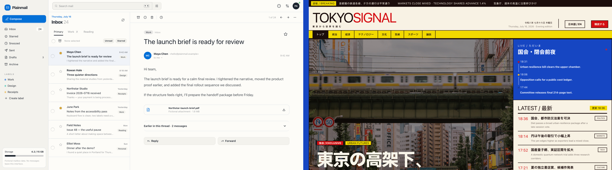
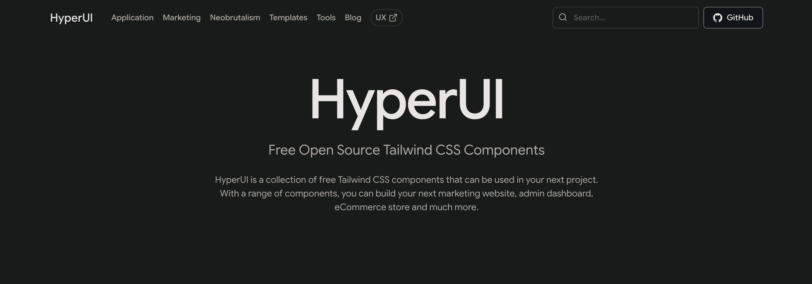
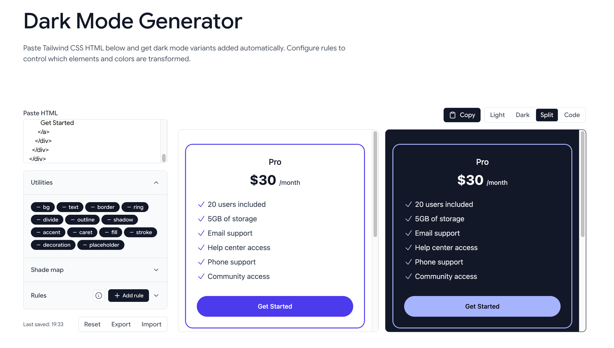
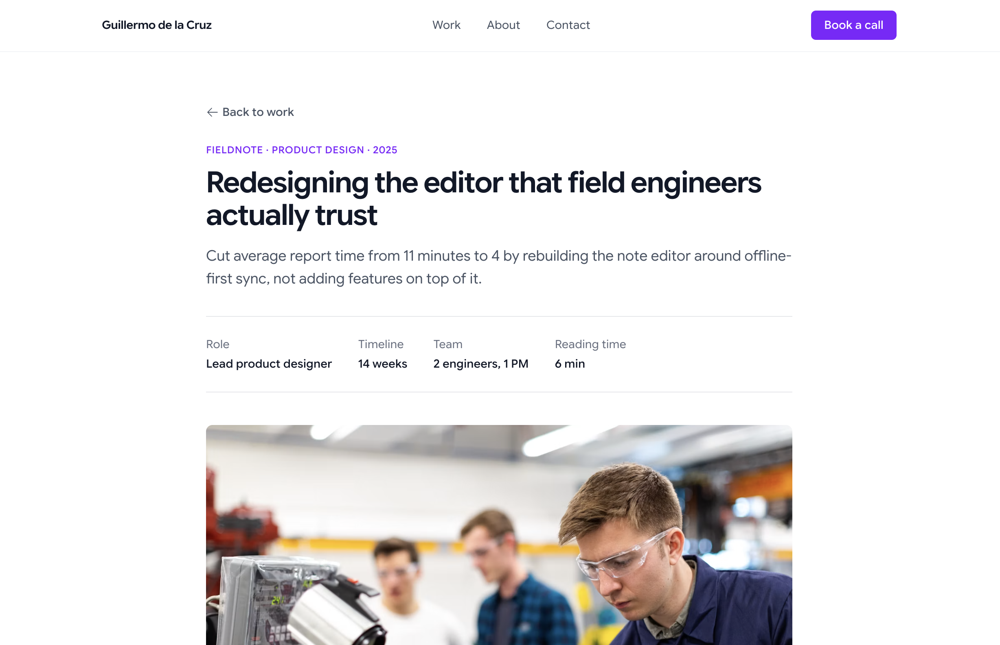
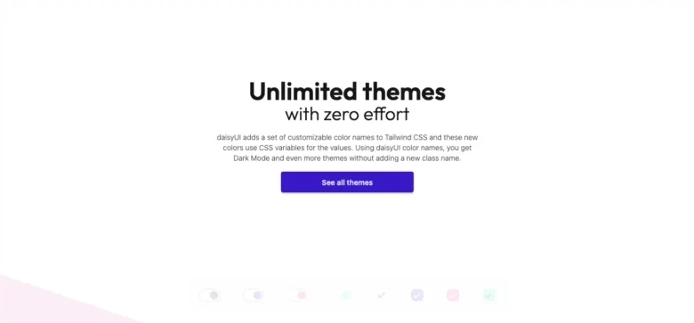
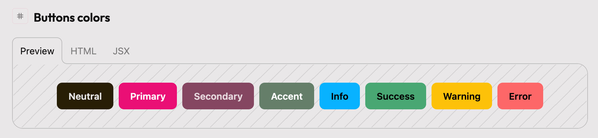
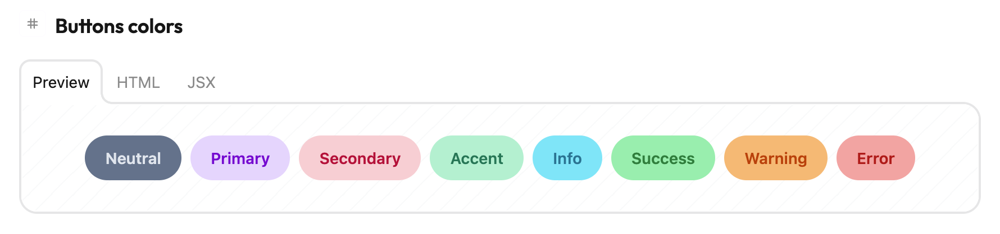
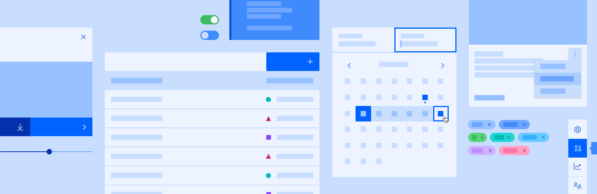
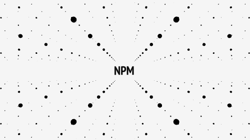

# Cours 3

<!-- **Savoirs :** #5 Cadriciel facilitant l'intégration · #6 Réutilisation de composantes -->
<!-- @sudo : Mini changement relatif au plan de cours. Je vais montrer HyperUI et d'autres options avant d'embarquer dans daisy. -->

*[CDN]: Content Delivery Network
*[npm]: Node Package Manager
*[HMR]: Hot Module Replacement
*[CLI]: Command-Line Interface

## Retour sur les exercices

[Bases, _Layout_ et _Responsive_](https://jfcmontmorency.codeberg.page/tailwind-basics/)

## Tailwind, la suite


Ci-dessous, quelques exemples de mise en forme utiles.

### Colonne centrée

<p class="codepen" data-theme-id="50173" data-height="300" data-pen-title="Tailwind - Structures fréquentes - Colonne centrée" data-version="2" data-default-tab="result" data-slug-hash="bNqpYzV" data-user="tim-momo" style="height: 300px; box-sizing: border-box; display: flex; align-items: center; justify-content: center; border: 2px solid; margin: 1em 0; padding: 1em;">
  <span>See the Pen <a href="https://codepen.io/editor/tim-momo/pen/01a07d9d-a32d-70c9-9836-cbf8d7769dc2">
  Tailwind - Structures fréquentes - Colonne centrée</a> by TIM Montmorency (<a href="https://codepen.io/tim-momo">@tim-momo</a>)
  on <a href="https://codepen.io">CodePen</a>.</span>
</p>
<script async src="https://public.codepenassets.com/embed/index.js"></script>

```html
<div class="max-w-xl mx-auto">
  <p>...</p>
</div>
```

### Layout header + aside + main + footer

<p class="codepen aspect-16-9" data-theme-id="50173" data-height="300" data-pen-title="Tailwind - Structures fréquentes - Squelette" data-version="2" data-default-tab="result" data-slug-hash="OPpNzVy" data-user="tim-momo" style="height: 300px; box-sizing: border-box; display: flex; align-items: center; justify-content: center; border: 2px solid; margin: 1em 0; padding: 1em;">
  <span>See the Pen <a href="https://codepen.io/editor/tim-momo/pen/01a07dc6-4b5f-777f-93c2-94132edc969c">
  Tailwind - Structures fréquentes - Squelette</a> by TIM Montmorency (<a href="https://codepen.io/tim-momo">@tim-momo</a>)
  on <a href="https://codepen.io">CodePen</a>.</span>
</p>
<script async src="https://public.codepenassets.com/embed/index.js"></script>

```html
<div class="grid grid-rows-[auto_1fr_auto] min-h-screen">

  <header>...</header>

  <div class="grid sm:grid-cols-[16rem_1fr]">
    <aside>...</aside>
    <main>...</main>
  </div>

  <footer>...</footer>

</div>
```

### Image + contenu

<p class="codepen aspect-4-3" data-theme-id="50173" data-height="300" data-pen-title="Tailwind - Structures fréquentes - Paires" data-version="2" data-default-tab="result" data-slug-hash="jEBqYPB" data-user="tim-momo" style="height: 300px; box-sizing: border-box; display: flex; align-items: center; justify-content: center; border: 2px solid; margin: 1em 0; padding: 1em;">
  <span>See the Pen <a href="https://codepen.io/editor/tim-momo/pen/01a07dc6-9f7f-766c-93e9-acba38dd0af0">
  Tailwind - Structures fréquentes - Paires</a> by TIM Montmorency (<a href="https://codepen.io/tim-momo">@tim-momo</a>)
  on <a href="https://codepen.io">CodePen</a>.</span>
</p>
<script async src="https://public.codepenassets.com/embed/index.js"></script>

```html
<section class="grid gap-4 items-center sm:grid-cols-2">
  
  <div>
    <p>...</p>
  </div>
</section>

<section class="grid gap-4 items-center sm:grid-cols-2 sm:text-right">
  
  <div>
    <p>...</p>
  </div>
</section>
```

### Colonne centrée + 3 colonnes

<p class="codepen" data-theme-id="50173" data-height="300" data-pen-title="Tailwind - Structures fréquentes - Colonne centrée  + 3 colonnes" data-version="2" data-default-tab="result" data-slug-hash="dPvMJor" data-user="tim-momo" style="height: 300px; box-sizing: border-box; display: flex; align-items: center; justify-content: center; border: 2px solid; margin: 1em 0; padding: 1em;">
  <span>See the Pen <a href="https://codepen.io/editor/tim-momo/pen/01a07dc9-f5d1-7631-8603-06b2db1ae14d">
  Tailwind - Structures fréquentes - Colonne centrée  + 3 colonnes</a> by TIM Montmorency (<a href="https://codepen.io/tim-momo">@tim-momo</a>)
  on <a href="https://codepen.io">CodePen</a>.</span>
</p>
<script async src="https://public.codepenassets.com/embed/index.js"></script>

```html
<div class="max-w-xl mx-auto">
  <div class="grid gap-4 sm:grid-cols-3">
    <div>...</div>
    <div>...</div>
    <div>...</div>
  </div>
</div>
```

### Texte sur image

<p class="codepen" data-theme-id="50173" data-height="300" data-pen-title="Tailwind - Structures fréquentes - Superposition" data-version="2" data-default-tab="result" data-slug-hash="yyMOpNo" data-user="tim-momo" style="height: 300px; box-sizing: border-box; display: flex; align-items: center; justify-content: center; border: 2px solid; margin: 1em 0; padding: 1em;">
  <span>See the Pen <a href="https://codepen.io/editor/tim-momo/pen/01a07dc7-6122-74e7-ac50-e875bb298f61">
  Tailwind - Structures fréquentes - Superposition</a> by TIM Montmorency (<a href="https://codepen.io/tim-momo">@tim-momo</a>)
  on <a href="https://codepen.io">CodePen</a>.</span>
</p>
<script async src="https://public.codepenassets.com/embed/index.js"></script>

```html
<section class="relative min-h-dvh grid place-items-center">
  
  <div class="absolute inset-0 bg-black/50"></div>
  <div class="relative text-center">
    <p>...</p>
  </div>
</section>
```

### Image et ratio

<p class="codepen" data-theme-id="50173" data-height="300" data-pen-title="Tailwind - Structures fréquentes - Images" data-version="2" data-default-tab="result" data-slug-hash="pveypJw" data-user="tim-momo" style="height: 300px; box-sizing: border-box; display: flex; align-items: center; justify-content: center; border: 2px solid; margin: 1em 0; padding: 1em;">
  <span>See the Pen <a href="https://codepen.io/editor/tim-momo/pen/01a07dc7-12be-7148-94e1-b96732e20daa">
  Tailwind - Structures fréquentes - Images</a> by TIM Montmorency (<a href="https://codepen.io/tim-momo">@tim-momo</a>)
  on <a href="https://codepen.io">CodePen</a>.</span>
</p>
<script async src="https://public.codepenassets.com/embed/index.js"></script>

```html

```

### À propos de Tailwind

{.w-50}

En soi, Tailwind n'a pas de style prédéfini. On dit que Tailwind est non opinionné (***unopinionated***). C'est-à-dire qu'il n'impose ni direction artistique ni identité visuelle. Il ne fournit que les outils pour styliser un site.

<figure markdown>
{data-zoom-image .w-50}
<figcaption>Même base Tailwind, deux styles complètement différents</figcaption>
</figure>

C'est très **flexible** et ça permet de faire un peu tout, mais disposer d'une **maquette avec un système de design** aide énormément à garder le cap sur le style à maintenir d'une page à l'autre.

Quand on n'en a pas, il faut trouver des solutions pour **ne pas réinventer la roue**, comme l'exercice du QR code 😜

## HyperUI

{data-zoom-image .w-100}

[HyperUI](https://hyperui.dev/) permet de magasiner des composantes responsives déjà faites (_opinionated_), construites avec des classes Tailwind.

Trois styles sont disponibles :

- **Application** : style pour des interfaces de gestion
- **Marketing** : style pour des sites promotionnels simples
- **Neobrutalism** : style plus original, mais moins passe-partout

### Générateur de mode sombre

Certaines composantes sont disponibles en mode sombre (_dark mode_), d'autres non. Pour pallier ce manque, on peut utiliser l'outil « [Dark Mode Generator](https://hyperui.dev/tools/dark-mode-generator/) ».

{data-zoom-image .w-25}

### Modèles HyperUI

Des [modèles de pages](https://hyperui.dev/components/templates/) complets (_templates_) sont également disponibles.

{data-zoom-image .w-25}

!!! tip "JS manquant 🤷"

    Il manque certaines fonctionnalités JavaScript, pour le menu mobile par exemple. C'est à prendre en considération.

### Installation

C'est tout l'avantage d'HyperUI, il n'y a rien à installer ! Ça utilise seulement les classes Tailwind 4 et rien d'autre 🤷

### Exercice HyperUI

<div class="grid grid-1-2" markdown>
  {.aspect-4-3}

  <small>Exercice - Tailwind</small><br>
  **[HyperUI](./activite/hyperui/index.md){.stretched-link .back}**
</div>

## DaisyUI

{.w-100}

Entièrement construite sur Tailwind, [DaisyUI](https://daisyui.com/) est une bibliothèque de classes sémantiques qui simplifie grandement le HTML.

En contrepartie, elle impose ses propres choix de design (_opinionated_). L'apparence des éléments étant définie à l'avance, cela peut représenter un inconvénient pour les projets nécessitant une interface sur mesure.

=== ":simple-tailwindcss: Tailwind"

    <br>
    

    ```html
    <button class="bg-zinc-100 border font-semibold text-zinc-900 text-sm px-4 
    duration-200 py-2.5 transition-all hover:border-zinc-300 hover:bg-zinc-200 
    focus-visible:outline-2 focus-visible:outline-offset-2 focus-visible:outline-zinc-900 
    active:translate-y-[0.5px] inline-flex gap-2 rounded-sm active:border-zinc-300 
    active:bg-zinc-200 active:shadow-none text-center align-middle cursor-pointer 
    border-zinc-200 dark:border-zinc-700 dark:bg-neutral-700 dark:text-zinc-300 
    dark:hover:border-zinc-950 dark:hover:bg-zinc-950 dark:focus-visible:outline-zinc-200 
    dark:active:border-zinc-950 dark:active:bg-zinc-900">
    Bouton Tailwind
    </button>
    ```
    
=== "DaisyUI"

    <br>
    

    ```html
    <button class="btn">
    Bouton DaisyUI
    </button>
    ```

!!! question "Quoi ? Tailwind c'est déjà fini ?"

    Non non !! Les deux cohabitent.
    
    Tailwind va continuer à être utilisé pour les notions de `Layout`, `Sizing`, `Flexbox`, `Grid`, `Alignment` et `Spacing`.

    DaisyUI va surtout servir à tout ce qui est de l'ordre du style.

### Thèmes

{data-zoom-image .w-100}

DaisyUI vient avec une multitude de [thèmes](https://daisyui.com/docs/themes/#list-of-themes). En changeant de thème, toutes les composantes s'ajustent dynamiquement. 

<!-- Vous pouvez même [créer votre propre thème](https://daisyui.com/theme-generator/). -->

### Sémantique

{.w-50}

DaisyUI utilise un vocabulaire sémantique pour ses classes. C'est pratique parce que peu importe le thème, c'est toujours les mêmes [noms des couleurs](https://daisyui.com/docs/colors/#list-of-all-daisyui-color-names) :

`Primary`, `Secondary`, `Info`, `Success`, `Warning`, `Error`, `Accent`, `Neutral` et `Base`

<div class="grid" markdown>
{data-zoom-image}

{data-zoom-image}
</div>

!!! question "C'est quoi déjà la sémantique ?"

    La sémantique Web sert à nommer sous forme de concept et non par attribut.
    
    C'est-à-dire qu'au lieu de spécifier une classe `bg-yellow-500` pour une zone d'avertissement, on va plutôt utiliser une classe `bg-warning`.
    
    Ainsi, en la lisant, on comprend à quoi elle sert. En indiquant que c'est jaune, on n'apprend rien d'autre que sa couleur.

### Installation du CDN

Comme Tailwind, DaisyUI possède aussi une méthode d'[installation par CDN](https://daisyui.com/docs/cdn/). Les deux s'installent conjointement dans la partie `<head>` du site :

```html title="Tailwind + DaisyUI"
<link href="https://cdn.jsdelivr.net/npm/daisyui@5" rel="stylesheet" type="text/css" />
<link href="https://cdn.jsdelivr.net/npm/daisyui@5/themes.css" rel="stylesheet" type="text/css" />
<script src="https://cdn.jsdelivr.net/npm/@tailwindcss/browser@4"></script> 
```

### Composantes



Une fois DaisyUI installée, on peut utiliser ses [composantes](https://daisyui.com/components/). Elles sont catégorisées ainsi :

- ***Actions*** (composantes interactives) : Bouton, dropdown, Modal
- ***Data display*** (affichage de données) : Accordion, Card, List, Table
- ***Navigation*** : Breadcrumb, Navbar, Tab
- ***Feedback*** (rétroaction utilisateur) : Alert, Progress, Tooltip
- ***Data input*** (composantes de formulaire) : Input field, Checkbox, Select
- ***Layout*** (mise en page) : Hero, Footer, Drawer
- ***Mockup*** (simulation visuelle)

### Spécifier un thème

Il suffit d'ajouter l'[identifiant du thème](https://daisyui.com/docs/themes/#list-of-themes) choisi à la balise `<html>` :

```html
<html data-theme="forest">
  ...
</html>
```

### Usage d'une composante

Pour ajouter un bouton :

1. Aller sur la page de la [documentation du bouton](https://daisyui.com/components/button/)
1. Trouver l'exemple pour un bouton `primary`
1. Cliquer sur l'onglet `HTML`
1. Copier la partie du code qui nous intéresse. Par exemple : <div>
```html
<button class="btn btn-soft btn-primary">Primary</button>
```
</div>
1. Coller dans le HTML de son projet.

<figure markdown>
{data-zoom-image .w-50}
</figure>

### Mode sombre

Il faut savoir que chaque thème DaisyUI incarne soit un mode `dark`, soit un mode `light`, mais jamais les deux.

Lorsqu'on utilise DaisyUI avec un CDN, il faut en choisir un par défaut. On ne peut pas configurer un thème en fonction du `prefers-color-scheme` du système de l'utilisateur.

Pour passer de l'un à l'autre, il faut donc permuter la valeur de `data-theme` avec un [contrôleur de thème](https://daisyui.com/components/theme-controller/).

```html
<input type="checkbox" class="theme-controller" value="id-du-theme-ici" />
```

<p class="codepen aspect-16-9" data-theme-id="50173" data-height="300" data-pen-title="DaisyUI Darkmode Toggle" data-version="2" data-default-tab="result" data-slug-hash="vExGedJ" data-user="tim-momo" style="height: 300px; box-sizing: border-box; display: flex; align-items: center; justify-content: center; border: 2px solid; margin: 1em 0; padding: 1em;">
  <span>See the Pen <a href="https://codepen.io/tim-momo/pen/vExGedJ">
  DaisyUI Darkmode Toggle</a> by TIM Montmorency (<a href="https://codepen.io/tim-momo">@tim-momo</a>)
  on <a href="https://codepen.io">CodePen</a>.</span>
</p>
<script async src="https://public.codepenassets.com/embed/index.js"></script>

### Exercice DaisyUI

<div class="grid grid-1-2" markdown>
  {.aspect-4-3}

  <small>Exercice - DaisyUI</small><br>
  **[DaisyUI](./activite/daisyui-cdn/index.md){.stretched-link .back}**
</div>

## Gestionnaire de paquets

{.w-100}

Le CDN, c'est du code hébergé ailleurs. C'est parfait pour faire un prototype, mais c'est vite limitant pour gérer ses dépendances à long terme.

La façon contemporaine d'ajouter du code externe se fait avec un **gestionnaire de paquets** (_package manager_). C'est l'équivalent du **:fontawesome-brands-app-store: App Store**, mais pour développeurs. Au lieu d'aller sur plein de sites différents, de télécharger des fichiers de code, de les copier dans tes dossiers et de gérer les mises à jour toi-même, un _package manager_ le fait pour toi. 

### _Node package manager_ : `npm`

{.w-50}

Pour le cours, nous utiliserons `npm`.

Il est déjà installé au Cégep, mais pour l'avoir à la maison, il suffit d'installer [Node.js](https://nodejs.org/fr/download).

### Installation

D'abord, `npm` s'utilise en ligne de commande ! On peut donc faire un test avec Git Bash.

1. Ouvrir Git Bash
1. Se déplacer dans `Documents` avec `cd`
1. Créer un dossier `test` avec `mkdir`
1. Se déplacer dans `test` avec `cd`
1. Exécuter la ligne de commande suivante pour initialiser le projet :<div markdown>
  ```bash
  npm init
  ```
  </div>
1. puis celle-ci pour installer la technologie milligram :<div markdown>
  ```bash
  npm install milligram
  ```
  </div>
1. Consulter le contenu du dossier `test` : 

  ```txt
  📁 test
  ├── 📁 node_modules
  │    ├── 📁 milligram
  │    │    ├── 📁 dist
  │    │    │    ├── 📄 milligram.css 👈
  │    │    │    └── ...
  │    │    ├── 📁 src
  │    │    └── ...
  │    └── 📁 normalize.css
  │         ├── 📄 normalize.css 👈
  │         └── ...
  ├── 📄 package.json
  └── 📄 package-lock.json
  ```

!!! note "Structure de fichiers"

    * `package.json` : Carte d'identité du projet. Contient la liste de ses librairies installées par `npm`
    * `package-lock.json` : Versions exactes installées (à ne jamais modifier à la main)
    * `node_modules/` : Code des librairies téléchargées

    ```json title="package.json"
    {
      "name": "digger",
      "version": "1.0.0",
      "dependencies": {
        "milligram": "^1.4.1",
        "normalize.css": "^8.0.1"
      }
    }
    ```

### Usage manuel

Le code de Milligram est sous `node_modules`, donc on pourrait simplement lier les fichiers ainsi :

```html title="index.html"
<link rel="stylesheet" href="./node_modules/normalize.css/normalize.css">
<link rel="stylesheet" href="./node_modules/milligram/dist/milligram.css">
```

!!! tip "Un peu fastidieux quand même !"

    Lier chaque fichier à la main depuis `node_modules`, ce n'est pas idéal. D'ailleurs, personne fait ça 😆

## Vite

{.w-100}

**[Vite](https://vite.dev/)** est un **outil de compilation** (_build tool_) en ligne de commande qui nous permettra de travailler avec Tailwind / DaisyUI sans l'usage de CDN.

### Vite vanille

Voici un usage de Vite sans _framework_ JavaScript.

1. Créer un dossier pour le projet<div>
  ```sh
  mkdir mon-projet
  ```
  </div>
1. Se déplacer dans le dossier<div>
  ```sh
  cd mon-projet
  ```
  </div>
1. Initialise npm avec : <div>
  ```sh
  npm init
  ```
  </div>
1. Installe vite, tailwind et daisyui avec la commande `npm`<div>
  ```sh
  npm install vite tailwindcss @tailwindcss/vite daisyui
  ```
  </div>
1. Ouvre le projet dans VSCode
1. À la racine, crée un fichier `vite.config.mjs` et ajoute ce contenu :<div>
  ```js title="vite.config.mjs"
  import { defineConfig } from 'vite'
  import tailwindcss from '@tailwindcss/vite'

  export default defineConfig({
    base: './',
    plugins: [tailwindcss()]
  })
  ```
  </div>
1. À la racine, crée un fichier `style.css` et ajoute ce contenu :<div>
  ```css title="style.css"
  @import "tailwindcss";
  @plugin "daisyui";
  ```
  </div>
1. À la racine, crée un fichier `index.html` et ajoute ce contenu :<div>
  ```html title="index.html"
  <!doctype html>
  <html lang="fr">
    <head>
      <meta charset="UTF-8">
      <meta name="viewport" content="width=device-width, initial-scale=1.0">
      <link rel="stylesheet" href="./style.css">
      <title>Mon projet</title>
    </head>
    <body>
      <button class="btn btn-primary">Bouton daisyUI</button>
    </body>
  </html>
  ```
  </div>
1. De retour en ligne de commande, exécuter :<div>
  ```sh
  npx vite
  ```
  </div>

Pour arrêter le serveur : ++ctrl+c++

### Build

Pour effectuer un build, exécutez : 

```sh
npx vite build
```

Ça va créer un dossier dans lequel on retrouve le html/css/js optimisé et prêt à mettre en ligne !

Pour tester le build, exécutez : 

```sh
npx vite preview
```

### GitHub

Lorsqu'on ajoute un projet du genre sur GitHub, il n'est pas nécessaire d'ajouter le dossier de distribution ni node_modules comme mentionné plus tôt.

```gitignore title=".gitignore"
node_modules/
dist/

# Cache de vite
.vite/

# Mac
.DS_Store

# VSCode
.vscode/*
!.vscode/extensions.json
```

<div class="grid grid-1-2" markdown>
  {.aspect-4-3}

  <small>Exercice - Vite</small><br>
  **[DaisyUI + Vite](./activite/daisyui-vite/index.md){.stretched-link .back}**
</div>

### Avantages

* Indépendance. Ça compile les classes Tailwind sans requête à un site externe
* Ça va nous permettre d'ajouter un thème DaisyUI custom. Impossible avec le CDN
* Ça va nous permettre de configurer les thèmes par défaut (dépendamment du `prefers-color-scheme` par exemple). Impossible avec le CDN
* Ouvre l'accès à tout l'écosystème `npm` ❤️
* Optimise le déploiement
* Contexte complet pour les outils d'IA : le code des librairies est présent localement
