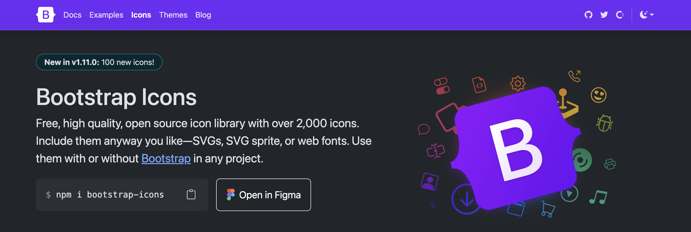
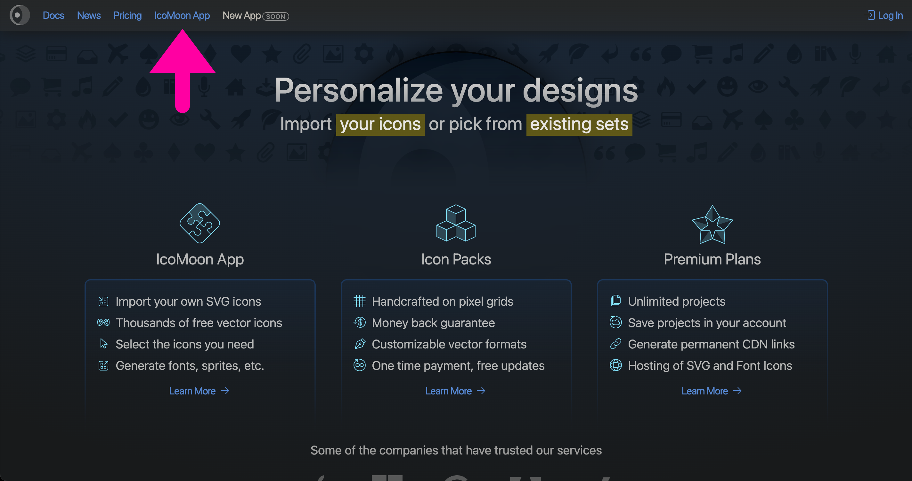
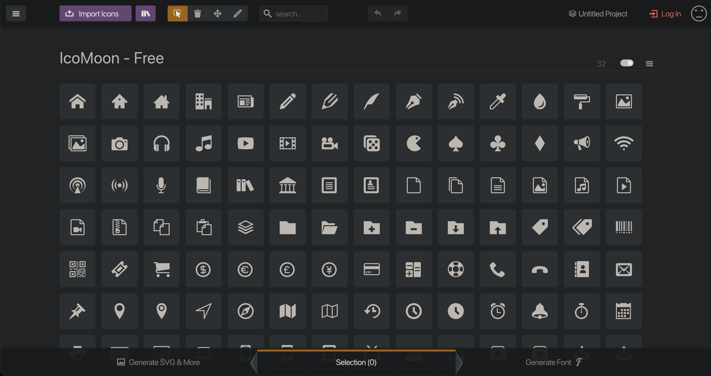
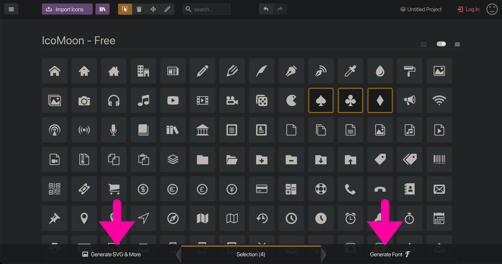
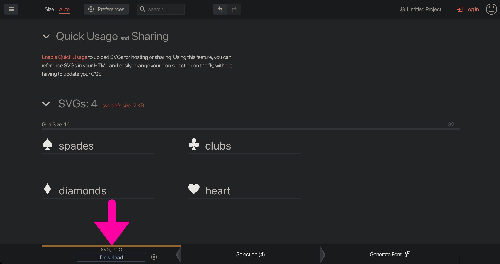
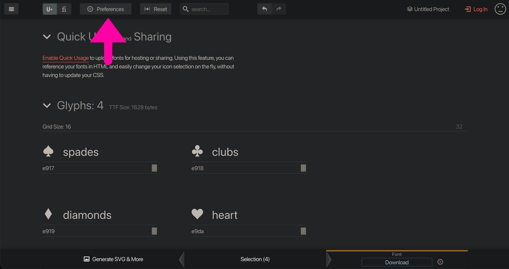
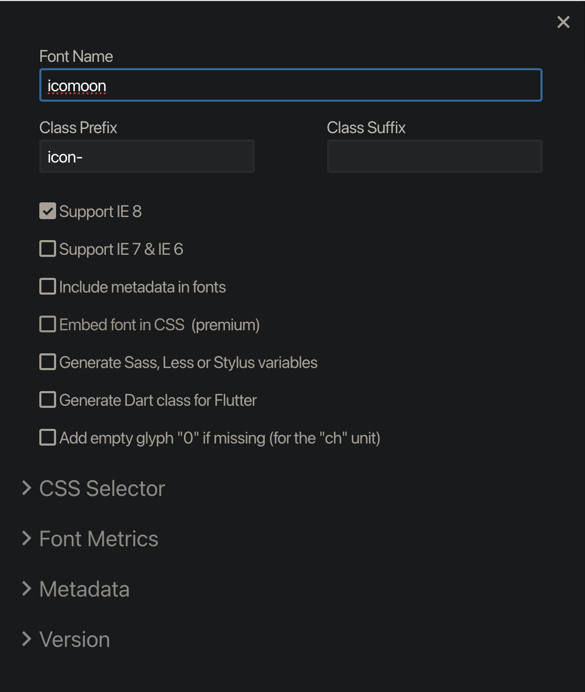
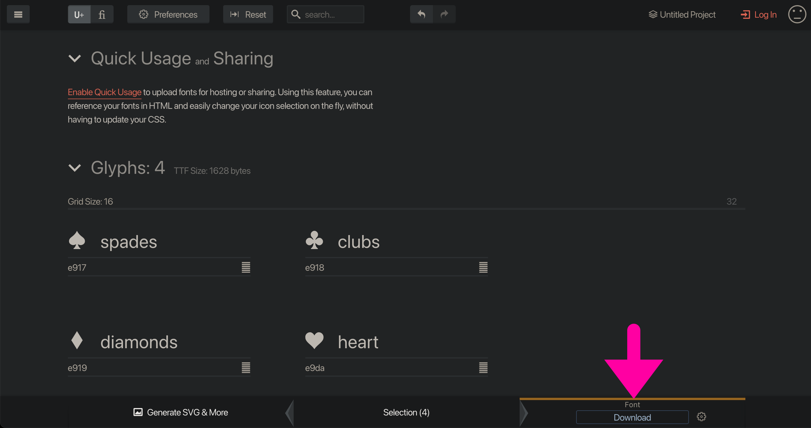
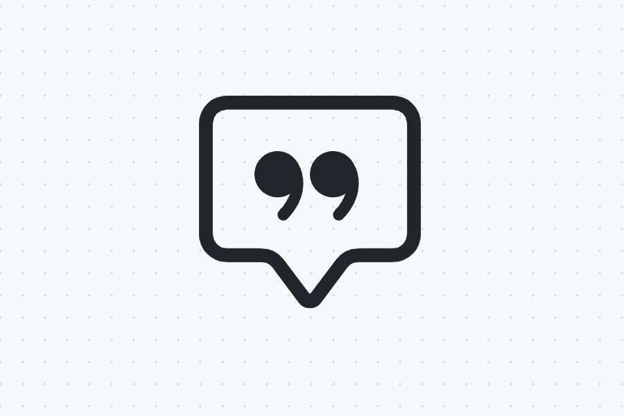
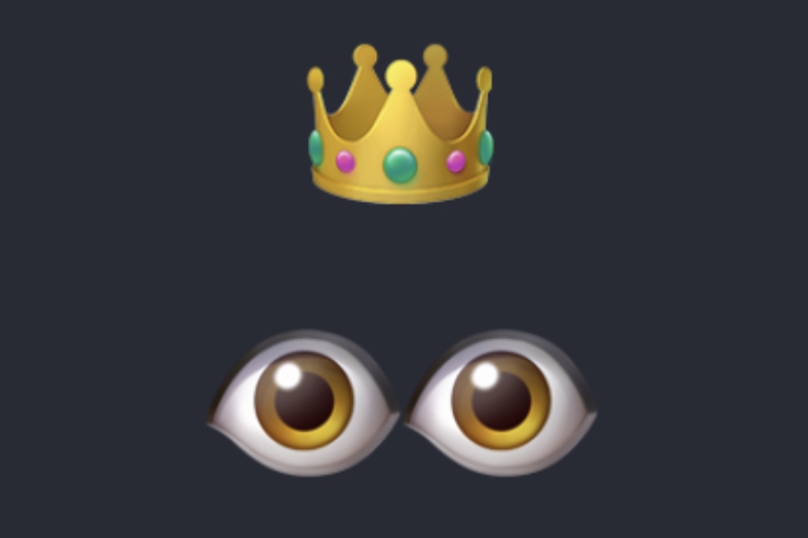

---
tags:
  - Cours 4
  - Vendredi 13 septembre
---

# Bootstrap 2/3

<style>
  nav.md-nav--secondary > ul > li > nav > ul > li > nav {
    display: none;
  }
</style>

## Image

La classe CSS `.img-fluid` est utilisée pour rendre les images réactives (responsive). Cette classe applique les styles nécessaires pour que l’image s’adapte automatiquement à la largeur de son conteneur, tout en conservant son ratio original.

```html title="Utilisation"

```

<iframe class="aspect-4-3" height="300" style="width: 100%;" scrolling="no" title="Form" src="https://codepen.io/tim-momo/embed/dyBYbqr?default-tab=result&theme-id=50210" frameborder="no" loading="lazy" allowtransparency="true" allowfullscreen="true">
  See the Pen <a href="https://codepen.io/tim-momo/pen/dyBYbqr">
  Form</a> by TIM Montmorency (<a href="https://codepen.io/tim-momo">@tim-momo</a>)
  on <a href="https://codepen.io">CodePen</a>.
</iframe>

## Icônes

### Bootstrap

<https://icons.getbootstrap.com/>



#### Installation

Ajouter cette ligne dans le `<head>` de votre HTML

```html
<link rel="stylesheet" href="https://cdn.jsdelivr.net/npm/bootstrap-icons@1.11.3/font/bootstrap-icons.min.css">
```

#### Utilisation

```html
<!-- Le préfix des classes est `bi-` pour « Bootstrap Icon » -->
<i class="bi bi-person-wheelchair"></i>
```

### IcoMoon :new_moon:

<https://icomoon.io/app/>

{data-zoom-image}
{data-zoom-image}
{data-zoom-image}
{data-zoom-image}
{data-zoom-image}
{data-zoom-image}
{data-zoom-image}

#### Installation

1. Placez le dossier de votre police icomoon dans le répertoire `assets/fonts/`
1. Ajouter cette ligne dans le `<head>` de votre HTML : `<link rel="stylesheet" href="assets/fonts/icomoon-v01/style.css">`

#### Utilisation

```html
<i class="icomoon-heart"></i>
```

## Carte

<https://getbootstrap.com/docs/5.3/components/card>

<iframe class="aspect-4-3" height="300" style="width: 100%;" scrolling="no" title="Card" src="https://codepen.io/tim-momo/embed/jOjRmeZ?default-tab=&theme-id=50173" frameborder="no" loading="lazy" allowtransparency="true" allowfullscreen="true">
  See the Pen <a href="https://codepen.io/tim-momo/pen/jOjRmeZ">
  Card</a> by TIM Montmorency (<a href="https://codepen.io/tim-momo">@tim-momo</a>)
  on <a href="https://codepen.io">CodePen</a>.
</iframe>

```html
<div class="card" style="width: 18rem;">

  

  <div class="card-body">

    <h5 class="card-title">Image à vendre</h5>
    <p class="card-text">Nulla vitae elit libero...</p>
    <a href="#" class="btn btn-primary">Acheter</a>

  </div>

</div>
```

## Bouton

<https://getbootstrap.com/docs/5.3/components/buttons/>

<iframe class="aspect-4-3" height="300" style="width: 100%;" scrolling="no" title="Button" src="https://codepen.io/tim-momo/embed/abgOzzm?default-tab=result&theme-id=50173" frameborder="no" loading="lazy" allowtransparency="true" allowfullscreen="true">
  See the Pen <a href="https://codepen.io/tim-momo/pen/abgOzzm">
  Button</a> by TIM Montmorency (<a href="https://codepen.io/tim-momo">@tim-momo</a>)
  on <a href="https://codepen.io">CodePen</a>.
</iframe>

!!! info "Petit rappel au sujet des couleurs disponibles"

    <https://getbootstrap.com/docs/5.3/customize/color/#colors>

```html title="Dimensions"
<button class="btn btn-primary btn-sm">Petit</button>
<button class="btn btn-primary">Normal</button>
<button class="btn btn-primary btn-lg">Large</button>
```

```html title="Style outline"
<button class="btn btn-outline-primary">Normal</button>
```

```html title="État désactivé"
<button class="btn btn-primary" disabled>Bouton</button>
```

Les classes s'appliquent également aux liens!

```html
<a href="#" class="btn btn-primary btn-sm">Petit</a>
<a href="#" class="btn btn-primary">Normal</a>
<a href="#" class="btn btn-primary btn-lg">Large</a>
```

## Display

<https://getbootstrap.com/docs/5.3/utilities/display>

Les classes CSS de type `display` sont construites de la façon suivante : `d-{affichage}` et `d-{breakpoint}-{affichage}`

Les différents affichages disponibles :

* `none`
* `inline`
* `inline-block`
* `block`
* `grid`
* `inline-grid`
* `table`
* `table-cell`
* `table-row`
* `flex`
* `inline-flex`

On utilise souvent ces classes afin de déterminer ce qui doit être affiché sur certains breakpoints.

| Taille d'écran                                              | Classe                                |
|-------------------------------------------------------------|---------------------------------------|
| :material-eye-off:{.text-danger} Caché sur tous             | `.d-none`                             |
| :material-eye-off:{.text-danger} Caché uniquement sur xs    | `.d-none` `.d-sm-block`               |
| :material-eye-off:{.text-danger} Caché uniquement sur sm    | `.d-sm-none` `.d-md-block`            |
| :material-eye-off:{.text-danger} Caché uniquement sur md    | `.d-md-none` `.d-lg-block`            |
| :material-eye-off:{.text-danger} Caché uniquement sur lg    | `.d-lg-none` `.d-xl-block`            |
| :material-eye-off:{.text-danger} Caché uniquement sur xl    | `.d-xl-none` `.d-xxl-block`           |
| :material-eye-off:{.text-danger} Caché uniquement sur xxl   | `.d-xxl-none`                         |
| :material-eye:{.text-success} Visible partout               | `.d-block`                            |
| :material-eye:{.text-success} Visible uniquement sur xs     | `.d-block` `.d-sm-none`               |
| :material-eye:{.text-success} Visible uniquement sur sm     | `.d-none` `.d-sm-block` `.d-md-none`  |
| :material-eye:{.text-success} Visible uniquement sur md     | `.d-none` `.d-md-block` `.d-lg-none`  |
| :material-eye:{.text-success} Visible uniquement sur lg     | `.d-none` `.d-lg-block` `.d-xl-none`  |
| :material-eye:{.text-success} Visible uniquement sur xl     | `.d-none` `.d-xl-block` `.d-xxl-none` |
| :material-eye:{.text-success} Visible uniquement sur xxl    | `.d-none` `.d-xxl-block`              |

<iframe class="aspect-2-1" height="300" style="width: 100%;" scrolling="no" title="Espacements" src="https://codepen.io/tim-momo/embed/OJeyJqz?default-tab=result&editable=true&theme-id=50173" frameborder="no" loading="lazy" allowtransparency="true" allowfullscreen="true">
  See the Pen <a href="https://codepen.io/tim-momo/pen/OJeyJqz">
  Espacements</a> by TIM Montmorency (<a href="https://codepen.io/tim-momo">@tim-momo</a>)
  on <a href="https://codepen.io">CodePen</a>.
</iframe>

### Display Flex

<https://getbootstrap.com/docs/5.3/utilities/flex/>

#### Justification

<iframe class="aspect-4-3" height="300" style="width: 100%;" scrolling="no" title="Card" src="https://codepen.io/tim-momo/embed/PorgjoK?default-tab=&theme-id=50173" frameborder="no" loading="lazy" allowtransparency="true" allowfullscreen="true">
  See the Pen <a href="https://codepen.io/tim-momo/pen/PorgjoK">
  Card</a> by TIM Montmorency (<a href="https://codepen.io/tim-momo">@tim-momo</a>)
  on <a href="https://codepen.io">CodePen</a>.
</iframe>

```html title="Quelques classes en particulier"
<div class="d-flex justify-content-start">...</div>
<div class="d-flex justify-content-end">...</div>
<div class="d-flex justify-content-center">...</div>
<div class="d-flex justify-content-between">...</div>
<div class="d-flex justify-content-around">...</div>
<div class="d-flex justify-content-evenly">...</div>
```

#### Alignement

<iframe class="aspect-1-1" height="300" style="width: 100%;" scrolling="no" title="Display Flex - justify-content" src="https://codepen.io/tim-momo/embed/jOjRwbv?default-tab=&theme-id=50173" frameborder="no" loading="lazy" allowtransparency="true" allowfullscreen="true">
  See the Pen <a href="https://codepen.io/tim-momo/pen/jOjRwbv">
  Display Flex - justify-content</a> by TIM Montmorency (<a href="https://codepen.io/tim-momo">@tim-momo</a>)
  on <a href="https://codepen.io">CodePen</a>.
</iframe>

```html title="Quelques classes en particulier"
<div class="d-flex align-items-start">...</div>
<div class="d-flex align-items-end">...</div>
<div class="d-flex align-items-center">...</div>
<div class="d-flex align-items-baseline">...</div>
<div class="d-flex align-items-stretch">...</div>
```

## Formulaire

<https://getbootstrap.com/docs/5.3/forms/overview/>

<iframe class="aspect-4-3" height="300" style="width: 100%;" scrolling="no" title="Form" src="https://codepen.io/tim-momo/embed/XWLmrqZ?default-tab=result&theme-id=50210" frameborder="no" loading="lazy" allowtransparency="true" allowfullscreen="true">
  See the Pen <a href="https://codepen.io/tim-momo/pen/XWLmrqZ">
  Form</a> by TIM Montmorency (<a href="https://codepen.io/tim-momo">@tim-momo</a>)
  on <a href="https://codepen.io">CodePen</a>.
</iframe>

```html
<form>
  <div class="mb-3">
    <label for="email-field" class="form-label">Courriel</label>
    <input type="email" class="form-control" id="email-field" aria-describedby="emailHelp">
    <div id="emailHelp" class="form-text">Entrez votre courriel pour que nous puissions le vendre, à votre insu bien sûr, à tous nos partenaires.</div>
  </div>
  <button type="submit" class="btn btn-primary">Soumettre</button>
</form>
```

## Prochain cours

On fait un peu de JavaScript.

Pour ceux et celles qui auraient besoin de se pratiquer en JavaScript, veuillez faire ces exercices à la maison : <https://www.w3schools.com/js/exercise_js.asp?filename=exercise_js_variables1>

Un aide-mémoire est également disponible sur mon GitHub : <https://github.com/jfcmontmorency/aide-memoire>

Finalement, réviser au besoin la [portion JavaScript du cours 1](./javascript.md)

## Exercices

<div class="grid grid-1-2" markdown>
  

  <small>Exercice - Bootstrap</small><br>
  **[Le petit prince](./exercices/bs-petit-prince.md){.stretched-link}**
</div>

<div class="grid grid-1-2" markdown>
  

  <small>Exercice - Bootstrap</small><br>
  **[Cartes philosophiques](./exercices/bs-philo.md){.stretched-link}**
</div>

<div class="grid grid-1-2" markdown>
  

  <small>Exercice - Bootstrap</small><br>
  **[L’enfant roi](./exercices/bs-enfant-roi.md){.stretched-link}**
</div>

<div class="grid grid-1-2" markdown>
  

  <small>Exercice - Bootstrap</small><br>
  **[Donkey Kong](./exercices/bs-donkey-kong.md){.stretched-link}**
</div>
