# Cours 4

[STOP]

*[CDN]: Content Delivery Network
*[npm]: Node Package Manager
*[HMR]: Hot Module Replacement

## Cellulaires 📱

## Retour sur les exercices

{.w-100}

[DaisyUI](./activite/daisyui-cdn/index.md) · [DaisyUI + Vite](./activite/daisyui-vite/index.md)

## Récapitulatif

<div class="grid grid-1-4" markdown>
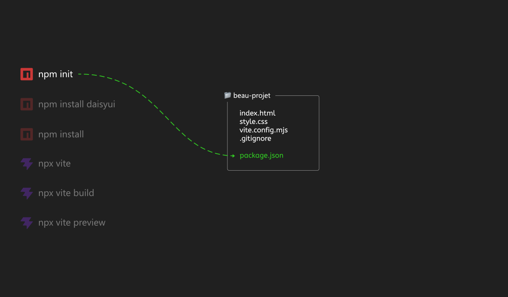{data-zoom-image}

:simple-npm: `npm init`
</div>

<div class="grid grid-1-4" markdown>
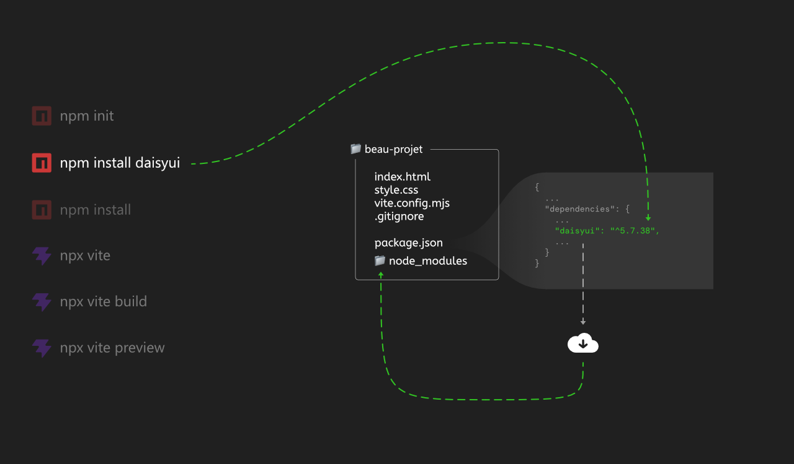{data-zoom-image}

:simple-npm: `npm install xyz`
</div>

<div class="grid grid-1-4" markdown>
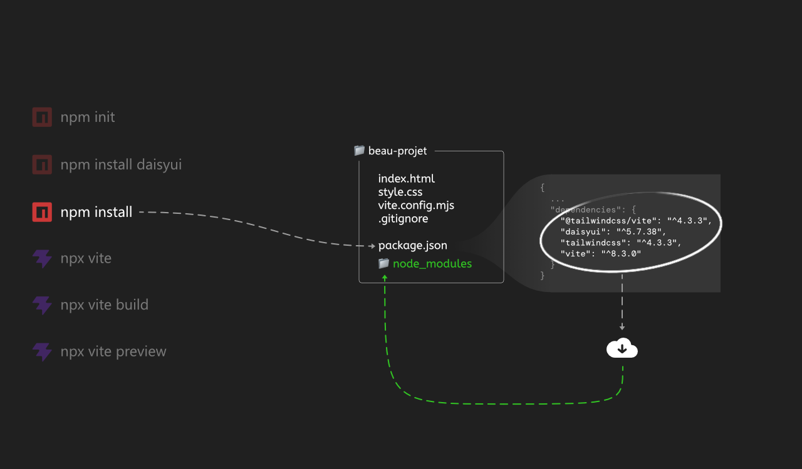{data-zoom-image}

:simple-npm: `npm install`
</div>

<div class="grid grid-1-4" markdown>
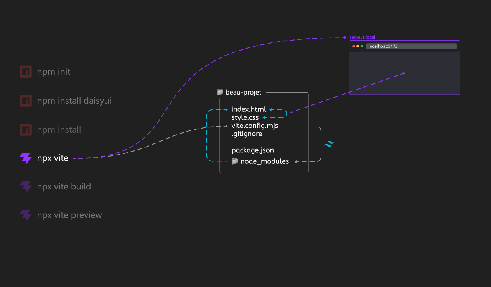{data-zoom-image}

:simple-vite: `npx vite`
</div>

<div class="grid grid-1-4" markdown>
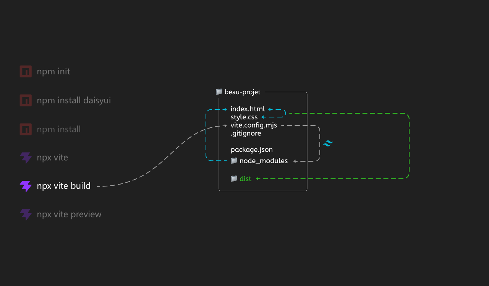{data-zoom-image}

:simple-vite: `npx vite build`
</div>

<div class="grid grid-1-4" markdown>
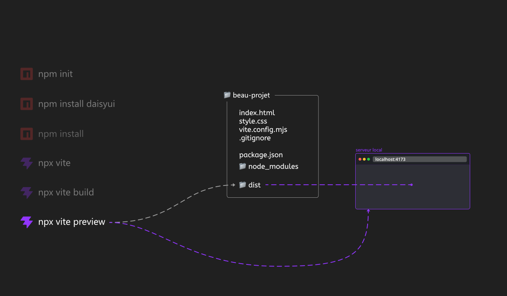{data-zoom-image}

:simple-vite: `npx vite preview`
</div>

<div class="grid grid-1-4" markdown>
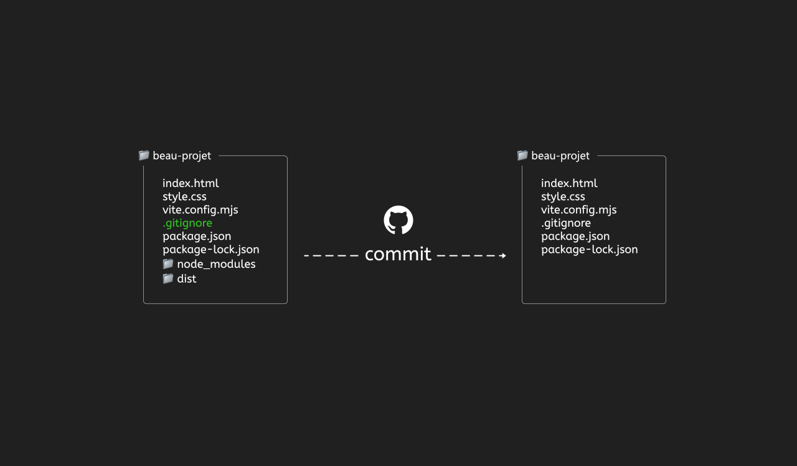{data-zoom-image}

:simple-github: `.gitignore`
</div>


<!-- <did class="grid" markdown>
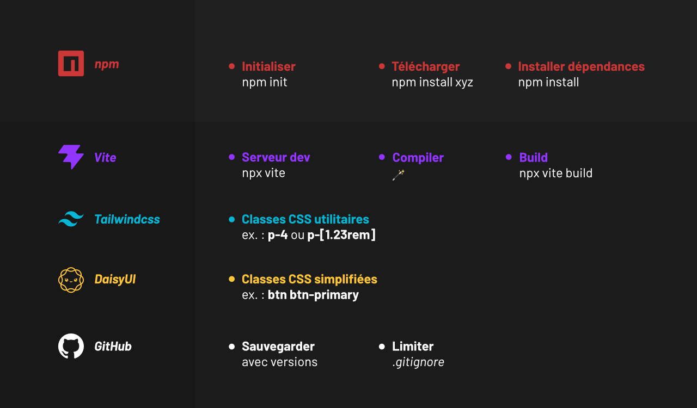{data-zoom-image}
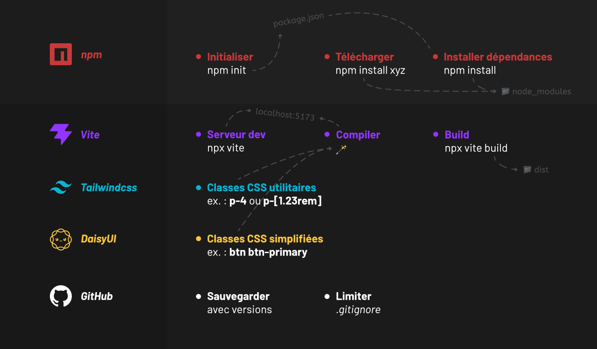{data-zoom-image}
</div> -->

!!! note "Go Live"

    « Live Server » et « Vite » affichent tous deux la page dans le navigateur en hot reload. 
    
    💅 La différence est que Vite lit sa configuration (`vite.config.mjs`), va chercher les librairies dans `node_modules` et transforme le code.

## Vite + `style.css`

| Instruction | Rôle | Exemple |
| :--- | :--- | :--- |
| `@import` | Ajoute le css des classes tailwind dans le html | `@import "tailwindcss";` |
| `@plugin` | Ajoute les classes daisyui présentes dans le html | `@plugin "daisyui";` |

Pour l'instant, la recette est toujours la même :

1. Installer le paquet : `npm install nom-du-paquet`
1. Ajouter les lignes nécessaires dans `style.css`
1. Utiliser les nouvelles classes dans le HTML

## Thèmes avec Vite

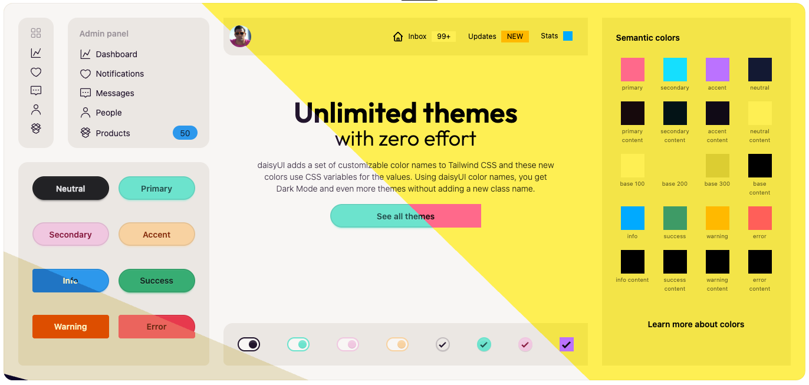

Avec le CDN, on liait `daisyui@5` et `daisyui@5/themes.css` (tous les thèmes).

Avec npm, on charge seulement ce qu'on a besoin.

Dans `style.css`, la ligne `@plugin "daisyui";` active `light` et `dark`. C'est tout.

### Activer des thèmes

Pour activer des thèmes, il faut configurer le plugin DaisyUI :

```css title="style.css"
@import "tailwindcss";
@plugin "daisyui" {
  themes: emerald --default, synthwave --prefersdark;
}
```

| Drapeau | Rôle |
| :--- | :--- |
| `--default` | Thème appliqué par défaut |
| `--prefersdark` | Thème utilisé si le système est en mode sombre. Par contre, le theme switcher devra alors être géré avec JavaScript. |
| `themes: all;` | Active **tous** les thèmes intégrés (Comme le CDN. Ne pas utiliser) |

<!-- 
Si `--prefersdark` est spécifié : 
<input id="theme" type="checkbox" class="toggle theme-controller" />
<script>
  const sombre = matchMedia('(prefers-color-scheme: dark)').matches;
  document.querySelector('#theme').value = sombre ? 'bumblebee' : 'halloween';
</script> -->

On choisit ensuite le thème actif avec l'attribut `data-theme` :

```html
<html data-theme="synthwave">
```

et le controlleur de thème fonctionne de la même façon :

```html title="Interrupteur clair/sombre"
<input type="checkbox" value="synthwave" class="toggle theme-controller" />
```

## Thème personnalisé

- Aller à l'adresse suivante : <https://daisyui.com/theme-generator/>
- Changer le nom du theme
- Configurer le thème
- Cliquer sur le bouton « **{ } CSS** ». Le code devra être collé dans le fichier `style.css`.


```css title="style.css"
@import "tailwindcss";
@plugin "daisyui";

@plugin "daisyui/theme" { 👈 Theme personnalisé A
  name: "momo-light";
  color-scheme: "light";
  ...
}
@plugin "daisyui/theme" { 👈 Theme personnalisé B
  name: "momo-dark";
  color-scheme: "dark";
  ...
}
```

!!! warning "Thème personnalisé et configuration"

    Les premières lignes du thème personnalisé servent à remplacer la configuration dans `@plugin "daisyui"` : 

    ```css
    @plugin "daisyui/theme" {
      name: "momo-light";
      color-scheme: "light";
      default: false; 👈
      prefersdark: false; 👈
      ...
    }
    ```

## Polices

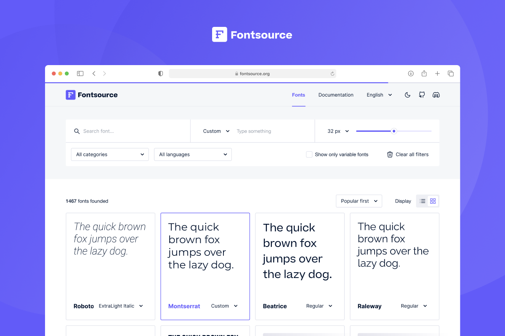{.w-100}

Google Fonts ne publie malheurement pas de paquet `npm` officiel. 

[Fontsource](https://fontsource.org/) empaquette les mêmes polices libres (et d'autres) pour `npm`. Les fichiers de police sont alors **inclus dans le projet** ! Alors aucune requête vers Google et la page fonctionne hors ligne 🤌

### Installation de Fontsource

1. Chercher la police sur [fontsource.org](https://fontsource.org/)
  - Sur Fontsource, la page d'installation propose l'installation _static_ ou _variable_. Choisir Static.
  - Certaines polices n'existent qu'en version statique (ex.: Poppins).
1. Installer le paquet (ex. la fonte Inter) :<div markdown>
  ```sh
  npm install @fontsource/inter
  ```
  </div>
1. Importer les graisses voulues dans `style.css` :<div markdown>
  ```css title="style.css"
  @import "@fontsource/inter/400.css"; 
  @import "@fontsource/inter/700.css";
  ```
  </div>
1. Déclarer la police comme police par défaut de Tailwind :<div markdown>
  ```css title="style.css"
  @theme {
    --font-sans: "Inter", sans-serif;
  }
  ```
  </div>

## Icônes

{.w-100}

[Lucide](https://lucide.dev/icons/) permet d'ajouter à son site les quelques 1 500 icônes développées à partir de Feather Icons.

### Installation de Lucide

```sh
npm install lucide-static
```

```css title="style.css"
@import "tailwindcss";
@import "lucide-static/font/lucide.css";
```

```html
<div class="icon-send"></div>
```

La taille de l'icône ne peut pas être spécifiée directement (ex. : `<span class="text-xl icon-send"></span>`), car sa taille est configurée pour être celle de son parent (`font-size: inherit;`).

```html
<span class="text-xl">
  <span class="icon-send"></span>
</span>
```

!!! note "Alternative"

    [Iconify](https://iconify.design/docs/usage/css/tailwind/tailwind4/) est une solide alternative qui propose encore plus de possibilités. Tellement que trop c'est comme pas assez 😅

## Typographie

Tailwind retire tous les styles par défaut : un `<h2>`, un `<ul>` ou un `<blockquote>` s'affichent comme du texte ordinaire.

Le plugin [Typography](https://github.com/tailwindlabs/tailwindcss-typography) règle ça avec une seule classe : `.prose`.

### Installation du plugin `Typography`

```sh
npm install -D @tailwindcss/typography
```

```css title="style.css"
@plugin "@tailwindcss/typography";
```

```html
<article class="prose">
  <h1>Titre</h1>
  <p>Paragraphe…</p>
  <ul><li>Liste</li></ul>
  <blockquote>Citation</blockquote>
</article>
```

| Classe | Effet |
| :--- | :--- |
| `prose` | Met en forme tout le contenu enfant |
| `prose-sm` / `prose-lg` / `prose-xl` | Taille générale du texte |

## Animations

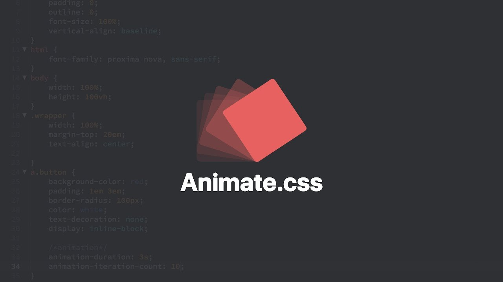{.w-100}

[Animate.css](https://animate.style/) est une bibliothèque d'animations CSS.

### Installation d'Animate.css

```sh
npm install animate.css
```

```css title="style.css"
@import "animate.css";
```

```html
<h1 class="animate__animated animate__fadeInDown">Bienvenue</h1>
```

| Classe | Effet |
| :--- | :--- |
| `animate__animated` | Obligatoire, active l'animation |
| `animate__bounce`, `animate__fadeInUp`… | L'animation choisie ([liste complète](https://animate.style/)) |
| `animate__delay-1s` … `animate__delay-5s` | Délai avant le départ |
| `animate__slow` / `animate__fast` | Durée |
| `animate__infinite` | Répétition sans fin |

!!! note "Au chargement seulement"

    Sans JavaScript, l'animation joue **une fois, au chargement de la page**. Déclencher une animation au défilement ou au clic viendra plus tard, avec **GSAP**.

## Exemple

```css title="style.css"
/* Imports (toujours en haut) */
@import "tailwindcss";
@import "@fontsource/Inter/400.css";
@import "@fontsource/Inter/700.css";
@import "animate.css";

@plugin "daisyui" {
  themes: light --default, dark --prefersdark;
}
@plugin "daisyui/theme" {
  name: "montmorency";
  color-scheme: light;
  --color-primary: oklch(55% 0.3 264);
}

@plugin "@tailwindcss/typography";

@plugin "@iconify/tailwind4";

/* Variables Tailwind */
@theme {
  --font-sans: "Inter", sans-serif;
}
```

## Exercices

<div class="grid grid-1-2" markdown>
  {.aspect-4-3}

  <small>Exercice - DaisyUI + Vite</small><br>
  **[Vitrine](./activite/login-unity/index.md){.stretched-link .back}**
</div>
