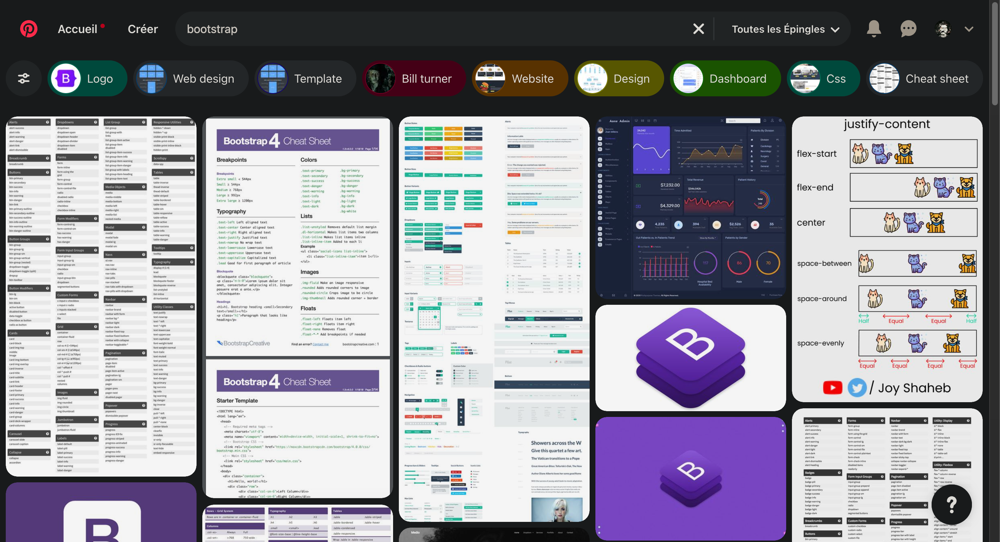

# Cours 4 | Bootstrap 2/2

*[npm] :  Node Package Manager

<style>
  nav.md-nav--secondary > ul > li > nav > ul > li > nav {
    display: none;
  }
</style>

## Défis Bootstrap

Retour sur l'exercice des défis Bootstrap.

## npm

{.w-100}

`npm` c'est comme un magasin d’applications (_Package manager_) pour développeurs qu'on utilise en ligne de commande.

### Préparation

[Installer Node.js](https://nodejs.org/fr/download) (`npm` vient avec).

Une fois l'installation terminée, on peut vérifier si `node` et `npm` sont accessibles en ligne de commande.

```bash title="Pour connaître la version installée de Node.js"
node --version
```

```bash title="Pour connaître la version installée de npm"
npm --version
```

### Initialisation

Pour inclure la notion de npm dans un projet, exécutez à la racine cette ligne de commande :

```bash
npm init -y
```

Elle sert à [initialiser les configurations](https://docs.npmjs.com/cli/v11/commands/npm-init) de base qui seront inscrites dans un nouveau fichier nommé `package.json`.

{data-zoom-image}

### Installation de packet

Pour [installer un packer](https://docs.npmjs.com/cli/v11/commands/npm-install) en npm, ça s'écrit de la façon suivante

```bash
npm i nom-du-packet
```

Quand on ajoute un packet avec npm, ca l'ajoute dans le fichier `package.json` et ça créé un dossier `node_modules` dans lequel se trouve le packet. Ça va aussi créer un fichier `package-lock.json` pour enregistrer les versions exactes des packets.

#### :simple-bootstrap: Bootstrap

Pour installer Bootstrap :

```bash
npm i bootstrap
```

{data-zoom-image}

Noter que le dossier Bootstrap contient beaucoup de fichiers de développement et de production. Dans la situation actuelle, ce qui nous intéresse sont les fichiers de production, souvent placés dans un dossier nommé `dist`.

{data-zoom-image}

Il ne reste plus qu'à lier Bootstrap au HTML avec le bon chemin :

```html
<link rel="stylesheet" href="./node_modules/bootstrap/dist/css/bootstrap.min.css">
```

## Variables Bootstrap

{.w-100}

Une fois Bootstrap ajouté, il est possible de surcharger ses variables CSS !

Lorsqu'on utilise une classe Bootstrap associée à une couleur, il y a de forte chance qu'elle se repose sur l'une des variables ci-dessous :

```css title="/node_modules/bootstrap/dist/css/bootstrap.css"
:root,
[data-bs-theme=light] {
  --bs-blue: #0d6efd;
  --bs-indigo: #6610f2;
  --bs-purple: #6f42c1;
  --bs-pink: #d63384;
  --bs-red: #dc3545;
  --bs-orange: #fd7e14;
  --bs-yellow: #ffc107;
  --bs-green: #198754;
  --bs-teal: #20c997;
  --bs-cyan: #0dcaf0;
  --bs-black: #000;
  --bs-white: #fff;
  --bs-gray: #6c757d;
  --bs-gray-dark: #343a40;
  --bs-gray-100: #f8f9fa;
  --bs-gray-200: #e9ecef;
  --bs-gray-300: #dee2e6;
  --bs-gray-400: #ced4da;
  --bs-gray-500: #adb5bd;
  --bs-gray-600: #6c757d;
  --bs-gray-700: #495057;
  --bs-gray-800: #343a40;
  --bs-gray-900: #212529;
  --bs-primary: #0d6efd;
  --bs-secondary: #6c757d;
  --bs-success: #198754;
  --bs-info: #0dcaf0;
  --bs-warning: #ffc107;
  --bs-danger: #dc3545;
  --bs-light: #f8f9fa;
  --bs-dark: #212529;
  --bs-primary-rgb: 13, 110, 253;
  --bs-secondary-rgb: 108, 117, 125;
  --bs-success-rgb: 25, 135, 84;
  --bs-info-rgb: 13, 202, 240;
  --bs-warning-rgb: 255, 193, 7;
  --bs-danger-rgb: 220, 53, 69;
  --bs-light-rgb: 248, 249, 250;
  --bs-dark-rgb: 33, 37, 41;
  --bs-primary-text-emphasis: #052c65;
  --bs-secondary-text-emphasis: #2b2f32;
  --bs-success-text-emphasis: #0a3622;
  --bs-info-text-emphasis: #055160;
  --bs-warning-text-emphasis: #664d03;
  --bs-danger-text-emphasis: #58151c;
  --bs-light-text-emphasis: #495057;
  --bs-dark-text-emphasis: #495057;
  --bs-primary-bg-subtle: #cfe2ff;
  --bs-secondary-bg-subtle: #e2e3e5;
  --bs-success-bg-subtle: #d1e7dd;
  --bs-info-bg-subtle: #cff4fc;
  --bs-warning-bg-subtle: #fff3cd;
  --bs-danger-bg-subtle: #f8d7da;
  --bs-light-bg-subtle: #fcfcfd;
  --bs-dark-bg-subtle: #ced4da;
  --bs-primary-border-subtle: #9ec5fe;
  --bs-secondary-border-subtle: #c4c8cb;
  --bs-success-border-subtle: #a3cfbb;
  --bs-info-border-subtle: #9eeaf9;
  --bs-warning-border-subtle: #ffe69c;
  --bs-danger-border-subtle: #f1aeb5;
  --bs-light-border-subtle: #e9ecef;
  --bs-dark-border-subtle: #adb5bd;
  --bs-white-rgb: 255, 255, 255;
  --bs-black-rgb: 0, 0, 0;
  --bs-font-sans-serif: system-ui, -apple-system, "Segoe UI", Roboto, "Helvetica Neue", "Noto Sans", "Liberation Sans", Arial, sans-serif, "Apple Color Emoji", "Segoe UI Emoji", "Segoe UI Symbol", "Noto Color Emoji";
  --bs-font-monospace: SFMono-Regular, Menlo, Monaco, Consolas, "Liberation Mono", "Courier New", monospace;
  --bs-gradient: linear-gradient(180deg, rgba(255, 255, 255, 0.15), rgba(255, 255, 255, 0));
  --bs-body-font-family: var(--bs-font-sans-serif);
  --bs-body-font-size: 1rem;
  --bs-body-font-weight: 400;
  --bs-body-line-height: 1.5;
  --bs-body-color: #212529;
  --bs-body-color-rgb: 33, 37, 41;
  --bs-body-bg: #fff;
  --bs-body-bg-rgb: 255, 255, 255;
  --bs-emphasis-color: #000;
  --bs-emphasis-color-rgb: 0, 0, 0;
  --bs-secondary-color: rgba(33, 37, 41, 0.75);
  --bs-secondary-color-rgb: 33, 37, 41;
  --bs-secondary-bg: #e9ecef;
  --bs-secondary-bg-rgb: 233, 236, 239;
  --bs-tertiary-color: rgba(33, 37, 41, 0.5);
  --bs-tertiary-color-rgb: 33, 37, 41;
  --bs-tertiary-bg: #f8f9fa;
  --bs-tertiary-bg-rgb: 248, 249, 250;
  --bs-heading-color: inherit;
  --bs-link-color: #0d6efd;
  --bs-link-color-rgb: 13, 110, 253;
  --bs-link-decoration: underline;
  --bs-link-hover-color: #0a58ca;
  --bs-link-hover-color-rgb: 10, 88, 202;
  --bs-code-color: #d63384;
  --bs-highlight-color: #212529;
  --bs-highlight-bg: #fff3cd;
  --bs-border-width: 1px;
  --bs-border-style: solid;
  --bs-border-color: #dee2e6;
  --bs-border-color-translucent: rgba(0, 0, 0, 0.175);
  --bs-border-radius: 0.375rem;
  --bs-border-radius-sm: 0.25rem;
  --bs-border-radius-lg: 0.5rem;
  --bs-border-radius-xl: 1rem;
  --bs-border-radius-xxl: 2rem;
  --bs-border-radius-2xl: var(--bs-border-radius-xxl);
  --bs-border-radius-pill: 50rem;
  --bs-box-shadow: 0 0.5rem 1rem rgba(0, 0, 0, 0.15);
  --bs-box-shadow-sm: 0 0.125rem 0.25rem rgba(0, 0, 0, 0.075);
  --bs-box-shadow-lg: 0 1rem 3rem rgba(0, 0, 0, 0.175);
  --bs-box-shadow-inset: inset 0 1px 2px rgba(0, 0, 0, 0.075);
  --bs-focus-ring-width: 0.25rem;
  --bs-focus-ring-opacity: 0.25;
  --bs-focus-ring-color: rgba(13, 110, 253, 0.25);
  --bs-form-valid-color: #198754;
  --bs-form-valid-border-color: #198754;
  --bs-form-invalid-color: #dc3545;
  --bs-form-invalid-border-color: #dc3545;
}

[data-bs-theme=dark] {
  color-scheme: dark;
  --bs-body-color: #dee2e6;
  --bs-body-color-rgb: 222, 226, 230;
  --bs-body-bg: #212529;
  --bs-body-bg-rgb: 33, 37, 41;
  --bs-emphasis-color: #fff;
  --bs-emphasis-color-rgb: 255, 255, 255;
  --bs-secondary-color: rgba(222, 226, 230, 0.75);
  --bs-secondary-color-rgb: 222, 226, 230;
  --bs-secondary-bg: #343a40;
  --bs-secondary-bg-rgb: 52, 58, 64;
  --bs-tertiary-color: rgba(222, 226, 230, 0.5);
  --bs-tertiary-color-rgb: 222, 226, 230;
  --bs-tertiary-bg: #2b3035;
  --bs-tertiary-bg-rgb: 43, 48, 53;
  --bs-primary-text-emphasis: #6ea8fe;
  --bs-secondary-text-emphasis: #a7acb1;
  --bs-success-text-emphasis: #75b798;
  --bs-info-text-emphasis: #6edff6;
  --bs-warning-text-emphasis: #ffda6a;
  --bs-danger-text-emphasis: #ea868f;
  --bs-light-text-emphasis: #f8f9fa;
  --bs-dark-text-emphasis: #dee2e6;
  --bs-primary-bg-subtle: #031633;
  --bs-secondary-bg-subtle: #161719;
  --bs-success-bg-subtle: #051b11;
  --bs-info-bg-subtle: #032830;
  --bs-warning-bg-subtle: #332701;
  --bs-danger-bg-subtle: #2c0b0e;
  --bs-light-bg-subtle: #343a40;
  --bs-dark-bg-subtle: #1a1d20;
  --bs-primary-border-subtle: #084298;
  --bs-secondary-border-subtle: #41464b;
  --bs-success-border-subtle: #0f5132;
  --bs-info-border-subtle: #087990;
  --bs-warning-border-subtle: #997404;
  --bs-danger-border-subtle: #842029;
  --bs-light-border-subtle: #495057;
  --bs-dark-border-subtle: #343a40;
  --bs-heading-color: inherit;
  --bs-link-color: #6ea8fe;
  --bs-link-hover-color: #8bb9fe;
  --bs-link-color-rgb: 110, 168, 254;
  --bs-link-hover-color-rgb: 139, 185, 254;
  --bs-code-color: #e685b5;
  --bs-highlight-color: #dee2e6;
  --bs-highlight-bg: #664d03;
  --bs-border-color: #495057;
  --bs-border-color-translucent: rgba(255, 255, 255, 0.15);
  --bs-form-valid-color: #75b798;
  --bs-form-valid-border-color: #75b798;
  --bs-form-invalid-color: #ea868f;
  --bs-form-invalid-border-color: #ea868f;
}
```

### Exemple de surcharge

{.w-100}

Par exemple, si on voulais modifier les variables relatives à « **Primary** » on pourrait surcharger ces variables :

```css title="styles.css"
:root,
[data-bs-theme=light] {
  --bs-primary: #ef5552;
  --bs-primary-rgb: 239, 85, 82;
}
```

Note : La plupart des styles « **Primary** » utilisent la variable `--bs-primary-rgb`.

## Icônes Bootstrap

<https://icons.getbootstrap.com/>

{ data-zoom-image }

### Installation

```bash
npm i bootstrap-icons
```

### Utilisation

```html
<!-- Le préfix des classes est `bi-` pour « Bootstrap Icon » -->
<i class="bi bi-person-wheelchair"></i>
```

## Composantes

Certaines composantes nécessitent du JavaScript alors nous aurons besoin d'inclure la librairie JavaScript de Bootstrap.

```html
<script src="./node_modules/bootstrap/dist/js/bootstrap.min.js"></script>
```

### Carte

<https://getbootstrap.com/docs/5.3/components/card>

<iframe class="aspect-4-3" height="300" style="width: 100%;" scrolling="no" title="Card" src="https://codepen.io/tim-momo/embed/jOjRmeZ?default-tab=&theme-id=50173" frameborder="no" loading="lazy" allowtransparency="true" allowfullscreen="true">
  See the Pen <a href="https://codepen.io/tim-momo/pen/jOjRmeZ">
  Card</a> by TIM Montmorency (<a href="https://codepen.io/tim-momo">@tim-momo</a>)
  on <a href="https://codepen.io">CodePen</a>.
</iframe>

```html
<div class="card">

  

  <div class="card-body">

    <h5 class="card-title">Image à vendre</h5>
    <p class="card-text">Nulla vitae elit libero...</p>
    <a href="#" class="btn btn-primary">Acheter</a>

  </div>

</div>
```

### Alerte

<https://getbootstrap.com/docs/5.3/components/alerts/>

Une alerte permet d’afficher des messages avec des styles prédéfinis et des options de fermeture.

<iframe class="aspect-4-1" height="300" style="width: 100%;" scrolling="no" title="Alert" src="https://codepen.io/tim-momo/embed/GRbpgjQ?default-tab=&theme-id=50173" frameborder="no" loading="lazy" allowtransparency="true" allowfullscreen="true">
  See the Pen <a href="https://codepen.io/tim-momo/pen/GRbpgjQ">
  Alert</a> by TIM Montmorency (<a href="https://codepen.io/tim-momo">@tim-momo</a>)
  on <a href="https://codepen.io">CodePen</a>.
</iframe>

Il y a deux types d'alertes. Une simple sans interaction possible, l'autre est révocable.

```js title="HTML - Alerte simple"
<div class="alert alert-success fade show" role="alert">
  Félicitations 🥳
</div>
```

```js title="HTML - Alerte révocable"
<div class="alert alert-warning alert-dismissible fade show" role="alert">
  Message plutôt important !
  <button type="button" class="btn-close" data-bs-dismiss="alert" aria-label="Close"></button>
</div>
```

Pour l'alerte révocable, il faut ajouter la classe .alert-dismissible et la balise `<button type="button" class="btn-close" data-bs-dismiss="alert" aria-label="Close"></button>` pour fermer l'alerte.

### Modal

<https://getbootstrap.com/docs/5.3/components/modal>

Un « modal » est une fenêtre (popup) qui apparaît au-dessus du contenu principal.

<iframe class="aspect-4-3" height="300" style="width: 100%;" scrolling="no" title="Modal" src="https://codepen.io/tim-momo/embed/MWMaYoW?default-tab=&theme-id=50173" frameborder="no" loading="lazy" allowtransparency="true" allowfullscreen="true">
  See the Pen <a href="https://codepen.io/tim-momo/pen/MWMaYoW">
  Modal</a> by TIM Montmorency (<a href="https://codepen.io/tim-momo">@tim-momo</a>)
  on <a href="https://codepen.io">CodePen</a>.
</iframe>

```html title="HTML"
<!-- Button trigger modal -->
<button type="button" class="btn btn-primary" data-bs-toggle="modal" data-bs-target="#exampleModal">
  Ouvrir Modal
</button>

<!-- Modal -->
<div class="modal fade" id="exampleModal" tabindex="-1" aria-labelledby="exampleModalLabel" aria-hidden="true">
  <div class="modal-dialog">
    <div class="modal-content">
      <!-- Entête -->
      <div class="modal-header">
        <h5 class="modal-title" id="exampleModalLabel">Titre du Modal</h5>
        <button type="button" class="btn-close" data-bs-dismiss="modal" aria-label="Close"></button>
      </div>
      <!-- Corps -->
      <div class="modal-body">
        Message super important
      </div>
      <!-- Pied -->
      <div class="modal-footer">
        <button type="button" class="btn btn-secondary" data-bs-dismiss="modal">Fermer</button>
        <button type="button" class="btn btn-primary">Ok merci</button>
      </div>

    </div>
  </div>
</div>
```

### Liste déroulante

<https://getbootstrap.com/docs/5.3/components/dropdowns>

Les listes déroulantes (dropdown) permettent d’afficher une liste d’options lors du clic sur un bouton.

<iframe class="aspect-2-1" height="300" style="width: 100%;" scrolling="no" title="Modal" src="https://codepen.io/tim-momo/embed/vYqoyZV?default-tab=&theme-id=50173" frameborder="no" loading="lazy" allowtransparency="true" allowfullscreen="true">
  See the Pen <a href="https://codepen.io/tim-momo/pen/vYqoyZV">
  Modal</a> by TIM Montmorency (<a href="https://codepen.io/tim-momo">@tim-momo</a>)
  on <a href="https://codepen.io">CodePen</a>.
</iframe>

```html title="HTML"
<div class="dropdown">
  <button class="btn btn-primary dropdown-toggle" type="button" id="dropdownMenuButton" data-bs-toggle="dropdown" aria-expanded="false">
    Dropdown
  </button>
  <ul class="dropdown-menu" aria-labelledby="dropdownMenuButton">
    <li><a class="dropdown-item" href="#">Action</a></li>
    <li><a class="dropdown-item" href="#">Autre action</a></li>
    <li><a class="dropdown-item" href="#">Quelque chose d'autre</a></li>
  </ul>
</div>
```

### Accordion

<https://getbootstrap.com/docs/5.3/components/accordion/>

L’accordion permet d’afficher et de masquer du contenu lié à une section spécifique.

<iframe class="aspect-3-2" height="300" style="width: 100%;" scrolling="no" title="Bootstrap - Liste déroulante" src="https://codepen.io/tim-momo/embed/gONVLGy?default-tab=&theme-id=50173" frameborder="no" loading="lazy" allowtransparency="true" allowfullscreen="true">
  See the Pen <a href="https://codepen.io/tim-momo/pen/gONVLGy">
  Bootstrap - Liste déroulante</a> by TIM Montmorency (<a href="https://codepen.io/tim-momo">@tim-momo</a>)
  on <a href="https://codepen.io">CodePen</a>.
</iframe>

```html title="HTML"
<div class="accordion" id="accordionExample">

  <div class="accordion-item">
    <h2 class="accordion-header" id="headingOne">
      <button class="accordion-button" type="button" data-bs-toggle="collapse" data-bs-target="#collapseOne" aria-expanded="true" aria-controls="collapseOne">
        Accordéon 1
      </button>
    </h2>
    <div id="collapseOne" class="accordion-collapse collapse show" aria-labelledby="headingOne" data-bs-parent="#accordionExample">
      <div class="accordion-body">
        Contenu de l'accordéon 1.
      </div>
    </div>
  </div>

  <div class="accordion-item">
    <h2 class="accordion-header" id="headingTwo">
      <button class="accordion-button collapsed" type="button" data-bs-toggle="collapse" data-bs-target="#collapseTwo" aria-expanded="false" aria-controls="collapseTwo">
        Accordéon 2
      </button>
    </h2>
    <div id="collapseTwo" class="accordion-collapse collapse" aria-labelledby="headingTwo" data-bs-parent="#accordionExample">
      <div class="accordion-body">
        Contenu de l'accordéon 2.
      </div>
    </div>
  </div>

</div>
```

!!! warning "Plusieurs attributs sont nécessaires"

    Dans l'exemple ci-haut, observez d'abord que le contenant possède un `id` (accordionExample). Ce id sera utilisé dans les attributs `data-bs-parent`.

    Ensuite, chaque élément d'accordéon doit avoir son propre identifiant. Observez particulièrement le premier élément, puis ses `id` (headingOne et collapseOne). Analysez comment ils sont utilisés.

### Toast :bread:

<https://getbootstrap.com/docs/5.3/components/toasts/>

Les toasts sont des messages temporaires et révocables pour informer les utilisateurs.

<iframe height="300" style="width: 100%;" scrolling="no" title="Bootstrap - Accordéon" src="https://codepen.io/tim-momo/embed/abgeBaY?default-tab=&theme-id=50173" frameborder="no" loading="lazy" allowtransparency="true" allowfullscreen="true">
  See the Pen <a href="https://codepen.io/tim-momo/pen/abgeBaY">
  Bootstrap - Accordéon</a> by TIM Montmorency (<a href="https://codepen.io/tim-momo">@tim-momo</a>)
  on <a href="https://codepen.io">CodePen</a>.
</iframe>

```html title="HTML"
<div class="toast show " role="alert" aria-live="assertive" aria-atomic="true">
  <div class="toast-header">
    <span class="me-2">🤩</span>
    <strong class="me-auto">Wow</strong>
    <small>Il y a 11 min</small>
    <button type="button" class="btn-close" data-bs-dismiss="toast" aria-label="Close"></button>
  </div>
  <div class="toast-body">
    Non, mais quel joli message ?
  </div>
</div>
```

!!! warning "Caché par défaut !"

    Il faut ajouter la classe `show` au toast pour que ça s'affiche!

!!! info "Positionnement"

    Si on veut que le toast soit positionné en bas à droite par exemple, il faut simplement ajouter les toasts dans un conteneur (appelons le grille-pain pour le plaisir), puis on le déplace dans la page. Voici un exemple : `<div class="toast-container position-fixed bottom-0 end-0 p-3"> ... </div>`

### Barre de navigation

<https://getbootstrap.com/docs/5.3/components/navbar/>

La barre de navigation bootstrap est une navigation de site pensée pour l'accessibilité et le responsive.

<iframe class="aspect-2-1" height="300" style="width: 100%;" scrolling="no" title="Navbar" src="https://codepen.io/tim-momo/embed/qBzOEMX?default-tab=result&editable=true&theme-id=50173" frameborder="no" loading="lazy" allowtransparency="true" allowfullscreen="true">
  See the Pen <a href="https://codepen.io/tim-momo/pen/qBzOEMX">
  Navbar</a> by TIM Montmorency (<a href="https://codepen.io/tim-momo">@tim-momo</a>)
  on <a href="https://codepen.io">CodePen</a>.
</iframe>

Notez dans le code qu'un conteneur se situe à l'intérieur de la barre de navigation. Or il n'est pas nécessaire de l'ajouter dans un conteneur préallablement.

```html title="HTML"
<nav class="navbar navbar-expand-lg navbar-light bg-light">
  <div class="container-fluid">
    <a class="navbar-brand" href="#">Festival</a>
    <button class="navbar-toggler" type="button" data-bs-toggle="collapse" data-bs-target="#navbarNav" aria-controls="navbarNav" aria-expanded="false" aria-label="Toggle navigation">
      <span class="navbar-toggler-icon"></span>
    </button>
    <div class="collapse navbar-collapse" id="navbarNav">
      <ul class="navbar-nav">
        <li class="nav-item">
          <a class="nav-link active" aria-current="page" href="#">Programmation</a>
        </li>
        <li class="nav-item">
          <a class="nav-link" href="#">Le festival</a>
        </li>
      </ul>
    </div>
  </div>
</nav>
```

!!! question "Y a-t-il un mode foncé ?"

    Ben oui! Il est possible de changer le thème de la barre de navigation en changeant les mentions `light` par `dark` dans les classes CSS.

!!! info "Breakpoints"

    La barre de navigation en version mobile s'active en fonction du breakpoint spécifié. Par exemple, dans l'exemple où un applique la classe `navbar-expand-lg`, cela signifie que la barre de navigation mobile s'activera à partir du breakpoint `md` en dessendant.

### Carousel Bootstrap

<https://getbootstrap.com/docs/5.3/components/carousel/>

Le carousel permet d’afficher une série d’images ou de contenus avec un effet de diaporama.

<iframe class="aspect-4-3" height="300" style="width: 100%;" scrolling="no" title="Bootstrap - Carousel" src="https://codepen.io/tim-momo/embed/yLdmVZb?default-tab=&theme-id=50173" frameborder="no" loading="lazy" allowtransparency="true" allowfullscreen="true">
  See the Pen <a href="https://codepen.io/tim-momo/pen/yLdmVZb">
  Bootstrap - Carousel</a> by TIM Montmorency (<a href="https://codepen.io/tim-momo">@tim-momo</a>)
  on <a href="https://codepen.io">CodePen</a>.
</iframe>

```html title="HTML"
<div id="carouselExampleIndicators" class="carousel slide">
  <div class="carousel-indicators">
    <button type="button" data-bs-target="#carouselExampleIndicators" data-bs-slide-to="0" class="active" aria-current="true" aria-label="Slide 1"></button>
    <button type="button" data-bs-target="#carouselExampleIndicators" data-bs-slide-to="1" aria-label="Slide 2"></button>
    <button type="button" data-bs-target="#carouselExampleIndicators" data-bs-slide-to="2" aria-label="Slide 3"></button>
  </div>
  <div class="carousel-inner">
    <div class="carousel-item active">
      
    </div>
    <div class="carousel-item">
      
    </div>
    <div class="carousel-item">
      
    </div>
    <div class="carousel-item">
      
    </div>
  </div>
  <button class="carousel-control-prev" type="button" data-bs-target="#carouselExampleIndicators" data-bs-slide="prev">
    <span class="carousel-control-prev-icon" aria-hidden="true"></span>
    <span class="visually-hidden">Previous</span>
  </button>
  <button class="carousel-control-next" type="button" data-bs-target="#carouselExampleIndicators" data-bs-slide="next">
    <span class="carousel-control-next-icon" aria-hidden="true"></span>
    <span class="visually-hidden">Next</span>
  </button>
</div>
```

## Carousel Swiper 🫡

Même si Bootstrap inclut un carrousel, Swiper est souvent plus flexible (touch, mobile-first, effets, modules).

Il est souvent préférable d'opter pour une librairie avec plus de flexibilité et d'options de configuration, comme [Swiper](https://swiperjs.com/).

### Installation

<https://swiperjs.com/get-started>

```bash
npm install swiper
```

```html
<link rel="stylesheet" href="./node_modules/swiper/swiper-bundle.min.css" />
<script src="./node_modules/swiper/swiper-bundle.min.js"></script>
```

### Utilisation

```html title="HTML"
<div class="swiper">
  <div class="swiper-wrapper">
    <div class="swiper-slide">Diapositive 1</div>
    <div class="swiper-slide">Diapositive 2</div>
    <div class="swiper-slide">Diapositive 3</div>
  </div>
</div>
```

```js title="JavaScript"
const swiper = new Swiper('.swiper', {
  loop: false
});
```

### Images

Afin d'obtenir de meilleurs résultats, lorsque vous utilisez des images dans un carrousel, assurez vous qu'elles soient pleine largeur.

Avec Bootstrap, vous pouvez utiliser la classe `w-100` pour lui donner une dimension de 100%, ainsi que la classe `img-fluid` pour éviter des problèmes de ratio d'image.

```html

```

<iframe class="aspect-4-3" height="300" style="width: 100%;" scrolling="no" title="Swiper" src="https://codepen.io/tim-momo/embed/ExBqEdM?default-tab=&editable=true&theme-id=50173" frameborder="no" loading="lazy" allowtransparency="true" allowfullscreen="true">
  See the Pen <a href="https://codepen.io/tim-momo/pen/ExBqEdM">
  Swiper</a> by TIM Montmorency (<a href="https://codepen.io/tim-momo">@tim-momo</a>)
  on <a href="https://codepen.io">CodePen</a>.
</iframe>

<https://swiperjs.com/demos>

## Formulaire

<https://getbootstrap.com/docs/5.3/forms/overview/>

<iframe class="aspect-4-3" height="300" style="width: 100%;" scrolling="no" title="Form" src="https://codepen.io/tim-momo/embed/XWLmrqZ?default-tab=result&theme-id=50210" frameborder="no" loading="lazy" allowtransparency="true" allowfullscreen="true">
  See the Pen <a href="https://codepen.io/tim-momo/pen/XWLmrqZ">
  Form</a> by TIM Montmorency (<a href="https://codepen.io/tim-momo">@tim-momo</a>)
  on <a href="https://codepen.io">CodePen</a>.
</iframe>

```html
<form>
  <div class="mb-3">
    <label for="email-field" class="form-label">Courriel</label>
    <input type="email" class="form-control" id="email-field" aria-describedby="emailHelp">
    <div id="emailHelp" class="form-text">Entrez votre courriel pour que nous puissions le vendre, à votre insu bien sûr, à tous nos partenaires.</div>
  </div>
  <button type="submit" class="btn btn-primary">Soumettre</button>
</form>
```

## Exercices

<div class="grid grid-1-2" markdown>
  

  <small>Exercice - Bootstrap</small><br>
  **[Le petit prince](./exercices/petit-prince/index.md){.stretched-link .back}**
</div>

<div class="grid grid-1-2" markdown>
  

  <small>Exercice - Bootstrap</small><br>
  **[Cartes philosophiques](./exercices/carte-philo/index.md){.stretched-link .back}**
</div>

<div class="grid grid-1-2" markdown>
  

  <small>Exercice - Bootstrap</small><br>
  **[L’enfant roi](./exercices/enfant-roi/index.md){.stretched-link .back}**
</div>

<div class="grid grid-1-2" markdown>
  

  <small>Exercice - Bootstrap</small><br>
  **[Donkey Kong](./exercices/donkey-kong/index.md){.stretched-link .back}**
</div>

<div class="grid grid-1-2" markdown>
  

  <small>Exercice - Bootstrap et Swiper</small><br>
  **[La lichée](./exercices/la-lichee/index.md){.stretched-link .back}**
</div>

## TP

<div class="grid grid-1-2" markdown>
  

  <small>Travail pratique</small><br>
  **[La critique](./tp/la-critique/index.md){.stretched-link .back}**
</div>

[STOP]

### Mise à jour

Pour vérifier les mises à jour disponibles :

```bash
npm outdated
```

Pour mettre tout à jour :

```bash
npm update
```


### IcoMoon :new_moon:

<https://icomoon.io/app/>

{data-zoom-image}
{data-zoom-image}
{data-zoom-image}
{data-zoom-image}
{data-zoom-image}
{data-zoom-image}
{data-zoom-image}

#### Installation icomoon

1. Placez le dossier de votre police icomoon dans le répertoire `assets/fonts/`
1. Ajouter cette ligne dans le `<head>` de votre HTML : `<link rel="stylesheet" href="assets/fonts/icomoon-v01/style.css">`

#### Utilisation icomoon

```html
<i class="icomoon-heart"></i>
```


https://www.freevector.com/chess-icons-20806#


## Maçonnerie

<https://masonry.desandro.com/options>

Masonry est une technique de mise en page utilisée pour organiser des éléments dans une grille asymétrique et fluide.

C'est la technique utilisée dans Pinterest.



Nous allons l'utiliser de pair avec Bootstrap.

### Installation

```html
<script src="https://unpkg.com/masonry-layout@4/dist/masonry.pkgd.min.js"></script>
```

### Utilisation

```html title="HTML"
<div class="row">
  <div class="col col-md-6">...</div>
  <div class="col col-md-6">...</div>
  <div class="col col-md-6">...</div>
  ...
</div>
```

```js title="JavaScript"
window.onload = function () {
  var grid = document.querySelector(".row");
  new Masonry(grid, {
    itemSelector: ".col",
    percentPosition: true,
    gutter: 0
  });
};
```

### Exemple

<iframe class="aspect-4-3" height="300" style="width: 100%;" scrolling="no" title="Masonry desandro" src="https://codepen.io/tim-momo/embed/BagXJbq?default-tab=result&editable=true&theme-id=50173" frameborder="no" loading="lazy" allowtransparency="true" allowfullscreen="true">
  See the Pen <a href="https://codepen.io/tim-momo/pen/BagXJbq">
  Masonry desandro</a> by TIM Montmorency (<a href="https://codepen.io/tim-momo">@tim-momo</a>)
  on <a href="https://codepen.io">CodePen</a>.
</iframe>

<!-- Barre de navigation
Alerte
Modal
Liste déroulante
Accordion
Swiperjs -->
