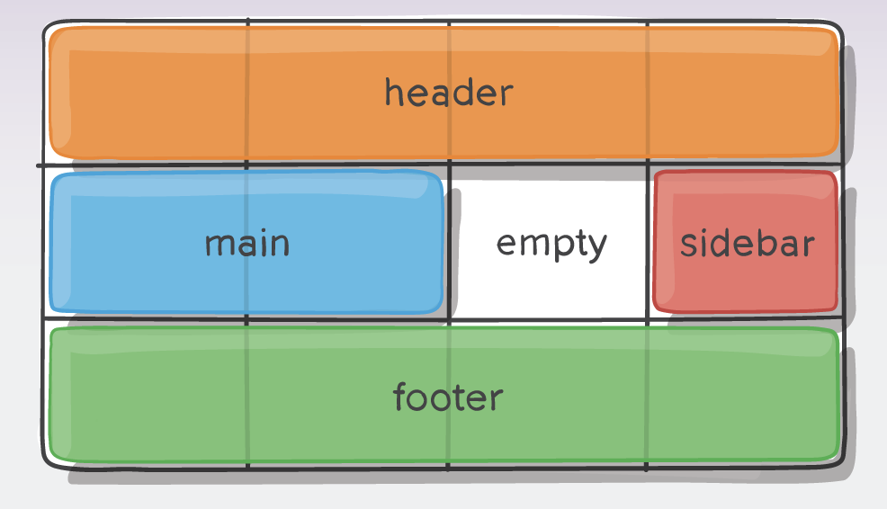
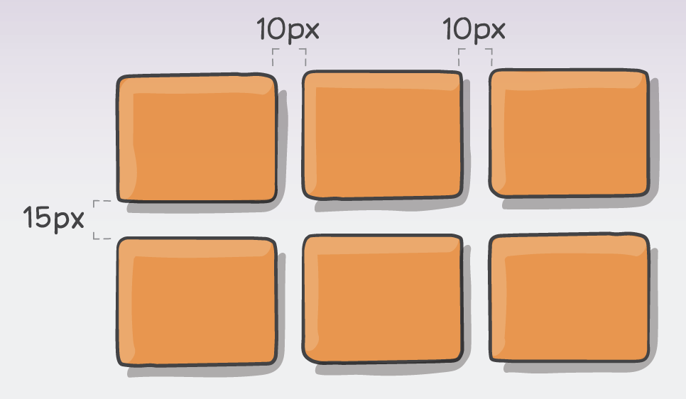
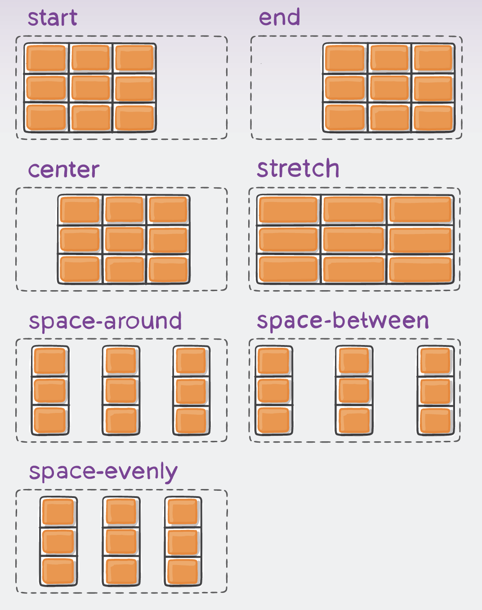
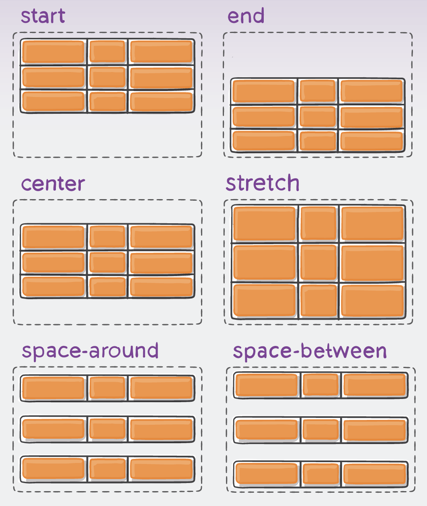
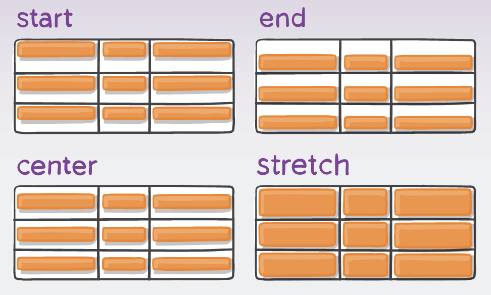
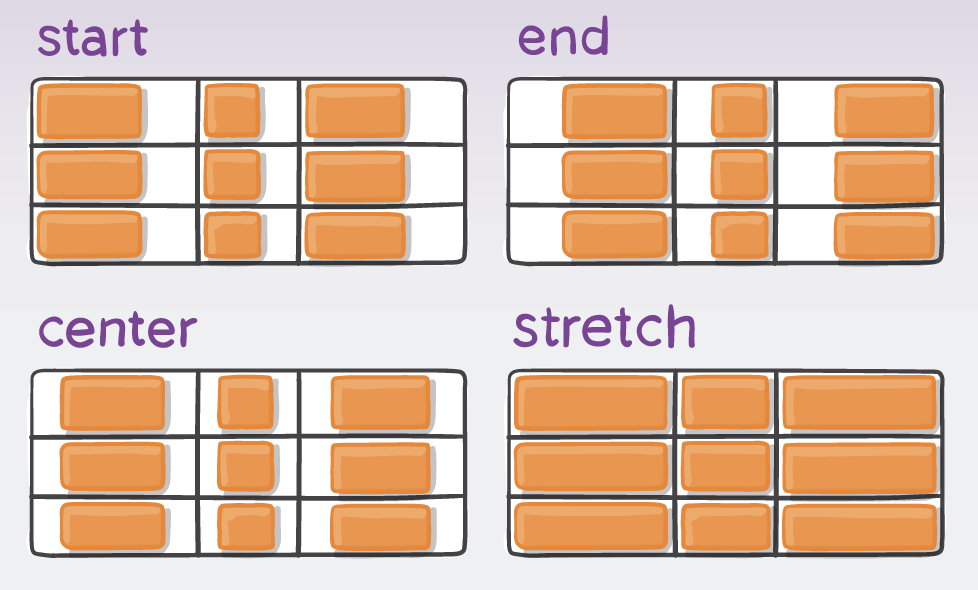
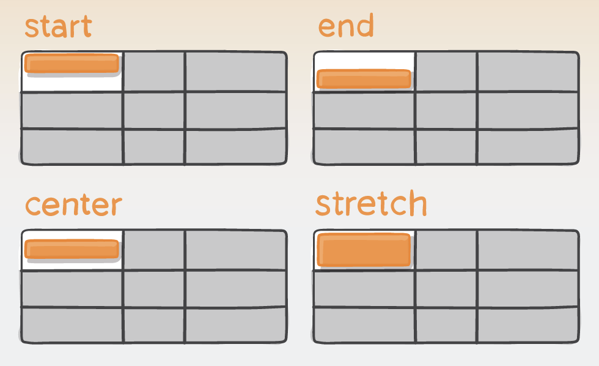
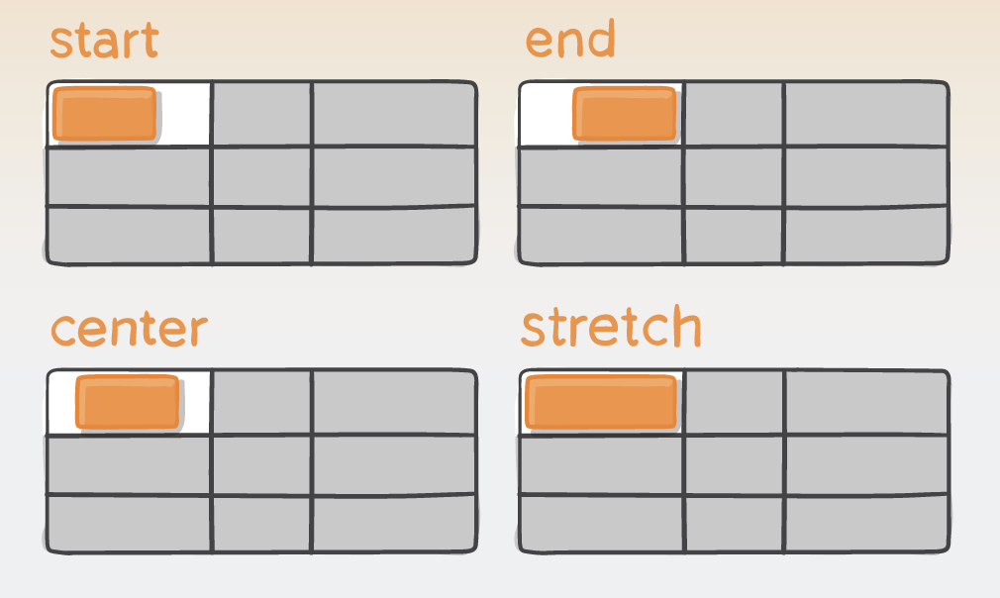
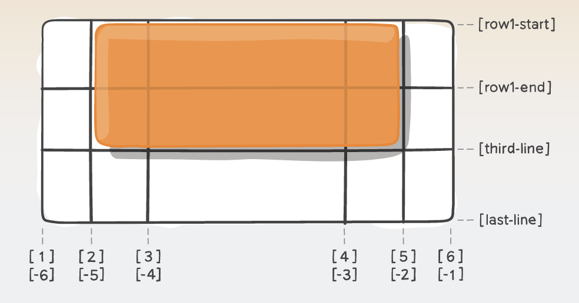
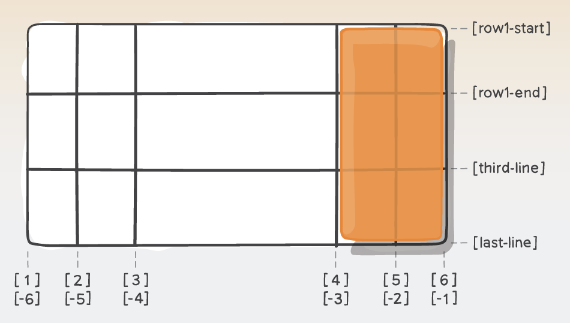

# Cours 5

## Bootstrap

Retour sur le devoir

### Coins arrondis

Bootstrap permet d’[arrondir](https://getbootstrap.com/docs/5.3/utilities/borders/#sizes) facilement les bords d’un élément :

* `.rounded` : coins légèrement arrondis
* ~~`.rounded-lg` : coins plus arrondis (large radius)~~
* `.rounded-1` ... `.rounded-5`  : [configuration de l'arrondissement](https://getbootstrap.com/docs/5.3/utilities/borders/#sizes)
* `.rounded-circle` : cercle parfait (utile avec des images carrées)
* `.rounded-pill` : forme “pilule” (bouton ou image allongée)
* `.img-thumbnail` : bordure + coins arrondis pour encadrer une image

<iframe height="300" style="width: 100%;" scrolling="no" title="Bootstrap - " src="https://codepen.io/tim-momo/embed/QwywVEQ?default-tab=result&editable=true&theme-id=50173" frameborder="no" loading="lazy" allowtransparency="true" allowfullscreen="true">
  See the Pen <a href="https://codepen.io/tim-momo/pen/QwywVEQ">
  Bootstrap - </a> by TIM Montmorency (<a href="https://codepen.io/tim-momo">@tim-momo</a>)
  on <a href="https://codepen.io">CodePen</a>.
</iframe>

### Tableaux

Bootstrap propose plusieurs classes pour améliorer la présentation des [tableaux](https://getbootstrap.com/docs/5.3/content/tables/) :

* `.table` : style de base (bordures et espacements)
* `.table-striped` : lignes alternées
* `.table-bordered` : toutes les bordures visibles
* `.table-hover` : surbrillance au survol
* `.table-primary` : couleur de ligne. Ça fonctionne avec toutes les couleurs de Bootstrap.

<iframe height="300" style="width: 100%;" scrolling="no" title="Bootstrap - Rounded corners" src="https://codepen.io/tim-momo/embed/ogbgPzg?default-tab=result&editable=true&theme-id=50173" frameborder="no" loading="lazy" allowtransparency="true" allowfullscreen="true">
  See the Pen <a href="https://codepen.io/tim-momo/pen/ogbgPzg">
  Bootstrap - Rounded corners</a> by TIM Montmorency (<a href="https://codepen.io/tim-momo">@tim-momo</a>)
  on <a href="https://codepen.io">CodePen</a>.
</iframe>

### Badges

Les [badges](https://getbootstrap.com/docs/5.3/components/badge) affichent de petites étiquettes colorées (souvent utilisés pour compter).

<iframe height="300" style="width: 100%;" scrolling="no" title="Bootstrap - Tables" src="https://codepen.io/tim-momo/embed/jEWEvMz?default-tab=result&editable=true&theme-id=50173" frameborder="no" loading="lazy" allowtransparency="true" allowfullscreen="true">
  See the Pen <a href="https://codepen.io/tim-momo/pen/jEWEvMz">
  Bootstrap - Tables</a> by TIM Montmorency (<a href="https://codepen.io/tim-momo">@tim-momo</a>)
  on <a href="https://codepen.io">CodePen</a>.
</iframe>

### Barre de progression

Les [barres de progression](https://getbootstrap.com/docs/5.3/components/progress/) montrent une avance ou un chargement.

* `.progress` : conteneur
* `.progress-bar` : barre interne
* `.progress-bar-striped` : rayures
* `.progress-bar-animated` : rayures animées

<iframe height="300" style="width: 100%;" scrolling="no" title="Bootstrap - Badges" src="https://codepen.io/tim-momo/embed/zxrxJKX?default-tab=result&editable=true&theme-id=50173" frameborder="no" loading="lazy" allowtransparency="true" allowfullscreen="true">
  See the Pen <a href="https://codepen.io/tim-momo/pen/zxrxJKX">
  Bootstrap - Badges</a> by TIM Montmorency (<a href="https://codepen.io/tim-momo">@tim-momo</a>)
  on <a href="https://codepen.io">CodePen</a>.
</iframe>

### Spinners

Les [spinners](https://getbootstrap.com/docs/5.3/components/spinners) servent à indiquer un chargement.

* `.spinner-border` : cercle qui tourne
* `.spinner-grow` : cercle qui grossit/rétrécit

<iframe height="300" style="width: 100%;" scrolling="no" title="Bootstrap - progress bar" src="https://codepen.io/tim-momo/embed/vELEzyK?default-tab=result&editable=true&theme-id=50173" frameborder="no" loading="lazy" allowtransparency="true" allowfullscreen="true">
  See the Pen <a href="https://codepen.io/tim-momo/pen/vELEzyK">
  Bootstrap - progress bar</a> by TIM Montmorency (<a href="https://codepen.io/tim-momo">@tim-momo</a>)
  on <a href="https://codepen.io">CodePen</a>.
</iframe>

### Pagination

La [pagination](https://getbootstrap.com/docs/5.3/components/pagination) met en forme la naviguation entre plusieurs pages.

<iframe height="300" style="width: 100%;" scrolling="no" title="Bootstrap - Breadcrumb" src="https://codepen.io/tim-momo/embed/pvgvONZ?default-tab=result&editable=true&theme-id=50173" frameborder="no" loading="lazy" allowtransparency="true" allowfullscreen="true">
  See the Pen <a href="https://codepen.io/tim-momo/pen/pvgvONZ">
  Bootstrap - Breadcrumb</a> by TIM Montmorency (<a href="https://codepen.io/tim-momo">@tim-momo</a>)
  on <a href="https://codepen.io">CodePen</a>.
</iframe>

### Breadcrumb (Fil d’Ariane)

Affiche le [chemin de navigation](https://getbootstrap.com/docs/5.3/components/breadcrumb/) de l’utilisateur.

<iframe height="300" style="width: 100%;" scrolling="no" title="Bootstrap - Spinners" src="https://codepen.io/tim-momo/embed/GgogXNr?default-tab=result&editable=true&theme-id=50173" frameborder="no" loading="lazy" allowtransparency="true" allowfullscreen="true">
  See the Pen <a href="https://codepen.io/tim-momo/pen/GgogXNr">
  Bootstrap - Spinners</a> by TIM Montmorency (<a href="https://codepen.io/tim-momo">@tim-momo</a>)
  on <a href="https://codepen.io">CodePen</a>.
</iframe>

### List group

Les [list-groups](https://getbootstrap.com/docs/5.3/components/list-group/) permettent de présenter des listes avec un style moderne.

* `.list-group` : conteneur
* `.list-group-item` : chaque item
* `.list-group-horizontal` : en ligne
  
<iframe height="300" style="width: 100%;" scrolling="no" title="Bootstrap - Pager" src="https://codepen.io/tim-momo/embed/yyeyxVx?default-tab=result&editable=true&theme-id=50173" frameborder="no" loading="lazy" allowtransparency="true" allowfullscreen="true">
  See the Pen <a href="https://codepen.io/tim-momo/pen/yyeyxVx">
  Bootstrap - Pager</a> by TIM Montmorency (<a href="https://codepen.io/tim-momo">@tim-momo</a>)
  on <a href="https://codepen.io">CodePen</a>.
</iframe>

## Système de grille CSS

{.w-100}

En css, le [système de grille](https://developer.mozilla.org/fr/docs/Web/CSS/CSS_grid_layout) permet d’organiser une page Web en lignes et colonnes, un peu comme un tableau invisible sur lequel on place des éléments.

Contrairement à Flexbox, qui aligne les éléments les uns après les autres dans un seul axe (horizontal OU vertical), Grid est pensé pour gérer les deux axes en même temps. Donc pas d'orientation en grid 😜.

[Guide css-tricks](https://css-tricks.com/snippets/css/complete-guide-grid/) (_[Cheatsheet](https://css-tricks.com/wp-content/uploads/2022/02/css-grid-poster.png)_)

### Quand l'utiliser ?

* Pour construire des layouts de page (header, nav, aside, main, footer).
* Pour des galeries d’images où les items doivent s’adapter automatiquement.
* Pour organiser du contenu sous forme de tableaux flexibles et responsives.

### Activer Grid

```html title="HTML"
<div class="grille">
  <div>A</div>
  <div>B</div>
  <div>C</div>
  <div>D</div>
  <div>E</div>
</div>
```

```css title="CSS"
.grille {
  display: grid;
}
```

<iframe height="300" style="width: 100%;" scrolling="no" title="Web Grid" src="https://codepen.io/tim-momo/embed/dPGyQzB?default-tab=result&editable=true&theme-id=50173" frameborder="no" loading="lazy" allowtransparency="true" allowfullscreen="true">
  See the Pen <a href="https://codepen.io/tim-momo/pen/dPGyQzB">
  Web Grid</a> by TIM Montmorency (<a href="https://codepen.io/tim-momo">@tim-momo</a>)
  on <a href="https://codepen.io">CodePen</a>.
</iframe>

Tous les enfants directs deviennent des items de la grille, mais pour que le comportement de grille se fasse voir, il faut spécifier les colonnes / lignes. Sinon on dirait de simple div normales.

### Colonnes et lignes

Les propriétés [`grid-template-columns`](https://developer.mozilla.org/fr/docs/Web/CSS/grid-template-columns) et [`grid-template-rows`](https://developer.mozilla.org/fr/docs/Web/CSS/grid-template-rows) sont la base pour créer un quadrillage précis.

#### `grid-template-columns`

Définit la largeur des colonnes de la grille.

```css
.grille {
  display: grid;
  grid-template-columns: 100px 1fr 100px;
}
```

Crée 3 colonnes :

* une fixe de 100px
* une fluide qui prend l’espace restant (1fr = 1 fraction)
* une fixe de 100px

<iframe height="300" style="width: 100%;" scrolling="no" title="Web Grid" src="https://codepen.io/tim-momo/embed/qEbBgbX?default-tab=result&editable=true&theme-id=50173" frameborder="no" loading="lazy" allowtransparency="true" allowfullscreen="true">
  See the Pen <a href="https://codepen.io/tim-momo/pen/qEbBgbX">
  Web Grid</a> by TIM Montmorency (<a href="https://codepen.io/tim-momo">@tim-momo</a>)
  on <a href="https://codepen.io">CodePen</a>.
</iframe>

#### `grid-template-rows`

Définit la hauteur des rangées.

```css
.grille {
  display: grid;
  grid-template-rows: 100px auto 50px;
}
```

Crée 3 lignes :

* une de 100px
* une qui s’adapte au contenu (auto)
* une de 50px

<iframe height="300" style="width: 100%;" scrolling="no" title="Web Grid template columns" src="https://codepen.io/tim-momo/embed/qEbBgNX?default-tab=result&editable=true&theme-id=50173" frameborder="no" loading="lazy" allowtransparency="true" allowfullscreen="true">
  See the Pen <a href="https://codepen.io/tim-momo/pen/qEbBgNX">
  Web Grid template columns</a> by TIM Montmorency (<a href="https://codepen.io/tim-momo">@tim-momo</a>)
  on <a href="https://codepen.io">CodePen</a>.
</iframe>

#### Raccourcis utiles

```css title="repeat()"
grid-template-columns: repeat(3, 1fr);
/* 
est identique à 
grid-template-columns: 1fr 1fr 1fr;
*/
```

<iframe height="300" style="width: 100%;" scrolling="no" title="Web Grid template rows" src="https://codepen.io/tim-momo/embed/PwZoVpV?default-tab=result&editable=true&theme-id=50173" frameborder="no" loading="lazy" allowtransparency="true" allowfullscreen="true">
  See the Pen <a href="https://codepen.io/tim-momo/pen/PwZoVpV">
  Web Grid template rows</a> by TIM Montmorency (<a href="https://codepen.io/tim-momo">@tim-momo</a>)
  on <a href="https://codepen.io">CodePen</a>.
</iframe>

```css title="repeat + auto-fit = responsive !"
/* 
Chaque colonne doit avoir au moins 150px,
mais peut grandir jusqu’à occuper une fraction de l’espace dispo.
*/
grid-template-columns: repeat(auto-fit, minmax(150px, 1fr));
```

<iframe height="300" style="width: 100%;" scrolling="no" title="Web Grid template columns repeat" src="https://codepen.io/tim-momo/embed/ogbNmWE?default-tab=result&editable=true&theme-id=50173" frameborder="no" loading="lazy" allowtransparency="true" allowfullscreen="true">
  See the Pen <a href="https://codepen.io/tim-momo/pen/ogbNmWE">
  Web Grid template columns repeat</a> by TIM Montmorency (<a href="https://codepen.io/tim-momo">@tim-momo</a>)
  on <a href="https://codepen.io">CodePen</a>.
</iframe>

### Zones

{.w-50 data-zoom-image}

La propriété `grid-template-areas` donne un nom à des zones de la grille. Ça sert à être plus lisible et facile à maintenir.

```css title="Exemple"
.grille {
  display: grid;
  grid-template-columns: 30px 1fr 1fr;
  grid-template-rows: 60px 1fr;
  grid-template-areas:
    "allo allo allo"
    "bravo cadeau cadeau";
}
```

Puis on assigne chaque élément :

```css title="Exemple"
.div1 { grid-area: allo; }
.div2 { grid-area: bravo; }
.div3 { grid-area: cadeau; }
```

<iframe height="300" style="width: 100%;" scrolling="no" title="Web Grid - template-area" src="https://codepen.io/tim-momo/embed/wBMBYjZ?default-tab=result&editable=true&theme-id=50173" frameborder="no" loading="lazy" allowtransparency="true" allowfullscreen="true">
  See the Pen <a href="https://codepen.io/tim-momo/pen/wBMBYjZ">
  Web Grid - template-area</a> by TIM Montmorency (<a href="https://codepen.io/tim-momo">@tim-momo</a>)
  on <a href="https://codepen.io">CodePen</a>.
</iframe>

### Espacements

{.w-50 data-zoom-image}

Propriétés :

* `column-gap` : espace entre les colonnes
* `row-gap` : espace entre les lignes
* `gap` : raccourci pour les deux

```css title="Exemple"
.grille {
  gap: 20px;              /* colonnes ET rangées */
  column-gap: 30px;       /* juste colonnes */
  row-gap: 10px;          /* juste rangées */
}
```

<iframe height="300" style="width: 100%;" scrolling="no" title="Web Grid - justify-content" src="https://codepen.io/tim-momo/embed/XJXJxqN?default-tab=result&editable=true&theme-id=50173" frameborder="no" loading="lazy" allowtransparency="true" allowfullscreen="true">
  See the Pen <a href="https://codepen.io/tim-momo/pen/XJXJxqN">
  Web Grid - justify-content</a> by TIM Montmorency (<a href="https://codepen.io/tim-momo">@tim-momo</a>)
  on <a href="https://codepen.io">CodePen</a>.
</iframe>

### Alignement global du contenu

Les propriétés `justify-content` et `align-content` gèrent l’alignement de l’ensemble de la grille, pas des items individuellement.

#### `justify-content`

{.w-50 data-zoom-image}

Aligne la grille entière horizontalement dans le conteneur, si celui-ci est plus large que la somme des colonnes.

```css title="Exemple"
.grille {
  justify-content: center;   /* centre la grille horizontalement */
}
```

<iframe height="300" style="width: 100%;" scrolling="no" title="Web Grid - align-content" src="https://codepen.io/tim-momo/embed/dPGPgmd?default-tab=result&editable=true&theme-id=50173" frameborder="no" loading="lazy" allowtransparency="true" allowfullscreen="true">
  See the Pen <a href="https://codepen.io/tim-momo/pen/dPGPgmd">
  Web Grid - align-content</a> by TIM Montmorency (<a href="https://codepen.io/tim-momo">@tim-momo</a>)
  on <a href="https://codepen.io">CodePen</a>.
</iframe>

#### `align-content`

{.w-50 data-zoom-image}

Aligne la grille entière verticalement, si la hauteur du conteneur est plus grande que celle des lignes.

```css title="Exemple"
.grille {
  align-content: space-between;
}
```

<iframe height="300" style="width: 100%;" scrolling="no" title="Web Grid - align-items / justify-items" src="https://codepen.io/tim-momo/embed/EaPadQW?default-tab=result&editable=true&theme-id=50173" frameborder="no" loading="lazy" allowtransparency="true" allowfullscreen="true">
  See the Pen <a href="https://codepen.io/tim-momo/pen/EaPadQW">
  Web Grid - align-items / justify-items</a> by TIM Montmorency (<a href="https://codepen.io/tim-momo">@tim-momo</a>)
  on <a href="https://codepen.io">CodePen</a>.
</iframe>

### Alignement des items dans les cellules

#### `align-items` / `justify-items`

<div class="grid" markdown>
<figure markdown>
{data-zoom-image}
<figcaption>align-items</figcaption>
</figure>
<figure markdown>
{data-zoom-image}
<figcaption>justify-items</figcaption>
</figure>
</div>

Les propriétés `align-items` et `justify-items` contrôlent l’alignement par défaut des items dans leurs cellules.

```scss title="Exemple"
.grille {
  //...
  align-items: end;
  justify-items: center;
}
```

<iframe height="300" style="width: 100%;" scrolling="no" title="Web Grid - align-self / justify-self" src="https://codepen.io/tim-momo/embed/YPwPJEa?default-tab=result&editable=true&theme-id=50173" frameborder="no" loading="lazy" allowtransparency="true" allowfullscreen="true">
  See the Pen <a href="https://codepen.io/tim-momo/pen/YPwPJEa">
  Web Grid - align-self / justify-self</a> by TIM Montmorency (<a href="https://codepen.io/tim-momo">@tim-momo</a>)
  on <a href="https://codepen.io">CodePen</a>.
</iframe>

Tous les enfants s’aligneront ainsi, sauf si un item définit ses propres règles.

#### `align-self` / `justify-self`

<div class="grid" markdown>
<figure markdown>
{data-zoom-image}
<figcaption>align-self</figcaption>
</figure>
<figure markdown>
{data-zoom-image}
<figcaption>justify-self</figcaption>
</figure>
</div>

Permettent d’aligner un item individuel dans sa cellule.

```scss title="Exemple"
.item {
  align-self: end;         
  justify-self: center;    
}
```

<iframe height="300" style="width: 100%;" scrolling="no" title="Web Grid testing" src="https://codepen.io/tim-momo/embed/XJXJxbm?default-tab=result&editable=true&theme-id=50173" frameborder="no" loading="lazy" allowtransparency="true" allowfullscreen="true">
  See the Pen <a href="https://codepen.io/tim-momo/pen/XJXJxbm">
  Web Grid testing</a> by TIM Montmorency (<a href="https://codepen.io/tim-momo">@tim-momo</a>)
  on <a href="https://codepen.io">CodePen</a>.
</iframe>

#### `place-items`

`place-items` est un raccourci pratique qui combine `align-items` (axe vertical) et `justify-items` (axe horizontal) en une seule propriété.

```css
.grille {
  /* équivalent à align-items: center; justify-items: center; */
  place-items: center;
}
```

Note : `place-items` s'applique au conteneur de la grille et définit l'alignement par défaut pour tous les items. Les propriétés individuelles `align-self` / `justify-self` peuvent toujours être utilisées pour surcharger l'alignement d'un item spécifique.

### Placement manuel

Les propriétés de positionnement permettent de définir précisément où commence et finit un élément dans la grille.

#### `grid-row-start` / `grid-row-end`

Définissent sur quelle ligne horizontale un item commence et finit :

```css
.item {
  grid-row-start: 1;    /* commence à la 1ère ligne horizontale */
  grid-row-end: 3;      /* finit avant la 3e ligne horizontale */
  /* L'item occupe donc les rangées 1 et 2 */
}
```

##### `grid-column-start` / `grid-column-end`

Définissent sur quelle ligne verticale un item commence et finit :

```css
.item {
  grid-column-start: 2;  /* commence à la 2e ligne verticale */
  grid-column-end: 5;    /* finit avant la 5e ligne verticale */
  /* L'item occupe donc les colonnes 2, 3 et 4 */
}
```

Note : Il est possible d'utiliser des valeur négatives 🤪

#### Raccourcis `grid-column` / `grid-row`

{.w-50 data-zoom-image}

Les propriétés `grid-column` et `grid-row` permettent à un item d’occuper plusieurs cases de la grille.

```scss
.item {
  /* Raccourci pour grid-column-start: 2 et grid-column-end: 5 */
  grid-column: 2 / 5; 
    
  /* Raccourci pour grid-row-start: 1 et grid-row-end: 3 */
  grid-row: 1 / 3;    
}
```

Très utile pour créer des mises en page asymétriques (un bloc plus grand que les autres).

#### Raccourci des raccourcis `grid-area`

{.w-50 data-zoom-image}

`grid-area` combine toutes les propriétés de positionnement en une seule ligne :

```scss
.item {
  grid-area: 1 / 5 / 4 / 6;

  // Équivalent à :
  //   grid-row-start: 1
  //   grid-column-start: 5  
  //   grid-row-end: 4
  //   grid-column-end: 6
}
```

L'ordre des valeurs est : `row-start / column-start / row-end / column-end`

##### Note sur le mot-clé `span`

Dans le sytème grid, `span` est un mot-clé utile pour indiquer qu'un item doit occuper un certain nombre de lignes ou colonnes sans préciser explicitement l'index de fin.

```css
/* 
Commence à la colonne 2 et s'étend sur 3 colonnes (2,3,4) 
Équivalent de : .item { grid-column: 2 / 5; }
*/
.item { grid-column: 2 / span 3; }
```

## Retour sur .gitignore

{.w-100}

Dans le TP1, vous devez utiliser la notion de `.gitignore`. Ce fichier permet d’exclure des fichiers ou dossiers de Git (et donc de GitHub).

### La bonne méthode

1. Créer le dépôt sur GitHub
1. Avant d’installer vos dépendances, ajoutez un fichier .gitignore contenant au minimum :
    ```bash title=".gitignore"
    node_modules
    ```
1. Clonez le dépôt, puis commencez le développement.

Si vous voyez le .gitignore dans GitHub, vous pouvez procéder au développement de votre site Web.

### Plan B

Si votre projet est déjà sur GitHub et que par exemple node_modules/ a été commité. C'est possible de corriger l'erreur.

Ajoutez d'abord votre .gitignore, puis supprimez le suivi du dossier dans l’index :

En ligne de commande, positionnez vous sur votre projet et exécutez les commandes suivantes :


```bash title="Terminal"
git rm -r --cached .
```

```bash title="Terminal"
git add -A
```

```bash title="Terminal"
git commit -m ".gitignore opérationnel"
```

```bash title="Terminal"
git push
```

À partir de là, Git arrêtera de suivre les éléments spécifiés dans le `.gitignore`.

### Exemple de .gitignore

```bash title=".gitignore"
# Dépendances npm
node_modules/

# macOS (pour les utilisateurs Apple)
.DS_Store
.AppleDouble
.LSOverride

# Vscode
.vscode
coverage/
```

Les slash ont une importance. Voici les différents cas de figure : 

* `/node_modules` : seulement à la racine.
* `node_modules/` : tous les dossiers node_modules (partout) ✅ (souvent la meilleure pratique).
* `node_modules` : tous les fichiers ET dossiers appelés node_modules (un peu trop permissif, mais fonctionne aussi). Exemple, node_modules.txt serait aussi ignoré.

## Exercices

<div class="grid grid-1-2" markdown>
  

  <small>Exercice - Bootstrap</small><br>
  **[W3Schools](./exercices/w3schools/index.md){.stretched-link .back}**
</div>

<div class="grid grid-1-2" markdown>
  

  <small>Exercice - Bootstrap</small><br>
  **[Triskaïdékaphobie](./exercices/triskaidekaphobie/index.md){.stretched-link .back}**
</div>

<div class="grid grid-1-2" markdown>
  

  <small>Exercice - Bootstrap</small><br>
  **[Drapeaux](./exercices/drapeau/index.md){.stretched-link .back}**
</div>

<div class="grid grid-1-2" markdown>
  

  <small>Exercice - Bootstrap</small><br>
  **[Jardin suspendu de Babylone](./exercices/jardin-babylone/index.md){.stretched-link .back}**
</div>

<div class="grid grid-1-2" markdown>
  

  <small>Exercice - grid</small><br>
  **[Spirale](./exercices/spirale/index.md){.stretched-link .back}**
</div>

<div class="grid grid-1-2" markdown>
  

  <small>Exercice - npm</small><br>
  **[Dragon Smaug](./exercices/dragon-smaug/index.md){.stretched-link .back}**
</div>

[STOP]

Tailwind retiré. La classe n'a pas encore absorbé Bootstrap.
Aussi, Tailwind serait à voir en même temps que vitejs. Ce serait plus logique.
