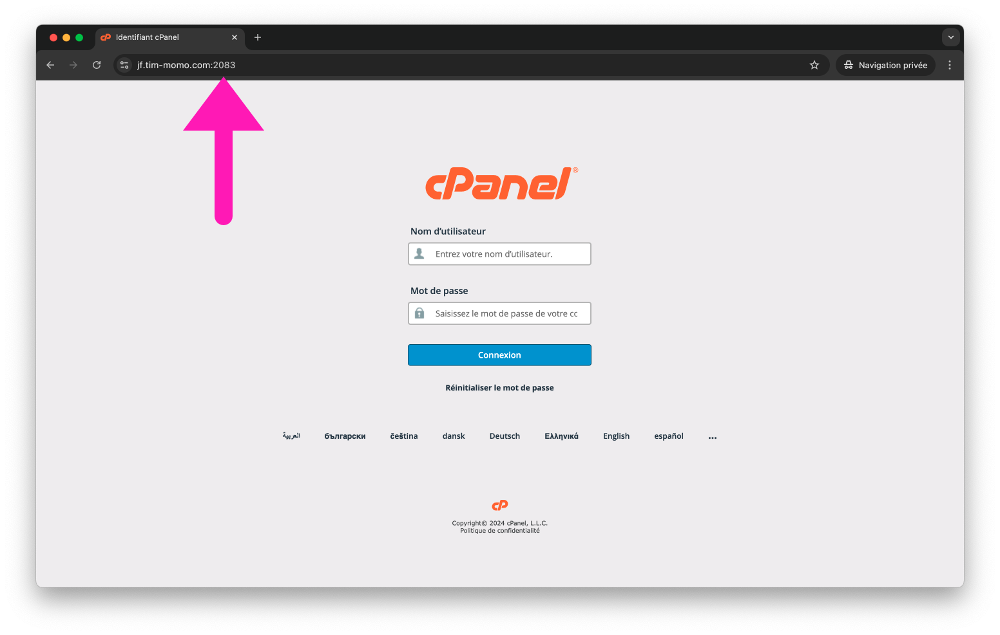
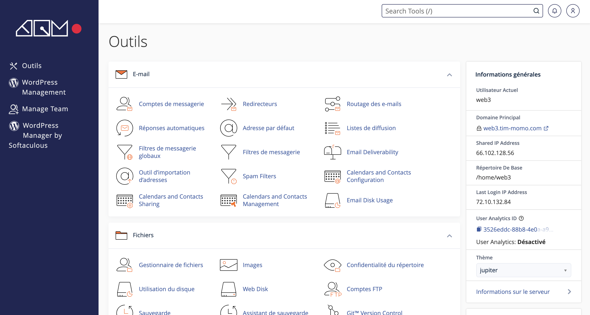
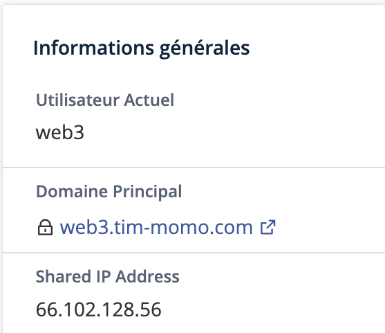
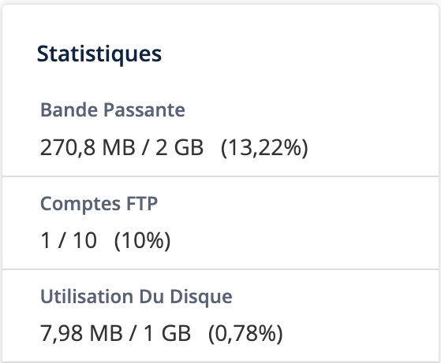
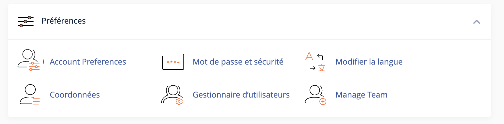
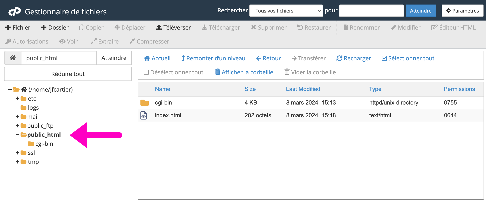
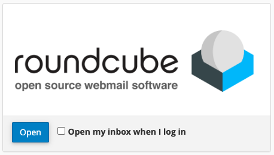
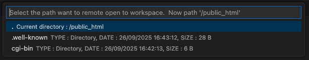

# Cours 5 

[STOP]

<!-- git ligne de commande
git vscode

Codeberg
Bitbucket
Console dans vscode

| Mise en ligne : GitHub Pages & cPanel -->

<!-- **Savoirs :** #4 Compatibilité navigateurs · #12 Validation (via le build/déploiement) -->

<!-- Plan : distinction code source vs build (dist/) · GitHub Pages (CI/CD) · cPanel (hébergement réel) · comparaison -->
<!-- {.aspect-16-9 .w-100} -->

*[CDN]: Content Delivery Network
*[FTP]: File Transfer Protocol
*[CI/CD]: Continuous Integration / Continuous Deployment

## Serveur, domaine et hébergement

Le concept de serveur, de domaine et d'hébergement se traduit bien par l'analogie du lopin de terre.

{data-zoom-image}

## GitHub Pages

{.w-100}

[GitHub Pages](https://docs.github.com/fr/pages) transforme gratuitement un dépôt Git en site Web. 

### Méthode rapide

La façon la plus simple de le faire est avec un `index.html` à la racine du repo.

- Créer un nouveau repository **public** sur GitHub.
- Créer un `index.html` avec une structure de base et du contenu dans le `<body>`
- Clic sur Settings > Pages
- Source = Deploy from a branch
- Branch = main, clic Save
- Attendre le déploiment (quelques minutes)

L'adresse de votre site est normalement construite ainsi : 

```
https://ton-username.github.io/nom-du-repo/
```

#### Déployer manuellement un build vite

Après avoir exécuté `npx vite build`, un dossier `/dist` est créé avec le code à déployer à l'intérieur.

Il suffit alors de mettre le contenu du dossier dist sur GitHub pour que GitHub Pages l'affiche.

### Méthode automatisée


Comme Vite exige une étape de *build*, on peut demander à **GitHub Actions** de le faire pour nous à chaque `git push`.


### :material-numeric-1-box: Configurer le `base` dans `vite.config.js`

C'est **l'étape la plus importante** - celle qu'on oublie toujours. Sur GitHub Pages, votre site n'est pas à la racine du domaine, mais dans un **sous-dossier** portant le nom du dépôt :

```
https://VOTRE-USAGER.github.io/NOM-DU-DEPOT/
```

Si Vite ne le sait pas, il cherchera vos fichiers CSS/JS à la racine et vous obtiendrez une **page blanche**. Il faut donc lui indiquer le chemin :

```js title="vite.config.js"
import { defineConfig } from 'vite'

export default defineConfig({
  base: '/NOM-DU-DEPOT/',
})
```

!!! warning "Les deux barres obliques comptent"

    Le `base` doit commencer **et** finir par un `/`. Remplacez `NOM-DU-DEPOT` par le nom exact de votre dépôt GitHub (sensible à la casse).

    *(Si un jour vous branchez un nom de domaine personnalisé ou utilisez `usager.github.io`, remettez simplement `base: '/'`.)*

### :material-numeric-2-box: Activer GitHub Pages

Dans votre dépôt, allez dans **Settings → Pages**. Sous **Build and deployment**, dans la liste déroulante **Source**, choisissez **GitHub Actions**.

### :material-numeric-3-box: Créer le workflow

Créez le fichier `.github/workflows/deploy.yml`. Ce fichier dit à GitHub : « à chaque `push` sur `main`, installe les dépendances, fais le `build`, et publie le `dist/` ».

```yaml title=".github/workflows/deploy.yml"
name: Deploy static content to Pages

on:```
  push:
    branches: ['main']
  workflow_dispatch:

permissions:
  contents: read
  pages: write
  id-token: write

concurrency:
  group: 'pages'
  cancel-in-progress: true

jobs:
  deploy:
    environment:
      name: github-pages
      url: ${{ steps.deployment.outputs.page_url }}
    runs-on: ubuntu-latest
    steps:
      - name: Checkout
        uses: actions/checkout@v7
      - name: Set up Node
        uses: actions/setup-node@v6
        with:
          node-version: lts/*
          cache: 'npm'
      - name: Install dependencies
        run: npm ci
      - name: Build
        run: npm run build
      - name: Setup Pages
        uses: actions/configure-pages@v6
      - name: Upload artifact
        uses: actions/upload-pages-artifact@v5
        with:
          path: './dist'
      - name: Deploy to GitHub Pages
        id: deployment
        uses: actions/deploy-pages@v5
```

### :material-numeric-4-box: Pousser et observer

```bash
git add .
git commit -m "Configurer le déploiement GitHub Pages"
git push
```

Rendez-vous dans l'onglet **Actions** de votre dépôt : vous verrez le workflow s'exécuter (checkout → build → deploy). Une fois le rond vert affiché, votre site est en ligne à `https://VOTRE-USAGER.github.io/NOM-DU-DEPOT/`.

!!! tip "C'est ça, le CI/CD"

    Vous venez de mettre en place un mini pipeline d'**intégration et de déploiement continus** : chaque `push` reconstruit et republie le site automatiquement. Plus besoin d'y penser.

## Partie 2 - Hébergement réel avec cPanel


Abréviation de “control panel”, cPanel est un panneau de gestion d’hébergement Web qui permet de gérer un ou plusieurs serveurs et leurs sites Web via une interface graphique.

Il existe plusieurs autres outils de gestion de serveur comme Plesk, DirectAdmin ou Webmin, mais dans le cadre du cours, nous utiliserons cPanel.

### Connexion

<!-- {data-zoom-image} -->

#### Adresse

La connexion se fait à l'adresse suivante : **https://SOUSDOMAINE.tim-momo.com:2083**

Remplacez `SOUSDOMAINE` par votre nom de famille

!!! example "Exemple : https://tremblay-rivard.tim-momo.com:2083"

#### Nom d'utilisateur

Le nom d'utilisateur est votre prénom sur colnet, en minuscule, sans accents. 

- Si vous avez plusieurs prénoms, ce sera simplement le premier. (ex: pour Charlie Charlotte, le username est charlie)
- Si c'est un prénom composé, le trait n'est pas conservé. (ex: pour Pier-Olivier, le username est pierolivier)

- Pour les Alexandre, ajoutez les initiales de votre nom de famille (ex: pour Alexandre Tremblay-Rivard, le username est alexandretr)

#### Mot de passe

Votre mot de passe est votre **DA** à 9 chiffres. (ex: 202012345)

### Tableau de bord

{data-zoom-image}

### Informations générales et statistiques

<div class="grid align-items-start" markdown>
{data-zoom-image}

{data-zoom-image}
</div>

### Changer son mot de passe



Il est fortement recommandé de changer son mot de passe pour quelque chose de plus sécuritaire.

1. Dans le tableau de bord, cliquer sur « Mot de passe et sécurité »
1. Changer le mot de passe

### Gestionnaire de fichiers

1. Dans le tableau de bord, cliquer sur « Gestionnaire de fichiers »

{data-zoom-image}

{data-zoom-image}

* 📁 public_html : C’est la racine Web : tout ce que vous y ajouterez sera visible sur internet

  > Exemples :
  > - public_html/index.html : visible par `https://201234567.tim-momo.com/`
  > - public_html/tp2/index.html : visible par `https://201234567.tim-momo.com/tp2/`
  > 
  > Je recommande de faire un répertoire par projet pour le moment. Rien à la racine directement. Pour le moment ;)
  > 
  > Petit truc. Téléverser un `.zip` pour l'extraire ensuite permet de faciliter le processus.

* 📁 public_ftp : Sert pour partager des fichiers via FTP anonyme. 

  > Si activé, n'importe qui pourrait télécharger son contenu via une adresse comme : `ftp://201234567.tim-momo.com`

* 📁 mail : Contient les boîtes de réception de vos courriels
* 📁 logs : contient les erreurs serveur au format compressé (ex. : 404, 500)
* 📁 ssl : stocke les certificats pour activer la notion HTTPS
* 📁 tmp : fichiers temporaires
* 📁 etc : contient des fichiers de configuration globales

!!! info "403 Forbidden"

    S'il n'y a pas de fichier index.html à la racine du dossier public_html, vous devriez logiquement voir cette page :

    

### Courriels


Votre cPanel vient avec une gestion de courriels, un peu comme si vous aviez votre propre Gmail.

#### Créer une boîte de courriel

1. Dans le tableau de bord, cliquer sur « Comptes de messagerie »
1. Cliquer sur « Créer »
1. Ajouter un nom d'utilisateur. Ce sera le nom de votre courriel. Par exemple : contact@201234567.tim-momo.com
1. Ajouter un mot de passe
1. Cliquer sur « Créer »

#### Boîte de courriel

1. Dans le tableau de bord, cliquer sur « Comptes de messagerie »
1. Cliquer sur « Check Email » de la boîte de courriel précédemment créée.

!!! info "Webmail"

    Si le lien ne fonctionne pas, vous y avez accès par votre url en spécifiant webmail.
    
    Ex: https://webmail.201234567.tim-momo.com/ 

1. Cliquer sur « Open »

  {.w-50}

1. Tester l'envoi et la réception d'un courriel.

## Gestion du serveur à distance avec ftp-simple


<div class="grid grid-auto" markdown>


[ftp-simple](https://marketplace.visualstudio.com/items?itemName=humy2833.ftp-simple) est une extension qui permet de travailler sur le serveur directement dans VSCode !
</div>

### Configuration

1. Dans VSCode, appuyer sur la touche ++f1++ (ou ++ctrl+shift+p++)
1. Chercher « ftp-simple »
1. Choisir l'option « ftp-simple: Config ... »

   > Cela ouvre le fichier de configuration `ftp-simple-temp.json`

1. Entrer les informations de connexion de votre cPanel :

  ```json title="Exemple"
  [
    {
      "name": "201234567.tim-momo.com",
      "host": "201234567.tim-momo.com",
      "port": 21,
      "type": "ftp",
      "username": "carmackjohn",
      "password": "5145551234",
      "path": "/public_html",
      "autosave": true,
      "confirm": true
    }
  ]
  ```
1. Sauvegarder et fermer le fichier de configuration.

### Ouvrir une session

1. Dans VSCode, ouvrir une nouvelle fenêtre
1. Appuyer sur la touche ++f1++
1. Chercher « ftp-simple »
1. Choisir l'option « ftp-simple: Remote directory ... »
1. Choisir le site sur lequel se connecter (normalement celui configuré plus tôt)
1. Choisir le dossier à ouvrir (`. Current directory : /public_html`)

  

!!! danger "Rappel : on téléverse le `dist/`, pas le source"

    Faites d'abord `npm run build` en local, puis glissez le **contenu du dossier `dist/`** dans `public_html` (ou dans un sous-dossier de projet). Ne téléversez jamais `node_modules`, `vite.config.js` ou vos fichiers source.

    Contrairement à GitHub Pages, ici **pas de `base` à configurer** si votre site est à la racine du domaine.

## GitHub Pages ou cPanel ?

Les deux méthodes publient le même `dist/` ; elles diffèrent par le *transport* et par ce que le serveur vous offre.

| Critère | :material-github: GitHub Pages | :material-server: cPanel |
| --- | --- | --- |
| **Transport du build** | Automatisé (GitHub Actions à chaque `push`) | Manuel (Gestionnaire de fichiers ou FTP) |
| **Étape de build** | Faite par GitHub dans le nuage | Faite par vous, en local |
| **Config `base` Vite** | Obligatoire (`/nom-du-depot/`) | Aucune (site à la racine) |
| **Coût** | Gratuit | Hébergement payant (réel) |
| **Nom de domaine** | `usager.github.io/...` (perso possible) | Vrai nom de domaine |
| **Courriels** | ✗ | ✓ (boîtes @votredomaine) |
| **Contrôle du serveur** | Aucun (boîte noire) | Total (fichiers, logs, SSL, FTP) |
| **Idéal pour** | Prototypes, portfolios, démos | Sites clients, milieu de travail |

!!! success "À retenir"

    Même livrable (`dist/`), deux transports. GitHub Pages **automatise** ; cPanel donne le **contrôle d'un vrai serveur**. Savoir faire les deux, c'est être prêt autant pour vos projets perso que pour un mandat client.

## Récapitulatif : mettre Digger en ligne

=== ":material-github: Méthode GitHub Pages"

    - [ ] Régler `base: '/nom-du-depot/'` dans `vite.config.js`
    - [ ] Créer `.github/workflows/deploy.yml`
    - [ ] Activer **Settings → Pages → Source : GitHub Actions**
    - [ ] `git add . && git commit -m "Déploiement" && git push`
    - [ ] Vérifier l'onglet **Actions** puis ouvrir l'URL `usager.github.io/nom-du-depot/`

=== ":material-server: Méthode cPanel"

    - [ ] `npm run build` en local (génère `dist/`)
    - [ ] Se connecter au cPanel (`https://SOUSDOMAINE.tim-momo.com:2083`)
    - [ ] Téléverser le **contenu de `dist/`** dans `public_html/` (ou un sous-dossier de projet)
    - [ ] Ouvrir l'URL de v```otre serveur pour valider

!!! danger "L'erreur numéro 1"

    Une **page blanche** sur GitHub Pages&nbsp;? C'est presque toujours le `base` mal configuré dans `vite.config.js`. Vérifiez qu'il correspond **exactement** au nom du dépôt, entre deux barres obliques.
