# Cours 6 | Mise en ligne

## Introduction

1. Remise du PS1 (critique) le 5 octobre à 23 h 59
1. Examen le 6 octobre
1. Retour sur les exercices

## Hygiène de programmation

{ .w-100 }

### Prettier

<div class="grid grid-auto" markdown>


Activez la mise en forme du code avec l’extension [**Prettier**](https://marketplace.visualstudio.com/items?itemName=esbenp.prettier-vscode)
</div>

Pour formatter manuellement votre code, effectuez un clic-droit sur le code et sélectionner "Mettre en forme le document" (ou _Format Document_).

#### Prettier par défaut

Si prettier n'est pas le formatteur par défaut, vous pouvez corriger cela.

1. Ouvrez les paramètres de VSCode : ++ctrl+comma++ (virgule)
1. Recherchez « Default Formatter »
1. Sélectionnez « Prettier - Code formatter »

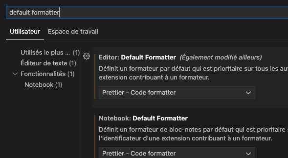{data-zoom-image .w-50}

#### Print Width

Par défaut, prettier est assez strict sur les longeurs de ligne de code. Il les limite à 80 caractères par ligne. Vous pouvez changer cela à 120 ou même 160.

1. Ouvrez les paramètres de VSCode : ++ctrl+comma++ (virgule)
1. Recherchez « Print Width »
1. Modifiez la valeur à 160

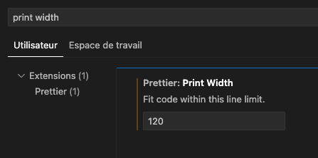{data-zoom-image .w-50}

#### Mise en forme automatique

1. Ouvrez les paramètres de VSCode : ++ctrl+comma++ (virgule)
1. Recherchez « Format On Save »
1. Cochez la case « Editor: Format On Save »
1. Testez en enregistrant un fichier pour voir le formatage automatique.

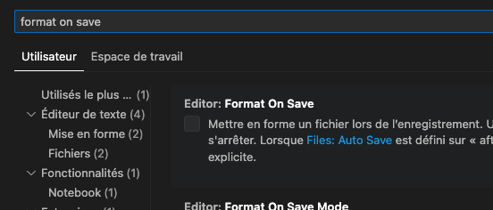{data-zoom-image .w-50}

:material-information: Si votre code n'est pas valide, la mise en forme ne s'effectuera pas. C'est un signe qu'il faut évaluer sa programmation.

### HTMLHint

<div class="grid grid-auto" markdown>


Activez la validation HTML avec l’extension VSCode [**HTMLHint**](https://marketplace.visualstudio.com/items?itemName=HTMLHint.vscode-htmlhint)
</div>


### ESLint

<div class="grid grid-auto" markdown>


Activez la validation avec l’extension VSCode [**ESLint**](https://marketplace.visualstudio.com/items?itemName=dbaeumer.vscode-eslint)
</div>

## Rappel de raccourcis


* Sélectionner tout le texte : ++ctrl+a++
* Sauvegarder : ++ctrl+s++
* Annuler (Undo) : ++ctrl+z++
* Refaire (Redo) : ++ctrl+shift+z++ ou ++ctrl+y++
* Copier : ++ctrl+c++
* Couper : ++ctrl+x++
* Coller : ++ctrl+v++
* Coller sans mise en forme : ++ctrl+shift+v++
* Ouvrir un onglet fermé : ++ctrl+shift+t++
* Changer d’application ouverte (_task switcher_) : ++alt+tab++
* Chercher : ++ctrl+f++

!!! info "Mac"

    La plupart du temps, les variations :simple-apple: pour mac remplacent ++ctrl++ par ++command++.

### VSCode

* Commenter/décommenter : ++ctrl+slash++

### Touche "Insert"

La tant détestée [touche Insert](https://en.wikipedia.org/wiki/Insert_key) (++insert++) sert à ajouter et supprimer en même temps. Ça fait l'effet d'écrire et d'effacer en même temps. Il faut juste savoir qu'elle existe 🙃

## Serveur, domaine et hébergement

Le concept de serveur, de domaine et d'hébergement se traduit bien par l'analogie du lopin de terre.

{data-zoom-image}

## cPanel


Abréviation de “control panel”, cPanel est un panneau de gestion d’hébergement Web qui permet de gérer un ou plusieurs serveurs et leurs sites Web via une interface graphique.

Il existe plusieurs autres outils de gestion de serveur comme Plesk, DirectAdmin ou Webmin, mais dans le cadre du cours, nous utiliserons cPanel.

### Connexion

<!-- {data-zoom-image} -->

#### Adresse

La connexion se fait à l'adresse suivante : **https://SOUSDOMAINE.tim-momo.com:2083**

Remplacez `SOUSDOMAINE` par les 9 caractères de votre numéro de DA.

!!! example "Exemple"

    https://202912345.tim-momo.com:2083

#### Nom d'utilisateur

Vous trouverez votre nom d'utilisateur dans une des listes ci-dessous.

<div class="grid align-items-start" markdown>

| AM |
| ----------------- |
| ounissiassil |
| keosombathtommy |
| siroistanguaycdr |
| chahedchaima |
| fosubradley[^exception]|
| benfradjadam |
| raymondjanviervi |
| canomendozacrist |
| gagnsabrina |
| jeanjacqueskathl |
| rousselthomas |
| cortesluca |
| richardnurlika |
| vicsaimark |
| onkoyasmine |
| ferdinandjayden |
| mullerfranoissar |
| briandwilliam |
| guilbaultalexis |
| driesenseanlarry |
| benmaizrada |
| richardtyler |
| veilleuxamlie |
| elfantroussiyass |
| bonneaulucas |

| PM |
| ----------------- |
| cheourwalid |
| pereiracalderonp |
| lalibertolivier |
| canizalezefram |
| simonnathan |
| rodriguezfontain |
| tighzanourelisle |
| crevierjonathan |
| gevorgyanmariam |
| chheralexia |
| cruznicolas |
| lvesqueflix |
| plantesalmeronal |
| thortjessica |
| sadkimohamedali |
| sousaluizfelippe |
| ataimeena |
| frchettemathieu |
| lysenkoiryna |
| guerrierjonesthe |
| warrenzackary |
| vaillancourtrosa |
| labbharleymarlon |
| thriaultjrmy |
| vitalstanleyoliv |
| barydiouma |

</div>

[^exception]: Votre mot de passe contient un "1" avant votre numéro de téléphone

#### Mot de passe

Votre mot de passe est votre **numéro de téléphone** sur Colnet : sans tiret ni espace.

!!! example "Exemple"

    5145551234

### Tableau de bord

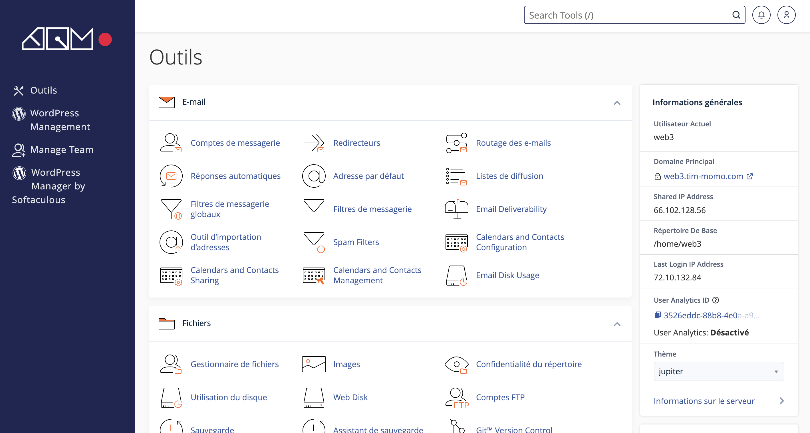{data-zoom-image}

### Informations générales et statistiques

<div class="grid align-items-start" markdown>
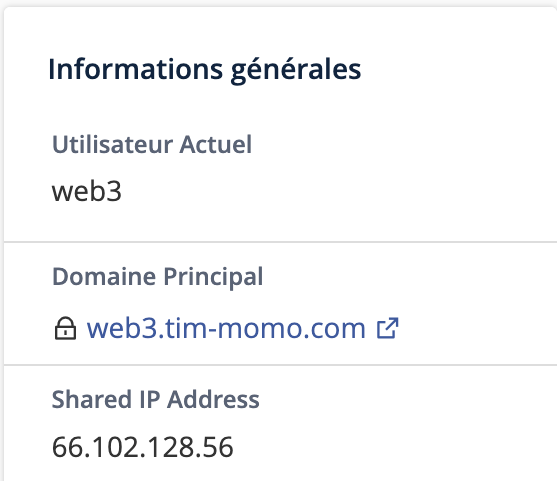{data-zoom-image}

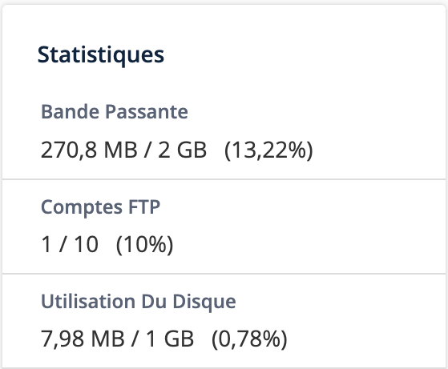{data-zoom-image}
</div>

### Changer son mot de passe

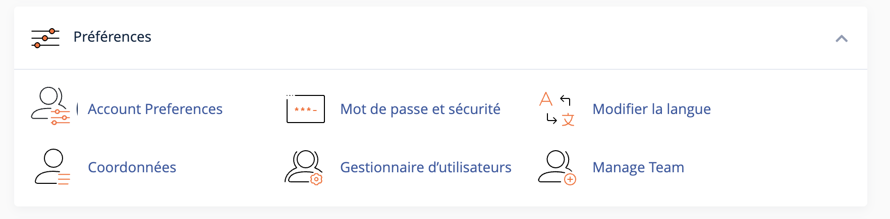

Il est fortement recommandé de changer son mot de passe pour quelque chose de plus sécuritaire.

1. Dans le tableau de bord, cliquer sur « Mot de passe et sécurité »
1. Changer le mot de passe

### Gestionnaire de fichiers

1. Dans le tableau de bord, cliquer sur « Gestionnaire de fichiers »

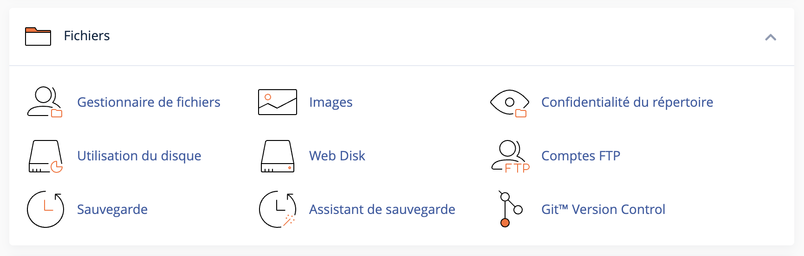{data-zoom-image}

{data-zoom-image}

* 📁 public_html : C’est la racine Web : tout ce que vous y ajouterez sera visible sur internet

  > Exemples :
  > - public_html/index.html : visible par `https://201234567.tim-momo.com/`
  > - public_html/tp2/index.html : visible par `https://201234567.tim-momo.com/tp2/`
  > 
  > Je recommande de faire un répertoire par projet pour le moment. Rien à la racine directement. Pour le moment ;)
  > 
  > Petit truc. Téléverser un `.zip` pour l'extraire ensuite permet de faciliter le processus.

* 📁 public_ftp : Sert pour partager des fichiers via FTP anonyme. 

  > Si activé, n'importe qui pourrait télécharger son contenu via une adresse comme : `ftp://201234567.tim-momo.com`

* 📁 mail : Contient les boîtes de réception de vos courriels
* 📁 logs : contient les erreurs serveur au format compressé (ex. : 404, 500)
* 📁 ssl : stocke les certificats pour activer la notion HTTPS
* 📁 tmp : fichiers temporaires
* 📁 etc : contient des fichiers de configuration globales

!!! info "403 Forbidden"

    S'il n'y a pas de fichier index.html à la racine du dossier public_html, vous devriez logiquement voir cette page :

    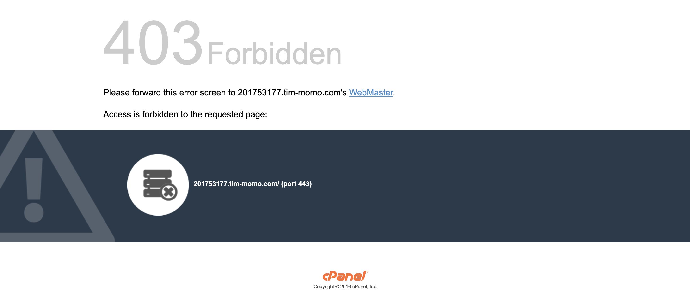

### Courriels

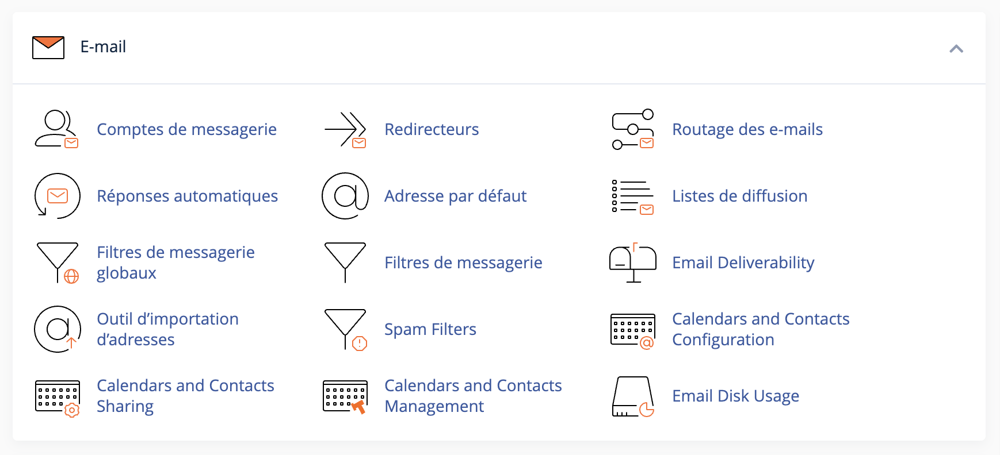

Votre cPanel vient avec une gestion de courriels, un peu comme si vous aviez votre propre Gmail.

#### Créer une boîte de courriel

1. Dans le tableau de bord, cliquer sur « Comptes de messagerie »
1. Cliquer sur « Créer »
1. Ajouter un nom d'utilisateur. Ce sera le nom de votre courriel. Par exemple : contact@201234567.tim-momo.com
1. Ajouter un mot de passe
1. Cliquer sur « Créer »

#### Boîte de courriel

1. Dans le tableau de bord, cliquer sur « Comptes de messagerie »
1. Cliquer sur « Check Email » de la boîte de courriel précédemment créée.

!!! info "Webmail"

    Si le lien ne fonctionne pas, vous y avez accès par votre url en spécifiant webmail.
    
    Ex: https://webmail.201234567.tim-momo.com/ 

1. Cliquer sur « Open »

  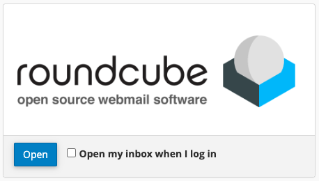{.w-50}

1. Tester l'envoi et la réception d'un courriel.

## Gestion du serveur à distance avec ftp-simple

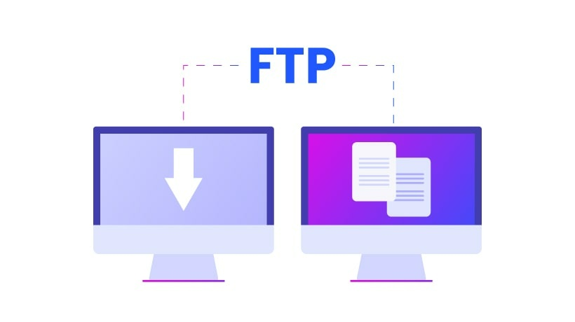

<div class="grid grid-auto" markdown>


[ftp-simple](https://marketplace.visualstudio.com/items?itemName=humy2833.ftp-simple) est une extension qui permet de travailler sur le serveur directement dans VSCode !
</div>

### Configuration

1. Dans VSCode, appuyer sur la touche ++f1++ (ou ++ctrl+shift+p++)
1. Chercher « ftp-simple »
1. Choisir l'option « ftp-simple: Config ... »

   > Cela ouvre le fichier de configuration `ftp-simple-temp.json`

1. Entrer les informations de connexion de votre cPanel :

  ```json title="Exemple"
  [
    {
      "name": "201234567.tim-momo.com",
      "host": "201234567.tim-momo.com",
      "port": 21,
      "type": "ftp",
      "username": "carmackjohn",
      "password": "5145551234",
      "path": "/public_html",
      "autosave": true,
      "confirm": true
    }
  ]
  ```
1. Sauvegarder et fermer le fichier de configuration.

### Ouvrir une session

1. Dans VSCode, ouvrir une nouvelle fenêtre
1. Appuyer sur la touche ++f1++
1. Chercher « ftp-simple »
1. Choisir l'option « ftp-simple: Remote directory ... »
1. Choisir le site sur lequel se connecter (normalement celui configuré plus tôt)
1. Choisir le dossier à ouvrir (`. Current directory : /public_html`)

  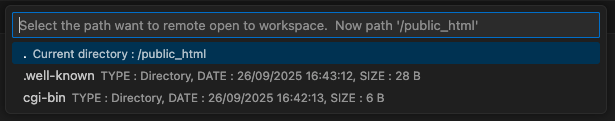

## EmailJS


### Création de compte

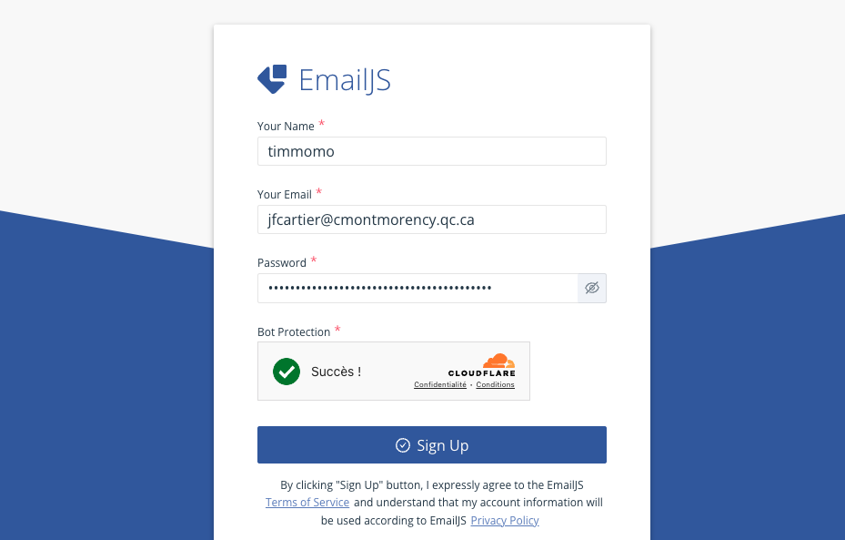

Créer un compte avec les informations de connexion de votre choix à l'adresse suivante : <https://dashboard.emailjs.com/sign-up>

### Clé publique

La clé publique de votre compte se trouve dans l'onglet Account

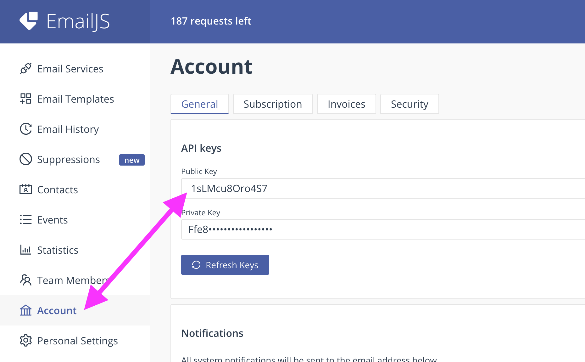

### Configurer un Email service

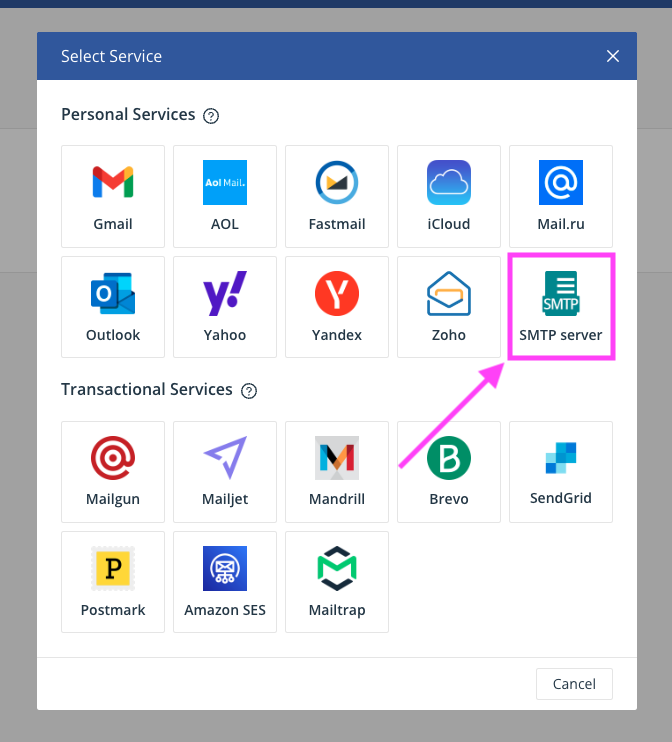

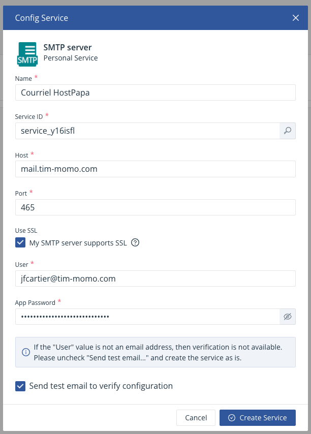

1. Pour le name, ajouter « Courriel HostPapa »
1. Laisser intouché le « Service ID » généré automatiquement
1. Pour le host, ajouter « mail.tim-momo.com »
1. Pour le port, ajouter « 465 »
1. Cocher la case « My SMTP server supports SSL »
1. Pour le user, utiliser le courriel que vous avez créé sur cPanel
1. Pour le App Password, utiliser le courriel de votre courriel créé sur cPanel.
1. Cocher la case « Send test email to verify configuration »
1. Cliquer sur « Create Service »

### Configurer un Email Template

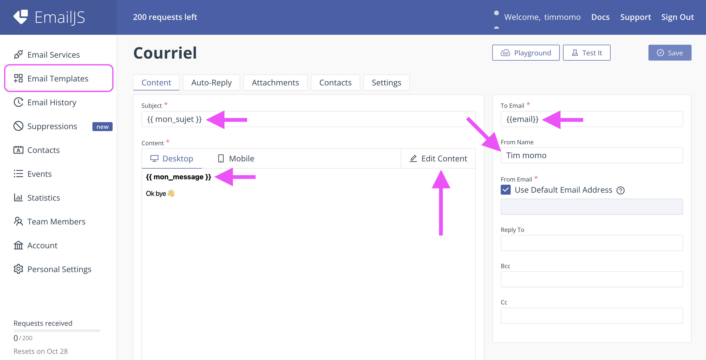

Les modèles permettent d'ajouter des variables qui seront remplacées par du contenu spécifié en JavaScript.

1. Choisir le modèle de départ « One-Time Password »
1. Cliquer sur « Create Template »
1. Cliquer sur « Edit Content » et « Design Editor »
1. Retirer tout le contenu et ajouter la variable « {{mon_message}} » en texte.
1. Cliquer sur Apply Changes
1. Dans le champ Subject, on peut ajouter une variable « {{mon_sujet}} »
1. Cliquer sur « Save »

### Usage

Pour utiliser EmailJS dans un site web, il faut d'abord le télécharger, le lier au html, l'initialiser et le déclencher.

#### Télécharger avec npm

```bash
npm install @emailjs/browser
```

#### Lier au HTML

Vous aurez également besoin d'un fichier js custom, alors pourquoi pas le mettre en même temps.

```html
<head>
  ...
  <script src="./node_modules/@emailjs/browser/dist/email.min.js" defer></script>
  <script src="./assets/js/scripts.js" defer></script>
</head>
```

### Initialisation et déclencheur

```js title="scripts.js"
// Initialisation
emailjs.init({ publicKey: "VOTRE_PUBLIC_KEY" });

// Déclencheur
const service_id = "service_xxx";
const template_id = "service_xxx";
const form = document.querySelector("form");
form.addEventListener("submit", (event) => {
  // Évite de déclencher la soumission normale du formulaire
  event.preventDefault();

  const templateParams = {
    // [variable emailjs] : [champ du formulaire]
    mon_sujet: form.sujet.value,     // Ex: <input name="sujet">
    mon_message: form.message.value, // Ex: <textarea name="message">
    email: form.to_mail.value,       // Ex: <input name="to_mail">
  };

  emailjs.send(service_id, template_id, templateParams)
    .then((response) => {
      // ✅ Succès
    })
    .catch((err) => {
      // ❌ Erreur
    });
});
```

## Exercices de révision

<div class="grid grid-1-2" markdown>
  

  <small>Exercice - JavaScript</small><br>
  **[Maria skłodowska](./exercices/js-mariecurie.md){.stretched-link .back}**
</div>

<!-- <div class="grid grid-1-2" markdown>
  

  <small>Exercice - JavaScript</small><br>
  **[Max](./exercices/js-plank.md){.stretched-link .back}**
</div> -->

<div class="grid grid-1-2" markdown>
  

  <small>Exercice - JavaScript</small><br>
  **[Gros calculs scientifiques](./exercices/js-calcul.md){.stretched-link .back}**
</div>

<!-- <div class="grid grid-1-2" markdown>
  

  <small>Exercice - Bootstrap</small><br>
  **[Bohrstrap](./exercices/js-bohr.md){.stretched-link .back}**
</div> -->

<div class="grid grid-1-2" markdown>
  

  <small>Exercice - Chemins</small><br>
  **[Itchy & Scratchy](./exercices/chat-souris/index.md){.stretched-link .back}**
</div>

<div class="grid grid-1-2" markdown>
  

  <small>Exercice - Bootstrap + JavaScript</small><br>
  **[CaraMail](./exercices/caramail/index.md){.stretched-link .back}**
</div>

[STOP]

```
[
  {
    "name": "201813828.tim-momo.com",
    "host": "201813828.tim-momo.com",
    "port": 21,
    "type": "ftp",
    "username": "cheourwalid",
    "password": "5149912983",
    "path": "/public_html",
    "autosave": true,
    "confirm": true
  }
]
```
