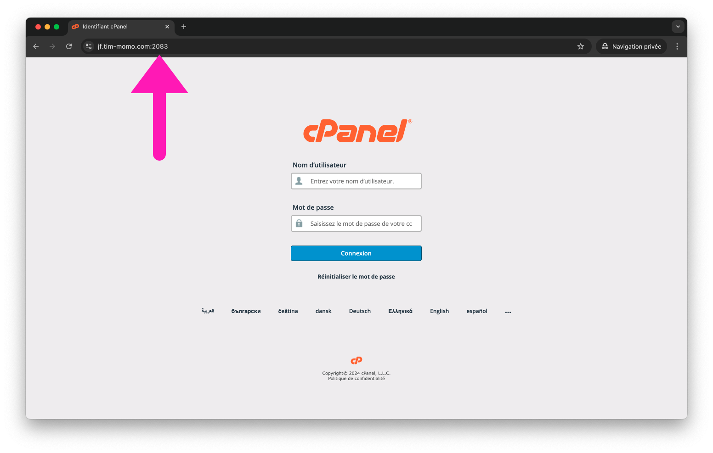
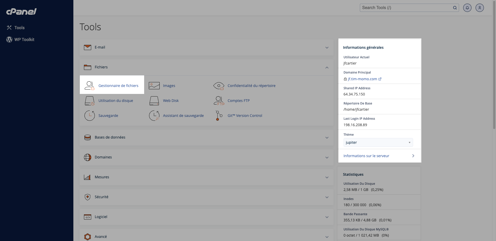
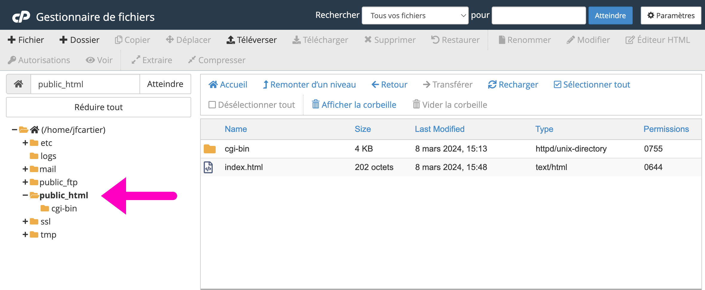
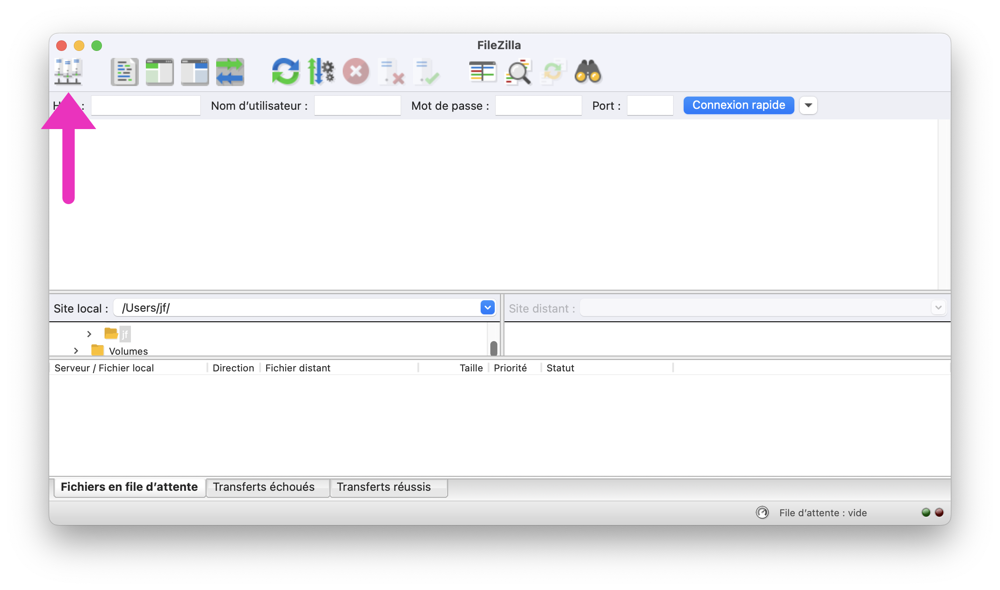
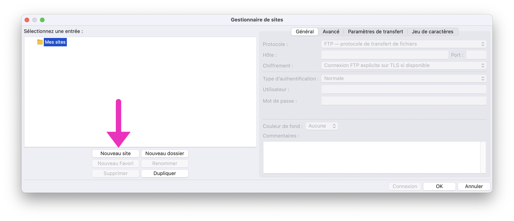
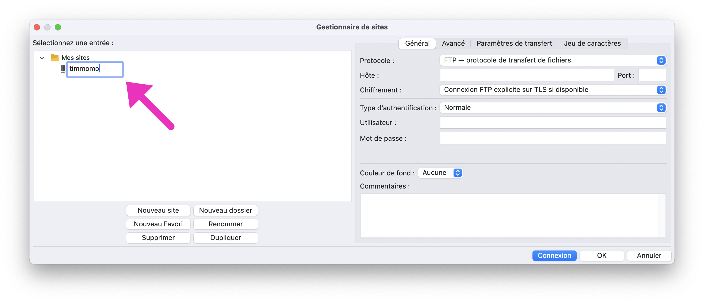
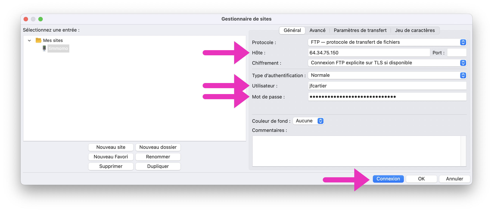
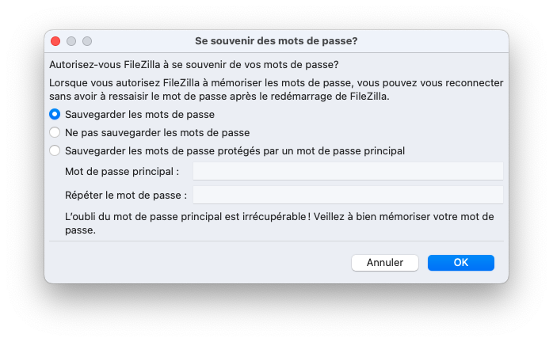
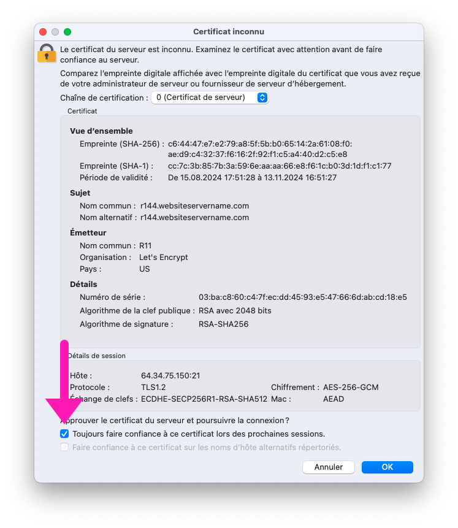
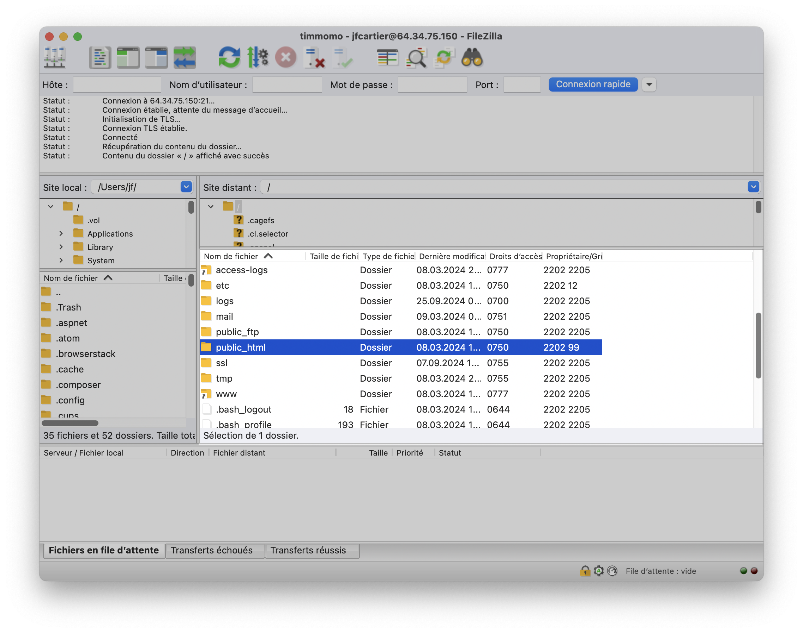

# Cours 6

[STOP]

## Rappel

Remise du PS1 (critique) le 3 octobre à 23:59

**Examen 1** le vendredi 4 octobre

## Ajustements

### Plan de cours

La notion de Sass/Scss est mise de côté pour l’instant afin de se concentrer sur la révision. Elle sera de toute façon abordée plus tard dans le cadre du programme TIM.

### Mise en forme automatique

1. Ouvrez les paramètres de VSCode avec :fontawesome-brands-windows: ++ctrl+comma++ ou :simple-apple: ++command+comma++
2. Recherchez « format on save »
3. Cochez la case « Editor: Format On Save »
4. Testez en enregistrant un fichier pour voir le formatage automatique.

### Validation HTML

Activez la validation de votre code HTML avec l'extension Vscode [HTMLHint](https://marketplace.visualstudio.com/items?itemName=HTMLHint.vscode-htmlhint)

### Validation JavaScript

Activez la validation de votre code JavaScript avec l'extension Vscode [ESLint](https://marketplace.visualstudio.com/items?itemName=dbaeumer.vscode-eslint)

### Insert :exploding_head:

La tant détestée touche ++insert++ sert à ajout et supprimer en même temps. Le problème c'est que si on l'active dans le vouloir, on ne comprends pas ce qui se passe.

## Votre propre serveur 😱

{.w-100}

### Nom de domaine vs. hébergemement

Imagine que tu veux construire une maison sur Internet. Il te faut deux choses principales : un terrain pour construire la maison et une adresse pour que les gens puissent la trouver.

:fontawesome-solid-location-dot: **Le nom de domaine (adresse)**

Le nom de domaine, c’est comme l’adresse de ta maison sur Internet. Par exemple, “www.mon-website.com”, c’est une adresse que les gens peuvent taper dans leur navigateur pour venir visiter ta maison (ton site web). C’est facile à retenir, tout comme l’adresse de ta vraie maison.

:material-server: **L’hébergement (terrain)**

L’hébergement, c’est le terrain où ta maison (ton site web) est construite.

C’est là où tous les fichiers, les images et tout ce qui compose ton site sont stockés.

Chaque terrain a aussi une adresse IP, qui est comme une adresse numérique unique permettant aux ordinateurs de localiser ton site sur Internet. Le nom de domaine, quant à lui, est simplement une version plus lisible et facile à retenir pour accéder à ton site web, mais en réalité, il pointe toujours vers cette adresse IP.

!!! tip "Votre maison vous attend!"

    Je vous ai créé un petit lopin de terre :house_with_garden: sur cPanel avec une adresse toute chaude :hotsprings:

    Votre adresse sera un sous-domaine du site timmomo.com et elle s'écrit de la manière suivante :

    https://VOTRE-SOUS-DOMAINE.tim-momo.com

    Remplacez VOTRE-SOUS-DOMAINE par les 7 derniers caractères de votre numéro de DA

## Gestion de serveur

Abréviation de “control panel”, cPanel est un panneau de gestion d’hébergement Web qui permet de gérer un ou plusieurs serveurs et leurs sites Web via une interface graphique.

Il existe plusieurs autres outils de gestion de serveur comme [Plesk](https://www.plesk.com/), [DirectAdmin](https://www.directadmin.com/) ou encore [Webmin](https://webmin.com/), mais dans le cadre du cours, nous utiliserons cPanel.

## Connexion à cPanel

URL : <https://VOTRE-SOUS-DOMAINE.tim-momo.com:2083>

<figure markdown>
  {data-zoom-image}
  <figcaption>Écran de connexion cPanel</figcaption>
</figure>

<figure markdown>
  {data-zoom-image}
  <figcaption>Tableau de bord cPanel après la connexion</figcaption>
</figure>

<figure markdown>
  {data-zoom-image}
  <figcaption>Gestionnaire de fichiers cPanel</figcaption>
</figure>

## Filezilla

[FileZilla](https://filezilla-project.org/) est un logiciel client FTP (File Transfer Protocol) qui permet de transférer des fichiers entre ton ordinateur et ton hébergement web, un peu comme la gestion de fichiers dans cPanel, mais avec quelques avantages supplémentaires.

* Transfert de fichiers plus rapide
* Drag & Drop
* Reprise des transferts interrompus
* Gestion de fichiers en masse
* Connexion facile et rapide : Une fois configuré, FileZilla permet de se connecter rapidement à ton serveur sans avoir à te connecter à cPanel via un navigateur chaque fois.

### Créer une nouvelle connexion FTP

{data-zoom-image}

{data-zoom-image}

{data-zoom-image}

{data-zoom-image}

{data-zoom-image}

{data-zoom-image}

{data-zoom-image}

## Exercices de révision

  

  <small>Exercice - JavaScript</small> 
  **[Maria Sklodowska](./exercices/js-mariecurie.md){.stretched-link}**

  

  <small>Exercice - JavaScript</small> 
  **[Max](./exercices/js-plank.md){.stretched-link}**

  

  <small>Exercice - JavaScript</small> 
  **[Gros calculs scientifiques](./exercices/js-calcul.md){.stretched-link}**

  

  <small>Exercice - Bootstrap</small> 
  **[Bohrstrap](./exercices/js-bohr.md){.stretched-link}**

## Devoir

Préparation à l'examen

Ajouter votre critique sur votre serveur
