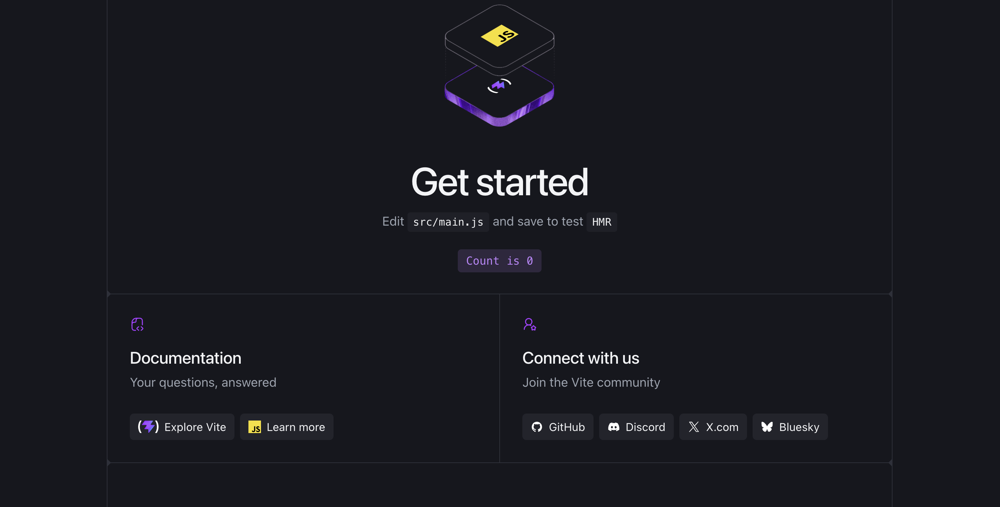
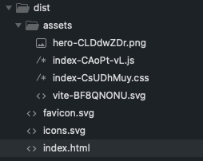
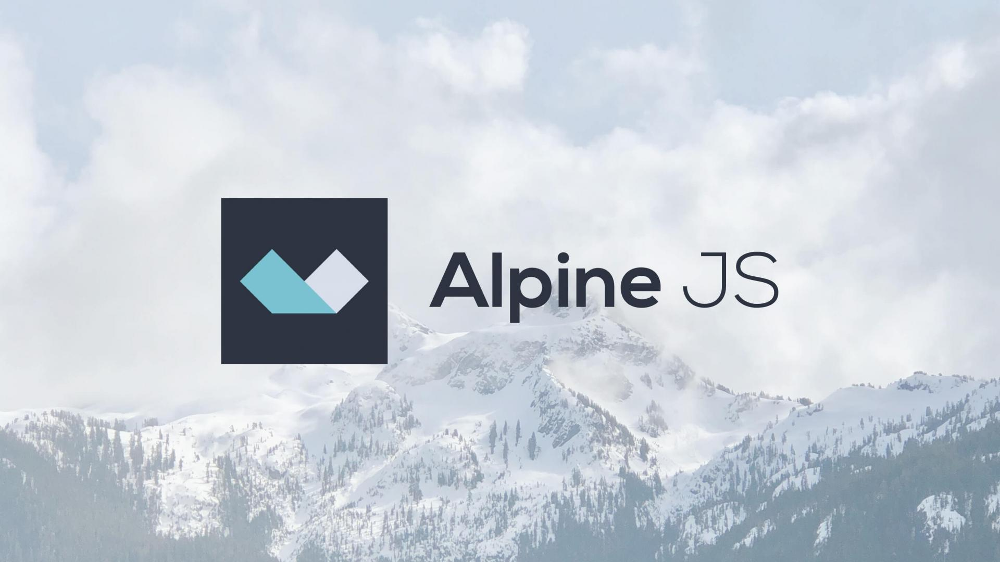

# Cours 7

*[CDN]: Content Delivery Network
*[DOM]: Document Object Model
*[npm]: Node Package Manager

[STOP]

## Retour sur l'examen


<!-- - Commit + Push à chaque étape -->

## JavaScript


Nous amorçons aujourd'hui un retour sur l'usage de JavaScript. Afin de vous accompagner dans cette deuxième partie du cours, vous pouvez consulter l'[aide mémoire](https://jfcmontmorency.github.io/aide-memoire/) préparé à cet effet.

La suite du cours portera sur les framework suivants :

* [Alpine.js](https://alpinejs.dev/)
* [GSAP](https://gsap.com/)
* [Howler.js](https://howlerjs.com/)
* [Tone.js](https://tonejs.github.io/)

<div class="grid grid-1-2" markdown>
  

  <small>Exercice - JavaScript</small><br>
  **[Camp d'entrainement](./activite/js-bootcamp/index.md){.stretched-link .back}**
</div>

## Vite

{.w-100}

Jusqu'à aujourd'hui nous avons utilisé, d'une manière un peu détournée, Vite pour compiler notre CSS. Étant donné qu'on amorce la portion JavaScript du cours, nous pourrons maintenant l'utiliser de manière plus conventionnelle.

### Installation conventionnelle

L'installation conventionnelle fonctionne avec une logique de Javascript par défaut qu'on a évité volontairement pour se concentrer sur le CSS.

Quand on va sur [vite.dev](https://vite.dev/), il est indiqué d'installer vite avec la commande suivante : 

```bash
npm create vite@latest timmomo
cd timmomo
```

Si vous vous trouvez déjà dans le dossier du projet, exécuter :

```bash
npm create vite@latest .
```

Une série de questions vous sera posé. Choisir les options suivantes : 

* Select a framework : **Vanilla**
* Select a variant : **JavaScript**
* Install with npm and start now ? **Yes**

{data-zoom-image}

### Nouvelle structure

```txt
📁 timmomo
├── 📁 node_modules
├── 📁 public
│    ├── 🎆 favicon.svg
│    └── 🎆 icons.svg
├── 📁 src    
│    ├── 📁 assets
│    │    ├── 🎆 hero.png
│    │    ├── 🎆 javascript.svg
│    │    └── 🎆 vite.svg
│    ├── 📄 counter.js
│    ├── 📄 main.js
│    └── 📄 style.css
├── 📄 index.html
├── 📄 package.json
└── 📄 package-lock.json
```

`npx vite` : Vite prend **tout** ce qui est importé à partir de `main.js`

**📁 public** : ce qui est dans public ira à la racine du build<br>{data-zoom-image .w-10}

!!! example "Nouveau paradigme 🧠"

    Regardons ensemble ce qui se passe dans le code initial

!!! example "Nettoyer un projet de base"

    - Retirer le contenu du css
    - Retirer le contenu du js inutilisé

## Installer en GodMode 🤌

La recette reste semblable à celle du cours 3.

Le CSS n'est plus lié dans `index.html`, il est **importé par `main.js`**.

1. Installer Tailwind et DaisyUI<div>
  ```sh
  npm install tailwindcss
  ```
  ```sh
  npm install @tailwindcss/vite
  ```
  ```sh
  npm install daisyui
  ```
  </div>
1. À la racine, créer le fichier `vite.config.js` (pas `.mjs`!)<div>
  ```js title="vite.config.js"
  import { defineConfig } from 'vite'
  import tailwindcss from '@tailwindcss/vite'

  export default defineConfig({
    base: './',
    plugins: [tailwindcss()]
  })
  ```
  </div>
1. Remplacer le contenu de `src/style.css`<div>
  ```css title="src/style.css"
  @import "tailwindcss";
  @plugin "daisyui";
  ```
  </div>
1. S'assurer que `src/main.js` importe le CSS<div>
  ```js title="src/main.js"
  import './style.css'
  ```
  </div>
1. Ajouter une classe DaisyUI dans `index.html` pour tester<div>
  ```html title="index.html"
  <body>
    <button class="btn btn-primary">Bouton daisyUI</button>
    <script type="module" src="/src/main.js"></script>
  </body>
  ```
  </div>
1. Lancer le serveur<div>
  ```sh
  npx vite
  ```
  </div>

<!-- 
!!! info "Pourquoi `.js` et non `.mjs` ?"

    Le `package.json` généré par `npm create vite` contient `"type": "module"`. Tous les fichiers `.js` du projet sont donc des modules : l'extension `.mjs` n'est plus nécessaire.

!!! warning "Pas de `<link>` vers le CSS"

    Avec cette méthode, il ne faut **pas** ajouter de `<link rel="stylesheet">` dans `index.html`. C'est `main.js` qui importe `style.css`, et Vite injecte le CSS dans la page. 
-->

## Alpine.js 🏔️ 

{.w-100}

[Alpine.js](https://alpinejs.dev/) est un petit framework JavaScript qui permet d'intégrer des comportements réactifs directement dans le HTML. Son objectif est de rendre les tâches courantes en JavaScript plus simple à gérer.

## Installation

Alpine s'installe comme les autres paquets vus depuis le cours 3, dans un projet **Vite**.

```bash
npm install alpinejs
```

Puis, dans le fichier JavaScript principal du projet :

```js title="src/main.js"
import Alpine from 'alpinejs'

window.Alpine = Alpine
Alpine.start()
```

## Premier composant

Quatre directives suffisent pour commencer&nbsp;:

| Directive | Rôle |
| :--- | :--- |
| `x-data` | Déclare un composant et son **état** (un objet JavaScript) |
| `x-text` | Affiche une valeur de l'état dans l'élément |
| `@click` | Exécute une expression au clic |
| `x-show` | Affiche l'élément seulement si l'expression est vraie |

```html
<div x-data="{ compteur: 0 }">
  <button @click="compteur++">+1</button>
  <button @click="compteur = 0">Remettre à zéro</button>

  <p>Valeur : <span x-text="compteur"></span></p>
  <p x-show="compteur >= 10">Dix clics, bravo 🎉</p>
</div>
```

1. `x-data` crée l'état&nbsp;: une variable `compteur` qui vaut `0`.
2. Chaque `@click` modifie cette variable avec du **JavaScript ordinaire** (`compteur++`, `compteur = 0`).
3. `x-text` et `x-show` relisent la variable et se mettent à jour **tout seuls**. Aucun `querySelector`, aucun `addEventListener`.

!!! tip "Tout se passe à l'intérieur du `x-data`"

    Les directives ne voient que l'état de l'élément qui porte le `x-data` et de ses enfants. Un bouton placé en dehors de la `<div>` ne connaît pas `compteur`.

## Exercice - Alpine

<div class="grid grid-1-2" markdown>
  {.aspect-4-3}

  <small>Exercice - Alpine</small><br>
  **[Pot à biscuits](./exercices/alpine-pot-biscuits.md){.stretched-link .back}**
</div>

