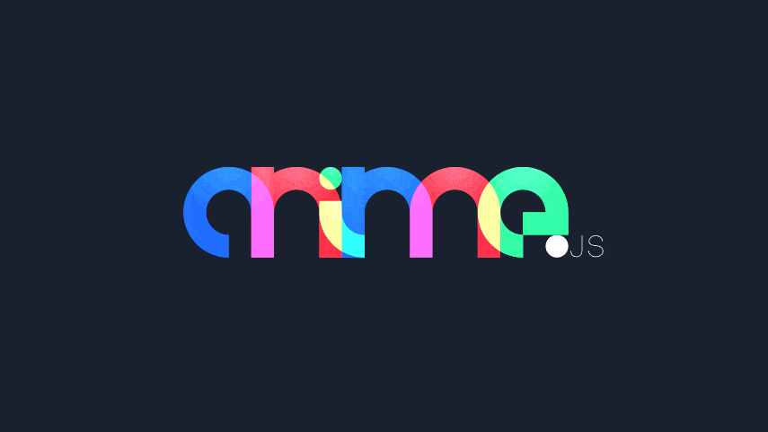
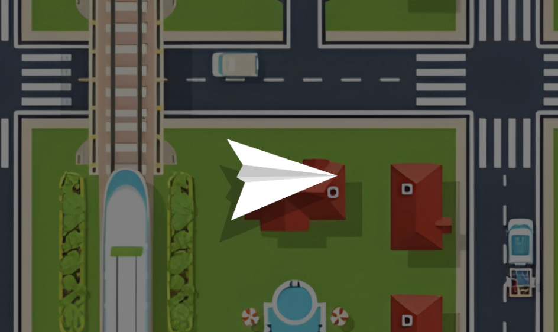

# Cours 8 | Anime.js

*[API] : Application Programming Interface
*[WAAPI] :  Web Animations API

{.w-100}

[Anime.js](https://animejs.com/) est une bibliothèque d'animation JavaScript. Elle permet d'animer quasiment toutes les propriétés CSS, les attributs SVG, les objets JavaScript et plus encore.

[Documentation officielle](https://animejs.com/documentation/){.md-button .md-button--primary}

## Installation

```node
npm init -y
```

```node
npm install animejs
```

Nouveauté ! Dans le HTML, nous allons utiliser la façon [modulaire](https://developer.mozilla.org/fr/docs/Web/JavaScript/Guide/Modules) d'importer une librairie js.

```html title="index.html"
<head>
  <!-- ... -->
  <script type="importmap">
  {
    "imports": {
      "animejs": "./node_modules/animejs/dist/bundles/anime.esm.min.js"
    }
  }
  </script>
  <script src="./src/js/script.js" type="module"></script>
</head>
<body>

  <div class="dot"></div>
  
</body>
```

```js title="script.js"
import { animate } from 'animejs';

animate('.dot', {
  // ...
});
```

<!-- Note : `animejs` contiens plein de classes et de variables exportées (ex. : `animate`) qui peuvent être importées dans le script. -->

!!! warning "Live Server requis"

    Cette méthode se rapproche plus de la méthode contemporaine de développement Web. Toutefois, elle nécessite l'usage d'un serveur. Donc à partir de maintenant, et ce, jusqu'à la fin de session, il sera important d'utiliser Live Server dans vscode pour afficher son site Web.

## Animations

{.w-100}

Une [animation](https://animejs.com/documentation/animation) se crée en appelant la méthode `animate()`.

On doit lui passer 2 choses :

1. **Cible(s)** : L'élément (ou les éléments) à animer. Peut être un sélecteur CSS (`p.intro`), un élément du DOM ou un objet JavaScript.
1. **Paramètre(s)** : Objet Javascript qui contient toutes les configurations de l'animation.

```js
import { animate } from 'animejs';

animate('.dot', {
  x : 100
});
```

### Translate

Les propriétés de translation (`x`, `y`) permettent de déplacer un élément dans l'espace. Par défaut, les valeurs numériques sont interprétées en pixels, mais vous pouvez spécifier d'autres unités comme `%`, `em`, `rem`, `vh`, `vw`.

<div class="grid align-items-start" markdown>
```js title="script.js"
import { animate } from 'animejs';

animate('.dot', {
  x: 100  // équivaut à x: '100px'
});
```

<iframe class="aspect-2-1" style="width: 100%;" scrolling="no" title="AnimeJS - animate" src="https://codepen.io/tim-momo/embed/wBMpGxg/f27c34e23d7a1d1d8c8e4cbb5be7c61c?default-tab=result&theme-id=50173" frameborder="no" loading="lazy" allowtransparency="true" allowfullscreen="true">
  See the Pen <a href="https://codepen.io/tim-momo/pen/wBMpGxg/f27c34e23d7a1d1d8c8e4cbb5be7c61c">
  AnimeJS - animate</a> by TIM Montmorency (<a href="https://codepen.io/tim-momo">@tim-momo</a>)
  on <a href="https://codepen.io">CodePen</a>.
</iframe>
</div>

!!! info "Pourcentages et transformations"

    Les pourcentages sont calculés par rapport à la taille de l'élément animé.

    Pour une valeur plus absolue, utiliser `offsetWidth` ou `offsetHeight`.

### Rotate

La propriété `rotate` permet de faire tourner un élément autour de son point d'origine. AnimeJS accepte plusieurs types de valeurs :

- **Nombres** : `360` (degrés par défaut)
- **Chaînes avec unités** : `"180deg"`, `"0.5turn"`, `"3.14rad"`

<div class="grid align-items-start" markdown>
```js title="script.js"
import { animate } from 'animejs';

animate('.bar', {
  rotate: 360
});
```

<iframe class="aspect-2-1" height="300" style="width: 100%;" scrolling="no" title="AnimeJS - rotation" src="https://codepen.io/tim-momo/embed/KwVZgaK/0edfbc4d74adc6b5cbdfa308ad56e040?default-tab=result&theme-id=50173" frameborder="no" loading="lazy" allowtransparency="true" allowfullscreen="true">
  See the Pen <a href="https://codepen.io/tim-momo/pen/KwVZgaK/0edfbc4d74adc6b5cbdfa308ad56e040">
  AnimeJS - rotation</a> by TIM Montmorency (<a href="https://codepen.io/tim-momo">@tim-momo</a>)
  on <a href="https://codepen.io">CodePen</a>.
</iframe>
</div>

!!! success "L'origine en CSS"

    La notion de [_transform origin_](https://developer.mozilla.org/fr/docs/Web/CSS/transform-origin) en css est importante lorsqu'on effectue une transformation sur une forme. Ça indique à partir de où sera faite la transformation. 
  
    La valeur par défaut est de 50% 50%, soit au centre de l'élément HTML.

    <iframe height="300" style="width: 100%;" scrolling="no" title="AnimeJS - transformOrigin" src="https://codepen.io/tim-momo/embed/QwyadwQ/60c6231193f49b9863344ad1809506d5?default-tab=result&theme-id=50173" frameborder="no" loading="lazy" allowtransparency="true" allowfullscreen="true">
      See the Pen <a href="https://codepen.io/tim-momo/pen/QwyadwQ/60c6231193f49b9863344ad1809506d5">
      AnimeJS - transformOrigin</a> by TIM Montmorency (<a href="https://codepen.io/tim-momo">@tim-momo</a>)
      on <a href="https://codepen.io">CodePen</a>.
    </iframe>

### Scale

La propriété `scale` modifie la taille d'un élément proportionnellement. Une valeur de `1` conserve la taille originale, `2` double la taille, `0.5` la réduit de moitié. Vous pouvez également utiliser `scaleX` et `scaleY` pour contrôler chaque axe indépendamment.

<div class="grid align-items-start" markdown>
```js title="script.js"
import { animate } from 'animejs';

animate('.dot', {
  scale: 4  // Agrandit l'élément 4 fois
});
```

<iframe class="aspect-2-1" height="300" style="width: 100%;" scrolling="no" title="AnimeJS - translate" src="https://codepen.io/tim-momo/embed/ZYQvpeW/3ea11485ee42feb147b53c982b793832?default-tab=result&theme-id=50173" frameborder="no" loading="lazy" allowtransparency="true" allowfullscreen="true">
  See the Pen <a href="https://codepen.io/tim-momo/pen/ZYQvpeW/3ea11485ee42feb147b53c982b793832">
  AnimeJS - translate</a> by TIM Montmorency (<a href="https://codepen.io/tim-momo">@tim-momo</a>)
  on <a href="https://codepen.io">CodePen</a>.
</iframe>
</div>

### Skew

La propriété `skew` déforme un élément en inclinant ses axes. Les valeurs sont exprimées en degrés. Vous pouvez également utiliser `skewX` et `skewY` pour contrôler l'inclinaison sur chaque axe séparément.

<div class="grid align-items-start" markdown>
```js title="script.js"
import { animate } from 'animejs';

animate('.dot', {
  skew: -20  // Inclinaison de -20 degrés
});
```

<iframe class="aspect-2-1" height="300" style="width: 100%;" scrolling="no" title="AnimeJS - translate" src="https://codepen.io/tim-momo/embed/JoGMRNy/74f267770ef5fc7915f3b0e550d161f6?default-tab=result&theme-id=50173" frameborder="no" loading="lazy" allowtransparency="true" allowfullscreen="true">
  See the Pen <a href="https://codepen.io/tim-momo/pen/JoGMRNy/74f267770ef5fc7915f3b0e550d161f6">
  AnimeJS - translate</a> by TIM Montmorency (<a href="https://codepen.io/tim-momo">@tim-momo</a>)
  on <a href="https://codepen.io">CodePen</a>.
</iframe>
</div>


### Variables CSS 🤌

On peut animer des variables css très simplement avec animejs. Un cas de figure assez classique est d'interpoler entre deux [couleurs](https://animejs.com/documentation/animation/tween-value-types/color-value).

<div class="grid align-items-start" markdown>
```js title="script.js"
// :root {
//   --bg: rgb(65, 52, 34);
// }

import { animate } from 'animejs';

animate(":root", {
  "--bg": "rgb(50, 100, 66)",
  duration: 3000
});
```

<iframe class="aspect-4-3" height="300" style="width: 100%;" scrolling="no" title="AnimeJS - translate" src="https://codepen.io/tim-momo/embed/LEGeRvB/50f2c1be9cc49fbcc9a1ff3e5c10a01b?default-tab=result&theme-id=50173" frameborder="no" loading="lazy" allowtransparency="true" allowfullscreen="true">
  See the Pen <a href="https://codepen.io/tim-momo/pen/LEGeRvB/50f2c1be9cc49fbcc9a1ff3e5c10a01b">
  AnimeJS - translate</a> by TIM Montmorency (<a href="https://codepen.io/tim-momo">@tim-momo</a>)
  on <a href="https://codepen.io">CodePen</a>.
</iframe>
</div>

<div class="grid align-items-start" markdown>
```js title="script.js"
// :root {
//   --bg: #413422;
// }

import { animate } from 'animejs';

animate(":root", {
  "--bg": "#293F30",
  duration: 3000
});
```

<iframe class="aspect-4-3" height="300" style="width: 100%;" scrolling="no" title="AnimeJS - color hex" src="https://codepen.io/tim-momo/embed/pvgpEMN/fc57d258625a721d7523634c591b25c2?default-tab=result&theme-id=50173" frameborder="no" loading="lazy" allowtransparency="true" allowfullscreen="true">
  See the Pen <a href="https://codepen.io/tim-momo/pen/pvgpEMN/fc57d258625a721d7523634c591b25c2">
  AnimeJS - color hex</a> by TIM Montmorency (<a href="https://codepen.io/tim-momo">@tim-momo</a>)
  on <a href="https://codepen.io">CodePen</a>.
</iframe>
</div>

### Opacité

La propriété `opacity` contrôle la transparence d'un élément. Les valeurs vont de `0` (complètement transparent) à `1` (complètement opaque).

<div class="grid align-items-start" markdown>
```js title="script.js"
import { animate } from 'animejs';

animate(".dot", {
  opacity: 1,
  duration: 3000,
  delay: 150
});
```

<iframe class="aspect-2-1" height="300" style="width: 100%;" scrolling="no" title="AnimeJS - scale" src="https://codepen.io/tim-momo/embed/JoGMbGa/55a036803d2fb21e2557e68bdd08c63b?default-tab=result&theme-id=50173" frameborder="no" loading="lazy" allowtransparency="true" allowfullscreen="true">
  See the Pen <a href="https://codepen.io/tim-momo/pen/JoGMbGa/55a036803d2fb21e2557e68bdd08c63b">
  AnimeJS - scale</a> by TIM Montmorency (<a href="https://codepen.io/tim-momo">@tim-momo</a>)
  on <a href="https://codepen.io">CodePen</a>.
</iframe>
</div>

### CSS vs. Anime.js 

Les animations AnimeJS (translate, rotate, scale, skew) utilisent la propriété CSS `transform`.

Si un `transform` est déjà défini dans votre CSS, il sera remplacé par l’animation.

Par exemple, dans l'exemple ci-dessous, le scale se ferait écrasé par le translate géré par animejs.

```css title="styles.css"
.dot {
  transform: scale(2);
}
```

```js title="script.js"
animate(".dot", {
  x: 100
});
```

## Gestion du temps

### Durée

La propriété `duration` définit la durée de l'animation en millisecondes. La valeur par défaut est de 1000ms (1 seconde).

<div class="grid align-items-start" markdown>
```js title="script.js"
import { animate } from 'animejs';

animate('.dot', {
  x: 100,
  duration: 1000 * 10 // 10 sec
});
```

<iframe class="aspect-2-1" height="300" style="width: 100%;" scrolling="no" title="AnimeJS - translate slowww" src="https://codepen.io/tim-momo/embed/jEWYMKb/2cd102077d8223f0b19ad0492c01eb0e?default-tab=result&theme-id=50173" frameborder="no" loading="lazy" allowtransparency="true" allowfullscreen="true">
  See the Pen <a href="https://codepen.io/tim-momo/pen/jEWYMKb/2cd102077d8223f0b19ad0492c01eb0e">
  AnimeJS - translate slowww</a> by TIM Montmorency (<a href="https://codepen.io/tim-momo">@tim-momo</a>)
  on <a href="https://codepen.io">CodePen</a>.
</iframe>
</div>

### Délais

La propriété `delay` permet de retarder le début de l'animation. Elle s'exprime également en millisecondes et s'applique avant le début de l'animation.

<div class="grid align-items-start" markdown>
```js title="script.js"
import { animate } from 'animejs';

animate('.dot', {
  x: 100,
  delay: 2000 // 2 sec
});
```

<iframe class="aspect-2-1" height="300" style="width: 100%;" scrolling="no" title="AnimeJS - translate delay" src="https://codepen.io/tim-momo/embed/RNrxGeE/b1be567f55a4d8b3fd004af0e10c2761?default-tab=result&theme-id=50173" frameborder="no" loading="lazy" allowtransparency="true" allowfullscreen="true">
  See the Pen <a href="https://codepen.io/tim-momo/pen/RNrxGeE/b1be567f55a4d8b3fd004af0e10c2761">
  AnimeJS - translate delay</a> by TIM Montmorency (<a href="https://codepen.io/tim-momo">@tim-momo</a>)
  on <a href="https://codepen.io">CodePen</a>.
</iframe>
</div>

### Boucles

La propriété `loop` permet de répéter l'animation. Elle peut être `true` pour une répétition infinie, ou un nombre pour un nombre spécifique de répétitions.

<div class="grid align-items-start" markdown>
```js title="script.js"
import { animate } from 'animejs';

animate('.dot', {
  x: 100,
  loop: true
});
```

<iframe class="aspect-2-1" height="300" style="width: 100%;" scrolling="no" title="AnimeJS - translate loop" src="https://codepen.io/tim-momo/embed/ByjJLGX/d4d105450c368d6b3b5fec67dfeea40f?default-tab=result&theme-id=50173" frameborder="no" loading="lazy" allowtransparency="true" allowfullscreen="true">
  See the Pen <a href="https://codepen.io/tim-momo/pen/ByjJLGX/d4d105450c368d6b3b5fec67dfeea40f">
  AnimeJS - translate loop</a> by TIM Montmorency (<a href="https://codepen.io/tim-momo">@tim-momo</a>)
  on <a href="https://codepen.io">CodePen</a>.
</iframe>
</div>

<div class="grid align-items-start" markdown>
```js title="script.js"
import { animate } from 'animejs';

animate('.dot', {
  x: 100,
  loop: true,
  alternate: true  // Effet ping-pong (aller-retour)
});
```

<iframe class="aspect-2-1" height="300" style="width: 100%;" scrolling="no" title="AnimeJS - translate pingpong" src="https://codepen.io/tim-momo/embed/VYeyKqE/c75a27049d86d775d586f7844639b351?default-tab=result&theme-id=50173" frameborder="no" loading="lazy" allowtransparency="true" allowfullscreen="true">
  See the Pen <a href="https://codepen.io/tim-momo/pen/VYeyKqE/c75a27049d86d775d586f7844639b351">
  AnimeJS - translate pingpong</a> by TIM Montmorency (<a href="https://codepen.io/tim-momo">@tim-momo</a>)
  on <a href="https://codepen.io">CodePen</a>.
</iframe>
</div>

## Lissage des animations

{.w-100}

[Éditeur de lissage](https://animejs.com/easing-editor/elastic/outelastic){.md-button .md-button--primary}

Certains lissages requiert d'importer d'autres librairies. Par exemple, le type de lissage irrégulier nécessite d'importer la méthode `irregular` : 

```js
import { animate, irregular } from 'animejs';

animate('.dot', {
  rotate: 90,
  duration: 2200,
  ease: irregular(23,10)
});
```

### Combinaison

<div class="grid align-items-start" markdown>
```js title="script.js"
import { animate } from 'animejs';

animate('.dot', {
  x: 100,
  width: 100,
  rotate: 180,
  loop: true,
  loopDelay: 500,
  scale: 0.5,
  delay: 150,
  duration: 2000,
  alternate: true
});
```

<iframe class="aspect-2-1" height="300" style="width: 100%;" scrolling="no" title="AnimeJS - translate" src="https://codepen.io/tim-momo/embed/ByjJQpj/742d710ea74ff97aa32b662fa1b5e8de?default-tab=result&theme-id=50173" frameborder="no" loading="lazy" allowtransparency="true" allowfullscreen="true">
  See the Pen <a href="https://codepen.io/tim-momo/pen/ByjJQpj/742d710ea74ff97aa32b662fa1b5e8de">
  AnimeJS - translate</a> by TIM Montmorency (<a href="https://codepen.io/tim-momo">@tim-momo</a>)
  on <a href="https://codepen.io">CodePen</a>.
</iframe>
</div>

### Granularité

Il y a trois manières d'animer une propriété. 

1. Valeur fixe (vers) : part de la valeur courante vers une autre spécifiée
1. Tableau [from, to] : on spécifie le départ et l'arrivée.
1. Objet { from, to, etc... } : on peut également ajouter d'autres paramètres ! Ça permet beaucoup de flexibilité

```js  title="script.js"
import { animate } from 'animejs';

animate('.dot', {
  width: 200,
  x: [100, 0],
  y: { from: 0, to: 240, duration: 3000 }
});
```

## Multi-éléments

### Parent enfant

On peut animer des enfants d'un élément qui lui-même est en cours d'animation.

```html
<div class="parent">
  <div class="enfant"></div>
</div>
```

<div class="grid align-items-start" markdown>
```js
import { animate, stagger } from 'animejs';

animate('.parent', {
  x: 100
});

animate('.parent .enfant', {
  rotate: "2turn"
});
```

<iframe class="aspect-2-1" height="300" style="width: 100%;" scrolling="no" title="AnimeJS - parent enfant" src="https://codepen.io/tim-momo/embed/ogbppxe/c4a11f3ae203b691af74897dad172e71?default-tab=result&theme-id=50173" frameborder="no" loading="lazy" allowtransparency="true" allowfullscreen="true">
  See the Pen <a href="https://codepen.io/tim-momo/pen/ogbppxe/c4a11f3ae203b691af74897dad172e71">
  AnimeJS - parent enfant</a> by TIM Montmorency (<a href="https://codepen.io/tim-momo">@tim-momo</a>)
  on <a href="https://codepen.io">CodePen</a>.
</iframe>
</div>

### Stagger

#### Rotation

```js
import { animate, stagger } from 'animejs';

animate('.carre', {
  rotate: stagger("20deg")
});
```

<iframe height="300" style="width: 100%;" scrolling="no" title="AnimeJS - stagger" src="https://codepen.io/tim-momo/embed/raxppzM/17520b6ae5b8e98c4b10347e61a0d0a3?default-tab=result&theme-id=50173" frameborder="no" loading="lazy" allowtransparency="true" allowfullscreen="true">
  See the Pen <a href="https://codepen.io/tim-momo/pen/raxppzM/17520b6ae5b8e98c4b10347e61a0d0a3">
  AnimeJS - stagger</a> by TIM Montmorency (<a href="https://codepen.io/tim-momo">@tim-momo</a>)
  on <a href="https://codepen.io">CodePen</a>.
</iframe>

---

```js
import { animate, stagger } from 'animejs';

animate('.carre', {
  rotate: stagger(["45deg", "-45deg"]),
});
```

<iframe height="300" style="width: 100%;" scrolling="no" title="AnimeJS - stagger range" src="https://codepen.io/tim-momo/embed/PwZEEGy/26f2f1dd9bd16f147478263e24db1f43?default-tab=result&theme-id=50173" frameborder="no" loading="lazy" allowtransparency="true" allowfullscreen="true">
  See the Pen <a href="https://codepen.io/tim-momo/pen/PwZEEGy/26f2f1dd9bd16f147478263e24db1f43">
  AnimeJS - stagger range</a> by TIM Montmorency (<a href="https://codepen.io/tim-momo">@tim-momo</a>)
  on <a href="https://codepen.io">CodePen</a>.
</iframe>

#### Délai

```js
import { animate, stagger } from 'animejs';

animate('.carre', {
  rotate: "90deg",
  delay: stagger(500),
});
```

<iframe height="300" style="width: 100%;" scrolling="no" title="AnimeJS - stagger range" src="https://codepen.io/tim-momo/embed/OPMzzjd/2488edf0d22b148c1d9286a1f73312e6?default-tab=result&theme-id=50173" frameborder="no" loading="lazy" allowtransparency="true" allowfullscreen="true">
  See the Pen <a href="https://codepen.io/tim-momo/pen/OPMzzjd/2488edf0d22b148c1d9286a1f73312e6">
  AnimeJS - stagger range</a> by TIM Montmorency (<a href="https://codepen.io/tim-momo">@tim-momo</a>)
  on <a href="https://codepen.io">CodePen</a>.
</iframe>

### Random

Lorsque le sélecteur s'applique à plusieurs éléments HTML, il est possible d'appliquer une valeur différente pour chaque éléments. Par exemple, avec une [valeur aléatoire](https://animejs.com/documentation/utilities/random/). 

Pour ce faire, il faut utiliser une **fonction flechée** et la fonction `utils` pour l'aléatoire. 

```js
import { animate, utils } from 'animejs';

animate(".carre", {
  opacity: () => utils.random(0, 1, 2)
});
```

<iframe height="300" style="width: 100%;" scrolling="no" title="AnimeJS - random" src="https://codepen.io/tim-momo/embed/qEbpGoL?default-tab=result&theme-id=50173" frameborder="no" loading="lazy" allowtransparency="true" allowfullscreen="true">
  See the Pen <a href="https://codepen.io/tim-momo/pen/qEbpGoL">
  AnimeJS - random</a> by TIM Montmorency (<a href="https://codepen.io/tim-momo">@tim-momo</a>)
  on <a href="https://codepen.io">CodePen</a>.
</iframe>

!!! info "utils"

    AnimeJS vient avec des [fonctions utilitaires](https://animejs.com/documentation/utilities), dont random. Il suffit d'importer `utils` !

## WAAPI

WAAPI, c’est l’outil d’animation déjà intégré au navigateur. On peut spécifier à AnimeJS de l'utiliser !

<div class="grid" markdown>
```js title="script.js"
import { animate } from 'animejs';

animate('.dot', {
  x: 100
});
```

```js title="script.js"
import { waapi } from 'animejs';

waapi.animate('.dot', {
  x: 100
});
```
</div>

<div class="grid" markdown>
<iframe class="aspect-2-1" height="300" style="width: 100%;" scrolling="no" title="AnimeJS - translate loop" src="https://codepen.io/tim-momo/embed/ByjJLGX/d4d105450c368d6b3b5fec67dfeea40f?default-tab=result&theme-id=50173" frameborder="no" loading="lazy" allowtransparency="true" allowfullscreen="true">
  See the Pen <a href="https://codepen.io/tim-momo/pen/ByjJLGX/d4d105450c368d6b3b5fec67dfeea40f">
  AnimeJS - translate loop</a> by TIM Montmorency (<a href="https://codepen.io/tim-momo">@tim-momo</a>)
  on <a href="https://codepen.io">CodePen</a>.
</iframe>

<iframe class="aspect-2-1" height="300" style="width: 100%;" scrolling="no" title="AnimeJS - waapi" src="https://codepen.io/tim-momo/embed/xbZpYGj/00b2b2709bdd85b33f114da85ba6988c?default-tab=result&theme-id=50173" frameborder="no" loading="lazy" allowtransparency="true" allowfullscreen="true">
  See the Pen <a href="https://codepen.io/tim-momo/pen/xbZpYGj/00b2b2709bdd85b33f114da85ba6988c">
  AnimeJS - waapi</a> by TIM Montmorency (<a href="https://codepen.io/tim-momo">@tim-momo</a>)
  on <a href="https://codepen.io">CodePen</a>.
</iframe>
</div>

C’est souvent la solution la plus performante et légère pour des animations simples, mais ça ne fait pas tout. Par exemple, on ne peut pas animer une variable CSS avec WAAPI 🫠

Utilisez WAAPI si le rendu est identique et que l’animation reste simple. Passez à `animate()` si vous avez besoin de timelines, d’enchaînements complexes ou de fonctionnalités avancées. [En savoir plus sur WAAPI et AnimeJS](https://animejs.com/documentation/web-animation-api/when-to-use-waapi).

## Exercices

<div class="grid grid-1-2" markdown>
  

  <small>Exercice - AnimeJS</small><br>
  **[L'avion](./exercices/avion/index.md){.stretched-link .back}**
</div>

<div class="grid grid-1-2" markdown>
  

  <small>Exercice - AnimeJS</small><br>
  **[Le truck](./exercices/truck/index.md){.stretched-link .back}**
</div>

<div class="grid grid-1-2" markdown>
  

  <small>Exercice - AnimeJS</small><br>
  **[Domino](./exercices/domino/index.md){.stretched-link .back}**
</div>

<div class="grid grid-1-2" markdown>
  

  <small>Exercice - AnimeJS</small><br>
  **[La ferme des animaux](./exercices/animal-farm/index.md){.stretched-link .back}**
</div>