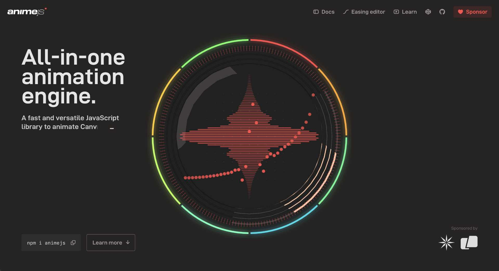

# Cours 8 | Classes et Anime.js

[STOP]

## Retour sur l'examen


## Introduction aux classes JavaScript

{.w-100}

Une classe en JavaScript, c’est un concept qui permet de structurer le code et de réutiliser la même logique plusieurs fois.

### Pourquoi on utiliserait ça ?

Imaginez que vous voulez programmer une page Web dans laquelle des poissons nagent indépendamment.

Vous pourriez commencer par écrire le code d’un premier poisson… puis copier-coller ce code pour en avoir un deuxième, un troisième, et ainsi de suite. Rapidement, ça devient lourd à maintenir.

C’est là que les classes sont utiles :

- On définit une seule fois une classe Poisson.
- Chaque nouveau poisson créé dans la page utilisera le même code.
- Peu importe si vous ajoutez 3 poissons ou 1 000 000, ils partageront tous la même logique.

### Comment ça fonctionne ?

```js
class Poisson {
  constructor(nom, couleur) {
    this.nom = nom;
    this.couleur = couleur;
  }

  coucou() {
    console.log(`${this.nom} (${this.couleur}) nage joyeusement.`);
  }
}

// On crée plusieurs poissons à partir de la même classe
const poisson1 = new Poisson("Nemo", "orange");
const poisson2 = new Poisson("Dory", "bleu");
const poisson3 = new Poisson("Sharky", "gris");

// Ils utilisent tous le même code défini dans la classe
poisson1.coucou(); // Résultat : Nemo (orange) nage joyeusement
poisson2.coucou(); // Résultat : Dory (bleu) nage joyeusement
poisson3.coucou(); // Résultat : Sharky (gris) nage joyeusement
```

<div class="grid grid-1-2" markdown>
  

  <small>Exercice - JavaScript</small><br>
  **[1001 poissons](./exercices/1001poissons/index.md){.stretched-link .back}**
</div>

## Programmation Orientée Objet (POO) en JavaScript (ES6)

## 1. Le constructeur

Le **constructeur** est une fonction spéciale qui s’exécute automatiquement quand on crée une instance avec `new`.  
Il sert souvent à **initialiser les propriétés** de la classe.

```js
class Voiture {
  constructor(marque, annee) {
    this.marque = marque;
    this.annee = annee;
  }

  infos() {
    console.log(`Cette voiture est une ${this.marque} fabriquée en ${this.annee}.`);
  }
}

const auto1 = new Voiture("Toyota", 2020);
auto1.infos();
// Résultat : Cette voiture est une Toyota fabriquée en 2020.
```

📝 **Notes**
- Le mot clé `constructor` est réservé.
- On ne peut avoir **qu’un seul constructeur** par classe.

👉 **Exercice 1**  
Crée une classe `Livre` qui prend un `titre` et un `auteur` en paramètre. Ajoute une méthode `resume()` qui affiche :  
`"Le livre TITRE a été écrit par AUTEUR."`


---

## 2. Héritage (extends, super)

Une classe peut **hériter** d’une autre classe avec `extends`.  
Cela permet de **réutiliser** du code existant et de **l’enrichir**.

```js
class Animal {
  constructor(nom) {
    this.nom = nom;
  }

  parler() {
    console.log(`${this.nom} fait un bruit.`);
  }
}

class Chien extends Animal {
  constructor(nom, race) {
    super(nom); // on appelle le constructeur de la classe parent
    this.race = race;
  }

  parler() {
    console.log(`${this.nom} aboie !`);
  }
}

const chien = new Chien("Rex", "Labrador");
chien.parler();
// Résultat : Rex aboie !
```

📝 **Notes**
- `extends` = hérite d’une autre classe.
- `super(...)` = appelle le constructeur du parent.

👉 **Exercice 2**  
Crée une classe `Employe` avec un nom et un salaire.  
Puis crée une classe `Manager` qui hérite de `Employe`, ajoute une propriété `departement` et une méthode `infos()` qui affiche toutes les infos.


---

## 3. Variables publiques et privées

En JavaScript (ES6+), on peut créer des **propriétés privées** avec `#`.  
Elles ne sont accessibles **que dans la classe**.

```js
class CompteBancaire {
  #solde; // propriété privée

  constructor(titulaire, soldeInitial) {
    this.titulaire = titulaire;
    this.#solde = soldeInitial;
  }

  deposer(montant) {
    this.#solde += montant;
  }

  afficherSolde() {
    console.log(`Solde de ${this.titulaire} : ${this.#solde}$`);
  }
}

const compte = new CompteBancaire("Alex", 100);
compte.deposer(50);
compte.afficherSolde();
// Résultat : Solde de Alex : 150$

console.log(compte.#solde); 
// ❌ Erreur : propriété privée !
```

📝 **Notes**
- Une variable **publique** peut être accédée partout.
- Une variable **privée** (avec `#`) est protégée et uniquement accessible dans la classe.

👉 **Exercice 3**  
Crée une classe `CoffreFort` avec une variable privée `#codeSecret`.  
Ajoute une méthode `verifierCode(code)` qui dit `"Accès autorisé"` ou `"Accès refusé"` selon le code.


---

## 4. Méthodes statiques

Une méthode `static` appartient à la **classe elle-même** et non à une instance.  
On l’appelle directement avec `NomDeClasse.methode()`.

```js
class Maths {
  static carre(x) {
    return x * x;
  }
}

console.log(Maths.carre(5));
// Résultat : 25
```

📝 **Notes**
- `static` = méthode utilitaire qui n’a pas besoin d’une instance.
- Exemple : méthodes mathématiques, outils de validation, etc.

👉 **Exercice 4**  
Crée une classe `Convertisseur` avec une méthode statique `kmToMiles(km)` qui retourne la conversion en miles (`1 km = 0.621 miles`).  
Teste-la avec `Convertisseur.kmToMiles(10)`.


---

# 🚀 Activité d’intégration

Crée une classe `Utilisateur` avec :
- un nom (public)
- un mot de passe (privé)
- une méthode `verifierMotDePasse(mdp)`
- une méthode statique `genererID()` qui retourne un nombre aléatoire entre 1000 et 9999

Puis crée une classe `Admin` qui hérite de `Utilisateur` et ajoute une méthode `supprimerUtilisateur(nomUtilisateur)` qui affiche :  
`"L'utilisateur NOM a été supprimé par ADMIN."`


## Introduction aux classes JavaScript

Les classes JavaScript c'est ce qu'on appelle de la programmation orientée objet (POO 💩). Ça n'a rien à voir avec une classe CSS (ex: `.rouge{ color: red; }`) et encore moins avec l'attribut `class=""` en HTML.

Ce type de programmation est très utile pour **organiser** sa programmation, mais ça ne sert pas qu’à cela. Il permet surtout de **réutiliser** du code, de faciliter la **maintenance**, d’**encapsuler** des données et de représenter des **concepts** du monde réel.

On peut essentiellement mettre des méthodes et des variables dans une classe. Voici une syntaxe de base :

```js
class Personne {

  constructor(n, a) {
    this.name = name;
    this.age = age;
  }

  presentations() {
    console.log(`Salut, je m'appelle ${this.name} et j'ai ${this.age} ans.`);
  }
}

const personneA = new Personne('Jeanne', 25);
personneA.presentations();
// Résultat : Salut, je m'appelle Jeanne et j'ai 25 ans.

const personneB = new Personne('Félix', 641);
personneB.presentations();
// Résultat : Salut, je m'appelle Félix et j'ai 641 ans.
personneB.age;
// Résultat : 641
```

🧐 Quelques observations à faire :

* La partie `class Personne {}` sert juste à définir une classe. Ça ne fait rien par défaut.
* La partie `new Personne(...);` sert à **instancier** la classe. Les variables `personneA` et `personneB` sont des `instances` de `Personne`. Disons que ce sont carrément des personnes !
  * On peut créer autant de `Personne` qu'on le désire.
  * On peut appeler les méthodes et les variables d'une instance en utilisant le point `.` Ex: `personneB.presentations();`.

## Anime.js



### Installation

```node
npm install animejs
```

to(), fromTo(), propriétés CSS animables, callbacks
