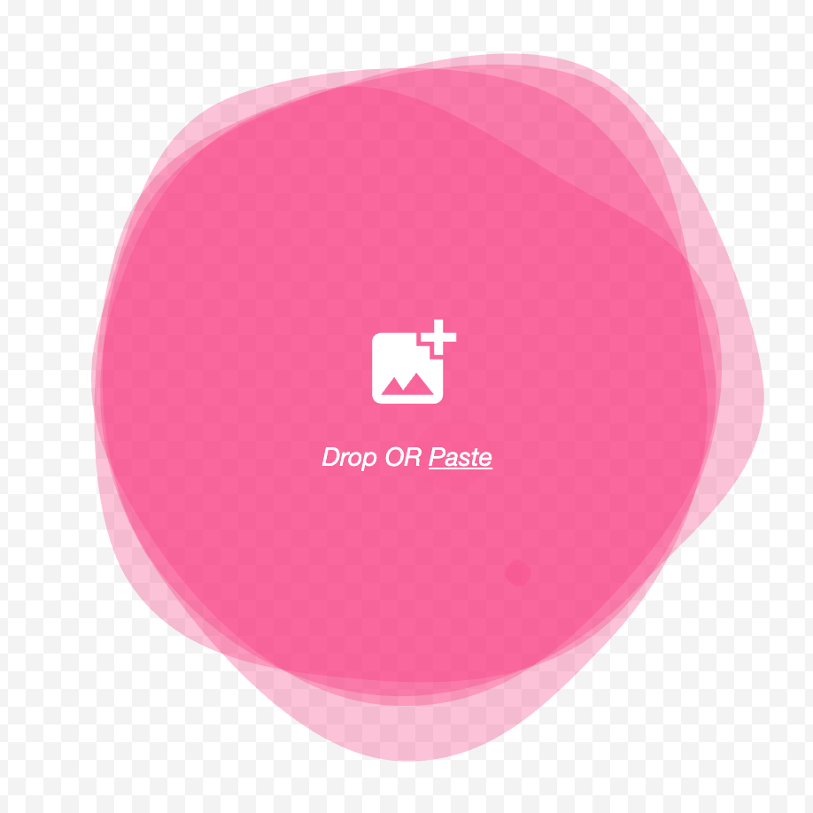
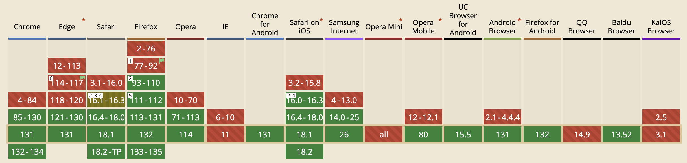
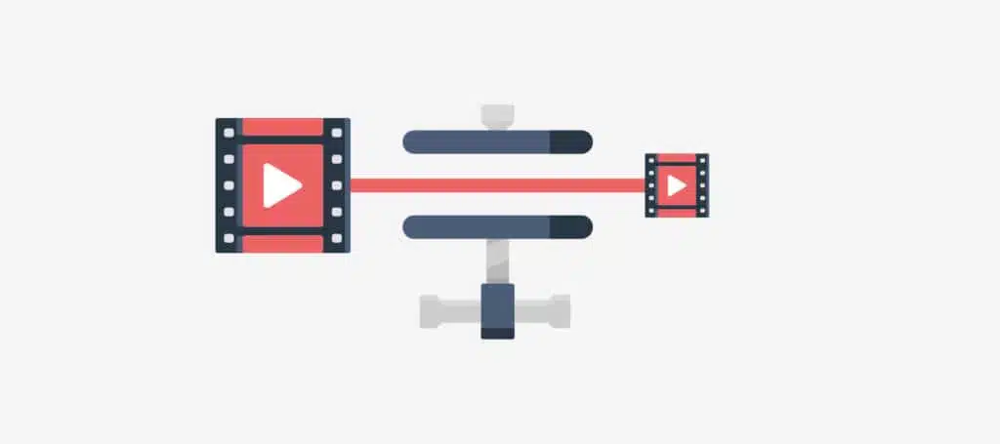

# Cours 8 | Médias audiovisuels

[STOP]

<!-- **Savoirs :** #1 Programmation fonctionnelle · #2 Intégration de médias · #3 Contrôle audio et vidéo · #7 Classement des médias · #8 Optimisation des médias · #4 Compatibilité · #12 Validation/DevTools · #13 Classe JavaScript · #14 Classes sur mesure -->

*[WebP]: format d'image moderne de Google
*[AVIF]: format d'image basé sur le codec AV1
*[API]: Application Programming Interface

{.w-100}

Ce cours s'appelle « Web **audiovisuel** » - et c'est aujourd'hui qu'on lui rend justice 🎬🔊. On aborde les médias sous deux angles complémentaires&nbsp;:

<div class="grid grid-1-4" markdown>
  {.aspect-4-3 .w-100}

  :material-image-multiple: **Optimiser** les fichiers médias (formats, poids, classement)
</div>

<div class="grid grid-1-4" markdown>
  {.aspect-4-3 .w-100}

  :material-play-circle: **Contrôler** les médias par programmation (API + librairie)
</div>

---

# Partie 1 - Optimiser les médias

Un site audiovisuel, ce sont de **gros fichiers**. Mal préparés, ils rendent la page lente et font fuir les visiteurs. Bien optimisés, ils se chargent vite et bien. C'est une compétence pro incontournable.

!!! abstract "En vue du projet final"

    Les médias de **votre jeu vidéo** (logo, captures d'écran, bande-annonce, musique, effets sonores) passeront exactement par ces étapes avant d'habiller votre site promotionnel. Gardez-les sous la main 🎮.

## Les formats d'image

Chaque format a son usage. La règle d'or&nbsp;: **le plus léger qui fait le travail**.

| Format | Idéal pour | Notes |
| :--- | :--- | :--- |
| `JPEG` | Photos | Compression avec pertes, pas de transparence |
| `PNG` | Images nettes, transparence | Plus lourd |
| `WebP` | **Remplace JPEG et PNG** | ~30 % plus léger, transparence, largement supporté |
| `AVIF` | Photos, encore plus léger | Le plus performant, support quasi universel en 2026 |
| `SVG` | Logos, icônes, formes | Vectoriel&nbsp;: net à toute taille, très léger |

{data-zoom-image .w-75}

!!! tip "En pratique"

    Servez du **WebP** ou de l'**AVIF** pour vos photos, et du **SVG** pour vos logos et icônes. Gardez le JPEG/PNG en dépannage seulement.

## Compresser et dimensionner

Deux réflexes qui font 90 % du travail&nbsp;:

1. **Compresser** avec un outil comme [Squoosh](https://squoosh.app/) (glisser-déposer, on voit le poids fondre en direct).
2. **Dimensionner juste**&nbsp;: ne servez pas une image de 4000&nbsp;px pour l'afficher à 400&nbsp;px. Redimensionnez avant de téléverser.

{data-zoom-image .w-75}

### Chargement paresseux (`lazy`)

L'attribut `loading="lazy"` diffère le chargement des images **hors écran** jusqu'à ce qu'on approche par le défilement. Gratuit et efficace.

```html

```

## La vidéo

Pour la vidéo, deux formats couvrent tout le monde&nbsp;: **MP4** (codec H.264, universel) et **WebM** (plus léger, moderne). On offre les deux avec plusieurs `<source>`&nbsp;; le navigateur prend le premier qu'il comprend.

```html
<video controls poster="./assets/images/apercu.webp" width="640">
  <source src="./assets/videos/demo.webm" type="video/webm">
  <source src="./assets/videos/demo.mp4" type="video/mp4">
  Votre navigateur ne supporte pas la vidéo.
</video>
```

{data-zoom-image .w-75}

!!! warning "L'autoplay exige le silence"

    Les navigateurs **bloquent** la lecture automatique avec son. Pour un fond vidéo qui démarre seul, il faut `muted` (et souvent `playsinline`)&nbsp;:

    ```html
    <video autoplay muted loop playsinline></video>
    ```

!!! tip "Compresser une vidéo"

    [HandBrake](https://handbrake.fr/) (gratuit) réencode et allège vos vidéos. Visez un **bitrate** raisonnable&nbsp;: une vidéo de fond n'a pas besoin de la qualité d'un film.

## L'audio

Mêmes principes&nbsp;: **MP3** (universel) et **OGG/Opus** ou **WebM** (plus légers). On peut aussi offrir plusieurs sources.

```html
<audio controls>
  <source src="./assets/audio/theme.webm" type="audio/webm">
  <source src="./assets/audio/theme.mp3" type="audio/mpeg">
</audio>
```

## Classement et nommage

Un projet propre range ses médias et les nomme intelligemment.

| Bonne pratique | Exemple |
| :--- | :--- |
| Un dossier par type | `assets/images/`, `assets/videos/`, `assets/audio/` |
| Minuscules, tirets | `hero-accueil.webp` (pas `Hero Accueil.PNG`) |
| Pas d'accents ni d'espaces | `plan-cegep.svg` (pas `plán cégep.svg`) |
| Noms descriptifs | `equipe-2026.webp` (pas `IMG_2381.jpg`) |

## Valider son code (W3C)

Avant de publier, passez votre HTML et votre CSS au [validateur du W3C](https://validator.w3.org/). Il repère les balises mal fermées, les attributs invalides, etc. Un code valide, c'est un code plus **compatible** entre navigateurs et plus facile à déboguer.

---

# Partie 2 - Contrôler les médias par programmation

Les balises `<video>` et `<audio>` viennent avec des contrôles par défaut. Mais dès qu'on veut un **lecteur sur mesure** (boutons stylisés, barre de progression maison, effets sonores au clic), on passe par le JavaScript.

## L'API native `<video>` / `<audio>`

Tout élément média expose des **propriétés**, des **méthodes** et des **événements** qu'on manipule en JS.

| Propriété | Rôle |
| :--- | :--- |
| `currentTime` | Position de lecture (en secondes) |
| `duration` | Durée totale |
| `volume` | Volume (0 à 1) |
| `muted` | Sourdine (booléen) |
| `paused` | En pause ? (booléen) |
| `playbackRate` | Vitesse de lecture |

| Méthode | Effet |
| :--- | :--- |
| `.play()` | Lance la lecture |
| `.pause()` | Met en pause |
| `.load()` | Recharge la source |

| Événement | Se déclenche… |
| :--- | :--- |
| `play` / `pause` | À la lecture / pause |
| `timeupdate` | À chaque avancée de lecture (pour une barre de progression) |
| `ended` | À la fin |
| `loadedmetadata` | Quand la durée est connue |

```js title="Bouton lecture/pause maison"
const video = document.querySelector("#film")
const bouton = document.querySelector("#lecture")

bouton.addEventListener("click", () => {
  video.paused ? video.play() : video.pause()
})

// Barre de progression
video.addEventListener("timeupdate", () => {
  const pourcent = (video.currentTime / video.duration) * 100
  document.querySelector("#barre").style.width = pourcent + "%"
})
```

<!-- CODEPEN: lecteur vidéo maison (play/pause + barre de progression) -->

## Petit détour : les classes JavaScript

Les librairies qu'on va utiliser nous donnent des **objets** créés avec le mot-clé `new`. Trois notions suffisent pour s'y retrouver&nbsp;:

- une **classe** est un *moule* (ex.&nbsp;: `Howl`)&nbsp;;
- `new` fabrique une **instance** à partir du moule&nbsp;;
- une **méthode** est une action de l'instance (ex.&nbsp;: `.play()`).

```js
const son = new Howl({ src: ["saut.mp3"] })  // une instance de la classe Howl
son.play()                                    // une méthode de cette instance
```

!!! note "On les utilise plus qu'on les écrit"

    À ce stade, l'important est de **savoir lire et utiliser** une classe fournie par une librairie, pas d'écrire les vôtres. Vous reconnaîtrez ce motif `new Quelquechose({...})` partout&nbsp;: Howler, Chart.js, Tone.js, GSAP…

### Écrire sa propre classe (aperçu)

Rien ne vous empêche d'écrire la vôtre. La structure minimale regroupe des **données** (dans le `constructor`) et des **méthodes** (des actions)&nbsp;:

```js
class Personnage {
  constructor(nom, pv) {
    this.nom = nom      // une propriété
    this.pv = pv
  }
  saluer() {           // une méthode
    console.log(`${this.nom} entre en scène !`)
  }
}

const heros = new Personnage("Digger", 100)
heros.saluer()   // "Digger entre en scène !"
```

!!! note "À garder simple"

    Écrire ses propres classes devient utile quand on gère **plusieurs objets du même type**. Pour un site promotionnel, l'usage des classes **fournies par les librairies** suffit largement&nbsp;: retenez surtout comment les **lire et les instancier**.

## Une librairie audio : Howler.js

L'`<audio>` natif suffit pour lire un fichier, mais dès qu'on veut des **effets sonores** fiables (jeu, interactions), des **sprites audio** ou un contrôle multiplateforme, **[Howler.js](https://howlerjs.com/)** est la référence.

=== ":material-flash: CDN"

    ```html
    <script src="https://cdnjs.cloudflare.com/ajax/libs/howler/2.2.4/howler.min.js"></script>
    ```

=== ":simple-vite: npm"

    ```bash
    npm install howler
    ```

    ```js title="src/main.js"
    import { Howl, Howler } from "howler"
    ```

```js title="Un son avec repli de format"
const son = new Howl({
  src: ["bruit.webm", "bruit.mp3"],  // le navigateur prend le 1er compatible
  volume: 0.8,
  loop: false
})

son.play()
```

| Méthode | Effet |
| :--- | :--- |
| `son.play()` / `son.pause()` / `son.stop()` | Contrôle de lecture |
| `son.volume(0.5)` | Règle le volume de ce son |
| `son.rate(1.5)` | Change la vitesse |
| `Howler.volume(0.5)` | Volume **global** de tous les sons |
| `Howler.mute(true)` | Coupe tout |

!!! tip "Les sprites audio"

    Comme les sprites d'image (cours 11), un **sprite audio** regroupe plusieurs sons dans un seul fichier - idéal pour les effets d'un jeu.

    ```js
    const fx = new Howl({
      src: ["fx.webm"],
      sprite: { saut: [0, 300], piece: [400, 150] }
    })
    fx.play("saut")
    ```

<!-- CODEPEN: effets sonores au clic avec Howler -->

### Autres librairies (survol)

- **[Video.js](https://videojs.com/)** - un lecteur **vidéo** entièrement habillable (thèmes, sous-titres, qualité).
- **[Tone.js](https://tonejs.github.io/)** - pour **synthétiser** du son et de la musique (boucles, notes, effets).

## Déboguer : les DevTools

Quand un média ne réagit pas, ouvrez les **DevTools** (++f12++)&nbsp;:

- la **Console** affiche les erreurs et vos `console.log(...)`&nbsp;;
- l'onglet **Réseau** montre si le fichier média se charge (ou renvoie une erreur 404)&nbsp;;
- un **point d'arrêt** (_breakpoint_) met le code en pause pour l'inspecter ligne par ligne.

```js
console.log("durée :", video.duration)   // vérifier une valeur au vol
```

## Exercice

<!-- À COMPLÉTER : carte d'exercice médias (dossier activite à créer). -->

- [ ] Optimisez un lot d'images (WebP/AVIF via Squoosh) et intégrez une vidéo avec `<source>` de repli et `poster`.
- [ ] Construisez un **lecteur vidéo maison** (bouton lecture/pause + barre de progression via `timeupdate`).
- [ ] Ajoutez un **effet sonore** au clic d'un bouton avec Howler.js.
