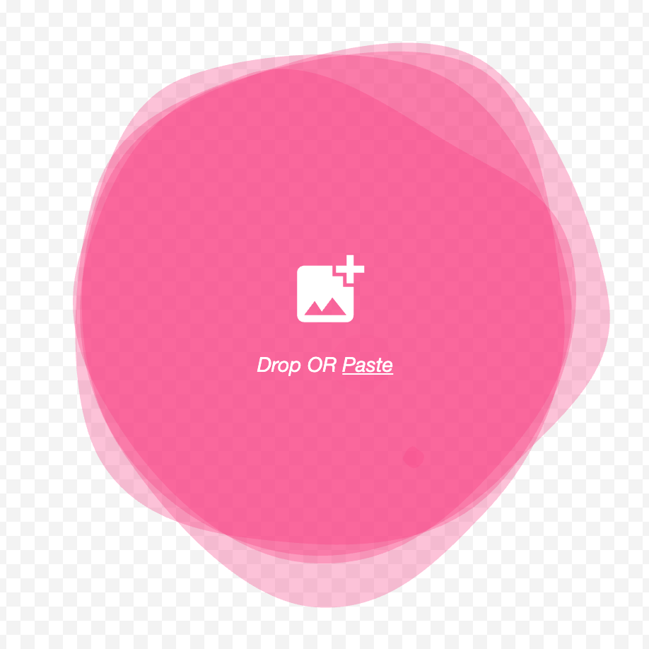
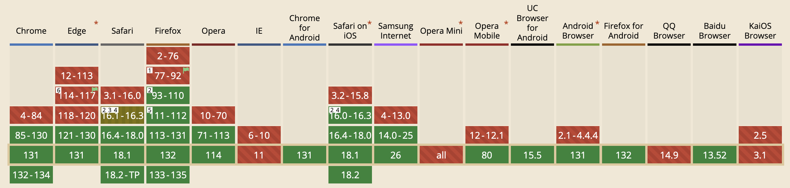
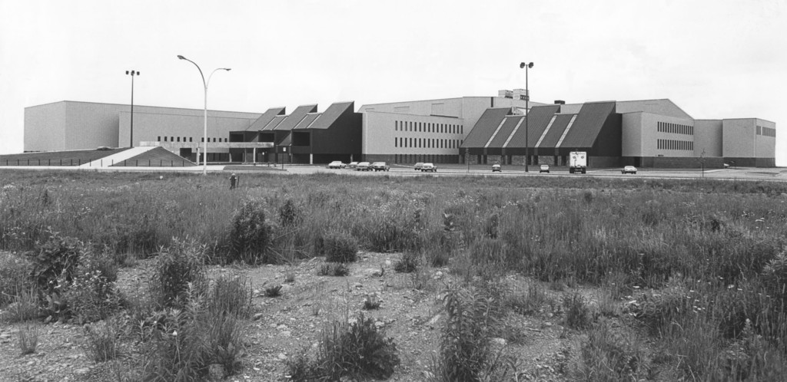
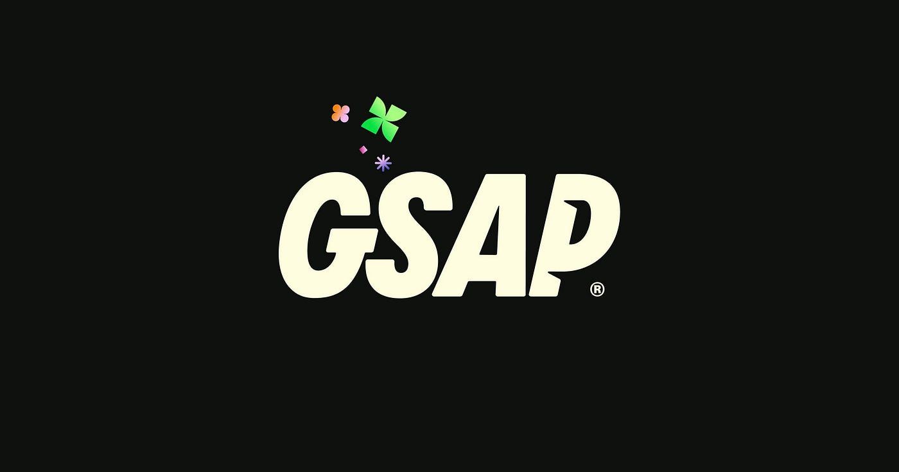

# Cours 8 | GSAP - les bases

[STOP]


## Vite

{.w-100}

Jusqu'à aujourd'hui nous avons utilisé, d'une manière un peu détournée, Vite pour compiler notre CSS. Étant donné qu'on amorce la portion JavaScript du cours, nous pourrons maintenant utiliser la manière plus conventionnelle.

### La vrai installation 😅

L'installation normale fonctionne avec une logique de Javascript par défaut qu'on a évité volontairement jusqu'à présent pour se concentrer sur le CSS.

Quand on va sur [vite.dev](https://vite.dev/), il est dailleurs indiqué d'installer vite avec la commande suivante : 

<div class="grid align-items-top" markdown>
```bash title="Installe vite dans un dossier « timmomo »"
npm create vite@latest timmomo
```

```bash title="Installe vite dans le dossier en cours"
npm create vite@latest .
```
</div>

Une série de questions vous sera posé. Choisir les options suivantes : 

* Select a framework : **Vanilla** 👈
* Select a variant : **JavaScript** 👈
* Install with npm and start now ? **Yes**

Le serveur Vite parti, vous devriez voir ceci dans le navigateur : 

{data-zoom-image}

### Structure d'un projet Vite

```txt
📁 timmomo
├── 📁 node_modules
├── 📁 public
│    ├── 🎆 favicon.svg
│    └── 🎆 icons.svg
├── 📁 src    
│    ├── 📁 assets
│    │    ├── 🎆 hero.png
│    │    ├── 🎆 javascript.svg
│    │    └── 🎆 vite.svg
│    ├── 📄 counter.js
│    ├── 📄 main.js
│    └── 📄 style.css
├── 📄 index.html
├── 📄 package.json
└── 📄 package-lock.json
```

!!! example "DEMO : Nouveau paradigme 🧠"

    1. Regardons ensemble ce qui se passe dans le code initial et retirons ce qui ne nous intéresse pas
    1. Installons Taiwind et DaisyUi dans ce nouveau contexte.
      - Nouveauté 1 : `vite.config.js` et non `vite.config.mjs`
      - Nouveauté 2 : fichier css est chargé en javascript 🤯

## Optimiser les médias 🎬

<!-- {.w-100} -->

En Web, si on ne prépare pas les médias, ceux-ci rendent la page lente et font fuir les visiteurs.

### Les formats d'image

Chaque format a son usage. La règle d'or&nbsp;: **le plus léger qui fait le travail**.

| Format | Idéal pour | Notes |
| :--- | :--- | :--- |
| `JPEG` | Photos | Compression avec pertes, pas de transparence |
| `PNG` | Images nettes, transparence | Plus lourd |
| `WebP` | **Remplace JPEG et PNG** | ~30 % plus léger, transparence, largement supporté |
| `AVIF` | Photos, encore plus léger | Le plus performant, support quasi universel en 2026 |
| `SVG` | Logos, icônes, formes | Vectoriel&nbsp;: net à toute taille |

[CanIUse.com<br>{data-zoom-image .w-50}](https://caniuse.com/?search=AVIF)

### Compresser, dimensionner et convertir les images

1. **Compresser** afin d'obtenir une version le plus allégée possible, sans grande perte de qualité
  - [Squoosh](https://squoosh.app/)
  - [TinyPng](https://tinypng.com/)
2. **Redimensionner** pour le contexte d'affichage. Ne servez jamais une image de 4000&nbsp;px pour l'afficher à 400&nbsp;px. Ça ralenti le chargement du site et prends du data inutilement sur les téléphones
  - Figma
  - Photoshop
  - [image-resizer](https://web-toolbox.dev/en/tools/image-resizer)
3. **Convertir** lorsqu'on veut optimiser la page Web
  - [ezgif : gif à webp](https://ezgif.com/gif-to-webp)
  - [ezgif : jpg à avif](https://ezgif.com/jpg-to-avif)
  - [ezgif : png à avif](https://ezgif.com/apng-to-avif)

### Chargement « paresseux » d'une image

L'attribut `loading="lazy"` diffère le chargement des images **hors écran** jusqu'à ce qu'on approche par le défilement. Gratuit et efficace.

```html

```

### La vidéo

**MP4** et **WebM** sont les deux standards Web. 

À des fins de compatibilité, on peut donner plusieurs choix au navigateur et celui-ci choisi en premier ce qu'il sait lire. Par exemple :

```html
<video controls poster="./assets/images/apercu.webp" width="640">
  <source src="./assets/videos/demo.webm" type="video/webm">
  <source src="./assets/videos/demo.mp4" type="video/mp4">
  Votre navigateur ne supporte pas la vidéo.
</video>
```

!!! warning "L'autoplay exige le silence"

    Pour garantir le démarrage automatique d'un fond vidéo sur tous les appareils (ordinateur et mobile), il faut combiner les attributs `muted` et `playsinline` pour répondre aux restrictions des navigateurs et d'Apple. 

    ```html
    <video autoplay loop muted playsinline>
      <source src="demo.webm" type="video/webm">
    </video>

    ```

#### Compresser et convertir une vidéo

Une vidéo sortie d'un téléphone ou d'un logiciel de montage pèse souvent plusieurs centaines de Mo. Pour le Web, une vidéo de fond de 10 à 20 secondes devrait peser **moins de 5 Mo**.

1. **Compresser et redimensionner**
  - [HandBrake](https://handbrake.fr/) (gratuit, Windows et macOS)
  - [ezgif : vidéo vers WebM](https://ezgif.com/video-to-webm)
2. **Choisir le bon format**
  - **MP4** (codec H.264)&nbsp;: lu partout, y compris sur les vieux appareils.
  - **WebM** (codec VP9)&nbsp;: plus léger, lu par tous les navigateurs modernes.
  - Pour les curieux&nbsp;: le codec **AV1**, encore plus efficace, peut remplacer VP9 dans un WebM
3. **Retirer le son** d'une vidéo de fond (`muted`)&nbsp;: c'est du poids inutile

!!! tip "Vidéos d'une minute et +"

    Mieux vaut intégrer la vidéo depuis **YouTube** ou **Vimeo** avec un `<iframe>`. Ces plateformes adaptent la qualité à la connexion de chaque visiteur et n'utilise pas la bande passante de votre serveur.

### L'audio

Mêmes principes&nbsp;: **MP3** (universel) et **OGG/Opus** ou **WebM** (plus légers). On peut aussi offrir plusieurs sources.

```html
<audio controls>
  <source src="./assets/audio/theme.webm" type="audio/webm">
  <source src="./assets/audio/theme.mp3" type="audio/mpeg">
</audio>
```

### Classement et nommage

| Bonne pratique | Exemple |
| :--- | :--- |
| Un dossier par type | `images/`, `videos/`, `audio/` |
| Minuscules, tirets | `hero-accueil.webp` (pas `Hero Accueil.PNG`) |
| Pas d'accents ni d'espaces | `plan-cegep.svg` (pas `plán cégep.svg`) |
| Noms descriptifs | `equipe-2026.webp` (pas `IMG_2381.jpg`) |

### Exercices - Médias

<div class="grid grid-1-2" markdown>
  {.aspect-4-3}

  <small>Exercice - Vite et médias</small><br>
  **[Momo](./activite/momo/index.md){.stretched-link .back}**
</div>

<!-- **Savoirs :** #10 Programmation événementielle · #16 Animation via librairie -->

*[GSAP]: GreenSock Animation Platform
*[CDN]: Content Delivery Network
*[npm]: Node Package Manager

{.w-100}

Jusqu'ici, vos pages sont belles et interactives, mais **statiques**. Aujourd'hui, on leur donne vie avec **[GSAP](https://gsap.com/)** (GreenSock Animation Platform), la librairie d'animation la plus utilisée du Web professionnel 🎬.

!!! note "GSAP, c'est une librairie"

    Contrairement à Tailwind ou DaisyUI (des **cadriciels** qui imposent leur façon de faire), GSAP est une **librairie**&nbsp;: *vous* l'appelez quand vous voulez, avec des fonctions comme `gsap.to(...)`. C'est une boîte à outils d'animation.

!!! success "100 % gratuit depuis 2025"

    Depuis que Webflow a racheté GreenSock, **tout GSAP est gratuit**, y compris les plugins autrefois payants (ScrollTrigger, SplitText, MorphSVG, DrawSVG…). Aucune barrière pour vos projets, même commerciaux.

## Installation

=== ":material-flash: CDN (rapide)"

    ```html title="index.html"
    <script src="https://cdn.jsdelivr.net/npm/gsap@3/dist/gsap.min.js"></script>
    ```

=== ":simple-vite: npm (projet Vite)"

    ```bash
    npm install gsap
    ```

    ```js title="src/main.js"
    import gsap from "gsap"
    ```

## Le _tween_

Le mot **_tween_** vient de « be**twee**n »&nbsp;: c'est une animation qui calcule toutes les valeurs **entre** un point de départ et un point d'arrivée. C'est l'unité de base de GSAP.

On crée un tween avec l'une de ces trois méthodes&nbsp;:

| Méthode | Anime… | Exemple |
| :--- | :--- | :--- |
| [`gsap.to()`](https://gsap.com/docs/v3/GSAP/gsap.to()) | de l'état **actuel** → vers les valeurs données | « va vers là » |
| [`gsap.from()`](https://gsap.com/docs/v3/GSAP/gsap.from()) | des valeurs données → vers l'état **actuel** | « viens de là » |
| [`gsap.fromTo()`](https://gsap.com/docs/v3/GSAP/gsap.fromTo()) | d'un état de départ → vers un état de fin (les deux définis) | « de là à là » |

```js title="Anatomie d'un tween"
gsap.to(".boite", {   // 1. la cible (sélecteur CSS)
  x: 300,             // 2. les propriétés à animer
  rotation: 360,
  duration: 2         // 3. les paramètres du tween
})
```

<!-- CODEPEN: to() vs from() vs fromTo() côte à côte -->

### La cible

Le premier argument est une **cible**&nbsp;: un sélecteur CSS (`".boite"`), un élément du DOM, ou un tableau d'éléments. GSAP anime **tout** ce qui correspond.

### Les propriétés animables

GSAP peut animer presque n'importe quelle propriété CSS. Les plus courantes&nbsp;:

| Propriété GSAP | Effet |
| :--- | :--- |
| `x` / `y` | Déplacement horizontal / vertical (via `transform`, performant) |
| `rotation` | Rotation en degrés |
| `scale` | Mise à l'échelle |
| `opacity` | Transparence |
| `backgroundColor` | Couleur de fond |
| `width` / `height` | Dimensions |

!!! tip "`x` plutôt que `left`"

    Pour déplacer un élément, préférez `x`/`y` (qui utilisent `transform`) à `left`/`top`. C'est beaucoup plus fluide, car le navigateur les traite sur le processeur graphique.

## Les paramètres d'un tween

Le deuxième argument est un **objet de configuration** (du JavaScript, comme ceux vus dans le camp d'entraînement 😉). En plus des propriétés animées, il accepte des paramètres&nbsp;:

| Paramètre | Rôle |
| :--- | :--- |
| `duration` | Durée en secondes |
| `delay` | Attente avant de démarrer |
| `repeat` | Nombre de répétitions (`-1` = infini) |
| `yoyo` | Repart en sens inverse à chaque répétition |
| `ease` | Courbe d'accélération (voir plus bas) |
| `stagger` | Décalage entre plusieurs cibles |
| `onComplete` | Fonction appelée à la fin |

```js title="Exemple complet"
gsap.to(".carte", {
  y: -20,
  duration: 0.6,
  repeat: -1,
  yoyo: true,
  ease: "power1.inOut"
})
```

## Les courbes d'accélération (`ease`)

L'`ease` décrit **comment** l'animation accélère et ralentit. C'est ce qui distingue une animation robotique d'une animation vivante. Testez-les dans le [visualiseur d'eases officiel](https://gsap.com/docs/v3/Eases).

| Ease | Sensation |
| :--- | :--- |
| `none` | Vitesse constante (linéaire) |
| `power2.out` | Démarre vite, ralentit à la fin (naturel) |
| `power2.in` | Démarre lentement, accélère |
| `back.out` | Dépasse légèrement puis revient |
| `elastic.out` | Rebondit comme un ressort |
| `bounce.out` | Rebondit comme une balle |

<!-- CODEPEN: comparateur d'eases (mêmes boîtes, eases différents) -->

## Le décalage (`stagger`)

`stagger` anime plusieurs cibles **l'une après l'autre**, avec un délai entre chacune. Parfait pour faire apparaître une liste ou une grille.

```js
gsap.from(".carte", {
  y: 50,
  opacity: 0,
  duration: 0.5,
  stagger: 0.15   // 0,15 s entre chaque carte
})
```

<!-- CODEPEN: stagger sur une grille de cartes -->

## Les _timelines_

Un tween anime une chose. Une **[timeline](https://gsap.com/docs/v3/GSAP/Timeline)** enchaîne **plusieurs** tweens dans un ordre précis, comme un scénario. C'est l'outil clé pour les séquences.

```js
const tl = gsap.timeline()

tl.to(".titre", { opacity: 1, duration: 1 })
  .to(".sous-titre", { x: 0, duration: 0.5 })
  .to(".bouton", { scale: 1, duration: 0.3 })
```

Par défaut, chaque tween attend la fin du précédent. Mais on peut contrôler le timing précis avec le **paramètre de position** (3e argument)&nbsp;:

| Position | Signifie |
| :--- | :--- |
| _(rien)_ | À la suite du tween précédent |
| `"+=0.5"` | 0,5 s **après** la fin du précédent |
| `"-=0.5"` | 0,5 s **avant** la fin (chevauchement) |
| `"<"` | En même temps que le **début** du précédent |
| `">"` | À la **fin** du précédent |
| `2` | À 2 s (temps absolu depuis le début) |

```js title="Positionnement précis"
tl.to(".a", { x: 100, duration: 1 })
  .to(".b", { y: 100, duration: 1 }, "<")     // en même temps que .a
  .to(".c", { rotation: 90, duration: 1 }, "-=0.5")
```

<!-- CODEPEN: timeline séquencée avec paramètres de position -->

### Contrôler la lecture

Une timeline (ou un tween) se pilote comme un lecteur vidéo&nbsp;: pratique pour brancher des boutons.

| Méthode | Effet |
| :--- | :--- |
| `.play()` | Lance |
| `.pause()` | Met en pause |
| `.reverse()` | Joue à l'envers |
| `.restart()` | Recommence du début |
| `.timeScale(2)` | Change la vitesse (2 = deux fois plus vite) |

```js
const tl = gsap.timeline({ paused: true })
tl.to(".boite", { x: 300, duration: 1 })

document.querySelector("#play").addEventListener("click", () => tl.play())
```

## Exercices

<div class="grid grid-1-2" markdown>
  {.aspect-4-3}

  <small>Exercice - GSAP</small><br>
  **[Un, deux et trois](./exercices/gsap-123.md){.stretched-link .back}**
</div>

<div class="grid grid-1-2" markdown>
  {.aspect-4-3}

  <small>Exercice - GSAP</small><br>
  **[Automobile jaune](./exercices/gsap-auto1.md){.stretched-link .back}**
</div>

<div class="grid grid-1-2" markdown>
  {.aspect-4-3}

  <small>Exercice - GSAP</small><br>
  **[Animation en séquence avec contrôle de lecture](./exercices/gsap-animation.md){.stretched-link .back}**
</div>

Pour aller plus loin&nbsp;: [Domino](./exercices/gsap-domino.md) · [Le chat potté 2](./exercices/gsap-puss.md) · [Passion maladive](./exercices/gsap-passion.md)
