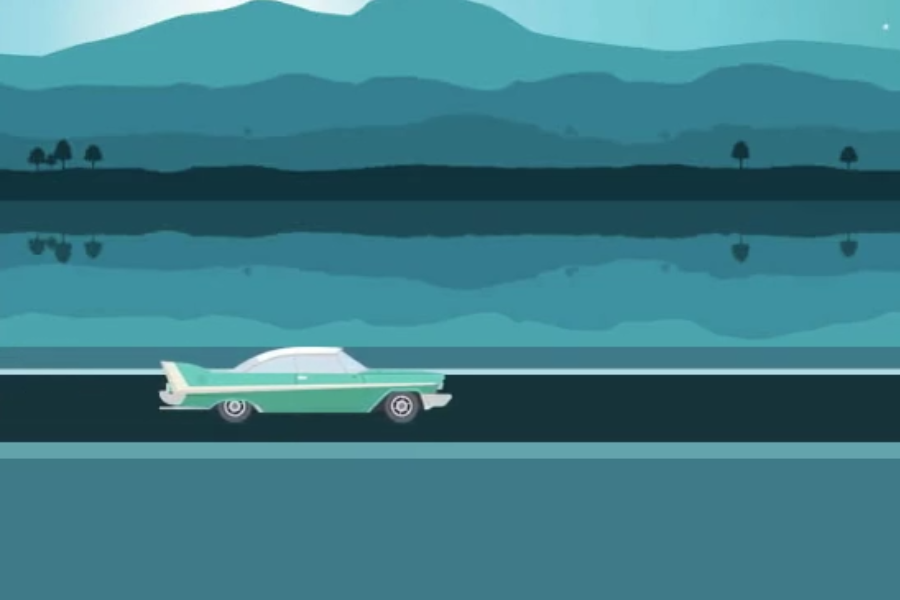

---
tags:
  - Cours 9
  - Vendredi 25 octobre
---

# Cours 9

## Message de Françoise [:material-microsoft-teams:](https://teams.microsoft.com/l/message/19:BiAHRPbK6SjauPwC8oHcs9qPyUx-CFhBPQ0C9ksx12U1@thread.tacv2/1729784430909?tenantId=ffa995c7-10de-4ec8-95db-28ed0576455d&groupId=47f527c0-26a1-4be3-b02d-ed97a9e5017a&parentMessageId=1729784430909&teamName=Intelligence%20Artificielle&channelName=General&createdTime=1729784430909)

> **Changement de plan**
>
> Intelligence Artificielle
>
> Bonjour à tous, changement de plan pour les licences. Vous pourrez utiliser les licences de Midjourney et de Runway uniquement au collège. Je vais changer les mots de passe. Donc pour votre moodboard, vous pouvez utiliser des images libres de droit. Au prochain cours, vous aurez du temps pour utiliser Midjourdney.

## Bootcamp JS

## Retour sur la partie JavaScript de l'examen

Les étapes à suivre pour compléter l'exercice :

1. On ajoute des variables qui nous servent à compter.
1. On fait juste un fruit pour commencer
1. On ajoute une fonction pour les tâches répétitives (incrémentation du total et validation du clique de chaque fruit)
1. Finalement, on copie/colle l'eventListener pour chaque fruit.

## GSAP


[GSAP](https://gsap.com/) (GreenSock Animation Platform) est une bibliothèque JavaScript pour créer des animations web. Elle est utilisée pour créer des animations complexes et interactives[^gsap].

[^gsap]: Exemples d'animations complexes et interactives : [showcase sur gsap.com](https://gsap.com/showcase/), [collection sur codepen](https://codepen.io/collection/ANaOod?grid_type=grid).


## Installation

```html
<head>
  <!-- ... -->
  <script src="https://cdn.jsdelivr.net/npm/gsap@3.12.5/dist/gsap.min.js" defer></script>
  <script src="path/to/your/script.js" defer></script>
</head>
```

[Documentation officielle pour la version 3](https://gsap.com/docs/v3/Installation)

!!! info "CDN : Content Delivery Network"

    Il est recommandé d’utiliser des fichiers CDN, car ils sont mis en cache et se chargent rapidement. Avec des millions de sites utilisant GSAP, il est probable que vos visiteurs aient déjà la bibliothèque en cache, ce qui réduit la bande passante et accélère le chargement.

## Qu’est-ce qu’on peut animer ?

GSAP permet d’animer une vaste gamme de propriétés CSS. Voici les types de propriétés fréquemment animées :

* **Positionnement** : Propriétés comme x, y, left, right, top, bottom permettent des translations sur l’écran.
* **Espacement** : Les marges (margin) et les espacements internes (padding) d’un élément peuvent être animés.
* **Dimensions** : Vous pouvez modifier la largeur (width) et la hauteur (height) d’un élément pour créer des effets de redimensionnement fluides.
* **Opacité** : L’animation de l’opacity permet de créer des effets de fondu, allant de 0 (0% visible) à 1 (100% visible).
* **Couleurs** : GSAP peut animer les propriétés de couleurs, comme background-color et color, permettant des transitions en douceur entre différentes teintes.
* **Typographie** : Les propriétés de texte comme la taille de police (font-size), l’espacement des lettres (letter-spacing) ou encore la couleur du texte peuvent être animées.
* **Transformations** : GSAP prend en charge les transformations CSS comme :
  * **Échelle** (scale) : Agrandir ou réduire la taille d’un élément.
  * **Rotation** (rotate) : Faire tourner un élément sur son axe.
  * **Inclinaison** (skew) : Modifier l’orientation d’un élément.

## Comment les animations fonctionnent-elles ?

Toutes ces propriétés sont animées via des **[interpolations](https://gsap.com/docs/v3/GSAP/Tween)** (ou tweens). GSAP modifie progressivement les valeurs de départ à destination en fonction d’une **[durée définie](https://gsap.com/docs/v3/GSAP/Timeline/duration()/)**.

Pour rendre les transitions plus naturelles, vous pouvez appliquer des **[fonctions d’assouplissement](https://gsap.com/docs/v3/Eases/)** (easing) qui contrôlent la vitesse du changement au cours de l’animation.

<iframe class="aspect-1-1" height="300" style="width: 100%;" scrolling="no" title="GSAP - ease" src="https://codepen.io/tim-momo/embed/QWeOrgo/9db303ae98b0cef97b5d8e699930c6e6?default-tab=result&editable=true&theme-id=50173" frameborder="no" loading="lazy" allowtransparency="true" allowfullscreen="true">
  See the Pen <a href="https://codepen.io/tim-momo/pen/QWeOrgo/9db303ae98b0cef97b5d8e699930c6e6">
  GSAP - ease</a> by TIM Montmorency (<a href="https://codepen.io/tim-momo">@tim-momo</a>)
  on <a href="https://codepen.io">CodePen</a>.
</iframe>

## Syntaxe

La syntaxe des animations avec GSAP est extrêmement simple. En résumé, vous appelez une fonction (ex.: `.to()`), spécifiez un élément à animer via un sélecteur CSS (ex.: `".etoiles"`), puis définissez les paramètres de l’animation dans un objet (ex.: `x: 100,`).

### [to()](https://gsap.com/docs/v3/GSAP/gsap.to())

Crée une animation où les propriétés de l’élément évoluent vers les valeurs spécifiées.

Dans l'exemple ci-dessous, l'animation s'effectue sur la position **x** du rond.

<div class="grid" markdown>
```js title="Syntaxe"
gsap.to("selecteur", {
  // configurations
  // propriété: valeur
});
```

<iframe class="aspect-3-2" height="300" style="width: 100%;" scrolling="no" title="GSAP - to()" src="https://codepen.io/tim-momo/embed/zYgzoEX/89bb58bd6ed29bc7a703a1ce460ff161?default-tab=result&theme-id=50173" frameborder="no" loading="lazy" allowtransparency="true" allowfullscreen="true">
  See the Pen <a href="https://codepen.io/tim-momo/pen/zYgzoEX/89bb58bd6ed29bc7a703a1ce460ff161">
  GSAP - to()</a> by TIM Montmorency (<a href="https://codepen.io/tim-momo">@tim-momo</a>)
  on <a href="https://codepen.io">CodePen</a>.
</iframe>
</div>

### [from()](https://gsap.com/docs/v3/GSAP/gsap.from()/)

Crée une animation où les propriétés de l’élément commencent à une certaine valeur, puis évoluent vers leur état final (tel qu’il est dans le DOM).

Dans l'exemple ci-dessous, l'animation s'effectue sur la position **x** du rond.

<div class="grid" markdown>
```js title="Syntaxe"
gsap.from("selecteur", {
  // configurations
  // propriété: valeur
});
```

<iframe class="aspect-3-2" height="300" style="width: 100%;" scrolling="no" title="GSAP - to()" src="https://codepen.io/tim-momo/embed/WNVOoLK/087c8d54f40078d64a89bf64eade1d2f?default-tab=result&theme-id=50173" frameborder="no" loading="lazy" allowtransparency="true" allowfullscreen="true">
  See the Pen <a href="https://codepen.io/tim-momo/pen/WNVOoLK/087c8d54f40078d64a89bf64eade1d2f">
  GSAP - to()</a> by TIM Montmorency (<a href="https://codepen.io/tim-momo">@tim-momo</a>)
  on <a href="https://codepen.io">CodePen</a>.
</iframe>
</div>

### [fromTo()](https://gsap.com/docs/v3/GSAP/gsap.fromTo()/)

Permet de définir à la fois les valeurs de départ et d’arrivée d’une animation, offrant ainsi un contrôle total sur le processus.

Dans l'exemple ci-dessous, l'animation s'effectue sur la position **x**, **y**, puis sur la **rotation** de la barre.

<div class="grid" markdown>
```js title="Syntaxe"
gsap.fromTo("selecteur", {
  // configurations from
}, {
  // configurations to
  // propriété: valeur
});
```

<iframe class="aspect-3-2" height="300" style="width: 100%;" scrolling="no" title="GSAP - from()" src="https://codepen.io/tim-momo/embed/ExqXNrx/7f1f9010b174671e88f5f671802891a4?default-tab=result&theme-id=50173" frameborder="no" loading="lazy" allowtransparency="true" allowfullscreen="true">
  See the Pen <a href="https://codepen.io/tim-momo/pen/ExqXNrx/7f1f9010b174671e88f5f671802891a4">
  GSAP - from()</a> by TIM Montmorency (<a href="https://codepen.io/tim-momo">@tim-momo</a>)
  on <a href="https://codepen.io">CodePen</a>.
</iframe>
</div>

### [set()](https://gsap.com/docs/v3/GSAP/gsap.set())

Initialise immédiatement les propriétés spécifiées des éléments ciblés sans animation.

C’est essentiellement un `to()`, mais qui se produit instantanément :stuck_out_tongue_winking_eye:.

```js title="Syntaxe"
gsap.set("selecteur", {
  // configurations
  // propriété: valeur
});
```

## Configurations

* **sélecteur** : Le [sélecteur CSS](https://developer.mozilla.org/en-US/docs/Web/API/Document/querySelector) qui sélectionne un ou plusieurs éléments sur lesquels l’animation s’appliquera. Par exemple, `#monElement` pour un ID ou `.classeXYZ` pour une classe.
* **configurations** : Les options d’animation spécifiques que GSAP va utiliser (ex.: duration, ease).
* **Propriétés CSS** : Les propriétés CSS à animer, comme x, opacity, etc.

### Propriétés CSS

* `x` : Représente un déplacement sur l’axe horizontal en pixels par défaut.
* `y` : Représente un déplacement sur l’axe vertical en pixels.
* `rotation` : Permet de faire pivoter l’élément autour de son centre. Les valeurs sont en degrés.
* `scale` : Modifie la taille de l’élément en appliquant un facteur de mise à l’échelle.
* `opacity` : Gère la transparence de l’élément, de 0 (invisible) à 1 (entièrement visible).
* `backgroundColor` : Change la couleur de fond de l’élément.
* `borderRadius` : Modifie le rayon des bordures, permettant des coins arrondis.
* `skewX` et `skewY` : Inclinent l’élément selon les axes X et Y.
* `scaleX` et `scaleY` : Changent respectivement la mise à l’échelle horizontale et verticale.

!!! info Valeur des propriétés CSS

    Les valeurs sous forme de nombre (qui ne sont pas entre guillemets), ex: 400, sont interprétées en pixel. Les valeurs entre guillemets, ex '400%', peuvent spécifier une unité de mesure différente, comme dans le cas précédent où un pourcentage a été utilisé (%).

### Configurations GSAP

* `duration` : Durée de l’animation en secondes.
* `ease` : Fonction d’assouplissement qui définit la vitesse de l’animation tout au long de sa durée (ex : "power2.inOut" pour une accélération/décélération progressive).
* `repeat` : Nombre de fois que l’animation se répète.
* `yoyo` : Si défini sur true, l’animation revient à son état initial après chaque répétition, créant un effet de va-et-vient.
* `delay` : Tout comme la propriété [animation-delay](https://developer.mozilla.org/en-US/docs/Web/CSS/animation-delay) en CSS, la propriété delay de GSAP permet de spécifier un délai d'attente avant de démarrer une animation.
* `repeatDelay` : Délai entre chaque répétition.
* `stagger` : Similaire à Delay, [Stagger](https://www.gsap.com/resources/getting-started/Staggers/) fait en sorte qu'un groupe d'éléments ayant tous la même animation soient décalés.
* `paused` : Si défini sur true, l’animation commence en pause.

### [Callbacks](https://gsap.com/docs/v3/GSAP/Tween/eventCallback()/)

* `onStart` : Fonction callback appelée lorsque l’animation démarre.
* `onUpdate` : Fonction callback appelée à chaque mise à jour de l’animation (frame).
* `onComplete` : Fonction callback appelée lorsque l’animation est terminée.
* `onRepeat` : Fonction callback appelée après chaque répétition de l’animation.

## Exemple complet

Voici un exemple d’animation GSAP avec plusieurs propriétés CSS et configurations :

<iframe height="300" style="width: 100%;" scrolling="no" title="GSAP - to() exemple" src="https://codepen.io/tim-momo/embed/wvVPjKX/7948f4e928d2aaf0883b1fd6b7ecc692?default-tab=result&editable=true&theme-id=50173" frameborder="no" loading="lazy" allowtransparency="true" allowfullscreen="true">
  See the Pen <a href="https://codepen.io/tim-momo/pen/wvVPjKX/7948f4e928d2aaf0883b1fd6b7ecc692">
  GSAP - to() exemple</a> by TIM Montmorency (<a href="https://codepen.io/tim-momo">@tim-momo</a>)
  on <a href="https://codepen.io">CodePen</a>.
</iframe>

```html title="HTML"
<div class="dot"></div>
```

```css title="CSS"
.dot {
  width: 10px;
  height: 10px;
  background-color: #ffffff;
  position: absolute;
  top: 50%;
  left: 100px;
  border-radius: 100%;
}
```

```js title="JavaScript"
const largeurFenetre = window.innerWidth;
gsap.to(".dot", {
  // Propriétés css
  x: largeurFenetre - 200 - 10,
  rotation: 180,
  opacity: 0.25,
  backgroundColor: "#2fb170",
  borderRadius: "12.5%",
  skewY: 45,
  scale: 10,

  // Configurations
  duration: 10,
  ease: "power2.inOut",
  stagger: 0.2,
  delay: 0.5,
  repeat: -1,
  yoyo: true,

  // Callbacks
  onStart: () => {
    console.log("Go!");
  }
});
```

## Timeline

Quand on utilise [timeline](https://gsap.com/docs/v3/GSAP/Timeline/) en GSAP, chaque animation commence après la fin de la précédente.

```js
gsap.timeline()
  .to("#box", { x: 100, duration: 1 }) // Démarre à 0 seconde
  .to("#box", { rotation: 360, duration: 1 }) // Démarre après la fin de la première animation
  .to("#box", { y: 100, duration: 1 }); // Démarre après la fin de la deuxième animation
```

Il est toutefois possible d'ajouter la notion de décalage.

```js
gsap.timeline()
  .to("#box", { x: 100, duration: 1 }) // Démarre à 0 seconde
  .to("#box", { rotation: 360, duration: 1 }, "-=0.5") // Démarre 0.5 seconde avant la fin de l’animation précédente
  .to("#box", { y: 100, duration: 1 }, "+=0.2"); // Démarre 0.2 seconde après la fin de l'animation précédente
```

## Exercices

<div class="grid grid-1-2" markdown>
  

  <small>Exercice - GSAP</small><br>
  **[Automobile jaune](./exercices/gsap-auto1.md){.stretched-link}**
</div>

<div class="grid grid-1-2" markdown>
  

  <small>Exercice - GSAP</small><br>
  **[Automobile turquoise](./exercices/gsap-auto2.md){.stretched-link}**
</div>

<div class="grid grid-1-2" markdown>
  

  <small>Exercice - GSAP</small><br>
  **[Domino](./exercices/gsap-domino.md){.stretched-link}**
</div>

## Devoir

Remise du devoir 3 (Formatif) : 31 octobre à 23h59

Joindre le lien url de votre fork dans le devoir 3 sur Teams.

<div class="grid grid-1-2" markdown>
  

  <small>Devoir - GSAP</small><br>
  **[Alien](./devoir/gsap-devoir3.md){.stretched-link}**
</div>

[STOP]

# Cours 9

## Sprite responsive


```html
<div class="sprite-container">
  <div class="sprite"></div>
</div>
```

```css
.sprite-container {
  width: 64px; /* Largeur d'une seule image (768px / 12 étapes) */
  height: 32px; /* Hauteur de chaque image dans le sprite */
  overflow: hidden; /* Cache les parties non visibles du sprite */
}

.sprite {
  width: 768px; /* Largeur du sprite (12 images x 64px de large chaque image) */
  height: 32px; /* Hauteur du sprite */
  background-image: url("https://assets.codepen.io/9367036/hell-hound-walk.png");

  /* facultatif */
  image-rendering: pixelated;
  image-rendering: -moz-crisp-edges;
  image-rendering: crisp-edges;
}
```

## ScrollTrigger

ScrollTrigger est un plugin GSAP qui permet de déclencher des animations en fonction du défilement de la page (scrolling).

### Fonctionnalités de base

Déclencher une animation lorsque l’élément entre dans la vue du viewport du navigateur.

```javascript
gsap.to(".box", {
  x: 200,
  scrollTrigger: ".box" // L'animation commence lorsque .box entre dans la vue
});
```

Personnaliser les points de déclenchement. Vous pouvez définir où commence et où se termine une animation avec les paramètres start et end.

```javascript
scrollTrigger: {
  trigger: ".box",
  start: "top 75%", // L'animation commence quand le haut de l'élément atteint 75% du viewport
  end: "bottom 25%", // L'animation se termine quand le bas de l'élément atteint 25% du viewport
}
```

Ajouter des marqueurs pour visualiser les déclencheurs (utile pour le développement).

```javascript
scrollTrigger: {
  trigger: ".box",
  start: "top 75%",
  end: "bottom 25%",
  markers: true // Affiche des marqueurs visuels sur la page
}
```

### Animation avec un sprite responsive

Les sprite ou spritesheet sont utilisés pour créer des animations fluides à partir d’une série d’images placées sur une seule image. L’animation se fait en déplaçant le “viewport” visible à travers les différentes images du sprite. Voici un exemple avec GSAP :

```javascript
const spriteAnimation = gsap.to(".sprite", {
  backgroundPosition: "-2400px 0px", // Modifie la position du background pour parcourir le spritesheet
  duration: 2,
  ease: "steps(12)", // Divise l'animation en 12 images fixes
  paused: true, // L'animation est en pause pour être contrôlée par ScrollTrigger!
  scrollTrigger: {
    trigger: ".sprite-container",
    start: "top 80%",
    end: "bottom 20%",
    scrub: 1, // Synchronise l'animation avec le scroll
    markers: true
  }
});
```

## Pratique guidée

[Pratique guidée sprite et scrolltrigger](./exercices/gsap-sprite-scrolltrigger.md)

## Exercices

1. Ajouter des effets supplémentaires : Intégrez des animations supplémentaires avec ScrollTrigger, comme un fond qui se déplace parallèlement au spritesheet.
1. Créer une version responsive : Adaptez l’animation pour différents écrans en ajustant les dimensions du conteneur et des images du spritesheet.
1. Combiner avec d’autres éléments : Ajoutez du texte ou des éléments graphiques qui apparaissent en synchronisation avec l’animation du spritesheet.
