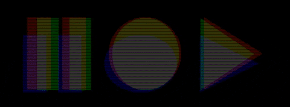
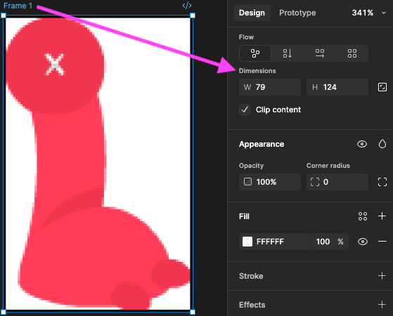
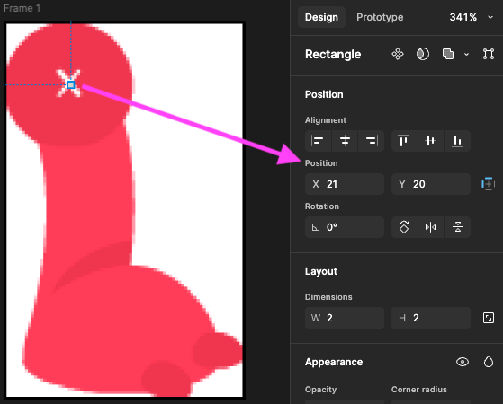
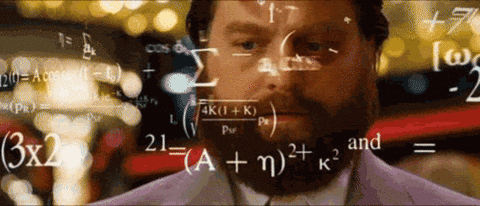
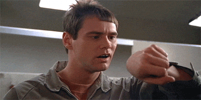
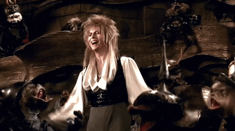
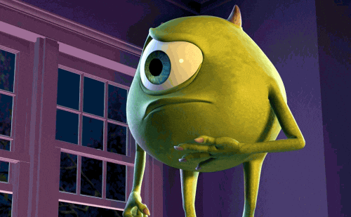

# Cours 9 | Anime.js la suite

## Contrôle de la lecture

{.w-100}

Il est possible de contrôler les animations AnimeJS de la même façon qu'on contrôle une vidéo. Ce sont ce qu'on appelle les [méthodes d'animation](https://animejs.com/documentation/animation/animation-methods).

```js
import { animate } from "animejs";

const a = animate(".dot", {
  x: 240
});

a.pause();
```

Quelques méthodes : 

* `play()`
* `pause()`
* `restart()`
* `resume()`

### autoplay

L’attribut `autoplay` permet d’activer ou de désactiver la lecture automatique d’une animation au chargement de la page.

On le désactive souvent lorsqu’on veut contrôler le déclenchement de l’animation à l’aide d’un événement (comme un clic, un survol ou un défilement).

```js
import { animate } from "animejs";

const a = animate(".dot", {
  autoplay: false
});
```

## Callbacks

{.w-100}

Les [callbacks](https://animejs.com/documentation/animation/animation-callbacks) sont des fonctions appelées à des moments spécifiques d'une animation.

Quelques callbacks : 

* `onBegin()`
* `onComplete()`
* `onLoop()`
* `onPause()`

Exemple de `onLoop()` :

<iframe class="aspect-16-9" height="300" style="width: 100%;" scrolling="no" title="AnimeJS - Callback " src="https://codepen.io/tim-momo/embed/gbPKvEZ/766c222d3abf165800cf58a6b3946931?default-tab=js%2Cresult&editable=true&theme-id=50210" frameborder="no" loading="lazy" allowtransparency="true">
      See the Pen <a href="https://codepen.io/tim-momo/pen/gbPKvEZ/766c222d3abf165800cf58a6b3946931">
  AnimeJS - Callback </a> by TIM Montmorency (<a href="https://codepen.io/tim-momo">@tim-momo</a>)
  on <a href="https://codepen.io">CodePen</a>.
</iframe>

<!--
```js
import { animate } from "animejs";

const colors = ['#ff477e', '#00c2ff', '#ffd166', '#06d6a0', '#9b5de5'];
let i = 0;

animate('.dot', {
  scale: [1, 1.2, 1],
  duration: 900,
  loop: true,
  onLoop: () => {
    i = (i + 1) % colors.length;
    document.querySelector('.dot').style.background = colors[i];
  }
});
```
-->

## État initial

L'utilitaire [`set()`](https://animejs.com/documentation/utilities/set) applique un état initial avant une animation. 

Ça permet entre autres d'ajouter des transformations qui ne se feront pas écraser par l'animation suivante. En effet, sans `set()`, chaque nouvelle animation remet les transformations à zéro avant d'appliquer les nouvelles valeurs. Avec `set()`, on peut préserver certaines transformations existantes.

Exemple : 

```js
import { animate, utils } from "animejs";

utils.set('.dot', { scale: 2 });

animate(".dot", {
  x: 240 // Ici la translation n'écrasera pas le scale !
});
```

## `transform-origin` d'une image

Parfois, l'origine d'une transformation sur une image est difficilement discernable. Il faut alors utiliser une méthode plus précise.

Dans Figma :

1. on crée un Frame de la même dimension que l'image;
1. on ajoute un petit carré sur l'image de 1 ou 2 pixels et on le place là où l'origine de la transformation doit se produire;
1. on effectue une règle de trois pour trouver l'origine.

### Exemple pratique

{data-zoom-image}

Dans Figma :

<div class="grid" markdown>
{data-zoom-image}

{data-zoom-image}
</div>

Taille de l'image : 79px par 124px

Position du carré : 21px par 20px

Pour calculer l'origine en pourcentage, on utilise une règle de trois :

Origine sur l'axe X en pourcentage : (21 / 79) × 100 = 26.58%

Origine sur l'axe Y en pourcentage : (20 / 124) × 100 = 16.12%

```css title="CSS"
.bras {
  /* ... */
  transform-origin: 26.58% 16.12%;
}
```

## Modificateur



Un [modificateur](https://animejs.com/documentation/animation/tween-parameters/modifier) (ou _modifier_) est une fonction qui modifie le comportement d'une animation. 

Il est souvent accompagné d'un utilitaire : [`clamp()`](https://animejs.com/documentation/utilities/clamp), [`snap()`](https://animejs.com/documentation/utilities/snap), [`lerp()`](https://animejs.com/documentation/utilities/lerp), [`damp()`](https://animejs.com/documentation/utilities/damp), etc.

Généralement, il y a deux façons d'écrire un modificateur.

### Avec utilitaire

<div class="grid align-items-start" markdown>
```js
import { animate, utils } from "animejs";

animate(".dot", {
  x: "25vw",
  modifier: utils.round(0)
});
```

<iframe class="aspect-16-9" height="300" style="width: 100%;" scrolling="no" title="AnimeJS - modifier " src="https://codepen.io/tim-momo/embed/xbZzWRY/2f4323af229a1ddf6e9c80a5e8ff7a1b?default-tab=&theme-id=50173" frameborder="no" loading="lazy" allowtransparency="true">
  See the Pen <a href="https://codepen.io/tim-momo/pen/xbZzWRY/2f4323af229a1ddf6e9c80a5e8ff7a1b">
  AnimeJS - modifier </a> by TIM Montmorency (<a href="https://codepen.io/tim-momo">@tim-momo</a>)
  on <a href="https://codepen.io">CodePen</a>.
</iframe>
</div>

### Avec une fonction personnalisée

Dans ce cas, le paramètre d'une fonction fléchée représente la ou les valeurs modifiées par l'animation.

<div class="grid align-items-start" markdown>
```js
import { animate } from "animejs";

animate(".dot", {
  x: "1vw",
  y: "0.5vw",
  modifier: (v) => {
    return v * 25
  }
});
```

<iframe class="aspect-16-9" height="300" style="width: 100%;" scrolling="no" title="AnimeJS - modifier " src="https://codepen.io/tim-momo/embed/XJXYEbR/fa9ef19ca3a25739ec7467954f0dfacd?default-tab=&theme-id=50173" frameborder="no" loading="lazy" allowtransparency="true">
      See the Pen <a href="https://codepen.io/tim-momo/pen/XJXYEbR/fa9ef19ca3a25739ec7467954f0dfacd">
  AnimeJS - modifier </a> by TIM Montmorency (<a href="https://codepen.io/tim-momo">@tim-momo</a>)
  on <a href="https://codepen.io">CodePen</a>.
      </iframe>
</div>

## Animations multi‑étapes

Il existe deux façons de créer des animations en plusieurs étapes avec AnimeJS : les tableaux simples, les keyframes et les timelines. 

Les tableaux simples permettent de définir plusieurs valeurs pour une même propriété, tandis que les keyframes offrent un contrôle plus précis sur la durée et le timing de chaque étape.

Pour ce qui est des timelines, nous verrons cela une autre fois.

### Tableaux simples

Cette méthode est la plus simple : on passe un tableau de valeurs pour chaque propriété. AnimeJS répartit automatiquement le temps entre chaque étape.

<div class="grid align-items-start" markdown>
```js
import { animate } from "animejs";

animate(".dot", {
  x: [0, "20vw", 0, "-20vw", 0],
  y: [0, "-20vh", "20vh", 0],
  duration: 2000,
  loop: true
});
```

<iframe class="aspect-16-9" height="300" style="width: 100%;" scrolling="no" title="AnimeJS - Multi-étapes" src="https://codepen.io/tim-momo/embed/vELrRgb/2e8c64163d050af62da00b2e63ac29bd?default-tab=&theme-id=50173" frameborder="no" loading="lazy" allowtransparency="true">
      See the Pen <a href="https://codepen.io/tim-momo/pen/vELrRgb/2e8c64163d050af62da00b2e63ac29bd">
  AnimeJS - Multi-étapes</a> by TIM Montmorency (<a href="https://codepen.io/tim-momo">@tim-momo</a>)
  on <a href="https://codepen.io">CodePen</a>.
</iframe>
</div>

### Keyframes

Les keyframes permettent de définir précisément la durée de chaque étape et de combiner plusieurs propriétés par étape. C'est plus verbeux mais plus flexible.

<div class="grid align-items-start" markdown>
```js
import { animate } from "animejs";

animate(".dot", {
  keyframes: [
    { x: 0, y: 0, duration: 0 },
    { x: `10vw`, y: `16vh`, duration: 100 },
    { x: `-10vw`, duration: 100 },
    { x: 0, y: 0, duration: 100 }
  ],
  loop: true,
  ease: "outExpo"
});
```

<iframe class="aspect-16-9" height="300" style="width: 100%;" scrolling="no" title="AnimeJS - Multi-étapes" src="https://codepen.io/tim-momo/embed/VYedXWq/ea6ce3d98312ce565fe2f4d431403d02?default-tab=&theme-id=50173" frameborder="no" loading="lazy" allowtransparency="true">
  See the Pen <a href="https://codepen.io/tim-momo/pen/VYedXWq/ea6ce3d98312ce565fe2f4d431403d02">
  AnimeJS - Multi-étapes</a> by TIM Montmorency (<a href="https://codepen.io/tim-momo">@tim-momo</a>)
  on <a href="https://codepen.io">CodePen</a>.
</iframe>
</div>

### Lissage global

Lorsqu'une animation est configurée en plusieurs étapes, le lissage sera effectué sur chaque animation individuellement. Si on veut un lissage sur l'animation sur la durée entière, on utilise plutot `playbackEase`.

<div class="grid" markdown>
```text title='ease'
0 ────────────────────────────────› 1
A ──ease──› B ──ease──› C ──ease──› D
```

```text title="playbackEase"
0 ──────────────ease──────────────› 1
A ────────› B ────────› C ────────› D
```
</div>

<div class="grid align-items-start" markdown>
```js
import { animate } from "animejs";

animate(".dot", {
  keyframes: [
    { x: 0, y: 0, duration: 0 },
    { x: `10vw`, y: `16vh`, duration: 1000 },
    { x: `-10vw`, duration: 1000 },
    { x: 0, y: 0, duration: 1000 }
  ],
  loop: true,
  playbackEase: "outExpo" // 👈 
});
```

<iframe height="300" style="width: 100%;" scrolling="no" title="AnimeJS - Multi-étapes keyframes" src="https://codepen.io/tim-momo/embed/NPxzYXN/a9352955daca959073dc33bde4b46180?default-tab=&theme-id=50173" frameborder="no" loading="lazy" allowtransparency="true">
  See the Pen <a href="https://codepen.io/tim-momo/pen/NPxzYXN/a9352955daca959073dc33bde4b46180">
  AnimeJS - Multi-étapes keyframes</a> by TIM Montmorency (<a href="https://codepen.io/tim-momo">@tim-momo</a>)
  on <a href="https://codepen.io">CodePen</a>.
</iframe>
</div>

## Valeurs relatives

Les [valeurs relatives](https://animejs.com/documentation/animation/tween-value-types/relative-value) ("-=3", "+=5", "*=6") affecte l'animation en considérant la valeur initiale de l'élément HTML comme point de départ. 

<div class="grid align-items-start" markdown>
```js
import { animate } from 'animejs';

document.body.addEventListener('click', () => {
  animate(".dot", { x: '+=10vw' });
});
```

<iframe class="aspect-2-1" height="300" style="width: 100%;" scrolling="no" title="AnimeJS - Multi-étapes keyframes" src="https://codepen.io/tim-momo/embed/dPGKmJw/472b4b31154bd02f39b67b762bde27b7?default-tab=&theme-id=50173" frameborder="no" loading="lazy" allowtransparency="true">
  See the Pen <a href="https://codepen.io/tim-momo/pen/dPGKmJw/472b4b31154bd02f39b67b762bde27b7">
  AnimeJS - Multi-étapes keyframes</a> by TIM Montmorency (<a href="https://codepen.io/tim-momo">@tim-momo</a>)
  on <a href="https://codepen.io">CodePen</a>.
</iframe>
</div>

!!! tip "Astuce"

    On peut penser aussi ajouter ce genre de logique dans un callback 😜 !

    Au lieu d'exécuter une action manuellement, elle pourrait être automatisée au loop d'une animation par exemple.

Dans l'exemple ci-dessous, on ajoute 180 degrés aux 180 existants. Ainsi `.bar` fera un tour complet. 

Si on ne met pas le "+=", l'animation ne fera rien, car elle est déjà à 180 !

```js
import { animate, utils } from 'animejs';

utils.set(".bar", { rotate: 180 });
animate(".bar", { rotate: "+=180" });
```

## Unités CSS relatives

Connaissez-vous `cqw` et `cqh` ? Ce sont des valeurs en pourcentage du conteneur d'un élément HTML (_Container Query Width_ et _Container Query Height_). 

C'est l'équivalent de `vw` et `vh`, mais dans un contexte spécifique : le conteneur parent de l'élément plutôt que la fenêtre du navigateur.

**Pourquoi ne pas utiliser `%` ?** 

C'est que le pourcentage pour les transformations se base sur les dimensions de l'élément lui-même, donc si on veut le positionner dans son conteneur en pourcentage, `cqw` et `cqh` sont les seules options CSS.

<iframe height="300" style="width: 100%;" scrolling="no" title="AnimeJS - cqw cqh" src="https://codepen.io/tim-momo/embed/gbPKejO/8205e1f39c5bdb6783aaf76e968dcf2e?default-tab=&theme-id=50173" frameborder="no" loading="lazy" allowtransparency="true">
      See the Pen <a href="https://codepen.io/tim-momo/pen/gbPKejO/8205e1f39c5bdb6783aaf76e968dcf2e">
  AnimeJS - cqw cqh</a> by TIM Montmorency (<a href="https://codepen.io/tim-momo">@tim-momo</a>)
  on <a href="https://codepen.io">CodePen</a>.
</iframe>

## Exercices

<div class="grid grid-1-2" markdown>
  

  <small>Exercice - AnimeJS</small><br>
  **[Ariana](./exercices/ariana/index.md){.stretched-link .back}**
</div>

<div class="grid grid-1-2" markdown>
  

  <small>Exercice - AnimeJS</small><br> 
  **[La cloche](./exercices/cloche/index.md){.stretched-link .back}**
</div>

<div class="grid grid-1-2" markdown>
  

  <small>Exercice - AnimeJS</small><br>
  **[Labyrinthe](./exercices/labyrinthe/index.md){.stretched-link .back}**
</div>

<div class="grid grid-1-2" markdown>
  

  <small>Exercice - AnimeJS</small><br> 
  **[Dino](./exercices/dino/index.md){.stretched-link .back}**
</div>

## Devoir

<div class="grid grid-1-2" markdown>
  

  <small>Devoir - Formatif</small><br> 
  **[Monstre inc.](./exercices/monsterinc/index.md){.stretched-link .back}**
</div>