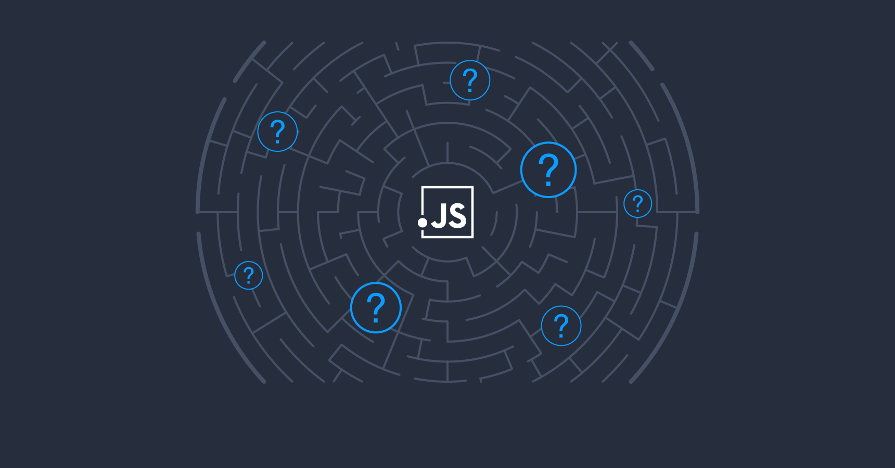

# Cours 9 | JavaScript, classes et médias

<!-- **Savoirs :** #1 Programmation fonctionnelle · #2 Intégration de médias · #3 Contrôle audio et vidéo · #12 Repérage d'erreur (DevTools) · #13 Classe JavaScript · #14 Classes sur mesure -->

{.w-100}

- Ouverture de la partie « programmation » : classes JavaScript (`class`, `constructor`, propriétés, méthodes, `this`, instanciation).
- API native `<video>`/`<audio>` : `play()`, `pause()`, `currentTime`, `volume`, événement `timeupdate`.
- Librairies (survol) : **Video.js** (lecteur vidéo habillable), **Howler.js** (audio : `new Howl()`, `play`/`pause`/`stop`, `volume`, formats de repli, sprites).
- Débogage : DevTools (Console, `console.log`, points d'arrêt de base).