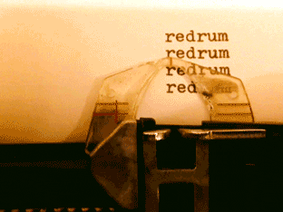

# Cours 10 | Anime.js 3/3

*[SVG] : Scalable Vector Graphics
*[IO] : Intersection Observer
*[ESM] : ECMAScript Module

## SVG

Petit rappel sur l'anatomie d'une image svg.

```html
<svg xmlns="http://www.w3.org/2000/svg" viewBox="0 0 16 16">
  <path d="..." />
  <polygon points="..."></polygon>
  <polyline points="..." />
</svg>
```

On peut trouver des SVG un peu partout sur le web, dont sur <https://icons.getbootstrap.com>.

### Morphing

<iframe height="300" style="width: 100%;" scrolling="no" title="AnimeJS - morphTo" src="https://codepen.io/tim-momo/embed/myVzOXR/4be64eb1f40865ed1a33e79f353c23cd?default-tab=&editable=true&theme-id=50173" frameborder="no" loading="lazy" allowtransparency="true">
      See the Pen <a href="https://codepen.io/tim-momo/pen/myVzOXR/4be64eb1f40865ed1a33e79f353c23cd">
  AnimeJS - morphTo</a> by TIM Montmorency (<a href="https://codepen.io/tim-momo">@tim-momo</a>)
  on <a href="https://codepen.io">CodePen</a>.
</iframe>

La méthode [`morphTo()`](https://animejs.com/documentation/svg/morphto) permer d'interpoler l'attribut `d` ou `points` dans les éléments d'un SVG. 

!!! tip "Quelques conditions idéales"

    Pour que ça fonctionne bien, il faut : 

    * appliquer des classes aux chemins (c'est plus clair comme ça)
    * cacher la forme de transition (ex: `style="opacity: 0"`)
    * s'assurer que les formes soient pleines

```html title="HTML"
<svg xmlns="http://www.w3.org/2000/svg" width="16" height="16" fill="currentColor" class="bi bi-hexagon-fill" viewBox="0 0 16 16">
  <path class="p1" d="M14 10a6 6 0 0 1-12 0C2 5.686 5 0 8 0s6 5.686 6 10"/>
  <path class="p2" style="opacity: 0" d="M0 2a2 2 0 0 1 2-2h12a2 2 0 0 1 2 2v12a2 2 0 0 1-2 2H2a2 2 0 0 1-2-2z"/>
</svg>
```

```js title="JavaScript"
import { animate, svg } from 'animejs';

let p1 = document.querySelector(".p1");
let p2 = document.querySelector(".p2");

animate(p1, {
  d: svg.morphTo(p2, 1),
  loop: true,
  alternate: true,
  duration: 1500,
  loopDelay: 500
});
```

### Animation d'un tracé

<iframe height="300" style="width: 100%;" scrolling="no" title="AnimeJS - morphTo" src="https://codepen.io/tim-momo/embed/myVzOQw/ebc5981478e4389cc0622414426b2404?default-tab=&editable=true&theme-id=50173" frameborder="no" loading="lazy" allowtransparency="true">
      See the Pen <a href="https://codepen.io/tim-momo/pen/myVzOQw/ebc5981478e4389cc0622414426b2404">
  AnimeJS - morphTo</a> by TIM Montmorency (<a href="https://codepen.io/tim-momo">@tim-momo</a>)
  on <a href="https://codepen.io">CodePen</a>.
</iframe>

La méthode [`createDrawable()`](https://animejs.com/documentation/svg/createdrawable) créé un objet `drawable` ce qui permet d'animer le stroke avec la technique _stroke-dasharray/stroke-dashoffset_. C'est-à-dire que l'animation considère toujours la position du départ et de fin de la ligne.

```html title="HTML"
<svg style="overflow: visible" xmlns="http://www.w3.org/2000/svg" viewBox="0 0 400 120" stroke="currentColor" fill="none" stroke-linecap="round" stroke-linejoin="round" stroke-width="1">
  <path class="p1" d="M14 10a6 6 0 0 1-12 0C2 5.686 5 0 8 0s6 5.686 6 10"/>
</svg>
```

```js title="JavaScript"
import { animate, svg } from "animejs";

const drawable = svg.createDrawable(".p1");
animate(drawable, {
  draw: ["0 0", "0 1", "1 1"],
  loop: true,
  alternate: true,
  duration: 1500,
  loopDelay: 500
});
```

!!! tip "Quelques conditions idéales"

    Pour que ça fonctionne bien, il faut probablement ajuster un peu le code du svg.

    Sur la balise `<svg>` (ou sur le groupe `<g>` s'il y en a un), appliquer ces paramètres afin de **configurer le stroke** et **retirer la couleur de fond** : 

    ```html
    stroke="currentColor" fill="none" stroke-linecap="round" stroke-linejoin="round" stroke-width="1"
    ```

    Je suggère également d'ajouter un style `overflow: visible;` au svg si les lignes ne se dessinent pas entièrement.

### Suivre un chemin

<iframe height="300" style="width: 100%;" scrolling="no" title="AnimeJS - createDrawable" src="https://codepen.io/tim-momo/embed/ZYQqvpe/f4bf302d37eb7b3dd6c592367b5aaf31?default-tab=&editable=true&theme-id=50173" frameborder="no" loading="lazy" allowtransparency="true">
      See the Pen <a href="https://codepen.io/tim-momo/pen/ZYQqvpe/f4bf302d37eb7b3dd6c592367b5aaf31">
  AnimeJS - createDrawable</a> by TIM Montmorency (<a href="https://codepen.io/tim-momo">@tim-momo</a>)
  on <a href="https://codepen.io">CodePen</a>.
      </iframe>

La fonction [createMotionPath()](https://animejs.com/documentation/svg/createmotionpath) permet d'animer un élément sur le tracé d'un svg en renvoyant les coordonnées `x`, `y` et `rotate` d'un seul coup.

```html title="HTML"
<div class="wrap">
  <svg xmlns="http://www.w3.org/2000/svg" width="16" height="16" fill="currentColor" class="bi bi-egg-fill" viewBox="0 0 16 16">
    <path class="ligne" d="M14 10a6 6 0 0 1-12 0C2 5.686 5 0 8 0s6 5.686 6 10" />
  </svg>
  <div class="car"></div>
</div>
```

```css title="CSS"
.wrap {
  position: relative;
  .car {
    position: absolute; /* 👈 Nécessaire */
    /* Facultatif, mais utile pour la suite 👇 */
    width: 10px; 
    height: 6px; 
    /* Permet de centrer l'élément */
    left: -5px;
    top: -3px;
  }
}
```

```js title="JavaScript"
import { animate, svg } from "animejs";

animate(".car", {
  ease: "linear",
  duration: 5000,
  loop: true,
  ...svg.createMotionPath(".ligne")
});
```

!!! info "... ???"

    La fonction `createMotionPath` retourne 3 paramètres d'un coup : `x`, `y` et `rotate`.

    ```js
    const { translateX, translateY, rotate } = svg.createMotionPath(path, offset);
    ```

    On pourrait ensuite, prendre chacune de ces variables et les appliquer une à une dans l'animation, mais il est plus simple et propre d'utiliser la [syntaxe de décomposition](https://developer.mozilla.org/fr/docs/Web/JavaScript/Reference/Operators/Spread_syntax) JavaScript avec les trois petits points.

    ---

    D'ailleurs, connaissiez-vous l'[affectation par décomposition](https://developer.mozilla.org/fr/docs/Web/JavaScript/Reference/Operators/Destructuring) ? C'est une méthode particulièrement pratique pour assigner les éléments reçus dans des variables directement.


## Draggable

<iframe height="300" style="width: 100%;" scrolling="no" title="AnimeJS - createMotionPath" src="https://codepen.io/tim-momo/embed/zxrmpya/34126be8d82a92543670377f7c756b52?default-tab=&editable=true&theme-id=50173" frameborder="no" loading="lazy" allowtransparency="true">
      See the Pen <a href="https://codepen.io/tim-momo/pen/zxrmpya/34126be8d82a92543670377f7c756b52">
  AnimeJS - createMotionPath</a> by TIM Montmorency (<a href="https://codepen.io/tim-momo">@tim-momo</a>)
  on <a href="https://codepen.io">CodePen</a>.
</iframe>

Avec la méthode [`createDraggable()`](https://animejs.com/documentation/draggable) on peut rendre n'importe quel élément d'une page déplaçable avec la souris.

```js title="JavaScript"
import { createDraggable } from "animejs";

createDraggable(".element", {
  /* paramètres */
});
```

Évidemment, il y a beaucoup de configurations possibles et une certaine autonomie dans celle-ci est de mise.

* [snap](https://animejs.com/documentation/draggable/draggable-axes-parameters/snap) : Lors qu'on relâche la souris, l'élément peut s'ajuster à une grille définie.
* [mapTo](https://animejs.com/documentation/draggable/draggable-axes-parameters/mapto) : On peut associer le déplacement d'un élément à d'autres paramètres de modification.
* [trigger](https://animejs.com/documentation/draggable/draggable-settings/trigger) : Il est possible de déplacer un élément à partir d'un autre élément.
* [container](https://animejs.com/documentation/draggable/draggable-settings/container) : Il est possible de restreindre le déplacement dans une zone définie.

!!! warning "Un createDraggable par élément"

    S'il y a deux éléments ayant la classe `.allo` dans la page, je ne peux pas faire un `createDraggable` sur `.allo` en espérant que les deux soient interactifs. Il faut pour cela créer un `createDraggable` par élément.

## Événement `onScroll`

L'événement [`onScroll`](https://animejs.com/documentation/events/onscroll) permet de déterminer un moment précis pour déclencher une animation en fonction du scroll dans la page.

On doit dabord définir un conteneur qui fait le scroll. Probablement que dans la plupart des cas, ce sera `body`.

<iframe class="aspect-16-9" height="300" style="width: 100%;" scrolling="no" title="AnimeJS - Draggable" src="https://codepen.io/tim-momo/embed/yyeRvzq/30ec2d71c1f705009c409b034a4b468d?default-tab=&editable=true&theme-id=50173" frameborder="no" loading="lazy" allowtransparency="true">
      See the Pen <a href="https://codepen.io/tim-momo/pen/yyeRvzq/30ec2d71c1f705009c409b034a4b468d">
  AnimeJS - Draggable</a> by TIM Montmorency (<a href="https://codepen.io/tim-momo">@tim-momo</a>)
  on <a href="https://codepen.io">CodePen</a>.
</iframe> 

```js
import { onScroll, animate } from "animejs";

animate(".dot", {
  x: ["-10dvw", "10dvw"],
  alternate: true,
  loop: true,
  autoplay: onScroll({
    container: "body",
    debug: true // À retirer éventuellement
  })
});
```

### Synchronisation

La synchronisation fait qu'une animation joue de façon à ce que son pourcentage de progression suit celui du scroll dans la zone prévue.

<iframe height="300" style="width: 100%;" scrolling="no" title="AnimeJS - onScroll" src="https://codepen.io/tim-momo/embed/Wbrazba/29a553ce51b91160cfad2f332593e497?default-tab=&editable=true&theme-id=50173" frameborder="no" loading="lazy" allowtransparency="true">
      See the Pen <a href="https://codepen.io/tim-momo/pen/Wbrazba/29a553ce51b91160cfad2f332593e497">
  AnimeJS - onScroll</a> by TIM Montmorency (<a href="https://codepen.io/tim-momo">@tim-momo</a>)
  on <a href="https://codepen.io">CodePen</a>.
</iframe>

```js
import { onScroll, animate } from "animejs";

animate(".dot", {
  x: ["-10dvw", "10dvw"],
  autoplay: onScroll({
    container: "body",
    sync: true
  })
});
```

Différentes synchronisations : 

* [`sync: 'play pause'`](https://animejs.com/documentation/events/onscroll/scrollobserver-synchronisation-modes/method-names) : Valeur par défaut. Elle déclenche l'animation selon certains contexte défini par des mots clés
* [`sync: true`](https://animejs.com/documentation/events/onscroll/scrollobserver-synchronisation-modes/playback-progress) : Synchronise l'avancement de l'animation avec l'état du scroll
* [`sync: 0.6`](https://animejs.com/documentation/events/onscroll/scrollobserver-synchronisation-modes/smooth-scroll) : Synchronise l'avancement de l'animation avec l'état du scroll. La différence ici c'est qu'il y a un lissage d'appliqué lorsque
* [`sync: 'inOutCirc'`](https://animejs.com/documentation/events/onscroll/scrollobserver-synchronisation-modes/eased-scroll) : L'animation suit le lissage spécifié en fonction de l'encement du scroll

### Seuils du ScrollObserver

Les [seuils](https://animejs.com/documentation/events/onscroll/scrollobserver-thresholds) `enter` et `leave` sont les points de déclenchement.

La valeur par défaut du `enter` est `'end start'` et la valeur par défaut du `leave` est `'start end'`, mais on peut utiliser toutes sortes d'unités de mesure.

<iframe class="aspect-16-9" height="300" style="width: 100%;" scrolling="no" title="AnimeJS - onScroll sync" src="https://codepen.io/tim-momo/embed/emJPMgm/ed8756819eab5591b26ef18ca010bccf?default-tab=js%2Cresult&editable=true&theme-id=50210" frameborder="no" loading="lazy" allowtransparency="true">
      See the Pen <a href="https://codepen.io/tim-momo/pen/emJPMgm/ed8756819eab5591b26ef18ca010bccf">
  AnimeJS - onScroll sync</a> by TIM Montmorency (<a href="https://codepen.io/tim-momo">@tim-momo</a>)
  on <a href="https://codepen.io">CodePen</a>.
</iframe>

## Texte

<iframe height="300" style="width: 100%;" scrolling="no" title="AnimeJS - Text" src="https://codepen.io/tim-momo/embed/gbPBeqQ/9d2be3e8dbfcf09869ecb98c5941dc65?default-tab=result&editable=true&theme-id=50173" frameborder="no" loading="lazy" allowtransparency="true">
      See the Pen <a href="https://codepen.io/tim-momo/pen/gbPBeqQ/9d2be3e8dbfcf09869ecb98c5941dc65">
  AnimeJS - Text</a> by TIM Montmorency (<a href="https://codepen.io/tim-momo">@tim-momo</a>)
  on <a href="https://codepen.io">CodePen</a>.
      </iframe>

Les animations de texte peuvent animer les [lignes](https://animejs.com/documentation/text/splittext/textsplitter-settings/lines) de texte, les [mots](https://animejs.com/documentation/text/splittext/textsplitter-settings/words) ou les [lettres](https://animejs.com/documentation/text/splittext/textsplitter-settings/chars).

Ce que ça fait, c'est que ça segmente un paragraphs ou un titre en plusieurs éléments animables. Qui dit plusieurs éléments, dit Stagger !

```js
import { animate, splitText, stagger } from 'animejs';

const { chars  } = splitText('p', {
  chars: { wrap: 'clip' },
});

animate(chars, {
  y: ['100%', '0%'],
  delay: stagger(50)
});
```

[Propriétés](https://animejs.com/documentation/text/splittext/textsplitter-properties) de `splitText()` : 

* `wrap` : représente simplement l'`overflow` CSS. La valeur `clip` se comporte presque comme `hidden`.
* [`clone`](https://animejs.com/documentation/text/splittext/split-parameters/clone) : Applique un effet de répétition de lettre sur un des axes.

## Timeline

<iframe height="300" style="width: 100%;" scrolling="no" title="AnimeJS - modifier " src="https://codepen.io/tim-momo/embed/dPGQOGB/6c57f55116f63c85f791ed762f96be14?default-tab=result&editable=true&theme-id=50173" frameborder="no" loading="lazy" allowtransparency="true">
      See the Pen <a href="https://codepen.io/tim-momo/pen/dPGQOGB/6c57f55116f63c85f791ed762f96be14">
  AnimeJS - modifier </a> by TIM Montmorency (<a href="https://codepen.io/tim-momo">@tim-momo</a>)
  on <a href="https://codepen.io">CodePen</a>.
      </iframe>

La méthode [createTimeline](https://animejs.com/documentation/timeline) permet de synchroniser plusieurs animations entre elles. Pour ajouter les animations dans la timeline, on doit utiliser `add()`.

On utilise timeline lorsqu'on a une animation à plusieurs étapes et que la séquence des animations n'est pas forcément une après l'autre.

```js
import { createTimeline } from 'animejs';

createTimeline()
  .add('.square', { x: '15rem' })
  .add('.circle', { x: '15rem' })
  .add('.triangle', { x: '15rem', rotate: '1turn' });
```

Quelques concepts à connaître :

* `add` : La méthode [`add`](https://animejs.com/documentation/timeline/add-animations) équivaut à `animate`. La différence est sont troisième * paramètre qui configure une [position dans le temps](https://animejs.com/documentation/timeline/time-position). 
* Dans la fonction `createTimeline({})`, on peut ajouter des [paramètres](https://animejs.com/documentation/timeline/timeline-playback-settings) comme `loop: true` par exemple.
  * Avec `defaults`, on peut aussi ajouter des [paramètres par défaut](https://animejs.com/documentation/timeline/timeline-playback-settings/defaults) pour chacune des animations.

## Responsive

Les animations peuvent être différentes selon les [medias queries](https://developer.mozilla.org/en-US/docs/Web/CSS/CSS_media_queries/Using_media_queries) avec la notion de [scope](https://animejs.com/documentation/scope).

La méthode `createScope()` peut avoir quelques [paramètres](https://animejs.com/documentation/scope/scope-parameters) dont les [mediasQueries](https://animejs.com/documentation/scope/scope-parameters/mediaqueries).

```js
import { animate, utils, createScope } from 'animejs';

createScope({
  mediaQueries: {
    isSmall: '(max-width: 200px)',
    reduceMotion: '(prefers-reduced-motion)',
  }
})
.add(self => {

  const { isSmall, reduceMotion } = self.matches;
  
  if (isSmall) {
    utils.set('.square', { scale: .5 });
  }
    
  animate('.square', {
    x: isSmall ? 0 : ['-35vw', '35vw'],
    y: isSmall ? ['-40vh', '40vh'] : 0,
    loop: true,
    alternate: true,
    duration: reduceMotion ? 0 : isSmall ? 750 : 1250
  });

});
```

## Exercices

<div class="grid grid-1-2" markdown>
  

  <small>Exercice - AnimeJS</small><br> 
  **[Machine à écrire](./exercices/typewriter/index.md){.stretched-link .back}**
</div>

<div class="grid grid-1-2" markdown>
  

  <small>Exercice - AnimeJS</small><br> 
  **[Lava](./exercices/lava/index.md){.stretched-link .back}**
</div>

<div class="grid grid-1-2" markdown>
  

  <small>Exercice - AnimeJS</small><br> 
  **[Monaco](./exercices/monaco/index.md){.stretched-link .back}**
</div>

<div class="grid grid-1-2" markdown>
  

  <small>Exercice - AnimeJS</small><br>
  **[Cosmos](./exercices/cosmos/index.md){.stretched-link .back}**
</div>
