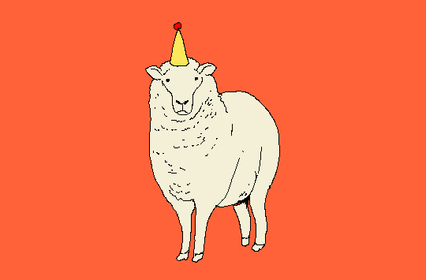

# Cours 11 | Diagrammes

[STOP]

Chart.js : bar, line, pie, radar, animation et personnalisation
Idée : Jeu de classes (monstre, personne, hit, score) et stats du jeu.


## Introduction aux classes JavaScript (après animejs?)

{.w-100}

Une classe en JavaScript, c’est un concept qui permet de structurer le code et de réutiliser la même logique plusieurs fois.

### Pourquoi on utiliserait ça ?

Imaginez que vous voulez programmer une page Web dans laquelle des poissons nagent indépendamment.

Vous pourriez commencer par écrire le code d’un premier poisson… puis copier-coller ce code pour en avoir un deuxième, un troisième, et ainsi de suite. Rapidement, ça devient lourd à maintenir.

C’est là que les classes sont utiles :

- On définit une seule fois une classe Poisson.
- Chaque nouveau poisson créé dans la page utilisera le même code.
- Peu importe si vous ajoutez 3 poissons ou 1 000 000, ils partageront tous la même logique.

### Comment ça fonctionne ?

```js
class Poisson {
  constructor(nom, couleur) {
    this.nom = nom;
    this.couleur = couleur;
  }

  coucou() {
    console.log(`${this.nom} (${this.couleur}) nage joyeusement.`);
  }
}

// On crée plusieurs poissons à partir de la même classe
const poisson1 = new Poisson("Nemo", "orange");
const poisson2 = new Poisson("Dory", "bleu");
const poisson3 = new Poisson("Sharky", "gris");

// Ils utilisent tous le même code défini dans la classe
poisson1.coucou(); // Résultat : Nemo (orange) nage joyeusement
poisson2.coucou(); // Résultat : Dory (bleu) nage joyeusement
poisson3.coucou(); // Résultat : Sharky (gris) nage joyeusement
```

<div class="grid grid-1-2" markdown>
  

  <small>Exercice - JavaScript</small><br>
  **[1001 poissons](./exercices/1001poissons/index.md){.stretched-link .back}**
</div>

## Programmation Orientée Objet (POO) en JavaScript (ES6)

## 1. Le constructeur

Le **constructeur** est une fonction spéciale qui s’exécute automatiquement quand on crée une instance avec `new`.  
Il sert souvent à **initialiser les propriétés** de la classe.

```js
class Voiture {
  constructor(marque, annee) {
    this.marque = marque;
    this.annee = annee;
  }

  infos() {
    console.log(`Cette voiture est une ${this.marque} fabriquée en ${this.annee}.`);
  }
}

const auto1 = new Voiture("Toyota", 2020);
auto1.infos();
// Résultat : Cette voiture est une Toyota fabriquée en 2020.
```

📝 **Notes**
- Le mot clé `constructor` est réservé.
- On ne peut avoir **qu’un seul constructeur** par classe.

👉 **Exercice 1**  
Crée une classe `Livre` qui prend un `titre` et un `auteur` en paramètre. Ajoute une méthode `resume()` qui affiche :  
`"Le livre TITRE a été écrit par AUTEUR."`


---

## 2. Héritage (extends, super)

Une classe peut **hériter** d’une autre classe avec `extends`.  
Cela permet de **réutiliser** du code existant et de **l’enrichir**.

```js
class Animal {
  constructor(nom) {
    this.nom = nom;
  }

  parler() {
    console.log(`${this.nom} fait un bruit.`);
  }
}

class Chien extends Animal {
  constructor(nom, race) {
    super(nom); // on appelle le constructeur de la classe parent
    this.race = race;
  }

  parler() {
    console.log(`${this.nom} aboie !`);
  }
}

const chien = new Chien("Rex", "Labrador");
chien.parler();
// Résultat : Rex aboie !
```

📝 **Notes**
- `extends` = hérite d’une autre classe.
- `super(...)` = appelle le constructeur du parent.

👉 **Exercice 2**  
Crée une classe `Employe` avec un nom et un salaire.  
Puis crée une classe `Manager` qui hérite de `Employe`, ajoute une propriété `departement` et une méthode `infos()` qui affiche toutes les infos.


---

## 3. Variables publiques et privées

En JavaScript (ES6+), on peut créer des **propriétés privées** avec `#`.  
Elles ne sont accessibles **que dans la classe**.

```js
class CompteBancaire {
  #solde; // propriété privée

  constructor(titulaire, soldeInitial) {
    this.titulaire = titulaire;
    this.#solde = soldeInitial;
  }

  deposer(montant) {
    this.#solde += montant;
  }

  afficherSolde() {
    console.log(`Solde de ${this.titulaire} : ${this.#solde}$`);
  }
}

const compte = new CompteBancaire("Alex", 100);
compte.deposer(50);
compte.afficherSolde();
// Résultat : Solde de Alex : 150$

console.log(compte.#solde); 
// ❌ Erreur : propriété privée !
```

📝 **Notes**
- Une variable **publique** peut être accédée partout.
- Une variable **privée** (avec `#`) est protégée et uniquement accessible dans la classe.

👉 **Exercice 3**  
Crée une classe `CoffreFort` avec une variable privée `#codeSecret`.  
Ajoute une méthode `verifierCode(code)` qui dit `"Accès autorisé"` ou `"Accès refusé"` selon le code.


---

## 4. Méthodes statiques

Une méthode `static` appartient à la **classe elle-même** et non à une instance.  
On l’appelle directement avec `NomDeClasse.methode()`.

```js
class Maths {
  static carre(x) {
    return x * x;
  }
}

console.log(Maths.carre(5));
// Résultat : 25
```

📝 **Notes**
- `static` = méthode utilitaire qui n’a pas besoin d’une instance.
- Exemple : méthodes mathématiques, outils de validation, etc.

👉 **Exercice 4**  
Crée une classe `Convertisseur` avec une méthode statique `kmToMiles(km)` qui retourne la conversion en miles (`1 km = 0.621 miles`).  
Teste-la avec `Convertisseur.kmToMiles(10)`.


---

# 🚀 Activité d’intégration

Crée une classe `Utilisateur` avec :
- un nom (public)
- un mot de passe (privé)
- une méthode `verifierMotDePasse(mdp)`
- une méthode statique `genererID()` qui retourne un nombre aléatoire entre 1000 et 9999

Puis crée une classe `Admin` qui hérite de `Utilisateur` et ajoute une méthode `supprimerUtilisateur(nomUtilisateur)` qui affiche :  
`"L'utilisateur NOM a été supprimé par ADMIN."`


## Introduction aux classes JavaScript

Les classes JavaScript c'est ce qu'on appelle de la programmation orientée objet (POO 💩). Ça n'a rien à voir avec une classe CSS (ex: `.rouge{ color: red; }`) et encore moins avec l'attribut `class=""` en HTML.

Ce type de programmation est très utile pour **organiser** sa programmation, mais ça ne sert pas qu’à cela. Il permet surtout de **réutiliser** du code, de faciliter la **maintenance**, d’**encapsuler** des données et de représenter des **concepts** du monde réel.

On peut essentiellement mettre des méthodes et des variables dans une classe. Voici une syntaxe de base :

```js
class Personne {

  constructor(n, a) {
    this.name = name;
    this.age = age;
  }

  presentations() {
    console.log(`Salut, je m'appelle ${this.name} et j'ai ${this.age} ans.`);
  }
}

const personneA = new Personne('Jeanne', 25);
personneA.presentations();
// Résultat : Salut, je m'appelle Jeanne et j'ai 25 ans.

const personneB = new Personne('Félix', 641);
personneB.presentations();
// Résultat : Salut, je m'appelle Félix et j'ai 641 ans.
personneB.age;
// Résultat : 641
```

🧐 Quelques observations à faire :

* La partie `class Personne {}` sert juste à définir une classe. Ça ne fait rien par défaut.
* La partie `new Personne(...);` sert à **instancier** la classe. Les variables `personneA` et `personneB` sont des `instances` de `Personne`. Disons que ce sont carrément des personnes !
  * On peut créer autant de `Personne` qu'on le désire.
  * On peut appeler les méthodes et les variables d'une instance en utilisant le point `.` Ex: `personneB.presentations();`.


## Parallaxe CSS

Une parallaxe consiste à créer un effet de profondeur en déplaçant des éléments à des vitesses différentes. Ainsi, les éléments se déplaçant plus rapidement sont perçus comme étant plus près, alors que ceux se déplaçant plus lentement sont perçus comme étant plus loin.

[Walt Disney](https://fr.wikipedia.org/wiki/Walt_Disney) fut l'un des pionniers à ce niveau grâce à son invention le [MultiPlane](https://fr.wikipedia.org/wiki/Cam%C3%A9ra_multiplane). Cette technologie permet de déplacer à des vitesses différentes plusieurs éléments d'un dessin animé recréant ainsi l'aspect de profondeur perçu dans la vie réelle.


Le même principe est applicable en CSS.

<iframe class="aspect-4-3" height="300" style="width: 100%;" scrolling="no" title="Walt Disney's MultiPlane Camera" src="https://codepen.io/tim-momo/embed/GRVYzaZ?default-tab=result&theme-id=50173" frameborder="no" loading="lazy" allowtransparency="true" allowfullscreen="true">
  See the Pen <a href="https://codepen.io/tim-momo/pen/GRVYzaZ">
  Walt Disney's MultiPlane Camera</a> by TIM Montmorency (<a href="https://codepen.io/tim-momo">@tim-momo</a>)
  on <a href="https://codepen.io">CodePen</a>.
</iframe>

Exemples de sites

* [Firewatch](https://www.firewatchgame.com/) (axe des Y)
* [Goonies](https://the-goonies.webflow.io/) (axe des Z)
* [Longshot](https://longshotfeatures.com/) (axe des X)

### Perspective & axe des Z

Pour créer un effet similaire en CSS, il est nécessaire de configurer une perspective. Cette perspective est l'équivalent de spécifier à quelle distance en pixels se trouve le point de vue de l'utilisateur de ce qui est affiché.

```css
.parallax {
  perspective: 100px;
}
```

Ce code indique que le point de vue de l'utilisateur se trouve à une distance équivalente à 100px de ce qui est affiché dans `.parallax`.

Une fois cette perspective configurée, le positionnement des éléments sur l'axe des Z peut être utilisé afin de rapprocher ou d'éloigner un élément de l'utilisateur.

```css
.back {
  transform: translateZ(-100px);
}

.front {
  transform: translateZ(0);
}
```

<iframe class="aspect-2-1" height="300" style="width: 100%;" scrolling="no" title="Untitled" src="https://codepen.io/tim-momo/embed/VwoERpa?default-tab=result&editable=true&theme-id=50173" frameborder="no" loading="lazy" allowtransparency="true" allowfullscreen="true">
  See the Pen <a href="https://codepen.io/tim-momo/pen/VwoERpa">
  Untitled</a> by TIM Montmorency (<a href="https://codepen.io/tim-momo">@tim-momo</a>)
  on <a href="https://codepen.io">CodePen</a>.
</iframe>

### Correction de la profondeur

Dans une animation parallax en CSS, les éléments plus éloignés de l’observateur apparaissent naturellement plus petits. Ce comportement, bien que fidèle à la perspective, peut nuire à l’effet souhaité dans le cadre d’une animation parallax. Pour corriger cette apparence, il est nécessaire d’agrandir ces éléments à l’aide de la fonction `scale()` afin qu’ils retrouvent leur taille d’origine relative à la scène.

Pour déterminer le scale approprié, la formule suivante peut être utilisée :

$$
\text{scale} = \left( \frac{\text{translateZ} \times -1}{\text{perspective}} \right) + 1
$$

Et pour l’exemple donné, l'élément `.back` avec un `translateZ` de -100px:

$$
\text{scale} = \left( \frac{-100 \times -1}{100} \right) + 1 = 2
$$

Donc,

```css
.back {
  transform: translateZ(-100px) scale(2);
}
```

Ainsi l'élément retrouvera sa taille de base.

<iframe class="aspect-2-1" height="300" style="width: 100%;" scrolling="no" title="Web - Parallax avec perspective" src="https://codepen.io/tim-momo/embed/gOVBymd?default-tab=result&editable=true&theme-id=50173" frameborder="no" loading="lazy" allowtransparency="true" allowfullscreen="true">
  See the Pen <a href="https://codepen.io/tim-momo/pen/gOVBymd">
  Web - Parallax avec perspective</a> by TIM Montmorency (<a href="https://codepen.io/tim-momo">@tim-momo</a>)
  on <a href="https://codepen.io">CodePen</a>.
</iframe>

## Parallaxe avec ScrollTrigger

Pour créer un effet de parallaxe simple en utilisant ScrollTrigger de GSAP, vous pouvez ajuster la position de l’image d’arrière-plan (`background-image`) lors du défilement.

Cela donne l’illusion de profondeur en faisant bouger l’image plus lentement ou plus rapidement que le contenu au premier plan.

### Mouvement vertical

Supposons avoir la structure HTML suivante :

```html
<section class="section"></section>
<section class="section" id="section-parallax"></section>
<section class="section"></section>
```

Préparons d'abord le CSS !

Pour positionner l’image verticalement, commencez par définir sa position verticale à `0%` ou `0px`.

Si vous souhaitez la centrer horizontalement, définissez la position horizontale à `50%`. Voici un exemple de configuration CSS :

```css
#section-parallax {
    background-image: url("chemin/de/votre/image.jpg");
    background-size: cover;
    background-repeat: no-repeat;
    background-attachment: scroll;
    background-position: 50% 0%;
}
```

!!! note "background-attachment"

    La propriété [background-attachment](https://developer.mozilla.org/fr/docs/Web/CSS/background-attachment) est réglée sur scroll pour animer l’arrière-plan lors du défilement.

Le code JavaScript suivant utilise GSAP pour animer la position de l’arrière-plan de l’élément `#section-parallax` :

```js
gsap.to("#section-parallax", {
    backgroundPosition: "50% 100%",
    ease: "none",
    scrollTrigger: {
        trigger: "#section-parallax",
        start: "top bottom",
        end: "bottom top",
        scrub: true,
        markers: true
    }
});
```

<iframe class="aspect-4-3" height="300" style="width: 100%;" scrolling="no" title="GSAP -  parallax" src="https://codepen.io/tim-momo/embed/poMxBaJ?default-tab=result&editable=true&theme-id=50173" frameborder="no" loading="lazy" allowtransparency="true" allowfullscreen="true">
  See the Pen <a href="https://codepen.io/tim-momo/pen/poMxBaJ">
  GSAP -  parallax</a> by TIM Montmorency (<a href="https://codepen.io/tim-momo">@tim-momo</a>)
  on <a href="https://codepen.io">CodePen</a>.
</iframe>

Petite variante : Vous pouvez inverser l’animation en définissant initialement la position verticale à 100% en CSS et en la ramenant à 0% avec GSAP, pour inverser le mouvement de l’image.

!!! question "Quel ratio d’image utiliser ?"

    Pour une section de site en mode paysage (plus large que haute), il est préférable d’utiliser une image en mode portrait (plus haute que large) pour maximiser l’impact visuel.

### Mouvement horizontal

Pour un mouvement horizontal, définissez la position horizontale à `0%` en CSS et utilisez GSAP pour la ramener à `100%`.

```scss
#section-parallax {
    background-image: url("chemin/de/votre/image.jpg");
    background-size: cover;
    background-repeat: no-repeat;
    background-attachment: scroll;
    background-position: 0% 50%; // 👈
}
```

Puis en GSAP :

```js
gsap.to("#section-parallax", {
      backgroundPosition: "100% 50%", // 👈
    ease: "none",
    scrollTrigger: {
        trigger: "#section-parallax",
        start: "top bottom",
        end: "bottom top",
        scrub: true,
        markers: true
    }
});
```

<iframe class="aspect-4-3" height="300" style="width: 100%;" scrolling="no" title="GSAP -  Parallax horizontal" src="https://codepen.io/tim-momo/embed/XWvxwaE?default-tab=result&editable=true&theme-id=50173" frameborder="no" loading="lazy" allowtransparency="true" allowfullscreen="true">
  See the Pen <a href="https://codepen.io/tim-momo/pen/XWvxwaE">
  GSAP -  Parallax horizontal</a> by TIM Montmorency (<a href="https://codepen.io/tim-momo">@tim-momo</a>)
  on <a href="https://codepen.io">CodePen</a>.
</iframe>

### Animation diverses

Comme dans l'exemple du MultiPlane de Disney, il est tout à fait possible d'utiliser la profondeur pour donner un effet parallax.

Pour simuler un zoom, nous n'avons qu'à changer le `background-size` en fonction de la position du scroll.

<iframe class="aspect-4-3" height="300" style="width: 100%;" scrolling="no" title="GSAP -  Parallax horizontal" src="https://codepen.io/tim-momo/embed/abeRrQQ?default-tab=result&editable=true&theme-id=50173" frameborder="no" loading="lazy" allowtransparency="true" allowfullscreen="true">
  See the Pen <a href="https://codepen.io/tim-momo/pen/abeRrQQ">
  GSAP -  Parallax horizontal</a> by TIM Montmorency (<a href="https://codepen.io/tim-momo">@tim-momo</a>)
  on <a href="https://codepen.io">CodePen</a>.
</iframe>

## Exercices

<div class="grid grid-1-2" markdown>
  

  <small>Exercice - GSAP</small><br>
  **[Un, deux et trois](./exercices/gsap-123.md){.stretched-link}**
</div>

<div class="grid grid-1-2" markdown>
  

  <small>Exercice - GSAP</small><br>
  **[Le chat potté 2](./exercices/gsap-puss.md){.stretched-link}**
</div>

[STOP]

https://tim-montmorency.com/timdoc/582-424MO/gsap/parallaxe-intermediaire/
