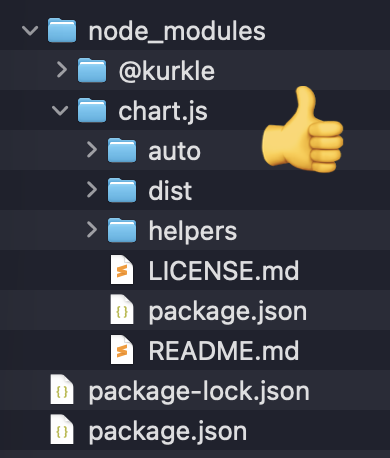
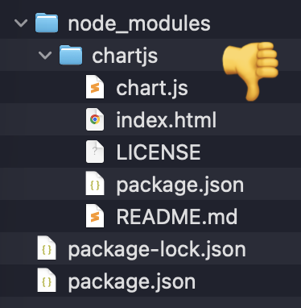
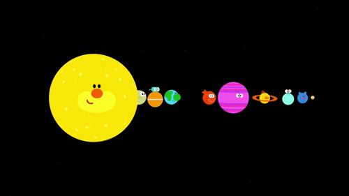

# Cours 11 | Diagrammes

Où en sommes nous dans la session :

* ✅ [Bootstrap](https://getbootstrap.com/)
* ✅ [Bootstrap-icons](https://icons.getbootstrap.com/)
* ✅ [Grid CSS](https://developer.mozilla.org/fr/docs/Web/CSS/Guides/Grid_layout)
* ✅ [AnimeJS](https://animejs.com/)
* [Diagrammes](https://www.chartjs.org/) (👈 aujourd'hui)
* [Cartes](https://openmaptiles.org/styles/) 
* [Tone.js](https://tonejs.github.io/)
* [typed.js](https://mattboldt.com/demos/typed-js/)
* [VFX-JS](https://amagi.dev/vfx-js/)
* [ZDog](https://codepen.io/desandro/pen/VJKxrV)
* [Classes JavaScript](https://developer.mozilla.org/fr/docs/Web/JavaScript/Reference/Classes)

## Chartjs

{.w-100}

[Chart.js](https://www.chartjs.org/) est une librairie qui permet d'ajouter des diagrammes dans une page Web. La librairie utilise la balise HTML [canvas](https://www.w3schools.com/html/html5_canvas.asp).

C'est une alternative moins complexe à [D3](https://d3js.org/).

### Installation

```bash title="Si ce n'est déjà fait"
npm init -y
```

```bash
npm i chart.js
```

!!! warning "Attention au nom du _package_"

    Il existe aussi le _package_ `chartjs`, mais ce n'est pas la bonne librairie.

    <div class="grid align-items-start" markdown>
    <div markdown>
    ```bash
    npm i chart.js
    ```
    {data-zoom-image}
    </div>
    <div markdown>
    ```bash
    npm i chartjs
    ```
    {data-zoom-image}
    </div>
    </div>


```html title="HTML"
<html>
  <head>

    <script type="importmap">
      {
        "imports": {
          "chart.js/auto": "./node_modules/chart.js/auto/auto.js",
          "@kurkle/color": "./node_modules/@kurkle/color/dist/color.esm.js"
        }
      }
    </script>

    <script type="module" src="chart.js"></script>

  </head>
  <body>

    <canvas id="mon-graphique"></canvas>

  </body>
</html>
```

```js title="chart.js"
import { Chart } from 'chart.js/auto';

let configurations = {
  type: "line",
  data: {
    // Données
  },
  options: {
    // Affichage
  }
};

const contexte = document.querySelector('#mon-graphique').getContext("2d");
new Chart(contexte, configurations);
```

Dans chaque graphique, il y a un `type`, des données (`data`), des `options` d'affichage et, optionnellement, des `plugins`.

* Code minimal : <https://codepen.io/tim-momo/pen/JoXoOaX>
* Plus d'options : <https://codepen.io/tim-momo/pen/LEGwPay>

### Graphique à barres

<iframe class="aspect-16-9" height="300" style="width: 100%;" scrolling="no" title="Chart.js - Graphique à barres" src="https://codepen.io/tim-momo/embed/xbZvGYZ/804b32ee346a210ef7f556e88cc67552?default-tab=result&editable=true&theme-id=50173" frameborder="no" loading="lazy" allowtransparency="true">
      See the Pen <a href="https://codepen.io/tim-momo/pen/xbZvGYZ/804b32ee346a210ef7f556e88cc67552">
  Chart.js - Graphique à barres</a> by TIM Montmorency (<a href="https://codepen.io/tim-momo">@tim-momo</a>)
  on <a href="https://codepen.io">CodePen</a>.
      </iframe>

<iframe class="aspect-16-9" height="300" style="width: 100%;" scrolling="no" title="Chart.js - Bar PUBLIC" src="https://codepen.io/tim-momo/embed/YPqPrEm?default-tab=result&editable=true&theme-id=50173" frameborder="no" loading="lazy" allowtransparency="true">
      See the Pen <a href="https://codepen.io/tim-momo/pen/YPqPrEm">
  Chart.js - Bar PUBLIC</a> by TIM Montmorency (<a href="https://codepen.io/tim-momo">@tim-momo</a>)
  on <a href="https://codepen.io">CodePen</a>.
      </iframe>

### Graphique en lignes

<iframe class="aspect-16-9" height="300" style="width: 100%;" scrolling="no" title="Chart.js - Graphique en lignes / aires" src="https://codepen.io/tim-momo/embed/QwyebOZ/b2f48efe1b8d0339bf3fd1b260aca76b?default-tab=result&editable=true&theme-id=50173" frameborder="no" loading="lazy" allowtransparency="true">
      See the Pen <a href="https://codepen.io/tim-momo/pen/QwyebOZ/b2f48efe1b8d0339bf3fd1b260aca76b">
  Chart.js - Graphique en lignes / aires</a> by TIM Montmorency (<a href="https://codepen.io/tim-momo">@tim-momo</a>)
  on <a href="https://codepen.io">CodePen</a>.
      </iframe>

### Graphique en nuage de points

<iframe class="aspect-16-9" height="300" style="width: 100%;" scrolling="no" title="Chart.js - Graphique en lignes / aires PUBLIC" src="https://codepen.io/tim-momo/embed/pvgMJLY/f07f51c3e9f19805e6a642bd73bd284a?default-tab=result&editable=true&theme-id=50173" frameborder="no" loading="lazy" allowtransparency="true">
      See the Pen <a href="https://codepen.io/tim-momo/pen/pvgMJLY/f07f51c3e9f19805e6a642bd73bd284a">
  Chart.js - Graphique en lignes / aires PUBLIC</a> by TIM Montmorency (<a href="https://codepen.io/tim-momo">@tim-momo</a>)
  on <a href="https://codepen.io">CodePen</a>.
      </iframe>


### Graphique à bulles

<iframe class="aspect-16-9" height="300" style="width: 100%;" scrolling="no" title="Chart.js - Bubble PUBLIC" src="https://codepen.io/tim-momo/embed/MYKNwBN/34be0f9d328382009b28b8f28306e6d3?default-tab=result&editable=true&theme-id=50173" frameborder="no" loading="lazy" allowtransparency="true">
      See the Pen <a href="https://codepen.io/tim-momo/pen/MYKNwBN/34be0f9d328382009b28b8f28306e6d3">
  Chart.js - Bubble PUBLIC</a> by TIM Montmorency (<a href="https://codepen.io/tim-momo">@tim-momo</a>)
  on <a href="https://codepen.io">CodePen</a>.
      </iframe>


### Graphiques en anneau et tarte

<iframe class="aspect-16-9" height="300" style="width: 100%;" scrolling="no" title="Chart.js - Bubble PUBLIC" src="https://codepen.io/tim-momo/embed/EaPqjJy/2a89cdfeb83ba743007f331017243501?default-tab=result&editable=true&theme-id=50173" frameborder="no" loading="lazy" allowtransparency="true">
      See the Pen <a href="https://codepen.io/tim-momo/pen/EaPqjJy/2a89cdfeb83ba743007f331017243501">
  Chart.js - Bubble PUBLIC</a> by TIM Montmorency (<a href="https://codepen.io/tim-momo">@tim-momo</a>)
  on <a href="https://codepen.io">CodePen</a>.
      </iframe>

### Graphique polaire

<iframe class="aspect-16-9" height="300" style="width: 100%;" scrolling="no" title="Chart.js - Radar PUBLIC" src="https://codepen.io/tim-momo/embed/GgoVpOP/a6473a11da466a08325b20f0f544e43e?default-tab=result&editable=true&theme-id=50173" frameborder="no" loading="lazy" allowtransparency="true">
      See the Pen <a href="https://codepen.io/tim-momo/pen/GgoVpOP/a6473a11da466a08325b20f0f544e43e">
  Chart.js - Radar PUBLIC</a> by TIM Montmorency (<a href="https://codepen.io/tim-momo">@tim-momo</a>)
  on <a href="https://codepen.io">CodePen</a>.
      </iframe>

### Graphique radar

<iframe class="aspect-16-9" height="300" style="width: 100%;" scrolling="no" title="Chart.js - Donut PUBLIC" src="https://codepen.io/tim-momo/embed/ByjXoRE/51f153a531463c8bee9ee2db86c51c90?default-tab=result&editable=true&theme-id=50173" frameborder="no" loading="lazy" allowtransparency="true">
      See the Pen <a href="https://codepen.io/tim-momo/pen/ByjXoRE/51f153a531463c8bee9ee2db86c51c90">
  Chart.js - Donut PUBLIC</a> by TIM Montmorency (<a href="https://codepen.io/tim-momo">@tim-momo</a>)
  on <a href="https://codepen.io">CodePen</a>.
      </iframe>

### Animation

<iframe class="aspect-16-9" height="300" style="width: 100%;" scrolling="no" title="Chart.js - Lines animation random" src="https://codepen.io/tim-momo/embed/vELoVYL/1ec05d5b4234a030852d21f858e65b2f?default-tab=result&editable=true&theme-id=50173" frameborder="no" loading="lazy" allowtransparency="true">
      See the Pen <a href="https://codepen.io/tim-momo/pen/vELoVYL/1ec05d5b4234a030852d21f858e65b2f">
  Chart.js - Lines animation random</a> by TIM Montmorency (<a href="https://codepen.io/tim-momo">@tim-momo</a>)
  on <a href="https://codepen.io">CodePen</a>.
      </iframe>

1. Ajouter le graphique dans une variable pour le rendre accessible.
1. Ensuite, pour chaque dataset du graphique, on peut appliquer des valeurs différentes sur chacun des axes.
1. Enfin, la méthode `update()` permet d'appliquer le changement et l'animation s'appliquera.

L'animation peut se faire de 2 façons. Soit par une action, soit automatiquement. Dans le deux cas, c'est le même principe.

```js title="Événement"
document.body.addEventListener("click", () => {

  for (const ds of graphique.data.datasets) {
    for (let i = 0; i < ds.data.length; i++) {
      ds.data[i].y = Math.round(Math.random() * 2000);
    }
  }
  graphique.update();

});
```

```js title="Temps"
setInterval(() => {

  for (let ds of graphique.data.datasets) {
    for (let i = 0; i < ds.data.length; i++) {
      ds.data[i].y = Math.round(Math.random() * 2000);
    }
  }
  graphique.update();
  
}, 500);
```

Au lieu d'un interval JavaScript, on peut aussi utilise un callback d'AnimeJS.

!!! note "Vitesse d'animation" 

    Dans les options d'un graphique, on peut aussi ajuster la durée de l'animation.

    ```js
    options: {
      animation: {
        duration: 10000,
        easing: 'easeIn'
      },
    }
    ```

    Les options de lissage chart.js sont spécifiées ici : <https://www.chartjs.org/docs/latest/configuration/animations.html#easing>.

### Dégradé de couleurs 

<iframe height="300" style="width: 100%;" scrolling="no" title="Chart.js - Gradient" src="https://codepen.io/tim-momo/embed/pvgMBgR?default-tab=result&editable=true&theme-id=50173" frameborder="no" loading="lazy" allowtransparency="true">
      See the Pen <a href="https://codepen.io/tim-momo/pen/pvgMBgR">
  Chart.js - Gradient</a> by TIM Montmorency (<a href="https://codepen.io/tim-momo">@tim-momo</a>)
  on <a href="https://codepen.io">CodePen</a>.
      </iframe>

```js title="Exemple"
const ctx2d = document.querySelector("#chart123").getContext("2d");
const chart123 = new Chart(ctx2d, {
  type: "line",
  data: {
    datasets: [
      {
        data: [{x: 1, y: 2}, {x: 2, y: 4}, {x: 3 y: 6}],
        fill: true,
        borderColor: "rgba(239, 85, 82, 1)",

        // 👇 Inspiré de : https://www.chartjs.org/docs/latest/samples/advanced/radial-gradient.html
        backgroundColor: (ctx) => {
          const { ctx: c, chartArea } = ctx.chart;
          if (!chartArea) return;
          const g = c.createLinearGradient(0, chartArea.top, 0, chartArea.bottom);
          g.addColorStop(0, "rgba(239, 85, 82, 0.25)");
          g.addColorStop(1, "rgba(239, 85, 82, 0)");
          return g;
        }

      }
    ]
  },
  options: {
    //...
  }
});
```

## Snippets du jour

<iframe height="300" style="width: 100%;" scrolling="no" title="AnimeJS - Cercle animé" src="https://codepen.io/tim-momo/embed/EaKxoob?default-tab=result&editable=true&theme-id=50210" frameborder="no" loading="lazy" allowtransparency="true">
      See the Pen <a href="https://codepen.io/tim-momo/pen/EaKxoob">
  AnimeJS - Cercle animé</a> by TIM Montmorency (<a href="https://codepen.io/tim-momo">@tim-momo</a>)
  on <a href="https://codepen.io">CodePen</a>.
      </iframe>

<iframe height="300" style="width: 100%;" scrolling="no" title="AnimeJS - textContent !" src="https://codepen.io/tim-momo/embed/WbwNLbq/bd60bb374e06b89f9e09f94d740123c5?default-tab=result&editable=true&theme-id=50210" frameborder="no" loading="lazy" allowtransparency="true">
      See the Pen <a href="https://codepen.io/tim-momo/pen/WbwNLbq/bd60bb374e06b89f9e09f94d740123c5">
  AnimeJS - textContent !</a> by TIM Montmorency (<a href="https://codepen.io/tim-momo">@tim-momo</a>)
  on <a href="https://codepen.io">CodePen</a>.
      </iframe>

## Exercice

<div class="grid grid-1-2" markdown>
  

  <small>Exercice - ChartJS</small><br>
  **[Révolution sidérale](./exercices/planetes/index.md){.stretched-link .back}**
</div>

## TP2

<div class="grid grid-1-2" markdown>
  

  <small>TP</small><br>
  **[HUD](./tp/hud/index.md){.stretched-link .back}**
</div>
