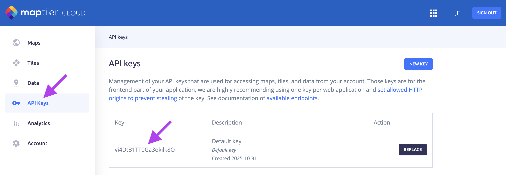
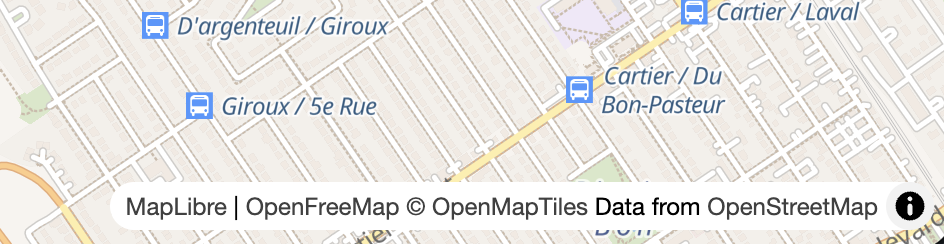

# Cours 12

## Cartes

{.w-100}

[MapLibre](https://maplibre.org/) permet d'afficher une carte géographique sur une page Web. Contairement à [Leaflet](https://leafletjs.com/), elle est plus lourde, mais elle permet d'afficher du 3D et des cartes en vectoriel ! Elle a également une tonne d'[exemples concrets](https://maplibre.org/maplibre-gl-js/docs/examples/) pour tous les cas de figure.

### Installation

L'installation d'une librairie de carte ne se fait quasiment jamais sans internet. Il y aurait beaucoup trop de données à enregistrer localement. C'est pourquoi, il est recommandé d'utiliser un CDN pour cette partie.

```html title="index.html"
<html>
  <head>
    
    <link
      rel="stylesheet"
      href="./node_modules/maplibre-gl/dist/maplibre-gl.css"
    />
    <link rel="stylesheet" href="./src/css/styles.css">
    
    <script type="importmap">
      {
        "imports": {
          "maplibre-gl": "https://esm.sh/maplibre-gl@5.13.0"
        }
      }
    </script>
    <script type="module" src="./src/js/map.js"></script>
    
  </head>
  <body>

    <div id="carte"></div>

  </body>
</html>
```

```css title="styles.css"
#carte {
  width: 90vw;
  height: 90vh;
}
```

```js title="map.js (L'exemple le plus simple)"
import maplibregl from "maplibre-gl";

const carte = new maplibregl.Map({
  container: "carte", // id du div
  style: "https://tiles.openfreemap.org/styles/bright",
  center: [-73.8462195, 45.6125882], // Laval
  zoom: 9 // Plus c'est bas, plus c'est haut
});
```

<iframe height="300" style="width: 100%;" scrolling="no" title="MapLibre - Simple" src="https://codepen.io/tim-momo/embed/MYybMXw?default-tab=result&editable=true&theme-id=50173" frameborder="no" loading="lazy" allowtransparency="true">
      See the Pen <a href="https://codepen.io/tim-momo/pen/MYybMXw">
  MapLibre - Simple</a> by TIM Montmorency (<a href="https://codepen.io/tim-momo">@tim-momo</a>)
  on <a href="https://codepen.io">CodePen</a>.
      </iframe>

### Option `center`

{.w-100}

La propriété `center` contient un tableau des coordonnées géographiques : `[longitude, latitude]`.

```js
import maplibregl from "maplibre-gl";

const carte = new maplibregl.Map({
  // ...
  center: [-73.8462195, 45.6125882], // Laval
});
```

!!! question "Comment savoir ?"

    Pour trouver des coordonnées, le plus simple est de passer par une URL Google Maps. 
    
    ⚠️ Attention, les coordonnées dans maplibre sont inversés.

    {data-zoom-image .w-50}

### Option `style`

{.w-100}

La propriété `style` déterminer les couleurs utilisées sur la carte.

```js
import maplibregl from "maplibre-gl";

const carte = new maplibregl.Map({
  // ...
  // style: "https://tiles.openfreemap.org/styles/bright",
  // style: "https://tiles.openfreemap.org/styles/positron",
  // style: "https://api.maptiler.com/maps/toner-v2/style.json?key=[VOTRE_CLÉ_D'API]",
  // style: "https://api.maptiler.com/maps/hybrid/style.json?key=[VOTRE_CLÉ_D'API]",
  style: "https://tiles.stadiamaps.com/styles/alidade_smooth_dark.json"
});
```

!!! example "Sources"

    Vous contaterez dans l'exemple ci-dessus que les styles proviennent de différentes sources.

    [Maptiler](https://www.maptiler.com/fr/) nécessite la création d'un compte développeur. C'est gratuit pour un usage personnel. Une fois le compte créé, vous aurez accès à une clé d'API qui sera nécessaire à ajouter dans l'adresse URL du style.

    {data-zoom-image .w-50}

    [openfreemap](https://openfreemap.org/) offre gratuitement 4 styles de carte.

    [StadiaMaps](https://stadiamaps.com/explore-the-map/#map=7%2F52.3%2F0&style=alidade_smooth_dark) nécessite en principe une connexion, mais ils tolèrent pour le moment qu'on utilise leur style comme dans l'exemple ci-dessus.

    > Je ne serais pas surpris que le collège soit bloqué éventuellement ;)

!!! question "Télécharger un carte en local. C'est possible ?"

    🧐 Admettons que tu télécharges la carte pour la planète au complet (si veut te promener sur le globe), on parle ici d'un fichier compessé d'environ 100 Go. Décompressé ça fait [≈2 To](https://wiki.openstreetmap.org/wiki/Planet.osm).
    
    Donc oui, mais pas vraiment, non 🙃

### Option `attributionControl`

{.w-50 data-zoom-image}

```js
import maplibregl from "maplibre-gl";

const carte = new maplibregl.Map({
  // ...
  attributionControl: false // 👈 Retrait des crédits
});
```

### Ajout des contrôles

{.w-25 data-zoom-image}

```js
import maplibregl from "maplibre-gl";

const carte = new maplibregl.Map({ /* ... */ });

// 👇 Ajout des contrôles
carte.addControl(new maplibregl.NavigationControl());
```

### Options de déplacement

#### zoom

Plus le zoom est petit, plus la caméra va vers l'espace.

Entre 0 et ~22

#### pitch

{.h-auto .w-50}

Contrairement à la perspective "top down", le `pitch` donne un angle à la caméra. 

Valeur permise : entre 0 et 60

#### bearing

{.h-auto .w-50}

La propriété bearing sert à tourner autour du point de vue.

Valeur permise : entre -180 et 180

!!! example "Debug"

    Pour avoir des informations sur l'état du `zoom`, du `pitch`, du `bearing` et même du `center`, on peut ajouter ce code à notre script : 

    ```js
    import maplibregl from "maplibre-gl";

    const carte = new maplibregl.Map({ /* ... */ });

    // 👇 Debug
    carte.on("moveend", () => {
      const center = carte.getCenter();
      const zoom = carte.getZoom();
      const pitch = carte.getPitch();
      const bearing = carte.getBearing();
      console.log(`center: [${center.lng.toFixed(7)}, ${center.lat.toFixed(7)}],`);
      console.log(`zoom: ${zoom.toFixed(1)},`);
      console.log(`pitch: ${pitch.toFixed(0)},`);
      console.log(`bearing: ${bearing.toFixed(1)}`);
      console.log("---");
    });
    ```

### Option `interactive`
  
La propriété `interactive` permet à l'utilisateur de contrôler la carte.

```js
import maplibregl from "maplibre-gl";

const carte = new maplibregl.Map({
  // ...
  interactive: false // 👈 Aucune interactivité possible
});
```  

### Afficher en globe

<iframe class="aspect-4-3" height="300" style="width: 100%;" scrolling="no" title="MapLibre - 3d rotate" src="https://codepen.io/tim-momo/embed/NPNdWXo/f50bbe6eb614eb258261c27f194e0272?default-tab=result&editable=true&theme-id=50173" frameborder="no" loading="lazy" allowtransparency="true">
      See the Pen <a href="https://codepen.io/tim-momo/pen/NPNdWXo/f50bbe6eb614eb258261c27f194e0272">
  MapLibre - 3d rotate</a> by TIM Montmorency (<a href="https://codepen.io/tim-momo">@tim-momo</a>)
  on <a href="https://codepen.io">CodePen</a>.
      </iframe>

```js
import maplibregl from "maplibre-gl";

const carte = new maplibregl.Map({ /* ... */ });

// 👇 Afficher en globe
carte.on('style.load', () => {
    carte.setProjection({ type: 'globe' });
});
```

### Bâtiments en 3D

<iframe class="aspect-4-3" height="300" style="width: 100%;" scrolling="no" title="MapLibre - Rotate" src="https://codepen.io/tim-momo/embed/ZYWLKyj/5ba569ca611d6d38a00c43a5becd0064?default-tab=result&editable=true&theme-id=50173" frameborder="no" loading="lazy" allowtransparency="true">
      See the Pen <a href="https://codepen.io/tim-momo/pen/ZYWLKyj/5ba569ca611d6d38a00c43a5becd0064">
  MapLibre - Rotate</a> by TIM Montmorency (<a href="https://codepen.io/tim-momo">@tim-momo</a>)
  on <a href="https://codepen.io">CodePen</a>.
      </iframe>


### Flyto

<iframe height="300" style="width: 100%;" scrolling="no" title="MapLibre - Fly" src="https://codepen.io/tim-momo/embed/gbrgdEY?default-tab=result&editable=true&theme-id=50173" frameborder="no" loading="lazy" allowtransparency="true">
      See the Pen <a href="https://codepen.io/tim-momo/pen/gbrgdEY">
  MapLibre - Fly</a> by TIM Montmorency (<a href="https://codepen.io/tim-momo">@tim-momo</a>)
  on <a href="https://codepen.io">CodePen</a>.
      </iframe>

```js
import maplibregl from "maplibre-gl";

const carte = new maplibregl.Map({ /* ... */ });

// On active le flyto à un event, peu importe lequel
document.body.addEventListener("click", () => {

  carte.flyTo({
    center: [-115.8819462, 37.2513459],
    zoom: 15,      // Facultatif
    duration: 3000 // Facultatif
  });

});
```

### Marker

<iframe height="300" style="width: 100%;" scrolling="no" title="MapLibre - Simple" src="https://codepen.io/tim-momo/embed/QwNdZVa?default-tab=result&editable=true&theme-id=50173" frameborder="no" loading="lazy" allowtransparency="true">
      See the Pen <a href="https://codepen.io/tim-momo/pen/QwNdZVa">
  MapLibre - Simple</a> by TIM Montmorency (<a href="https://codepen.io/tim-momo">@tim-momo</a>)
  on <a href="https://codepen.io">CodePen</a>.
      </iframe>

```js
import maplibregl from "maplibre-gl";

const carte = new maplibregl.Map({ /* ... */ });

new maplibregl.Marker().setLngLat([31.2356245, 30.0444168]).addTo(carte);
```

## VFX-JS

{.w-100}

[VFX-JS](https://amagi.dev/vfx-js/) permet d'appliquer des shaders aux éléments HTML d'une page.

### Installation

Le package ne vient pas en esm, alors nous devrons fonctionner via un CDN.

```html title="index.html"
<html>
  <head>
    <script type="importmap">
      {
        "imports": {
          "vfx-js": "https://esm.sh/@vfx-js/core"
        }
      }
    </script>
    <script type="module" src="./src/js/vfx.js"></script>
  </head>
  <body>
    <p class="trop-coooooool">glitch</p>
  </body>
</html>
```

Il y a une série de _[presets](https://codepen.io/fand/pen/dyBbVRG?editors=0010)_ offert par la librairie, en voici quelques uns.

### Glitch

<iframe class="aspect-4-3" height="300" style="width: 100%;" scrolling="no" title="VFX-JS - Glitch" src="https://codepen.io/tim-momo/embed/yyOgjPa?default-tab=result&editable=true&theme-id=50173" frameborder="no" loading="lazy" allowtransparency="true">
      See the Pen <a href="https://codepen.io/tim-momo/pen/yyOgjPa">
  VFX-JS - Glitch</a> by TIM Montmorency (<a href="https://codepen.io/tim-momo">@tim-momo</a>)
  on <a href="https://codepen.io">CodePen</a>.
      </iframe>

```js title="vfx.js"
import { VFX } from "vfx-js";

const vfx = new VFX();

const el = document.querySelector(".trop-coooooool");
vfx.add(el, {
  shader: "glitch",
  overflow: 30
});
```

### rgbShift

<iframe class="aspect-4-3" height="300" style="width: 100%;" scrolling="no" title="VFX-JS - rgbShift" src="https://codepen.io/tim-momo/embed/qEZRYLM?default-tab=result&editable=true&theme-id=50173" frameborder="no" loading="lazy" allowtransparency="true">
      See the Pen <a href="https://codepen.io/tim-momo/pen/qEZRYLM">
  VFX-JS - rgbShift</a> by TIM Montmorency (<a href="https://codepen.io/tim-momo">@tim-momo</a>)
  on <a href="https://codepen.io">CodePen</a>.
      </iframe>

```js title="vfx.js"
import { VFX } from "vfx-js";

const vfx = new VFX();

const el = document.querySelector(".trop-coooooool");
vfx.add(el, {
  shader: "rgbShift",
  overflow: 30
});
```

### sinewave

<iframe class="aspect-4-3" height="300" style="width: 100%;" scrolling="no" title="VFX-JS - rgbShift" src="https://codepen.io/tim-momo/embed/OPNWZdP?default-tab=result&editable=true&theme-id=50173" frameborder="no" loading="lazy" allowtransparency="true">
      See the Pen <a href="https://codepen.io/tim-momo/pen/OPNWZdP">
  VFX-JS - sinewave</a> by TIM Montmorency (<a href="https://codepen.io/tim-momo">@tim-momo</a>)
  on <a href="https://codepen.io">CodePen</a>.
      </iframe>

```js title="vfx.js"
import { VFX } from "vfx-js";

const vfx = new VFX();

const el = document.querySelector(".trop-coooooool");
vfx.add(el, {
  shader: "sinewave",
  overflow: 30
});
```

### pixelate

<iframe class="aspect-4-3" height="300" style="width: 100%;" scrolling="no" title="VFX-JS - sinewave" src="https://codepen.io/tim-momo/embed/bNpgjyZ?default-tab=result&editable=true&theme-id=50173" frameborder="no" loading="lazy" allowtransparency="true">
      See the Pen <a href="https://codepen.io/tim-momo/pen/bNpgjyZ">
  VFX-JS - sinewave</a> by TIM Montmorency (<a href="https://codepen.io/tim-momo">@tim-momo</a>)
  on <a href="https://codepen.io">CodePen</a>.
      </iframe>

```js title="vfx.js"
import { VFX } from "vfx-js";

const vfx = new VFX();

const el = document.querySelector(".trop-coooooool");
vfx.add(el, {
  shader: "pixelate"
});
```

## Snippets du jour

### Modèle 3D

<iframe class="aspect-4-3" height="300" style="width: 100%;" scrolling="no" title="MapLibre - Bâtiments 3D" src="https://codepen.io/tim-momo/embed/bNpgaPe/7a83c269633d18a06320f887cc5d5eb8?default-tab=result&editable=true&theme-id=50173" frameborder="no" loading="lazy" allowtransparency="true">
      See the Pen <a href="https://codepen.io/tim-momo/pen/bNpgaPe/7a83c269633d18a06320f887cc5d5eb8">
  MapLibre - Bâtiments 3D</a> by TIM Montmorency (<a href="https://codepen.io/tim-momo">@tim-momo</a>)
  on <a href="https://codepen.io">CodePen</a>.
      </iframe>

Pour appliquer cet effet à votre projet : 

1. Téléchargez le [code source](./assets/documents/three.zip){ download }
1. Effectuez un `npm install` pour installer la librairie `three` (Pour afficher un modèle 3D)
   > Pour installer la librairie three, normalement on doit faire un `npm i three`
1. Exportez votre modèle 3d en `.obj` dans le dossier `assets/models`
1. Changez le chemin de la variable `modelSource` dans le fichier `scripts.js`

## Exercice

<div class="grid grid-1-2" markdown>
  

  <small>Exercice - MapLibre</small><br> 
  **[Casa](./exercices/casa/index.md){.stretched-link .back}**
</div>

## TP2

<div class="grid grid-1-2" markdown>
  

  <small>TP</small><br>
  **[HUD](./tp/hud/index.md){.stretched-link .back}**
</div>
