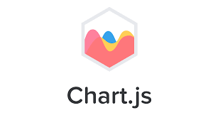
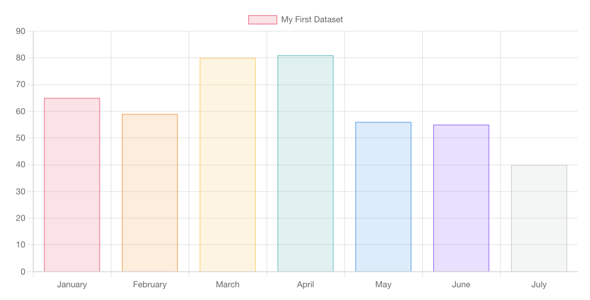
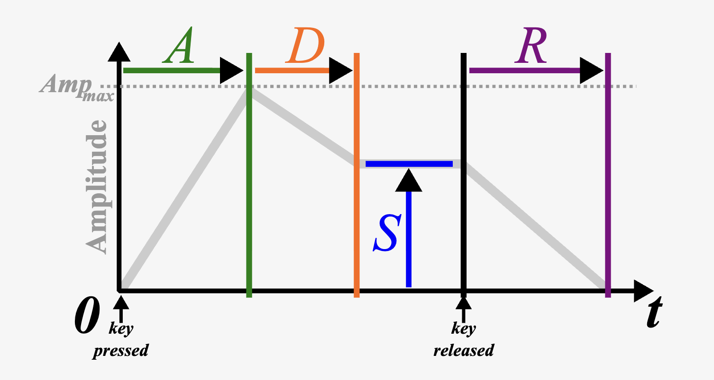
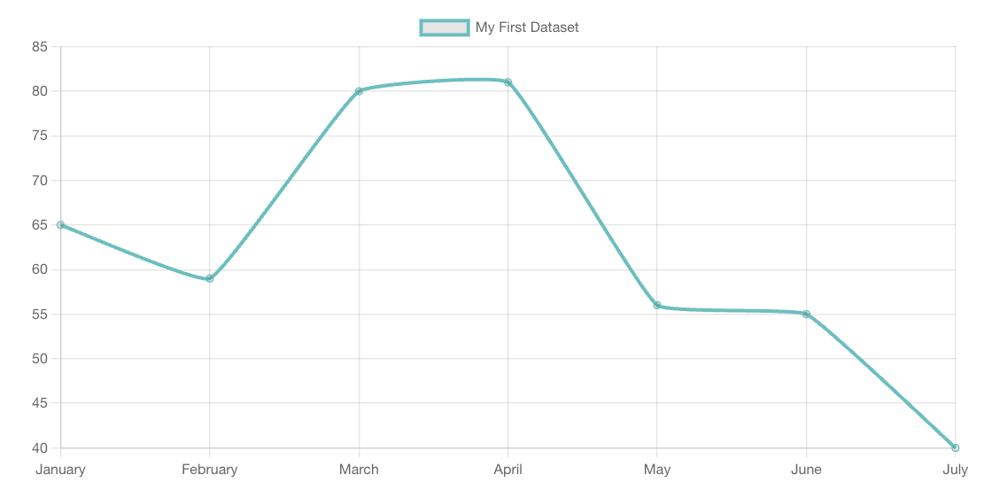
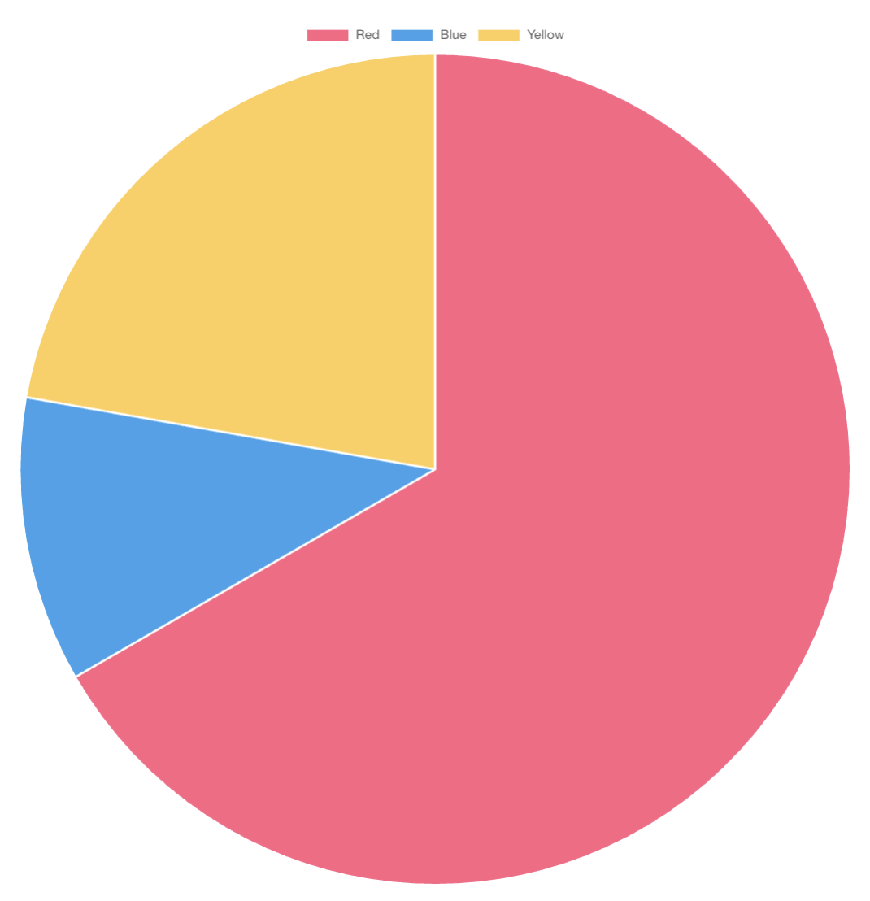
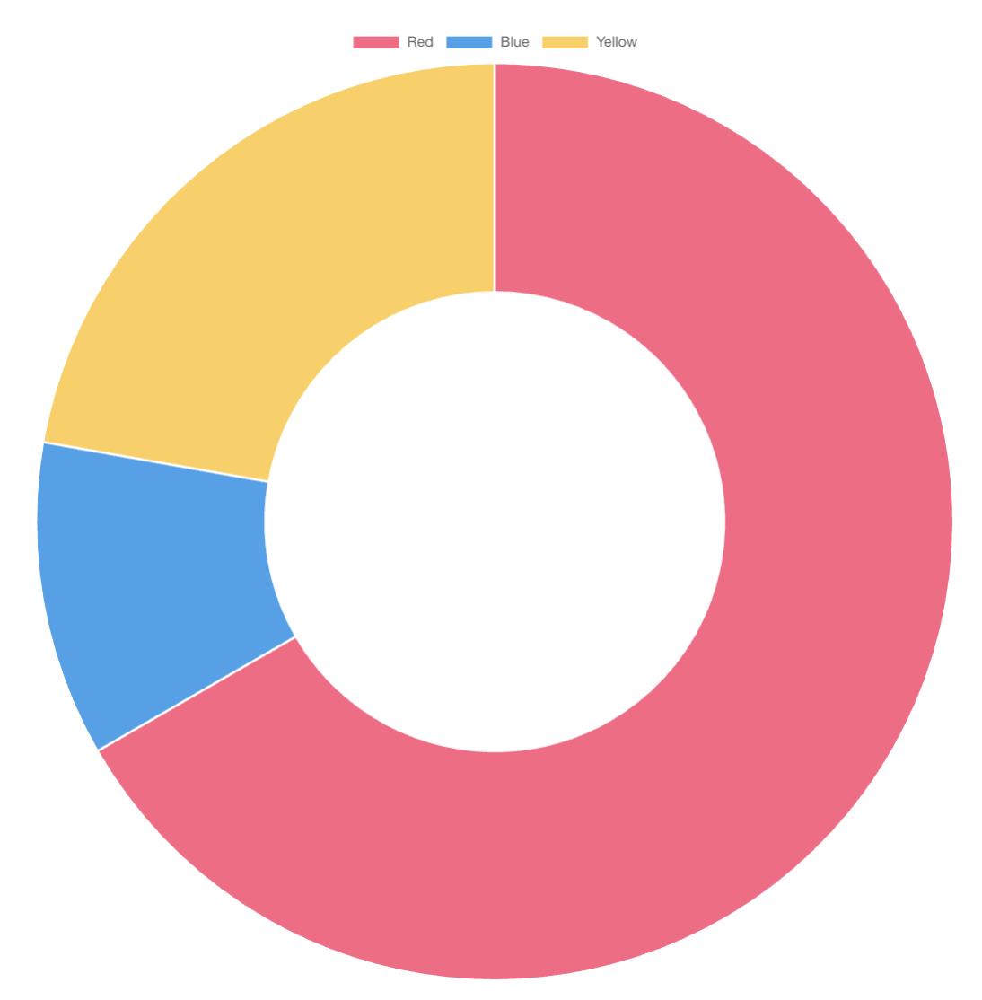
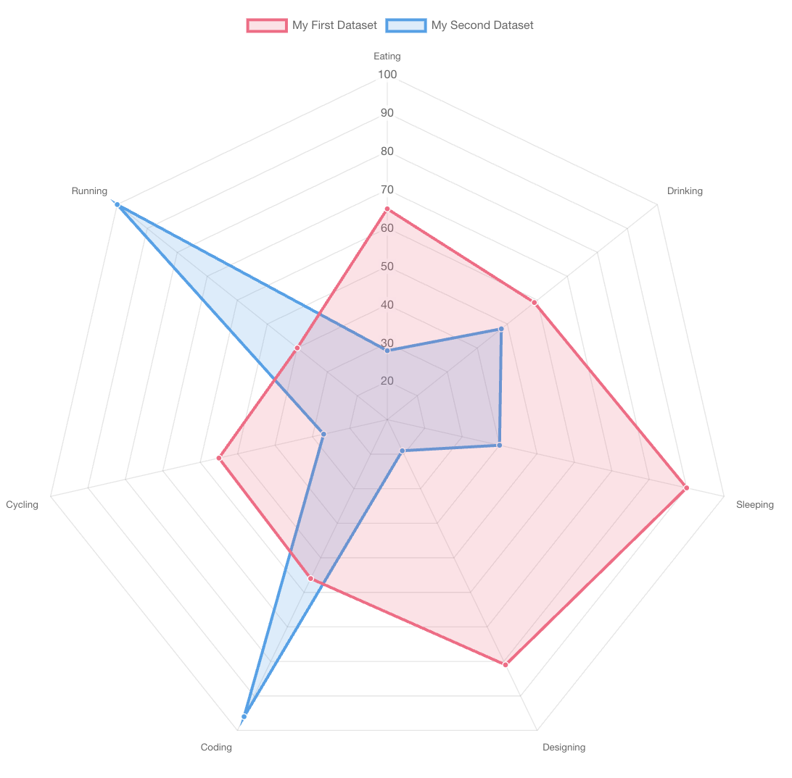
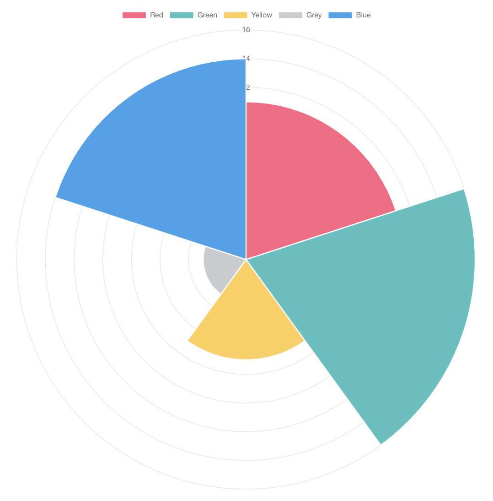
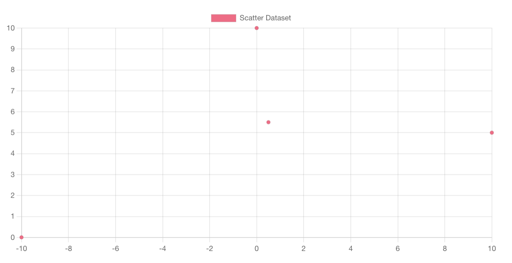
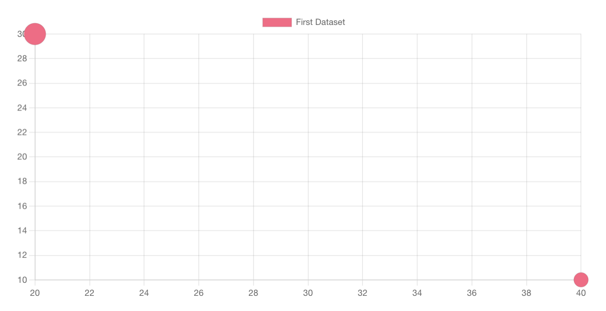

# Cours 12 | Autres librairies

[STOP]

<!-- **Savoirs :** #15 Interactivité · #16 Animation/visualisation via librairie -->

*[CDN]: Content Delivery Network
*[npm]: Node Package Manager
*[API]: Application Programming Interface

{.w-100}

L'écosystème JavaScript regorge de **librairies** spécialisées&nbsp;: on n'a pas à tout coder soi-même. Aujourd'hui, on en explore deux, très utiles pour votre site de jeu&nbsp;:

<div class="grid grid-1-4" markdown>
  {.aspect-4-3 .w-100}

  :material-chart-bar: **Chart.js** - des graphiques (ex.&nbsp;: stats du jeu)
</div>

<div class="grid grid-1-4" markdown>
  {.aspect-4-3 .w-100}

  :material-music: **Tone.js** - du son et de la musique
</div>

…et un **bonus optionnel** en fin de cours&nbsp;: **Three.js** pour un aperçu de la 3D.

!!! note "Encore des librairies"

    Comme GSAP, ces outils sont des **librairies**&nbsp;: *vous* les appelez avec des fonctions (`new Chart(...)`, `new Tone.Synth(...)`). La démarche est toujours la même&nbsp;: **installer**, **préparer un conteneur** (si nécessaire), puis **appeler** la librairie en JavaScript.

---

# Partie 1 - Chart.js

**[Chart.js](https://www.chartjs.org/)** transforme des données en **graphiques** clairs et animés, dessinés dans une balise `<canvas>`. C'est la librairie de visualisation la plus populaire&nbsp;: simple, responsive et gratuite.

## Installation

=== ":material-flash: CDN (rapide)"

    ```html
    <script src="https://cdn.jsdelivr.net/npm/chart.js"></script>
    ```

=== ":simple-vite: npm (projet Vite)"

    ```bash
    npm install chart.js
    ```

    ```js title="src/main.js"
    import Chart from 'chart.js/auto'
    ```

    !!! note "`chart.js/auto`"

        L'import `chart.js/auto` enregistre automatiquement tous les types de graphiques. Pratique pour apprendre&nbsp;; en production, on peut n'importer que ce qu'on utilise pour alléger le _build_.

## Un conteneur `<canvas>`

Chart.js **dessine** le graphique&nbsp;; il lui faut donc une toile. On lui réserve un `<canvas>` avec un identifiant.

```html
<canvas id="monGraphique"></canvas>
```

## Premier graphique

On crée une instance avec `new Chart(cible, configuration)`. La configuration est un objet à trois clés&nbsp;: **`type`**, **`data`** et **`options`**.

```js
const ctx = document.querySelector("#monGraphique")

new Chart(ctx, {
  type: "bar",                       // 1. le type de graphique
  data: {                            // 2. les données
    labels: ["Lun", "Mar", "Mer", "Jeu", "Ven"],
    datasets: [{
      label: "Ventes",
      data: [12, 19, 7, 15, 22]
    }]
  },
  options: {                         // 3. les réglages
    responsive: true
  }
})
```

<!-- CODEPEN: premier graphique Chart.js (barres) -->

### Anatomie des données

C'est le cœur de Chart.js. Deux notions&nbsp;:

| Clé | Rôle |
| :--- | :--- |
| `labels` | Les étiquettes de l'axe (ex.&nbsp;: les jours) |
| `datasets` | Un ou plusieurs **jeux de données** à tracer |
| `datasets[].label` | Le nom du jeu (affiché dans la légende) |
| `datasets[].data` | Les valeurs, **alignées** sur les `labels` |

!!! warning "Aligner `data` et `labels`"

    Le tableau `data` doit avoir **autant de valeurs** que `labels` a d'étiquettes. 5 jours → 5 valeurs. Sinon, le graphique sera décalé ou incomplet.

## Les types de graphiques

Il suffit de changer la clé `type` pour obtenir un rendu complètement différent&nbsp;:

<div class="grid" markdown>
<figure markdown>
{data-zoom-image}
<figcaption>`bar`</figcaption>
</figure>
<figure markdown>
{data-zoom-image}
<figcaption>`line`</figcaption>
</figure>
<figure markdown>
{data-zoom-image}
<figcaption>`pie`</figcaption>
</figure>
<figure markdown>
{data-zoom-image}
<figcaption>`doughnut`</figcaption>
</figure>
<figure markdown>
{data-zoom-image}
<figcaption>`radar`</figcaption>
</figure>
<figure markdown>
{data-zoom-image}
<figcaption>`polarArea`</figcaption>
</figure>
<figure markdown>
{data-zoom-image}
<figcaption>`scatter`</figcaption>
</figure>
<figure markdown>
{data-zoom-image}
<figcaption>`bubble`</figcaption>
</figure>
</div>

## Quelques options utiles

Les `options` personnalisent le comportement et l'apparence. Toutes sont dans la [documentation](https://www.chartjs.org/docs/latest/).

```js
options: {
  responsive: true,
  plugins: {
    legend: { position: "top" },
    title: { display: true, text: "Ventes de la semaine" }
  },
  scales: {
    y: { beginAtZero: true }
  }
}
```

| Option | Effet |
| :--- | :--- |
| `responsive: true` | Le graphique s'adapte à la taille de son conteneur |
| `plugins.legend` | Position/affichage de la légende |
| `plugins.title` | Titre du graphique |
| `scales.y.beginAtZero` | Force l'axe vertical à démarrer à 0 |

!!! tip "Responsive : encadrez le canvas"

    Pour maîtriser la taille, placez le `<canvas>` dans une `<div>` conteneur de dimensions fixes (ex.&nbsp;: `class="w-full max-w-xl"`) plutôt que de dimensionner le canvas directement.

<!-- CODEPEN: changer le type et les options d'un même jeu de données -->

## Exercice - Chart.js

<!-- À COMPLÉTER : carte d'exercice Chart.js (dossier activite/chartjs à créer). -->

- [ ] Créez une page qui affiche **deux graphiques** de types différents à partir des mêmes données.
- [ ] Ajoutez un titre, une légende et des couleurs personnalisées à chaque jeu de données.

---

# Partie 2 - Tone.js

{data-zoom-image .w-75}

**[Tone.js](https://tonejs.github.io/)** est un cadre audio pour **créer du son et de la musique** dans le navigateur. Pour un site de jeu, c'est parfait&nbsp;: une ambiance sonore, un thème musical, ou des effets aux interactions.

## Installation

=== ":material-flash: CDN (rapide)"

    ```html
    <script src="https://unpkg.com/tone"></script>
    ```

=== ":simple-vite: npm (projet Vite)"

    ```bash
    npm install tone
    ```

    ```js title="src/main.js"
    import * as Tone from "tone"
    ```

!!! danger "Le son exige un clic d'abord"

    Les navigateurs **bloquent** tout son tant que l'utilisateur n'a pas interagi avec la page. Il faut donc appeler **`Tone.start()`** depuis un événement déclenché par l'utilisateur (un clic), sinon&nbsp;: silence.

    ```js
    document.querySelector("#demarrer").addEventListener("click", async () => {
      await Tone.start()   // débloque l'audio
      // … le son peut jouer maintenant …
    })
    ```

## Jouer une note

L'objet de base est le **synthétiseur**. On le crée, on le branche aux haut-parleurs avec `.toDestination()`, puis on joue une note.

```js
const synth = new Tone.Synth().toDestination()

// note "Do 4", tenue pendant une croche ("8n")
synth.triggerAttackRelease("C4", "8n")
```

| Argument | Signifie |
| :--- | :--- |
| `"C4"` | La note (nom + octave), ou une fréquence en Hz (`440`) |
| `"8n"` | La durée&nbsp;: `"4n"` = noire, `"8n"` = croche, `"1m"` = une mesure |

## Enchaîner des notes

Le 3ᵉ argument planifie **quand** jouer, en secondes à partir de maintenant (`Tone.now()`).

```js
const synth = new Tone.Synth().toDestination()
const t = Tone.now()

synth.triggerAttackRelease("C4", "8n", t)
synth.triggerAttackRelease("E4", "8n", t + 0.5)
synth.triggerAttackRelease("G4", "8n", t + 1)
```

## Jouer un fichier audio

Pour une **musique** ou un effet à partir d'un fichier, on utilise `Tone.Player`.

```js
const musique = new Tone.Player({
  url: "./assets/audio/theme.mp3",
  loop: true,
  autostart: false
}).toDestination()

// après Tone.start() :
musique.start()
```

!!! tip "Idées pour votre site de jeu"

    Un thème musical en boucle dans le hero, un « bip » à chaque survol de bouton, un son de validation à l'envoi du formulaire… petit détail, grande immersion 🎧.

<!-- CODEPEN: clavier de quelques notes + bouton Tone.start() -->

## Exercice - Tone.js

<!-- À COMPLÉTER : carte d'exercice Tone.js (dossier activite/tonejs à créer). -->

- [ ] Ajoutez un bouton qui, après `Tone.start()`, joue une courte mélodie (3-4 notes).
- [ ] Jouez un effet sonore au survol d'un élément de votre page.

---

# Partie 3 - Three.js (bonus, optionnel)

!!! info "Pour les curieux - non obligatoire"

    **[Three.js](https://threejs.org/)** permet d'afficher de la **3D** dans le navigateur (WebGL). C'est spectaculaire, mais plus **avancé** que les autres librairies. Cette partie est un **survol facultatif**&nbsp;: elle n'est pas requise pour le projet final. Explorez-la si le cœur vous en dit&nbsp;!

Toute scène 3D repose sur **trois objets**&nbsp;: une **scène** (le monde), une **caméra** (le point de vue) et un **renderer** (qui dessine).

```bash
npm install three
```

```js title="src/main.js"
import * as THREE from "three"

// 1. La scène, la caméra, le renderer
const scene = new THREE.Scene()
const camera = new THREE.PerspectiveCamera(75, window.innerWidth / window.innerHeight, 0.1, 1000)
const renderer = new THREE.WebGLRenderer()
renderer.setSize(window.innerWidth, window.innerHeight)
document.body.appendChild(renderer.domElement)

// 2. Un objet : une géométrie + un matériau = un « mesh »
const cube = new THREE.Mesh(
  new THREE.BoxGeometry(1, 1, 1),
  new THREE.MeshBasicMaterial({ color: 0x00ff00 })
)
scene.add(cube)
camera.position.z = 5

// 3. La boucle d'animation
function animate(temps) {
  cube.rotation.x = temps / 2000
  cube.rotation.y = temps / 1000
  renderer.render(scene, camera)
}
renderer.setAnimationLoop(animate)
```

Ce code affiche un **cube vert qui tourne**. À partir de là, on peut charger des modèles 3D, ajouter des lumières, des textures…

!!! tip "Où continuer"

    Le [manuel officiel](https://threejs.org/manual/) et la [galerie d'exemples](https://threejs.org/examples/) de Three.js sont la meilleure porte d'entrée. Idéal pour un élément 3D vedette (personnage, objet du jeu) sur votre page d'accueil.

---

!!! success "Ce qu'il faut retenir"

    Chaque librairie suit le même rituel&nbsp;: **installer → préparer un conteneur (`<canvas>` ou `<div>`) → appeler la librairie avec une configuration**. Une fois ce réflexe acquis, vous pouvez apprivoiser **n'importe quelle** nouvelle librairie à partir de sa documentation. C'est l'autonomie visée par le cours 🎓.
