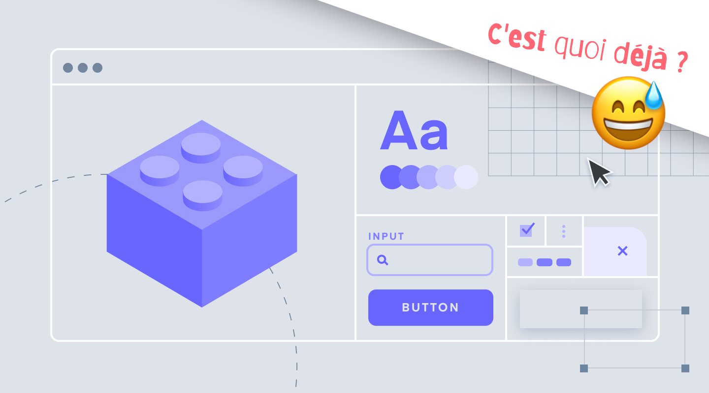

# Cours 12 | Alpine.js et librairies bonus

[STOP]

<!-- **Savoirs :** #1 Programmation fonctionnelle · #11 Sauvegarde côté client · #15 Interactivité · #18 Introduction à un cadriciel JavaScript · #16 Visualisation via librairie (bonus) -->

*[DOM]: Document Object Model
*[npm]: Node Package Manager

Deux parties aujourd'hui&nbsp;:

<div class="grid grid-1-4" markdown>
  {.aspect-4-3 .w-100}

  :material-gesture-tap: **Alpine.js** - de l'interactivité directement dans le HTML
</div>

<div class="grid grid-1-4" markdown>
  {.aspect-4-3 .w-100}

  :material-star-plus: **Bonus** - Chart.js (graphiques) et Three.js (3D)
</div>

---

# Partie 1 - Alpine.js


{.w-100}

[Alpine.js](https://alpinejs.dev/) est un petit framework JavaScript qui permet d'intégrer des comportements réactifs directement dans le HTML. Son objectif est de rendre les tâches courantes en JavaScript plus simple à gérer.

## Composantes Web

{.w-100}

Règle général, un site Web se segmente en plusieurs partie. La première est la structure, celle qui défini l'emplacemennt de l'entête, de la navigation, du contenu principal, etc. et la seconde en plusieur c'est la façon dont on affiche l'information. Quand un type d'affichage revient plusieurs fois à travers les pages, on tente d'éviter de copier coller sa structure à chaque page. On fait alors des modèles réutilisables nommées composantes (_components_).


Une page Web se construit à partir de blocs : un en-tête, une navigation, une liste d'articles, une carte de produit, un pied de page. 

Plusieurs de ces blocs reviennent d'une page à l'autre, souvent avec la même apparence mais un contenu différent. Plutôt que d'en recopier le code à chaque endroit, on en fait un modèle réutilisable auquel on fournit des données. C'est ce qu'on appelle une composante (_component_).

La page devient alors un assemblage de composantes plutôt qu'un long document HTML.

[Exemples de composantes Web](https://ui.shadcn.com/docs/components){ .md-button .md-button--primary }


## Cadriciel ou librairie ?

Depuis le début de la session, vous utilisez des **cadriciels** (Tailwind, DaisyUI). Alpine en est un aussi, mais côté JavaScript. En quoi est-ce différent d'une simple **librairie**&nbsp;?

| | Librairie | Cadriciel (_framework_) |
| :--- | :--- | :--- |
| **Qui appelle qui** | *Vous* appelez son code quand vous voulez | *Lui* appelle votre code selon ses règles |
| **Analogie** | Une boîte à outils | Un plan de maison |
| **Exemple** | `Math.random()`, `fetch()` (on les appelle) | Tailwind, DaisyUI, Alpine |


## Installation

Alpine s'installe comme les autres paquets vus depuis le cours 3, dans un projet **Vite**.

```bash
npm install alpinejs
```

Puis, dans le fichier JavaScript principal du projet :

```js title="src/main.js"
import Alpine from 'alpinejs'

window.Alpine = Alpine
Alpine.start()
```

## Premier composant

Quatre directives suffisent pour commencer&nbsp;:

| Directive | Rôle |
| :--- | :--- |
| `x-data` | Déclare un composant et son **état** (un objet JavaScript) |
| `x-text` | Affiche une valeur de l'état dans l'élément |
| `@click` | Exécute une expression au clic |
| `x-show` | Affiche l'élément seulement si l'expression est vraie |

```html
<div x-data="{ compteur: 0 }">
  <button @click="compteur++">+1</button>
  <button @click="compteur = 0">Remettre à zéro</button>

  <p>Valeur : <span x-text="compteur"></span></p>
  <p x-show="compteur >= 10">Dix clics, bravo 🎉</p>
</div>
```

1. `x-data` crée l'état&nbsp;: une variable `compteur` qui vaut `0`.
2. Chaque `@click` modifie cette variable avec du **JavaScript ordinaire** (`compteur++`, `compteur = 0`).
3. `x-text` et `x-show` relisent la variable et se mettent à jour **tout seuls**. Aucun `querySelector`, aucun `addEventListener`.

!!! tip "Tout se passe à l'intérieur du `x-data`"

    Les directives ne voient que l'état de l'élément qui porte le `x-data` et de ses enfants. Un bouton placé en dehors de la `<div>` ne connaît pas `compteur`.

## Les directives essentielles

Une **directive** est un attribut HTML qui commence par `x-`. En voici le tableau de référence&nbsp;:

| Directive | Rôle |
| :--- | :--- |
| [`x-data`](https://alpinejs.dev/directives/data) | Déclare un composant et son état (objet) |
| [`x-text`](https://alpinejs.dev/directives/text) | Insère du **texte** dans l'élément |
| [`x-html`](https://alpinejs.dev/directives/html) | Insère du **HTML** dans l'élément |
| [`x-bind`](https://alpinejs.dev/directives/bind) (`:`) | Lie un **attribut** à une expression |
| [`x-on`](https://alpinejs.dev/directives/on) (`@`) | Écoute un **événement** |
| [`x-model`](https://alpinejs.dev/directives/model) | Liaison **bidirectionnelle** sur un champ |
| [`x-show`](https://alpinejs.dev/directives/show) | Affiche / masque (via `display`) |
| [`x-if`](https://alpinejs.dev/directives/if) | Ajoute / retire du DOM (sur `<template>`) |
| [`x-for`](https://alpinejs.dev/directives/for) | Boucle sur une liste (sur `<template>`) |
| [`x-init`](https://alpinejs.dev/directives/init) | Exécute du code à l'initialisation |
| [`x-transition`](https://alpinejs.dev/directives/transition) | Anime l'apparition / la disparition |
| [`x-ref`](https://alpinejs.dev/directives/ref) | Nomme un élément pour y accéder via `$refs` |
| [`x-cloak`](https://alpinejs.dev/directives/cloak) | Cache l'élément tant qu'Alpine n'est pas prêt |

### `x-text` et `x-html`

Affichent une valeur dans l'élément.

```html
<div x-data="{ nom: 'Digger' }">
  <p>Bonjour <span x-text="nom"></span> !</p>
</div>
```

!!! warning "`x-html` = danger potentiel"

    `x-html` injecte du HTML brut. Ne l'utilisez **jamais** avec du contenu venant de l'utilisateur&nbsp;: c'est une porte d'entrée aux attaques XSS. Dans le doute, `x-text`.

### `x-on` (`@`) - les événements

Écoute un événement et exécute une expression. `x-on:click` s'écrit aussi `@click` (raccourci).

```html
<div x-data="{ compteur: 0 }">
  <button @click="compteur++">+1</button>
  <span x-text="compteur"></span>
</div>
```

On peut écouter n'importe quel événement (`@input`, `@submit`, `@keyup`…) et ajouter des **modificateurs**&nbsp;:

| Modificateur | Effet |
| :--- | :--- |
| `@submit.prevent` | Annule le comportement par défaut (`preventDefault`) |
| `@click.outside` | Se déclenche au clic **hors** de l'élément |
| `@keyup.enter` | Uniquement sur la touche Entrée |
| `@click.once` | Une seule fois |

### `x-model` - la liaison bidirectionnelle

Synchronise un champ de formulaire avec l'état, dans les **deux sens**&nbsp;: on tape, l'état change; l'état change, le champ suit.

```html
<div x-data="{ message: '' }">
  <input type="text" x-model="message" class="input" placeholder="Écrivez…">
  <p>Aperçu en direct : <span x-text="message"></span></p>
  <p x-text="message.length + ' caractères'"></p>
</div>
```

<!-- CODEPEN: x-model, aperçu en direct + compteur de caractères -->

### `x-show` ou `x-if` ?

Les deux gèrent l'affichage conditionnel, mais **différemment** - une distinction classique en entrevue 😉.

| | `x-show` | `x-if` |
| :--- | :--- | :--- |
| Mécanisme | Bascule `display: none` | Ajoute/retire du DOM |
| L'élément existe dans le DOM | Toujours | Seulement si vrai |
| S'utilise sur | N'importe quel élément | Une balise `<template>` |
| Idéal pour | Ce qu'on montre/cache souvent | Ce qui est lourd ou rarement affiché |

```html title="x-if exige un <template>"
<div x-data="{ connecte: false }">
  <template x-if="connecte">
    <p>Bienvenue !</p>
  </template>
</div>
```

### `x-bind` (`:`) - lier un attribut

Rend n'importe quel attribut dynamique. `x-bind:class` s'écrit `:class`.

```html
<div x-data="{ actif: true }">
  <button :class="actif ? 'btn btn-primary' : 'btn btn-ghost'">
    État
  </button>
</div>
```

!!! tip "Combo avec DaisyUI"

    `:class` est parfait pour basculer les **classes sémantiques** DaisyUI (`btn-primary`, `badge-error`…) selon l'état. C'est là qu'Alpine et DaisyUI brillent ensemble.

### `x-for` - répéter une liste

Boucle sur un tableau, toujours sur une balise `<template>` avec une clé `:key`.

```html
<ul x-data="{ fruits: ['Pomme', 'Kiwi', 'Mangue'] }">
  <template x-for="fruit in fruits" :key="fruit">
    <li x-text="fruit"></li>
  </template>
</ul>
```

## Les propriétés magiques

En plus des directives, Alpine offre des **magies** (préfixe `$`) accessibles dans les expressions.

| Magie | Rôle |
| :--- | :--- |
| [`$el`](https://alpinejs.dev/magics/el) | L'élément DOM courant |
| [`$refs`](https://alpinejs.dev/magics/refs) | Les éléments marqués `x-ref` |
| [`$event`](https://alpinejs.dev/directives/on#accessing-the-event-object) | L'objet événement natif |
| [`$watch`](https://alpinejs.dev/magics/watch) | Observe une propriété et réagit |
| [`$store`](https://alpinejs.dev/magics/store) | Accès à un état **global** partagé |
| [`$dispatch`](https://alpinejs.dev/magics/dispatch) | Émet un événement personnalisé |
| [`$persist`](https://alpinejs.dev/plugins/persist) | Sauvegarde une valeur dans `localStorage` (plugin) |

## Sauvegarder l'état : `localStorage` et `$persist`

Voici le chaînon manquant du cours 4&nbsp;: le bouton `theme-controller` changeait le thème, mais **oubliait** le choix au rechargement. Pour s'en souvenir, il faut écrire dans le **`localStorage`** du navigateur.

Le `localStorage`, c'est un petit espace de stockage clé/valeur qui **survit** aux rechargements et à la fermeture de l'onglet.

=== "À la main (JavaScript pur)"

    ```js
    // Écrire
    localStorage.setItem('theme', 'dark')
    // Lire
    const theme = localStorage.getItem('theme')
    ```

=== "Avec le plugin $persist (Alpine)"

    ```html
    <div x-data="{ compteur: $persist(0) }">
      <button @click="compteur++" x-text="compteur"></button>
    </div>
    ```

    Rechargez la page&nbsp;: le compteur garde sa valeur 🎉. Alpine s'occupe de tout.

### Installer le plugin Persist

```bash
npm install @alpinejs/persist
```

```js title="src/main.js"
import Alpine from 'alpinejs'
import persist from '@alpinejs/persist'

Alpine.plugin(persist)
window.Alpine = Alpine
Alpine.start()
```


!!! tip "Nommer la clé de stockage"

    Par défaut, la clé du `localStorage` reprend le nom de la variable. Pour éviter les collisions, on la nomme avec `.as()`&nbsp;:

    ```html
    <div x-data="{ compteur: $persist(0).as('digger-compteur') }"></div>
    ```

### Exemple complet : un sélecteur de thème persistant

On réunit tout&nbsp;: état (`x-data`), liaison d'attribut (`:data-theme`), événement (`@click`) et persistance (`$persist`). Le thème DaisyUI choisi est **retenu** d'une visite à l'autre.

```html
<html x-data="{ theme: $persist('light') }" :data-theme="theme">
  <body>
    <button class="btn" @click="theme = (theme === 'light' ? 'dark' : 'light')">
      Thème : <span x-text="theme"></span>
    </button>
  </body>
</html>
```

<!-- CODEPEN: Sélecteur de thème DaisyUI persistant avec Alpine ($persist) -->

!!! success "Ce qu'on vient de faire"

    On a couvert l'**interactivité** (savoir #15), l'**introduction à un cadriciel JS** (savoir #18) et la **sauvegarde côté client** (savoir #11) - le tout en restant proche du HTML. Exactement ce que le cours exige, sans la lourdeur d'un gros _framework_.

## Exercices - Alpine

<div class="grid grid-1-2" markdown>
  {.aspect-4-3}

  <small>Exercice - Alpine</small><br>
  **[Pot à biscuits](./exercices/alpine-pot-biscuits.md){.stretched-link .back}**
</div>

<div class="grid grid-1-2" markdown>
  {.aspect-4-3}

  <small>Exercice - Alpine</small><br>
  **[Jour et nuit](./exercices/alpine-jour-nuit.md){.stretched-link .back}**
</div>

<div class="grid grid-1-2" markdown>
  {.aspect-4-3}

  <small>Exercice - Alpine</small><br>
  **[Poste restante](./exercices/alpine-poste-restante.md){.stretched-link .back}**
</div>

*Pot à biscuits* est un exercice de réchauffement&nbsp;; *Jour et nuit* et *Poste restante* font partie de la remise *Exercices 02*.

---

# Partie 2 - Chart.js (bonus, optionnel)

!!! info "Pour les curieux - non obligatoire"

    Chart.js ne fait pas partie de la remise *Exercices 02*. Il reste admissible comme **librairie supplémentaire** dans le projet final.

**[Chart.js](https://www.chartjs.org/)** transforme des données en **graphiques** clairs et animés, dessinés dans une balise `<canvas>`. C'est la librairie de visualisation la plus populaire&nbsp;: simple, responsive et gratuite.

## Installation

=== ":material-flash: CDN (rapide)"

    ```html
    <script src="https://cdn.jsdelivr.net/npm/chart.js"></script>
    ```

=== ":simple-vite: npm (projet Vite)"

    ```bash
    npm install chart.js
    ```

    ```js title="src/main.js"
    import Chart from 'chart.js/auto'
    ```

    !!! note "`chart.js/auto`"

        L'import `chart.js/auto` enregistre automatiquement tous les types de graphiques. Pratique pour apprendre&nbsp;; en production, on peut n'importer que ce qu'on utilise pour alléger le _build_.

## Un conteneur `<canvas>`

Chart.js **dessine** le graphique&nbsp;; il lui faut donc une toile. On lui réserve un `<canvas>` avec un identifiant.

```html
<canvas id="monGraphique"></canvas>
```

## Premier graphique

On crée une instance avec `new Chart(cible, configuration)`. La configuration est un objet à trois clés&nbsp;: **`type`**, **`data`** et **`options`**.

```js
const ctx = document.querySelector("#monGraphique")

new Chart(ctx, {
  type: "bar",                       // 1. le type de graphique
  data: {                            // 2. les données
    labels: ["Lun", "Mar", "Mer", "Jeu", "Ven"],
    datasets: [{
      label: "Ventes",
      data: [12, 19, 7, 15, 22]
    }]
  },
  options: {                         // 3. les réglages
    responsive: true
  }
})
```

<!-- CODEPEN: premier graphique Chart.js (barres) -->

### Anatomie des données

C'est le cœur de Chart.js. Deux notions&nbsp;:

| Clé | Rôle |
| :--- | :--- |
| `labels` | Les étiquettes de l'axe (ex.&nbsp;: les jours) |
| `datasets` | Un ou plusieurs **jeux de données** à tracer |
| `datasets[].label` | Le nom du jeu (affiché dans la légende) |
| `datasets[].data` | Les valeurs, **alignées** sur les `labels` |

!!! warning "Aligner `data` et `labels`"

    Le tableau `data` doit avoir **autant de valeurs** que `labels` a d'étiquettes. 5 jours → 5 valeurs. Sinon, le graphique sera décalé ou incomplet.

## Les types de graphiques

Il suffit de changer la clé `type` pour obtenir un rendu complètement différent&nbsp;:

<div class="grid" markdown>
<figure markdown>
{data-zoom-image}
<figcaption>`bar`</figcaption>
</figure>
<figure markdown>
{data-zoom-image}
<figcaption>`line`</figcaption>
</figure>
<figure markdown>
{data-zoom-image}
<figcaption>`pie`</figcaption>
</figure>
<figure markdown>
{data-zoom-image}
<figcaption>`doughnut`</figcaption>
</figure>
<figure markdown>
{data-zoom-image}
<figcaption>`radar`</figcaption>
</figure>
<figure markdown>
{data-zoom-image}
<figcaption>`polarArea`</figcaption>
</figure>
<figure markdown>
{data-zoom-image}
<figcaption>`scatter`</figcaption>
</figure>
<figure markdown>
{data-zoom-image}
<figcaption>`bubble`</figcaption>
</figure>
</div>

## Quelques options utiles

Les `options` personnalisent le comportement et l'apparence. Toutes sont dans la [documentation](https://www.chartjs.org/docs/latest/).

```js
options: {
  responsive: true,
  plugins: {
    legend: { position: "top" },
    title: { display: true, text: "Ventes de la semaine" }
  },
  scales: {
    y: { beginAtZero: true }
  }
}
```

| Option | Effet |
| :--- | :--- |
| `responsive: true` | Le graphique s'adapte à la taille de son conteneur |
| `plugins.legend` | Position/affichage de la légende |
| `plugins.title` | Titre du graphique |
| `scales.y.beginAtZero` | Force l'axe vertical à démarrer à 0 |

!!! tip "Responsive : encadrez le canvas"

    Pour maîtriser la taille, placez le `<canvas>` dans une `<div>` conteneur de dimensions fixes (ex.&nbsp;: `class="w-full max-w-xl"`) plutôt que de dimensionner le canvas directement.

<!-- CODEPEN: changer le type et les options d'un même jeu de données -->

## Exercice bonus - Chart.js

<div class="grid grid-1-2" markdown>
  {.aspect-4-3}

  <small>Exercice - Chart.js (bonus)</small><br>
  **[Bulletin de saison](./exercices/chartjs-bulletin.md){.stretched-link .back}**
</div>

---

# Partie 3 - Three.js (bonus, optionnel)

!!! info "Pour les curieux - non obligatoire"

    **[Three.js](https://threejs.org/)** permet d'afficher de la **3D** dans le navigateur (WebGL). C'est spectaculaire, mais plus **avancé** que les autres librairies. Cette partie est un **survol facultatif**&nbsp;: elle n'est pas requise pour le projet final. Explorez-la si le cœur vous en dit&nbsp;!

Toute scène 3D repose sur **trois objets**&nbsp;: une **scène** (le monde), une **caméra** (le point de vue) et un **renderer** (qui dessine).

```bash
npm install three
```

```js title="src/main.js"
import * as THREE from "three"

// 1. La scène, la caméra, le renderer
const scene = new THREE.Scene()
const camera = new THREE.PerspectiveCamera(75, window.innerWidth / window.innerHeight, 0.1, 1000)
const renderer = new THREE.WebGLRenderer()
renderer.setSize(window.innerWidth, window.innerHeight)
document.body.appendChild(renderer.domElement)

// 2. Un objet : une géométrie + un matériau = un « mesh »
const cube = new THREE.Mesh(
  new THREE.BoxGeometry(1, 1, 1),
  new THREE.MeshBasicMaterial({ color: 0x00ff00 })
)
scene.add(cube)
camera.position.z = 5

// 3. La boucle d'animation
function animate(temps) {
  cube.rotation.x = temps / 2000
  cube.rotation.y = temps / 1000
  renderer.render(scene, camera)
}
renderer.setAnimationLoop(animate)
```

Ce code affiche un **cube vert qui tourne**. À partir de là, on peut charger des modèles 3D, ajouter des lumières, des textures…

!!! tip "Où continuer"

    Le [manuel officiel](https://threejs.org/manual/) et la [galerie d'exemples](https://threejs.org/examples/) de Three.js sont la meilleure porte d'entrée. Idéal pour un élément 3D vedette (personnage, objet du jeu) sur votre page d'accueil.

---

!!! success "Ce qu'il faut retenir"

    Chaque librairie suit le même rituel&nbsp;: **installer → préparer un conteneur (`<canvas>` ou `<div>`) → appeler la librairie avec une configuration**. Une fois ce réflexe acquis, vous pouvez apprivoiser **n'importe quelle** nouvelle librairie à partir de sa documentation. C'est l'autonomie visée par le cours 🎓.


---

## Remise Exercices 02

[Énoncé de la remise Exercices 02](./devoir/exercices-02.md){ .md-button .md-button--primary }
