# Cours 12 | Audio et vidéo par programmation

[STOP]

<!-- **Savoirs :** #3 Contrôle audio et vidéo · #13 Classe JavaScript · #14 Classes sur mesure · #12 Repérage d'erreur (DevTools) · #15 Interactivité · #16 Visualisation via librairie (bonus) -->

*[CDN]: Content Delivery Network
*[npm]: Node Package Manager
*[API]: Application Programming Interface

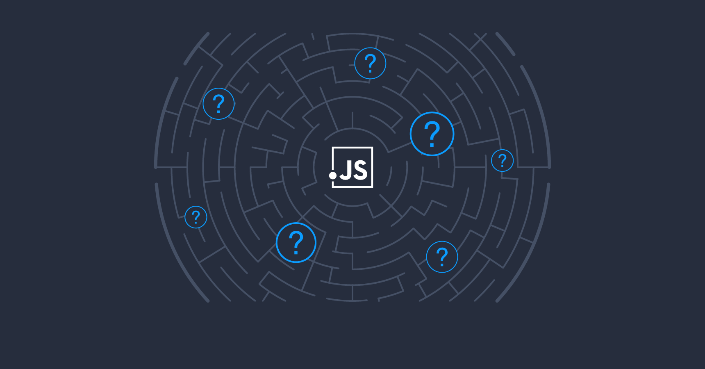{.w-100}

Ce cours s'appelle « Web **audiovisuel** »&nbsp;: au cours 8, les médias ont été **optimisés**. Aujourd'hui, on les **contrôle par programmation** 🎬🔊, juste à temps pour le projet final.

<div class="grid grid-1-4" markdown>
  {.aspect-4-3 .w-100}

  :material-play-circle: **Audio et vidéo** - API native, classes JavaScript et Howler.js
</div>

<div class="grid grid-1-4" markdown>
  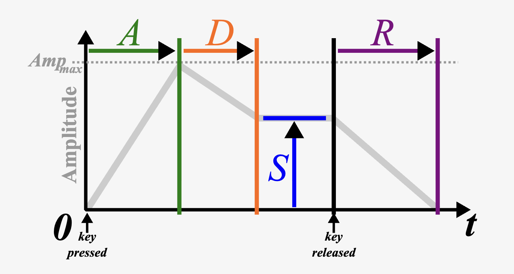{.aspect-4-3 .w-100}

  :material-music: **Tone.js** - du son et de la musique
</div>

…et deux **bonus optionnels**&nbsp;: **Chart.js** (graphiques) et **Three.js** (3D).

---

# Partie 1 - Contrôler les médias par programmation

Les balises `<video>` et `<audio>` viennent avec des contrôles par défaut. Mais dès qu'on veut un **lecteur sur mesure** (boutons stylisés, barre de progression maison, effets sonores au clic), on passe par le JavaScript.

## L'API native `<video>` / `<audio>`

Tout élément média expose des **propriétés**, des **méthodes** et des **événements** qu'on manipule en JS.

| Propriété | Rôle |
| :--- | :--- |
| `currentTime` | Position de lecture (en secondes) |
| `duration` | Durée totale |
| `volume` | Volume (0 à 1) |
| `muted` | Sourdine (booléen) |
| `paused` | En pause ? (booléen) |
| `playbackRate` | Vitesse de lecture |

| Méthode | Effet |
| :--- | :--- |
| `.play()` | Lance la lecture |
| `.pause()` | Met en pause |
| `.load()` | Recharge la source |

| Événement | Se déclenche… |
| :--- | :--- |
| `play` / `pause` | À la lecture / pause |
| `timeupdate` | À chaque avancée de lecture (pour une barre de progression) |
| `ended` | À la fin |
| `loadedmetadata` | Quand la durée est connue |

```js title="Bouton lecture/pause maison"
const video = document.querySelector("#film")
const bouton = document.querySelector("#lecture")

bouton.addEventListener("click", () => {
  video.paused ? video.play() : video.pause()
})

// Barre de progression
video.addEventListener("timeupdate", () => {
  const pourcent = (video.currentTime / video.duration) * 100
  document.querySelector("#barre").style.width = pourcent + "%"
})
```

<!-- CODEPEN: lecteur vidéo maison (play/pause + barre de progression) -->

## Petit détour : les classes JavaScript

Les librairies (GSAP depuis le cours 9, Howler et Tone.js aujourd'hui) nous donnent des **objets** créés avec le mot-clé `new`. Trois notions suffisent pour s'y retrouver&nbsp;:

- une **classe** est un *moule* (ex.&nbsp;: `Howl`)&nbsp;;
- `new` fabrique une **instance** à partir du moule&nbsp;;
- une **méthode** est une action de l'instance (ex.&nbsp;: `.play()`).

```js
const son = new Howl({ src: ["saut.mp3"] })  // une instance de la classe Howl
son.play()                                    // une méthode de cette instance
```

!!! note "On les utilise plus qu'on les écrit"

    À ce stade, l'important est de **savoir lire et utiliser** une classe fournie par une librairie, pas d'écrire les vôtres. Vous reconnaîtrez ce motif `new Quelquechose({...})` partout&nbsp;: Howler, Chart.js, Tone.js, GSAP…

### Écrire sa propre classe (aperçu)

Rien ne vous empêche d'écrire la vôtre. La structure minimale regroupe des **données** (dans le `constructor`) et des **méthodes** (des actions)&nbsp;:

```js
class Personnage {
  constructor(nom, pv) {
    this.nom = nom      // une propriété
    this.pv = pv
  }
  saluer() {           // une méthode
    console.log(`${this.nom} entre en scène !`)
  }
}

const heros = new Personnage("Digger", 100)
heros.saluer()   // "Digger entre en scène !"
```

!!! note "À garder simple"

    Écrire ses propres classes devient utile quand on gère **plusieurs objets du même type**. Pour un site promotionnel, l'usage des classes **fournies par les librairies** suffit largement&nbsp;: retenez surtout comment les **lire et les instancier**.

## Une librairie audio : Howler.js

L'`<audio>` natif suffit pour lire un fichier, mais dès qu'on veut des **effets sonores** fiables (jeu, interactions), des **sprites audio** ou un contrôle multiplateforme, **[Howler.js](https://howlerjs.com/)** est la référence.

=== ":material-flash: CDN"

    ```html
    <script src="https://cdnjs.cloudflare.com/ajax/libs/howler/2.2.4/howler.min.js"></script>
    ```

=== ":simple-vite: npm"

    ```bash
    npm install howler
    ```

    ```js title="src/main.js"
    import { Howl, Howler } from "howler"
    ```

```js title="Un son avec repli de format"
const son = new Howl({
  src: ["bruit.webm", "bruit.mp3"],  // le navigateur prend le 1er compatible
  volume: 0.8,
  loop: false
})

son.play()
```

| Méthode | Effet |
| :--- | :--- |
| `son.play()` / `son.pause()` / `son.stop()` | Contrôle de lecture |
| `son.volume(0.5)` | Règle le volume de ce son |
| `son.rate(1.5)` | Change la vitesse |
| `Howler.volume(0.5)` | Volume **global** de tous les sons |
| `Howler.mute(true)` | Coupe tout |

!!! tip "Les sprites audio"

    Comme les sprites d'image (cours 10), un **sprite audio** regroupe plusieurs sons dans un seul fichier - idéal pour les effets d'un jeu.

    ```js
    const fx = new Howl({
      src: ["fx.webm"],
      sprite: { saut: [0, 300], piece: [400, 150] }
    })
    fx.play("saut")
    ```

<!-- CODEPEN: effets sonores au clic avec Howler -->

### Autres librairies (survol)

- **[Video.js](https://videojs.com/)** - un lecteur **vidéo** entièrement habillable (thèmes, sous-titres, qualité).

## Déboguer : les DevTools

Quand un média ne réagit pas, ouvrez les **DevTools** (++f12++)&nbsp;:

- la **Console** affiche les erreurs et vos `console.log(...)`&nbsp;;
- l'onglet **Réseau** montre si le fichier média se charge (ou renvoie une erreur 404)&nbsp;;
- un **point d'arrêt** (_breakpoint_) met le code en pause pour l'inspecter ligne par ligne.

```js
console.log("durée :", video.duration)   // vérifier une valeur au vol
```

## Exercice - Médias

<div class="grid grid-1-2" markdown>
  {.aspect-4-3}

  <small>Exercice - Médias</small><br>
  **[Salle de projection](./exercices/medias-salle-projection.md){.stretched-link .back}**
</div>

---

# Partie 2 - Tone.js

{data-zoom-image .w-75}

**[Tone.js](https://tonejs.github.io/)** est un cadre audio pour **créer du son et de la musique** dans le navigateur. Pour un site de jeu, c'est parfait&nbsp;: une ambiance sonore, un thème musical, ou des effets aux interactions.

## Installation

=== ":material-flash: CDN (rapide)"

    ```html
    <script src="https://unpkg.com/tone"></script>
    ```

=== ":simple-vite: npm (projet Vite)"

    ```bash
    npm install tone
    ```

    ```js title="src/main.js"
    import * as Tone from "tone"
    ```

!!! danger "Le son exige un clic d'abord"

    Les navigateurs **bloquent** tout son tant que l'utilisateur n'a pas interagi avec la page. Il faut donc appeler **`Tone.start()`** depuis un événement déclenché par l'utilisateur (un clic), sinon&nbsp;: silence.

    ```js
    document.querySelector("#demarrer").addEventListener("click", async () => {
      await Tone.start()   // débloque l'audio
      // … le son peut jouer maintenant …
    })
    ```

## Jouer une note

L'objet de base est le **synthétiseur**. On le crée, on le branche aux haut-parleurs avec `.toDestination()`, puis on joue une note.

```js
const synth = new Tone.Synth().toDestination()

// note "Do 4", tenue pendant une croche ("8n")
synth.triggerAttackRelease("C4", "8n")
```

| Argument | Signifie |
| :--- | :--- |
| `"C4"` | La note (nom + octave), ou une fréquence en Hz (`440`) |
| `"8n"` | La durée&nbsp;: `"4n"` = noire, `"8n"` = croche, `"1m"` = une mesure |

## Enchaîner des notes

Le 3ᵉ argument planifie **quand** jouer, en secondes à partir de maintenant (`Tone.now()`).

```js
const synth = new Tone.Synth().toDestination()
const t = Tone.now()

synth.triggerAttackRelease("C4", "8n", t)
synth.triggerAttackRelease("E4", "8n", t + 0.5)
synth.triggerAttackRelease("G4", "8n", t + 1)
```

## Jouer un fichier audio

Pour une **musique** ou un effet à partir d'un fichier, on utilise `Tone.Player`.

```js
const musique = new Tone.Player({
  url: "./assets/audio/theme.mp3",
  loop: true,
  autostart: false
}).toDestination()

// après Tone.start() :
musique.start()
```

!!! tip "Idées pour votre site de jeu"

    Un thème musical en boucle dans le hero, un « bip » à chaque survol de bouton, un son de validation à l'envoi du formulaire… petit détail, grande immersion 🎧.

<!-- CODEPEN: clavier de quelques notes + bouton Tone.start() -->

## Exercice - Tone.js

<div class="grid grid-1-2" markdown>
  {.aspect-4-3}

  <small>Exercice - Tone.js</small><br>
  **[Boîte à musique](./exercices/tonejs-boite-a-musique.md){.stretched-link .back}**
</div>

---

# Partie 3 - Chart.js (bonus, optionnel)

!!! info "Pour les curieux - non obligatoire"

    Chart.js ne fait pas partie de la remise *Exercices 02*. Il reste admissible comme **librairie supplémentaire** dans le projet final.

**[Chart.js](https://www.chartjs.org/)** transforme des données en **graphiques** clairs et animés, dessinés dans une balise `<canvas>`. C'est la librairie de visualisation la plus populaire&nbsp;: simple, responsive et gratuite.

## Installation

=== ":material-flash: CDN (rapide)"

    ```html
    <script src="https://cdn.jsdelivr.net/npm/chart.js"></script>
    ```

=== ":simple-vite: npm (projet Vite)"

    ```bash
    npm install chart.js
    ```

    ```js title="src/main.js"
    import Chart from 'chart.js/auto'
    ```

    !!! note "`chart.js/auto`"

        L'import `chart.js/auto` enregistre automatiquement tous les types de graphiques. Pratique pour apprendre&nbsp;; en production, on peut n'importer que ce qu'on utilise pour alléger le _build_.

## Un conteneur `<canvas>`

Chart.js **dessine** le graphique&nbsp;; il lui faut donc une toile. On lui réserve un `<canvas>` avec un identifiant.

```html
<canvas id="monGraphique"></canvas>
```

## Premier graphique

On crée une instance avec `new Chart(cible, configuration)`. La configuration est un objet à trois clés&nbsp;: **`type`**, **`data`** et **`options`**.

```js
const ctx = document.querySelector("#monGraphique")

new Chart(ctx, {
  type: "bar",                       // 1. le type de graphique
  data: {                            // 2. les données
    labels: ["Lun", "Mar", "Mer", "Jeu", "Ven"],
    datasets: [{
      label: "Ventes",
      data: [12, 19, 7, 15, 22]
    }]
  },
  options: {                         // 3. les réglages
    responsive: true
  }
})
```

<!-- CODEPEN: premier graphique Chart.js (barres) -->

### Anatomie des données

C'est le cœur de Chart.js. Deux notions&nbsp;:

| Clé | Rôle |
| :--- | :--- |
| `labels` | Les étiquettes de l'axe (ex.&nbsp;: les jours) |
| `datasets` | Un ou plusieurs **jeux de données** à tracer |
| `datasets[].label` | Le nom du jeu (affiché dans la légende) |
| `datasets[].data` | Les valeurs, **alignées** sur les `labels` |

!!! warning "Aligner `data` et `labels`"

    Le tableau `data` doit avoir **autant de valeurs** que `labels` a d'étiquettes. 5 jours → 5 valeurs. Sinon, le graphique sera décalé ou incomplet.

## Les types de graphiques

Il suffit de changer la clé `type` pour obtenir un rendu complètement différent&nbsp;:

<div class="grid" markdown>
<figure markdown>
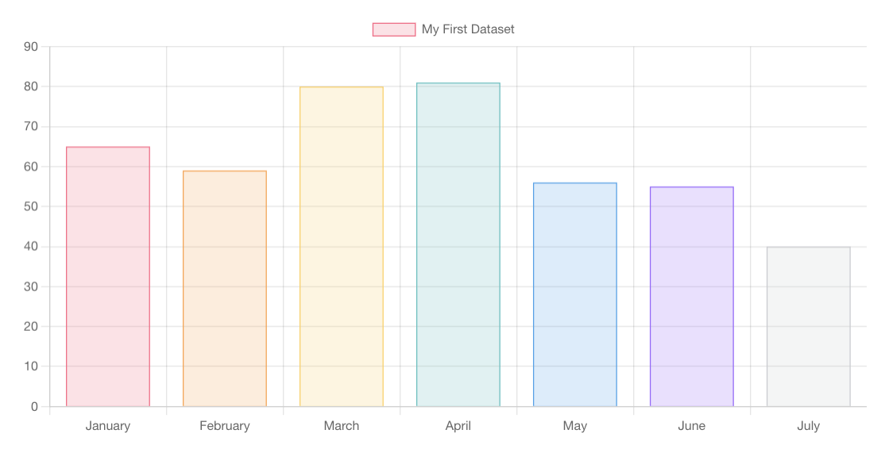{data-zoom-image}
<figcaption>`bar`</figcaption>
</figure>
<figure markdown>
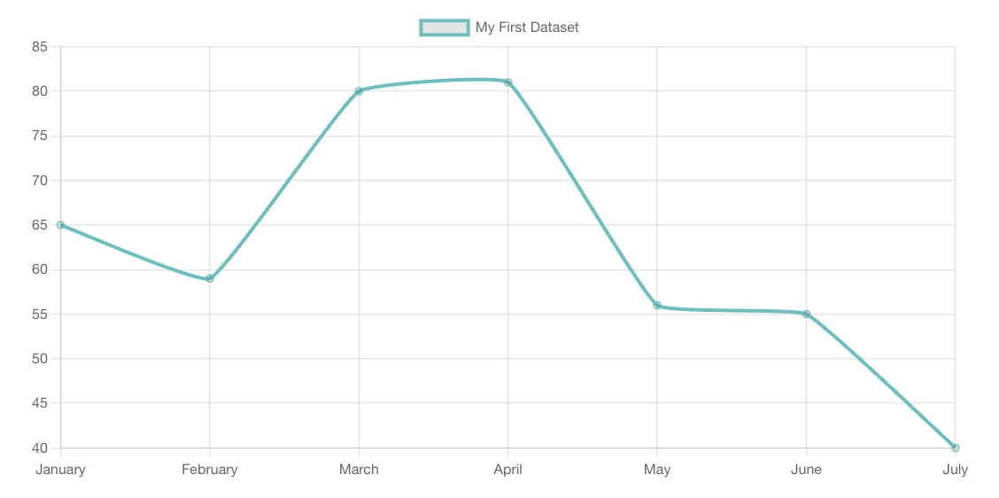{data-zoom-image}
<figcaption>`line`</figcaption>
</figure>
<figure markdown>
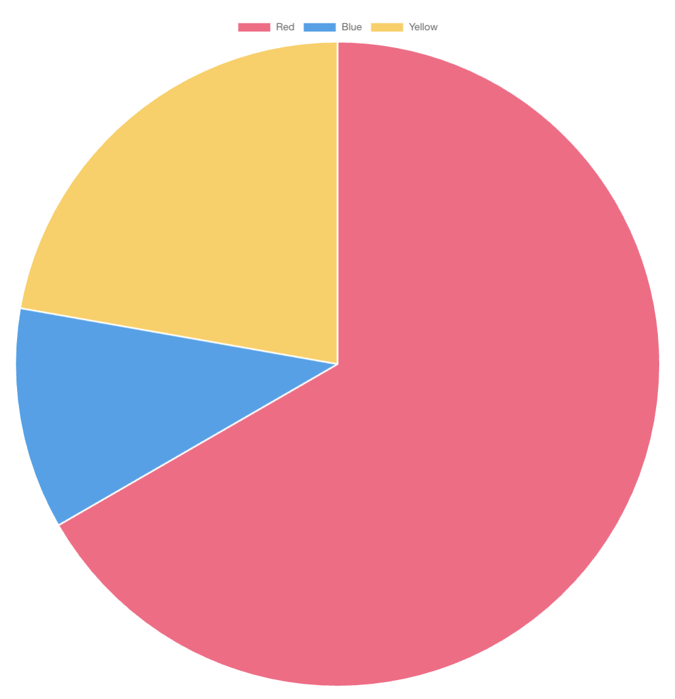{data-zoom-image}
<figcaption>`pie`</figcaption>
</figure>
<figure markdown>
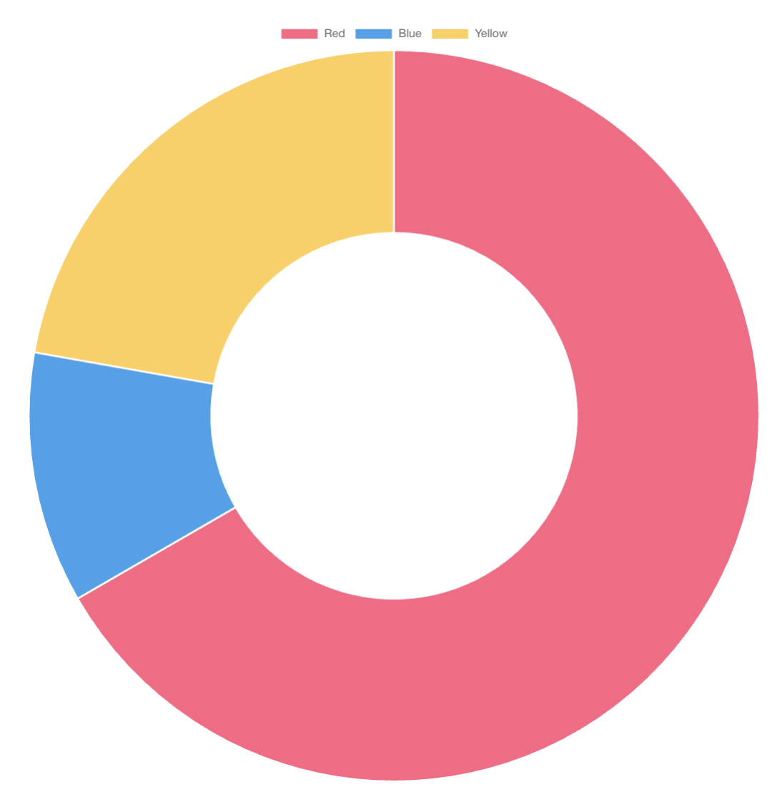{data-zoom-image}
<figcaption>`doughnut`</figcaption>
</figure>
<figure markdown>
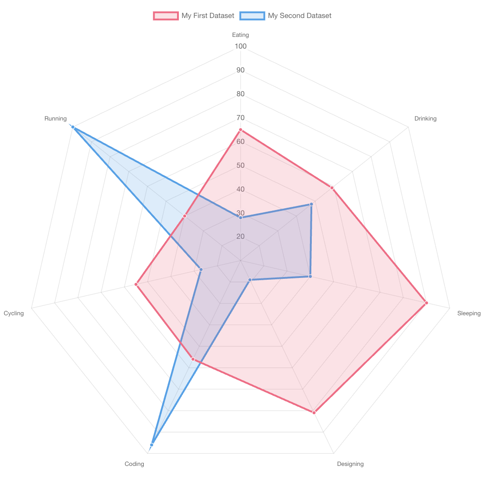{data-zoom-image}
<figcaption>`radar`</figcaption>
</figure>
<figure markdown>
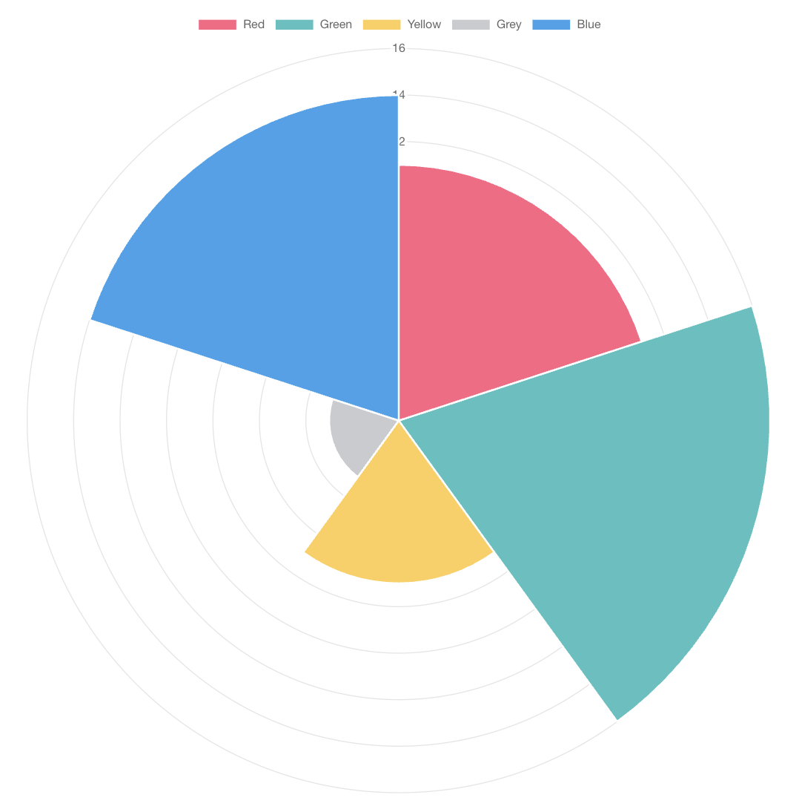{data-zoom-image}
<figcaption>`polarArea`</figcaption>
</figure>
<figure markdown>
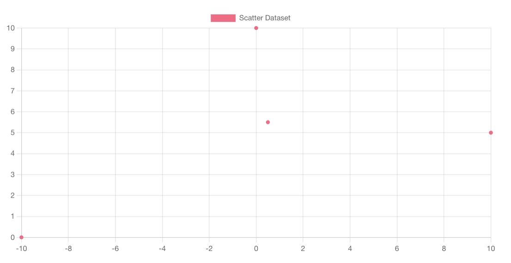{data-zoom-image}
<figcaption>`scatter`</figcaption>
</figure>
<figure markdown>
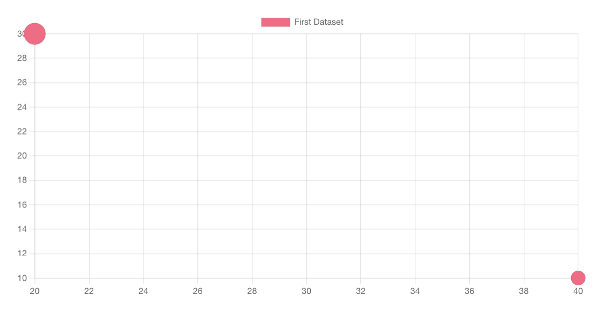{data-zoom-image}
<figcaption>`bubble`</figcaption>
</figure>
</div>

## Quelques options utiles

Les `options` personnalisent le comportement et l'apparence. Toutes sont dans la [documentation](https://www.chartjs.org/docs/latest/).

```js
options: {
  responsive: true,
  plugins: {
    legend: { position: "top" },
    title: { display: true, text: "Ventes de la semaine" }
  },
  scales: {
    y: { beginAtZero: true }
  }
}
```

| Option | Effet |
| :--- | :--- |
| `responsive: true` | Le graphique s'adapte à la taille de son conteneur |
| `plugins.legend` | Position/affichage de la légende |
| `plugins.title` | Titre du graphique |
| `scales.y.beginAtZero` | Force l'axe vertical à démarrer à 0 |

!!! tip "Responsive : encadrez le canvas"

    Pour maîtriser la taille, placez le `<canvas>` dans une `<div>` conteneur de dimensions fixes (ex.&nbsp;: `class="w-full max-w-xl"`) plutôt que de dimensionner le canvas directement.

<!-- CODEPEN: changer le type et les options d'un même jeu de données -->

## Exercice bonus - Chart.js

<div class="grid grid-1-2" markdown>
  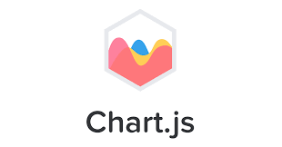{.aspect-4-3}

  <small>Exercice - Chart.js (bonus)</small><br>
  **[Bulletin de saison](./exercices/chartjs-bulletin.md){.stretched-link .back}**
</div>

---

# Partie 4 - Three.js (bonus, optionnel)

!!! info "Pour les curieux - non obligatoire"

    **[Three.js](https://threejs.org/)** permet d'afficher de la **3D** dans le navigateur (WebGL). C'est spectaculaire, mais plus **avancé** que les autres librairies. Cette partie est un **survol facultatif**&nbsp;: elle n'est pas requise pour le projet final. Explorez-la si le cœur vous en dit&nbsp;!

Toute scène 3D repose sur **trois objets**&nbsp;: une **scène** (le monde), une **caméra** (le point de vue) et un **renderer** (qui dessine).

```bash
npm install three
```

```js title="src/main.js"
import * as THREE from "three"

// 1. La scène, la caméra, le renderer
const scene = new THREE.Scene()
const camera = new THREE.PerspectiveCamera(75, window.innerWidth / window.innerHeight, 0.1, 1000)
const renderer = new THREE.WebGLRenderer()
renderer.setSize(window.innerWidth, window.innerHeight)
document.body.appendChild(renderer.domElement)

// 2. Un objet : une géométrie + un matériau = un « mesh »
const cube = new THREE.Mesh(
  new THREE.BoxGeometry(1, 1, 1),
  new THREE.MeshBasicMaterial({ color: 0x00ff00 })
)
scene.add(cube)
camera.position.z = 5

// 3. La boucle d'animation
function animate(temps) {
  cube.rotation.x = temps / 2000
  cube.rotation.y = temps / 1000
  renderer.render(scene, camera)
}
renderer.setAnimationLoop(animate)
```

Ce code affiche un **cube vert qui tourne**. À partir de là, on peut charger des modèles 3D, ajouter des lumières, des textures…

!!! tip "Où continuer"

    Le [manuel officiel](https://threejs.org/manual/) et la [galerie d'exemples](https://threejs.org/examples/) de Three.js sont la meilleure porte d'entrée. Idéal pour un élément 3D vedette (personnage, objet du jeu) sur votre page d'accueil.

---

!!! success "Ce qu'il faut retenir"

    Chaque librairie suit le même rituel&nbsp;: **installer → préparer un conteneur (`<canvas>` ou `<div>`) → appeler la librairie avec une configuration**. Une fois ce réflexe acquis, vous pouvez apprivoiser **n'importe quelle** nouvelle librairie à partir de sa documentation. C'est l'autonomie visée par le cours 🎓.
