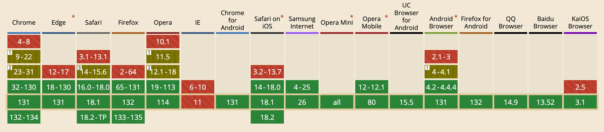
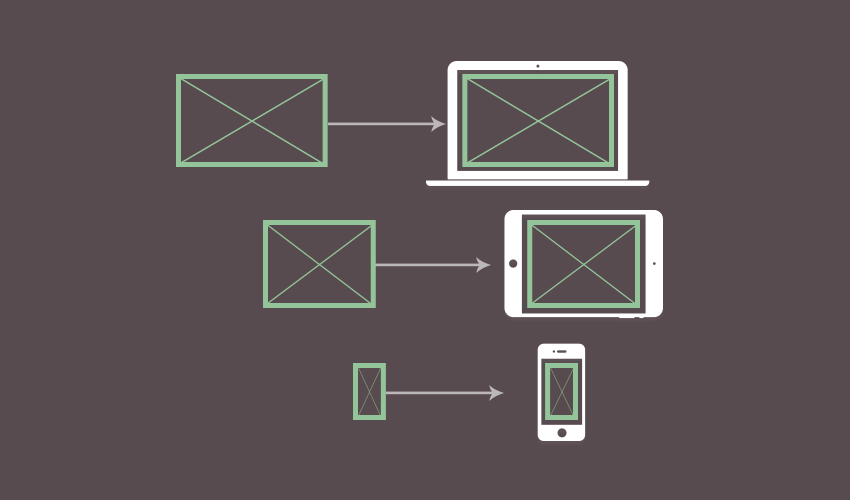
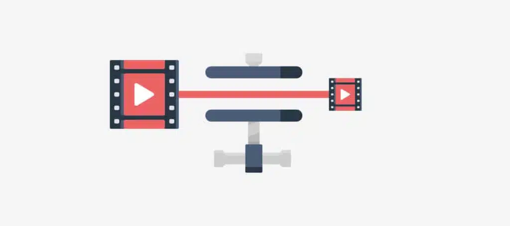
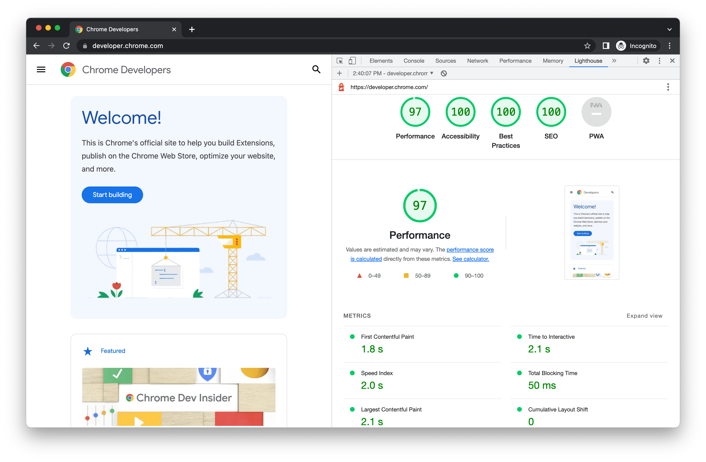

---
tags:
  - Cours 13
  - Vendredi 22 novembre
---

# Cours 13

## Balises meta

Les balises meta sont importantes pour la référencement d'un site web. Elles contribuent également à dicter les informations à partager lorsqu'on partage un lien sur les réseaux sociaux.

```html
<meta charset="utf-8" />
<meta name="viewport" content="width=device-width, initial-scale=1" />

<meta name="description" content="Plongez dans des mondes fantastiques avec notre collection de livres captivants." />
<meta property="og:title" content="Livres Fantastiques : Portail vers l'Imaginaire" />
<meta property="og:description" content="Découvrez notre sélection de livres fantastiques et plongez dans des histoires remplies de magie, d'aventures et de mystères." />
<meta property="og:image" content="fantasy-books-cover.jpg" />
<meta property="og:url" content="https://livresfantastiques.org" />
```

## Optimisation des images

### Formats modernes d'image

#### WebP

Développé par Google, [WebP](https://web.dev/learn/images/webp?hl=fr) est un format d'image qui supporte la compression avec et sans perte. Ça réduit la taille des fichiers par rapport à JPEG ou PNG (30-40% plus léger) et sa [compatibilité (caniuse)](https://caniuse.com/webp) est excellente.

{data-zoom-image}

[Convertir un JPEG en WebP (en anglais)](https://shortpixel.com/blog/convert-jpeg-to-webp/)

#### AVIF

La compression [AVIF](https://web.dev/learn/images/avif?hl=fr) est plus efficace que WebP, mais plus lente à générer. Elle convient aux images statiques avec des couleurs riches et des détails complexes. Sa [compatibilité (caniuse)](https://caniuse.com/avif) est de mieux en mieux. Depuis le 17 janvier 2024, Google Chrome (v121) supporte AVIF.

{data-zoom-image}

[Convertir un JPEG en AVIF (en anglais)](https://shortpixel.com/blog/convert-jpg-to-avif/)

### Outils de compression d'image

* [TinyPNG.com](https://tinypng.com/)
* [Squoosh.app](https://squoosh.app/) (Google)

### Retour sur la balise picture

```html title="Gestion de la compatibilité"
<picture>
  <source srcset="image.avif" type="image/avif"> <!-- Si le navigateur supporte AVIF, il charge cette image -->
  <source srcset="image.webp" type="image/webp"> <!-- Si AVIF n'est pas supporté mais WebP l'est, il charge cette image -->
   <!-- FALLBACK : Si aucun format moderne n'est supporté, il utilise cette image JPEG -->
</picture>
```



```html title="Usage des media queries"
<picture>
  <source srcset="image-large.jpg" media="(min-width: 1200px)">
  <source srcset="image-medium.jpg" media="(min-width: 768px)">
  <source srcset="image-small.jpg" media="(max-width: 767px)">
  
</picture>
```

### Chargement différé d'images

Le *lazy loading* télécharge les images uniquement lorsqu’elles deviennent visibles, réduisant le temps de chargement initial.

Cela est particulièrement utile pour les sites avec beaucoup d’images ou des pages longues.

```html

```

```html
<picture>
  <source srcset="image.avif" type="image/avif">
  <source srcset="image.webp" type="image/webp">
  
</picture>
```

## Optimisation des vidéos

### Formats de vidéo

#### WebM

Format open-source de Google, adapté pour le web. Particulièrement recommandé pour les vidéos en streaming.

Sa [compatibilité](https://caniuse.com/?search=webm) est excellente.

#### MP4 (H.264)

Format universellement compatible, idéal comme fallback.

#### AV1

Format offrant une compression supérieure à WebM et H.264, mais avec un coût de traitement plus élevé.

Sa [compatibilité](https://caniuse.com/?search=av1) est également un peu plus limitée.

### Encodage et compression vidéo



* Utilisez des outils comme [HandBrake](https://handbrake.fr/) ou [FFmpeg](https://www.ffmpeg.org/) (ligne de commande).
* Choisissez un débit (bitrate) adapté à votre résolution

!!! question "Le débit (bitrate)?"

    Le bitrate c'est la quantité de données transférées par seconde dans une vidéo.

    En Web, l'objectif est de trouver le bon bitrate pour obtenir une qualité vidéo acceptable tout en minimisant la taille du fichier.

    * La qualité visuelle : Plus le bitrate est élevé, meilleure est la qualité.
    * La taille du fichier : Un bitrate élevé augmente la taille du fichier vidéo.

    [Recommandations SDR Google concernant le débit vidéo](https://support.google.com/youtube/answer/1722171?hl=fr#zippy=%2Cd%C3%A9bit)

    [Vidéo de comparaison de bitrate (en anglais)](./assets/videos/bitrate.mp4)

Les avantages

1. **Amélioration des performances** : En chargeant les vidéos uniquement lorsqu’elles sont nécessaires, le temps de chargement initial de la page est réduit, offrant une meilleure expérience utilisateur.
1. **Réduction de la consommation de bande passante** : Les vidéos ne sont téléchargées que si l’utilisateur les visionne, ce qui est particulièrement bénéfique pour les utilisateurs disposant de connexions internet limitées ou coûteuses.
1. **Diminution de la charge serveur** : En limitant le nombre de requêtes simultanées, le lazy loading réduit la sollicitation du serveur, améliorant ainsi sa performance globale.

### Retour sur la balise video

Il est possible d'ajouter plusieurs sources de vidéos (format) pour assurer la compatibilité avec différents navigateurs.

L'attribut `poster` définit une image statique affichée avant que la vidéo ne soit lue.

La balise track permet l'ajout de sous-titre pour améliorer l’accessibilité Web

```html
<video controls width="640" height="360" poster="thumbnail.jpg">
  <source src="video.av1" type="video/av1">
  <source src="video.webm" type="video/webm">
  <source src="video.mp4" type="video/mp4"> <!-- Fallback -->
  <track src="subtitles-fr.vtt" kind="subtitles" srclang="fr" label="Français" default>
  <track src="subtitles-en.vtt" kind="subtitles" srclang="en" label="English">
  Votre navigateur ne supporte pas les vidéos HTML5.
</video>
```

!!! question ".vtt?"

    Un fichier WebVTT (Web Video Text Tracks) (.vtt) contient des répliques qui peuvent être sur une ou plusieurs lignes, comme illustré ici :

    ```text
    WEBVTT

    00:01.000 --> 00:04.000
    - Ne buvez jamais d'azote liquide.

    00:05.000 --> 00:09.000
    - Cela va vous perforer l'estomac.
    - Vous pourriez mourir!
    ```

    L'attribut `default` indique que ce fichier est le fichier par défaut pour les sous-titres.

```html title="Usage des media queries"
<video controls>
  <source src="video-1080p.webm" type="video/webm" media="(min-width: 1920px)">
  <source src="video-720p.webm" type="video/webm" media="(min-width: 1280px)">
  <source src="video-480p.webm" type="video/webm" media="(max-width: 1279px)">
  Votre navigateur ne supporte pas les vidéos HTML5.
</video>
```

### Chargement différé de vidéos

Preload (version lazyload de la balise vidéo)

* **none** : Aucun chargement avant l’interaction
* **metadata** : Charge uniquement les informations nécessaires
* **auto** : Charge entièrement la vidéo (par défaut)

```html
<video controls preload="none" poster="thumbnail.jpg">
  <source src="video.webm" type="video/webm">
  <source src="video.mp4" type="video/mp4">
  Votre navigateur ne supporte pas les vidéos HTML5.
</video>
```

## Tests

Les tests d'un site Web doivent faire parti intégrante de chaque projet Web que vous entreprenez. Aucune négociation possible ;)

C'est une étape cruciale pour la réussite de votre oeuvre, car elle affecte directement le taux de visites, la fidélité des utilisateurs, le référencement (résultats Google) et même le chiffre d'affaires.

> Selon une étude[^study] de 2017 menée par Google, lorsque le temps de chargement d’une page passe de 1 à 3 secondes, le taux de rebond augmente de 32 %. Si ce temps atteint 5 secondes, le taux de rebond peut grimper jusqu’à 90 %.

[^study]: Mobile page speed new industry benchmarks : <https://www.thinkwithgoogle.com/_qs/documents/3266/a061d_Mobile-page-speed-new-industry-benchmarks-FR.pdf>

### Que devons nous tester ?

1. Temps de chargement des pages
2. Structure du site : Une architecture complexe ou désorganisée rend difficile l’exploration et l’indexation par les robots des moteurs de recherche. Assurez-vous que votre site possède une architecture logique avec des URL conviviales et une hiérarchie claire des pages. 
3. Le contenu ! : Évitez le contenu dupliqué et assurez-vous que chaque page offre une valeur unique aux utilisateurs. Contrôlez que tous les liens pointent vers les pages appropriées et qu’aucun lien brisé n’est présent.
4. Optimisation mobile : Testez la réactivité (mise en page et médias) de votre site sur différents appareils et résolutions pour garantir une expérience utilisateur cohérente.
5. Balises méta : Vérifiez que chaque page possède des balises titre et description uniques et descriptives, optimisées pour le référencement.
6. Accessibilité : Vérifiez que votre site est utilisable par tous, y compris les personnes en situation de handicap. Assurez-vous que les lecteurs d’écran peuvent interpréter correctement le contenu, que les contrastes de couleurs sont suffisants et que la navigation au clavier est fluide.
7. Tests de conformité légale : Assurez-vous que votre site respecte les lois et réglementations en vigueur.
  * Standard sur l’accessibilité des sites Web ([SGQRI 008 3.0](https://www.quebec.ca/gouvernement/ministere/cybersecurite-numerique/publications/standard-accessibilite-sites-web)) pour les organismes publics au Québec
  * Loi modernisant des dispositions législatives en matière de protection des renseignements personnels (communément appelée « [loi 25](https://www.newswire.ca/fr/news-releases/loi-25-sur-la-protection-des-renseignements-personnels-des-citoyens-du-quebec-entree-en-vigueur-de-nouvelles-dispositions-qui-font-du-quebec-un-chef-de-file-mondial-890231786.html) »).

### Tester avec Lighthouse

{.w-100}

[Google Lighthouse](https://developer.chrome.com/docs/lighthouse/overview?hl=fr) est un outil intégré à l'inspecteur (DevTools) de Chrome, conçu pour auditer divers aspects de votre site, notamment les **performances**, l’**accessibilité**, les **meilleures pratiques** et le **référencement**.

1. Accéder à Lighthouse via Chrome DevTools
  * Ouvrez votre site Web dans le navigateur Chrome.
  * Cliquez avec le bouton droit sur la page et sélectionnez «Inspecter» pour ouvrir l'inspecteur.
  * Naviguez vers l’onglet «Lighthouse».
1. Configurer l’audit en sélectionnant le type d'appareil «Desktop» pui les catégories (Performances, Accessibilité, Meilleures pratiques et SEO).
1. Lancer l’audit
  * Cliquez sur «Analyze page load» pour démarrer l’analyse.
  * Lighthouse effectuera une série de tests et générera un rapport détaillé.
1. Interpréter les résultats :
  * Chaque catégorie reçoit un score sur 100.
  * Des recommandations spécifiques sont fournies pour améliorer les aspects évalués.
1. Finalement, répéter l'exercice en sélectionnant le type d'appareil «Mobile».

### Autres outils de test

* **[PageSpeed Insights](https://pagespeed.web.dev/)** : Offre des analyses similaires à Lighthouse, avec des suggestions d’amélioration spécifiques. Votre site doit cependant être accessible en ligne via une adresse URL.
* **[Broken link checker](https://chromewebstore.google.com/detail/broken-link-checker/bjcoimpfplliplknnmgbffboiihamekf)** : Un outil de vérification des liens brisés.
* **[Wave](https://chromewebstore.google.com/detail/wave-evaluation-tool/jbbplnpkjmmeebjpijfedlgcdilocofh)** : Permet d’évaluer l’accessibilité d’une page web.
* **[ImageResizer](https://imageresizer.com/)** : Outil en ligne de redimension d'image.
* **[WebP Converter](https://cloudconvert.com/webp-converter)** : Outil en ligne de conversion d'image.

## Exercice

<div class="grid grid-1-2" markdown>
  

  <small>Exercice - Web</small><br>
  **[La grenouille et la baleine](./exercices/web-baleines.md){.stretched-link}**
</div>

[STOP]

## Animations GSAP

Pour illustrer l’optimisation des animations pour les performances, voici des exemples avant et après qui montrent comment améliorer l’efficacité de vos animations en évitant les propriétés coûteuses pour le navigateur. L’optimisation se concentre sur l’utilisation de propriétés gérées par le GPU comme transform et opacity au lieu de propriétés qui déclenchent des reflows et des repaints comme left, top, width, et height.

!!! note "Déplacement d’un élément"

    === "C'est bien"

        ```js
        gsap.to(".box", {
          left: "200px", // Modifie la propriété "left", ce qui déclenche un reflow
          duration: 1
        });
        ```

        :triangular_flag_on_post: L’animation de left force le navigateur à recalculer la disposition de tous les éléments, ce qui est coûteux en termes de performance.

    === "C'est mieux"

        ```js
        gsap.to(".box", {
          x: 200, // Utilise "transform: translateX", géré par le GPU
          duration: 1
        });
        ```

        :medal: **Optimisation** : L’animation de x (qui correspond à transform: translateX) est gérée par le GPU, ce qui évite les reflows et améliore la fluidité.