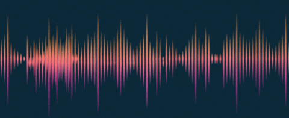

# Cours 13

## Zdog 

{.w-100}

[Zdog](https://zzz.dog/) est une petite librairie JavaScript pour créer des illustrations pseudo-3D “flat” (sans perspective) et animées, à partir de formes simples (cercles, rectangles, cylindres, etc.). 

Sa particularité est que les objets existent en 3D, mais sont rendus comme des formes 2D plates, ce qui donne un look illustratif plutôt qu’un rendu 3D réaliste.

Zdog n’est pas une vraie librairie 3D comme [threejs](https://threejs.org/), mais plutôt un petit moteur pseudo-3D très simplifié.

### Installation

```html title="index.html"
<html>
  <head>
    
    <script type="importmap">
      {
        "imports": {
          "zzz": "https://esm.sh/zdog"
        }
      }
    </script>
    <script type="module" src="./src/js/zdog.js"></script>
    
  </head>
  <body>

    <canvas class="zdog-canvas"></canvas>

  </body>
</html>
```

```css title="styles.css"
.zdog-canvas {
  width: 90vw;
  height: 90vh;
}
```

```js title="zdog.js (exemple le plus simple)"
import Zdog from "zzz";

const illo = new Zdog.Illustration({
    element: ".zdog-canvas",
    resize: true, // canvas responsive
});

new Zdog.Ellipse({
    addTo: illo,
    diameter: 100,
    stroke: 40,
    color: "#E49",
});

illo.updateRenderGraph(); // 👈 Dessine dans le canvas
```

<iframe height="300" style="width: 100%;" scrolling="no" title="Zdog - Getting started, zoom" src="https://codepen.io/tim-momo/embed/LENzMRw?default-tab=result&editable=true&theme-id=50173" frameborder="no" loading="lazy" allowtransparency="true">
      See the Pen <a href="https://codepen.io/tim-momo/pen/LENzMRw">
  Zdog - Getting started, zoom</a> by TIM Montmorency (<a href="https://codepen.io/tim-momo">@tim-momo</a>)
  on <a href="https://codepen.io">CodePen</a>.
      </iframe>

### Interactivité

```js title="zdog.js (exemple le plus simple)"
import Zdog from "zzz";

const illo = new Zdog.Illustration({
    // ...
    dragRotate: true, // 👈
});

// 👇 Nécessaire pour l'interactivité
function animate() {
    illo.updateRenderGraph();
    requestAnimationFrame(animate);
}
animate();
```

<iframe height="300" style="width: 100%;" scrolling="no" title="Zdog - Simple" src="https://codepen.io/tim-momo/embed/myPqwyz?default-tab=result&editable=true&theme-id=50173" frameborder="no" loading="lazy" allowtransparency="true">
      See the Pen <a href="https://codepen.io/tim-momo/pen/myPqwyz">
  Zdog - Simple</a> by TIM Montmorency (<a href="https://codepen.io/tim-momo">@tim-momo</a>)
  on <a href="https://codepen.io">CodePen</a>.
      </iframe>

#### Bloquer un axe

```js title="Fixe la rotation de l'axe x à 0"
import Zdog from "zzz";

const illo = new Zdog.Illustration({
    // ...
    dragRotate: true,
    onDragMove: function() {
        this.rotate.x = 0;
    },
});
```

### Animation

```js title="zdog.js (exemple le plus simple)"
import Zdog from "zzz";

const illo = new Zdog.Illustration({
    // ...
});

function animate() {
  illo.rotate.y += 0.03; // 👈 360° = 2π
  illo.rotate.x += 0.03; // 👈 360° = 2π
  illo.updateRenderGraph();
  requestAnimationFrame(animate);
}
animate();
```

<iframe height="300" style="width: 100%;" scrolling="no" title="Zdog - Animé" src="https://codepen.io/tim-momo/embed/ZYWayWp?default-tab=result&editable=true&theme-id=50173" frameborder="no" loading="lazy" allowtransparency="true">
      See the Pen <a href="https://codepen.io/tim-momo/pen/ZYWayWp">
  Zdog - Animé</a> by TIM Montmorency (<a href="https://codepen.io/tim-momo">@tim-momo</a>)
  on <a href="https://codepen.io">CodePen</a>.
      </iframe>

### Formes

{data-zoom-image}

Les [formes zdog](https://zzz.dog/shapes) (Rect, RoundedRect, Ellipse, Polygon, Shape, Hemisphere, Cone, Cylinder, Box) sont pour la plupart assez simple à mettre en place. Il suffit de consulter la documentation à cet effet.

### AnimeJS

Yep ! Ça se fait. Et assez facilement même.

Avec animejs, on peut animer des variables. Ces mêmes variables seront utilisés pour changer les transformations zdog.

<iframe height="300" style="width: 100%;" scrolling="no" title="Zdog - Animé D" src="https://codepen.io/tim-momo/embed/VYargVM?default-tab=result&editable=true&theme-id=50173" frameborder="no" loading="lazy" allowtransparency="true">
      See the Pen <a href="https://codepen.io/tim-momo/pen/VYargVM">
  Zdog - Animé D</a> by TIM Montmorency (<a href="https://codepen.io/tim-momo">@tim-momo</a>)
  on <a href="https://codepen.io">CodePen</a>.
      </iframe>

```js
import Zdog from "zzz";
import { animate, utils } from 'animejs';

let illo = new Zdog.Illustration({
  element: ".zdog-canvas",
  resize: true
});

let box = new Zdog.Box({
  addTo: illo,
  // ...
});


const rotationAnimation = { x: 0, y: 0, z: 0 };
const getRandomRotation = () => utils.random(0, Math.PI * 2, 2);

animate(rotationAnimation, {
  x: getRandomRotation,
  y: getRandomRotation,
  z: getRandomRotation,
  duration: 2000,
  loop: true,
  ease: "outElastic",
  onUpdate: () => {
    box.rotate.x = rotationAnimation.x;
    box.rotate.y = rotationAnimation.y;
    box.rotate.z = rotationAnimation.z;
  },
  onLoop: (self) => {
    self.refresh();
  }
});

function animateZDOG() {
  illo.updateRenderGraph();
  requestAnimationFrame(animateZDOG);
}

animateZDOG();
```

## Tone.js

{.w-100}

### Installation

```html title="index.html"
<html>
  <head>
    
    <script type="importmap">
      {
        "imports": {
          "tone.js": "https://esm.sh/tone@15.1.22",
        }
      }
    </script>
    <script type="module" src="./src/js/tonejs.js"></script>
    
  </head>
  <body>
    
    <button>♬</button>

  </body>
</html>
```

```js title="tonejs.js"
import * as Tone from "tone.js";

document.querySelector("button").addEventListener("click", async () => {
  await Tone.start();

  const synth = new Tone.Synth().toDestination();
  synth.triggerAttackRelease("C4", "8n");
});
```

<iframe class="aspect-6-1" height="300" style="width: 100%;" scrolling="no" title="Tone.js - simple" src="https://codepen.io/tim-momo/embed/MYyOEGW?default-tab=result&editable=true&theme-id=50173" frameborder="no" loading="lazy" allowtransparency="true">
      See the Pen <a href="https://codepen.io/tim-momo/pen/MYyOEGW">
  Tone.js - simple</a> by TIM Montmorency (<a href="https://codepen.io/tim-momo">@tim-momo</a>)
  on <a href="https://codepen.io">CodePen</a>.
      </iframe>

!!! example "Quelques notions importantes"

    Notation [anglo-saxonne](https://fr.wikipedia.org/wiki/D%C3%A9signation_des_notes_de_musique_suivant_la_langue) : 

    > C D E F G A B (Do Ré Mi Fa Sol La Si)<br> 
    > Ex: C4, le 4 représente l'octave

    Notation rythmique :
    
    * `1n` : ronde
    * `2n` : blanche (demi-note)
    * `4n` : noire (quart de note)
    * `8n` : croche (huitième de note)
    * `16n` : double-croche (seizième de note)

### Instruments

<iframe class="aspect-4-1" height="300" style="width: 100%;" scrolling="no" title="Tone.js - Instruments" src="https://codepen.io/tim-momo/embed/dPMZwxG?default-tab=result&editable=true&theme-id=50173" frameborder="no" loading="lazy" allowtransparency="true">
      See the Pen <a href="https://codepen.io/tim-momo/pen/dPMZwxG">
  Tone.js - Instruments</a> by TIM Montmorency (<a href="https://codepen.io/tim-momo">@tim-momo</a>)
  on <a href="https://codepen.io">CodePen</a>.
      </iframe>

```js title="tonejs.js"
import * as Tone from "tone.js";

document.querySelector("button").addEventListener("click", async () => {
  await Tone.start();

  const synth = new Tone.Synth().toDestination();
  synth.triggerAttackRelease("C4", "8n");

  const fmSynth = new Tone.FMSynth().toDestination();
  fmSynth.triggerAttackRelease("C3", "4n");

  const drum = new Tone.MembraneSynth().toDestination();
  drum.triggerAttackRelease("C2", "4n");

  // ...
});
```

:material-file-document: [Liste des instruments et leurs paramètres](https://tonejs.github.io/docs/r13/AMSynth).

#### Polyphonie / accords

<iframe class="aspect-6-1" height="300" style="width: 100%;" scrolling="no" title="Tone.js - simple" src="https://codepen.io/tim-momo/embed/jEqadad?default-tab=result&editable=true&theme-id=50173" frameborder="no" loading="lazy" allowtransparency="true">
      See the Pen <a href="https://codepen.io/tim-momo/pen/jEqadad">
  Tone.js - simple</a> by TIM Montmorency (<a href="https://codepen.io/tim-momo">@tim-momo</a>)
  on <a href="https://codepen.io">CodePen</a>.
      </iframe>

```js title="tonejs.js"
import * as Tone from "tone.js";

document.querySelector("button").addEventListener("click", async () => {
  await Tone.start();

  const synth = new Tone.PolySynth(Tone.Synth).toDestination();
  synth.triggerAttackRelease(["C4", "E4", "G4"], "4n");
});
```

### Suite

<iframe class="aspect-6-1" height="300" style="width: 100%;" scrolling="no" title="Tone.js - simple" src="https://codepen.io/tim-momo/embed/VYarQpp?default-tab=result&editable=true&theme-id=50173" frameborder="no" loading="lazy" allowtransparency="true">
      See the Pen <a href="https://codepen.io/tim-momo/pen/VYarQpp">
  Tone.js - simple</a> by TIM Montmorency (<a href="https://codepen.io/tim-momo">@tim-momo</a>)
  on <a href="https://codepen.io">CodePen</a>.
      </iframe>

```js title="tonejs.js"
import * as Tone from "tone.js";

const synth = new Tone.Synth().toDestination();

document.querySelector("button").addEventListener("click", async () => {
  await Tone.start();

  const now = Tone.now();
  synth.triggerAttackRelease("C4", "8n", now + 0.0);
  synth.triggerAttackRelease("D4", "8n", now + 0.25);
  synth.triggerAttackRelease("E4", "8n", now + 0.5);
  synth.triggerAttackRelease("F4", "8n", now + 0.75);
  synth.triggerAttackRelease("G4", "8n", now + 1.0);
  synth.triggerAttackRelease("A4", "8n", now + 1.25);
  synth.triggerAttackRelease("B4", "8n", now + 1.5);
  synth.triggerAttackRelease("c5", "2n", now + 1.75);
});
```

### Fichiers

<iframe class="aspect-6-1" height="300" style="width: 100%;" scrolling="no" title="Tone.js - série" src="https://codepen.io/tim-momo/embed/PwNOQmR?default-tab=result&editable=true&theme-id=50173" frameborder="no" loading="lazy" allowtransparency="true">
      See the Pen <a href="https://codepen.io/tim-momo/pen/PwNOQmR">
  Tone.js - série</a> by TIM Montmorency (<a href="https://codepen.io/tim-momo">@tim-momo</a>)
  on <a href="https://codepen.io">CodePen</a>.
      </iframe>
    
```js title="tonejs.js"
import * as Tone from "tone.js";

const player = new Tone.Player("https://tonejs.github.io/audio/berklee/gong_1.mp3").toDestination();

document.querySelector("button").addEventListener("click", async () => {
  await Tone.start();

  Tone.loaded().then(() => {
      player.start();
  });
});
```

:octicons-download-16: [Base de données de fichiers audio gratuits](https://pixabay.com/).

### Effets

<iframe class="aspect-4-1" height="300" style="width: 100%;" scrolling="no" title="Tone.js - FX" src="https://codepen.io/tim-momo/embed/emZeVEO?default-tab=result&editable=true&theme-id=50173" frameborder="no" loading="lazy" allowtransparency="true">
      See the Pen <a href="https://codepen.io/tim-momo/pen/emZeVEO">
  Tone.js - FX</a> by TIM Montmorency (<a href="https://codepen.io/tim-momo">@tim-momo</a>)
  on <a href="https://codepen.io">CodePen</a>.
      </iframe>

```js title="tonejs.js"
import * as Tone from "tone.js";

document.querySelector("button").addEventListener("click", async () => {

  const now = Tone.now();

  // Synth -> Delay -> Reverb -> 🔈
  const reverb = new Tone.Reverb(2).toDestination();
  const delay = new Tone.FeedbackDelay("8n", 0.5).connect(reverb);
  const synthWithReverb = new Tone.Synth().connect(delay);
  synthWithReverb.triggerAttackRelease("A4", "2n", now + 5);
});
```

:material-file-document: [Liste des effets et leurs paramètres](https://tonejs.github.io/docs/r13/AutoFilter).

!!! tip ".toDestination()"

    Imaginez le `.toDestination()` comme si on disait que c'était branché dans le haut-parleur 🔈.

## Typed.js

{.w-100}

### Installation 

```bash
npm i typed.js
```

```html title="index.html"
<html>
  <head>
    
    <script type="importmap">
      {
        "imports": {
          "typed.js": "./node_modules/typed.js/dist/typed.module.js",
        }
      }
    </script>
    <script type="module" src="./src/js/typedjs.js"></script>
    
  </head>
  <body>

    <p>
        <span id="typedjs-elem"></span>
    </p>

  </body>
</html>
```

```js title="typedjs.js"
import Typed from 'typed.js';

new Typed("#typedjs-elem", {
  strings: [
    "Typed.js est une <strong>librairie</strong> JavaScript.",
    "Elle <em>simule la frappe</em> de phrases, comme si quelqu’un les tapait au clavier."
  ],
  typeSpeed: 50,
  loop: true
});
```

<iframe height="300" style="width: 100%;" scrolling="no" title="Zdog - Animé C" src="https://codepen.io/tim-momo/embed/NPNwvXa?default-tab=result&editable=true&theme-id=50173" frameborder="no" loading="lazy" allowtransparency="true">
      See the Pen <a href="https://codepen.io/tim-momo/pen/NPNwvXa">
  Zdog - Animé C</a> by TIM Montmorency (<a href="https://codepen.io/tim-momo">@tim-momo</a>)
  on <a href="https://codepen.io">CodePen</a>.
      </iframe>

## Snippet du jour

<iframe class="aspect-16-9" height="300" style="width: 100%;" scrolling="no" title="Tone.js - tone viz" src="https://codepen.io/tim-momo/embed/azNVVoW?default-tab=result&editable=true&theme-id=50173" frameborder="no" loading="lazy" allowtransparency="true">
      See the Pen <a href="https://codepen.io/tim-momo/pen/azNVVoW">
  Tone.js - tone viz</a> by TIM Montmorency (<a href="https://codepen.io/tim-momo">@tim-momo</a>)
  on <a href="https://codepen.io">CodePen</a>.
      </iframe>

```bash
npm i tone-visualizer
```

```html
<!DOCTYPE html>
<html lang="fr">
<head>
    
    <script src="https://cdn.jsdelivr.net/npm/p5@2.1.1/lib/p5.js"></script>
    
    <script type="importmap">
      {
        "imports": {
          "tone.js": "https://esm.sh/tone@15.1.22",
          "tone-visualizer": "./node_modules/tone-visualizer/dist/visualizer.esm.js"
        }
      }
    </script>

    <script type="module" src="./src/js/script.js"></script>
</head>
<body>
    
    <div class="visualizer"></div>

</body>
</html>
```

```js
import * as Tone from "tone.js";
import { ToneVisualizer } from "tone-visualizer";

document.body.addEventListener("click", async () => {
    await Tone.start();

    const fmSynth = new Tone.FMSynth().toDestination();
    const viz = new ToneVisualizer('.visualizer', fmSynth, {Tone});
    fmSynth.triggerAttackRelease("C3", "4n");
});
```

## Exercices

<div class="grid grid-1-2" markdown>
  

  <small>Exercice - Tone.js</small><br> 
  **[La cinquième](./exercices/cinquieme/index.md){.stretched-link .back}**
</div>

<div class="grid grid-1-2" markdown>
  

  <small>Exercice - Zdog</small><br> 
  **[Éclipse](./exercices/eclipse/index.md){.stretched-link .back}**
</div>

## TP2
 
<div class="grid grid-1-2" markdown>
  

  <small>TP</small><br>
  **[HUD](./tp/hud/index.md){.stretched-link .back}**
</div>
