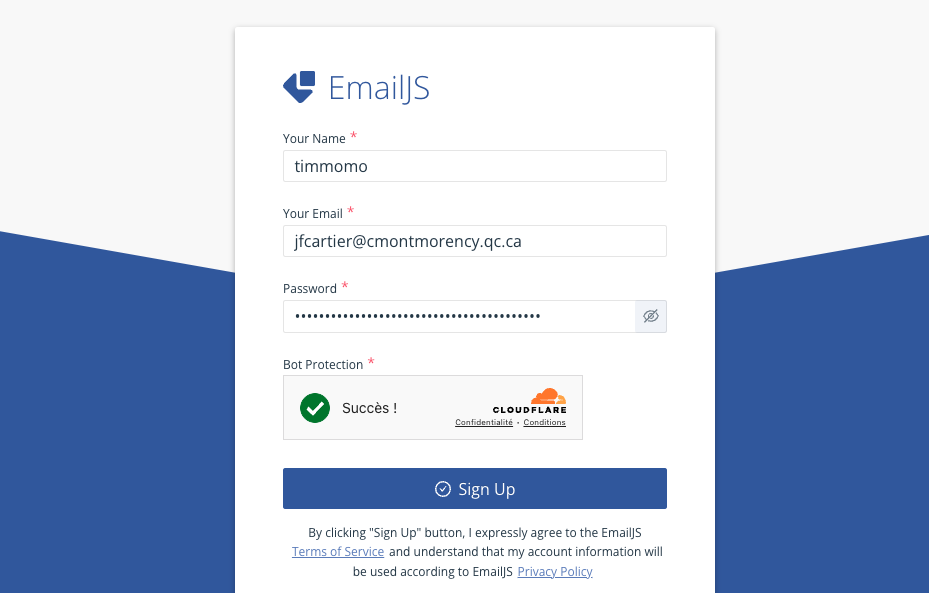
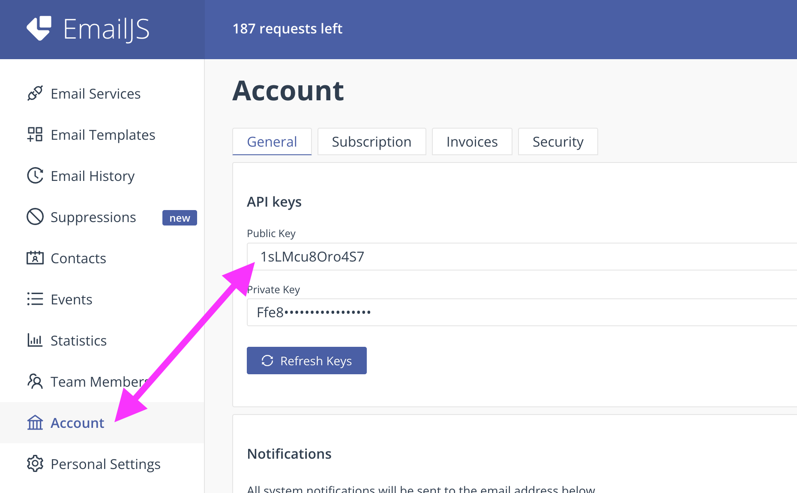
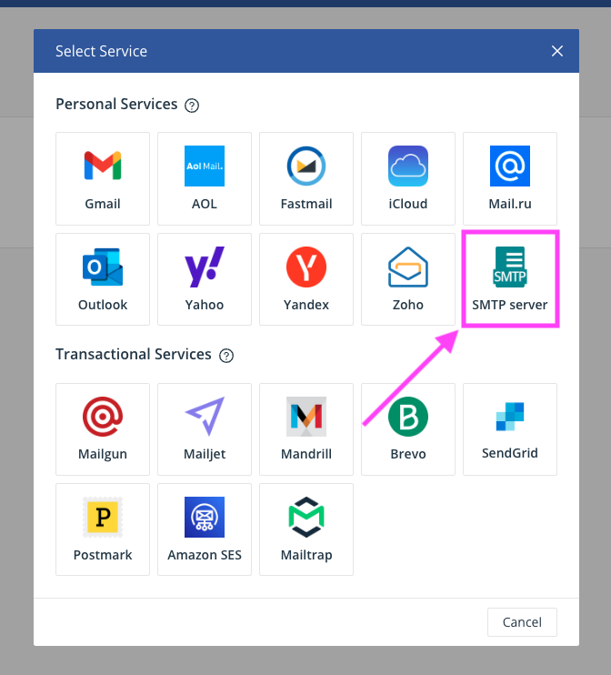
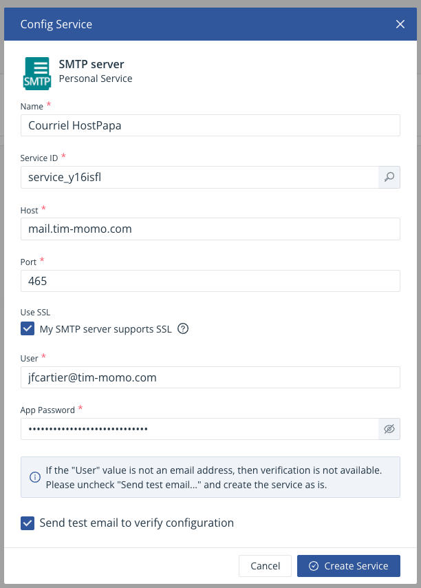
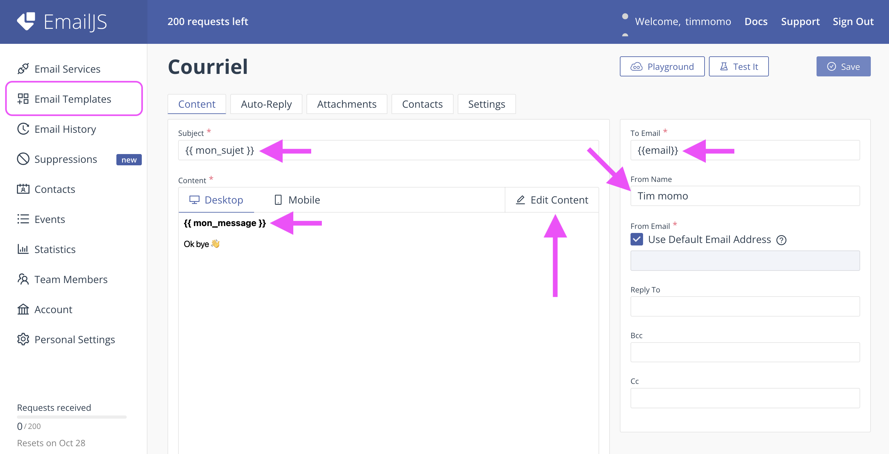
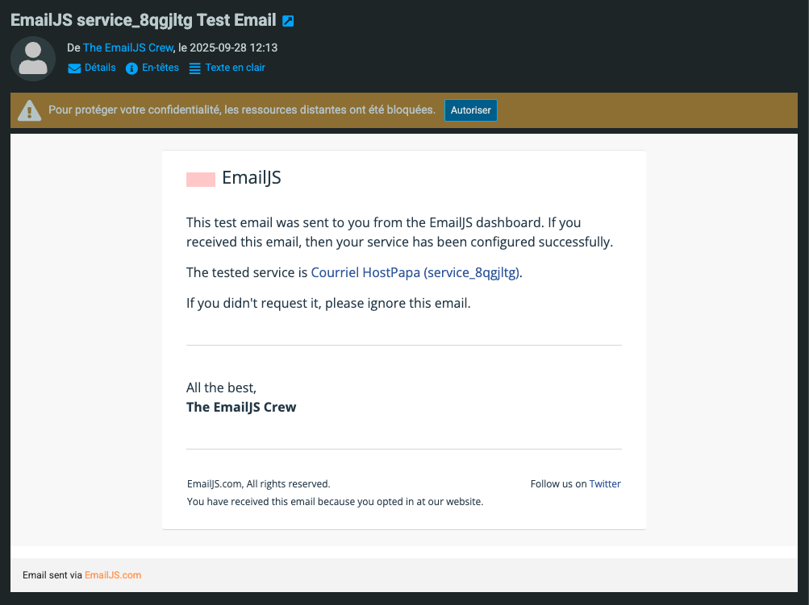

# Cours 13 | Séance de travail - projet final (1/2)

[STOP]

<!-- **Savoirs :** intégration de tous les acquis dans le projet (objectif intégrateur) -->

*[FTP]: File Transfer Protocol

{.w-100}

Place à la pratique&nbsp;! Cette séance et la suivante sont des **ateliers encadrés**&nbsp;: vous avancez votre **projet final** en autonomie, avec le soutien de l'enseignant. C'est ici que tout se rejoint.

!!! abstract "Le projet final"

    Vous réalisez le **site web promotionnel de votre jeu vidéo** - celui que vous développez en parallèle dans le cours d'**Interactivité ludique**. Vos propres médias de jeu (logo, captures d'écran, bande-annonce, musique et effets sonores) deviennent la matière première de votre site 🎮.

## Objectifs de l'atelier

- [ ] Rassembler et **optimiser les médias du jeu** (logo, captures, bande-annonce, sons - cours 8).
- [ ] Assembler l'interface avec **Tailwind + DaisyUI**&nbsp;: hero d'accueil, galerie de captures, section fonctionnalités (cours 2 à 4).
- [ ] Ajouter de l'**interactivité** avec Alpine.js - menu, onglets, sélecteur de thème (cours 7).
- [ ] **Animer** l'ambiance avec GSAP&nbsp;: apparition au défilement, parallaxe, bande-annonce mise en valeur (cours 9 à 11).
- [ ] Intégrer une **librairie** pertinente pour un site de jeu (ex.&nbsp;: **Howler** pour les effets sonores - cours 8&nbsp;; ou une librairie du cours 12).

!!! tip "Travaillez par composantes"

    Découpez votre site en morceaux (navbar, hero, galerie, formulaire…) et avancez-en un à la fois. C'est plus motivant et plus facile à déboguer.

## Ajouter un formulaire de contact avec EmailJS

Un site professionnel a souvent un **formulaire de contact** qui envoie un courriel. Comme on n'a pas de serveur, on utilise **[EmailJS](https://www.emailjs.com/)**, un service qui envoie le courriel directement depuis le navigateur.

### Créer un compte



Créez un compte à l'adresse&nbsp;: <https://dashboard.emailjs.com/sign-up>

### Récupérer la clé publique

La clé publique se trouve dans l'onglet **Account**.



### Configurer un Email Service





1. Pour le **name**, ajouter « Courriel HostPapa »
1. Laisser intact le **Service ID** généré automatiquement
1. Pour le **host**, ajouter « mail.tim-momo.com »
1. Pour le **port**, ajouter « 465 »
1. Cocher « My SMTP server supports SSL »
1. Pour le **user**, utiliser le courriel créé sur cPanel (cours 5)
1. Pour le **App Password**, le mot de passe de ce courriel
1. Cocher « Send test email to verify configuration »
1. Cliquer sur **Create Service**

### Configurer un Email Template



Les modèles contiennent des **variables** remplacées par le contenu envoyé en JavaScript.

1. Choisir le modèle de départ « One-Time Password »
1. Cliquer sur **Create Template**
1. **Edit Content** → **Design Editor**
1. Retirer le contenu et ajouter la variable `{{mon_message}}`
1. **Apply Changes**
1. Dans le champ **Subject**, ajouter `{{mon_sujet}}`
1. **Save**

### Utiliser EmailJS dans le site

```bash
npm install @emailjs/browser
```

```html title="Lier au HTML"
<head>
  ...
  <script src="./node_modules/@emailjs/browser/dist/email.min.js" defer></script>
  <script src="./assets/js/scripts.js" defer></script>
</head>
```

```js title="scripts.js"
// Initialisation
emailjs.init({ publicKey: "VOTRE_PUBLIC_KEY" });

// Déclencheur
const service_id = "service_xxx";
const template_id = "template_xxx";
const form = document.querySelector("form");

form.addEventListener("submit", (event) => {
  event.preventDefault(); // évite le rechargement de la page

  const templateParams = {
    mon_sujet: form.sujet.value,      // <input name="sujet">
    mon_message: form.message.value,  // <textarea name="message">
    email: form.to_mail.value,        // <input name="to_mail">
  };

  emailjs.send(service_id, template_id, templateParams)
    .then(() => {
      // ✅ Succès
    })
    .catch((err) => {
      // ❌ Erreur
    });
});
```

{data-zoom-image}

## Finitions optionnelles

Pour peaufiner votre site, deux petites librairies amusantes&nbsp;:

- **[Typed.js](https://mattboldt.com/demos/typed-js/)** - un effet de texte « machine à écrire ».
- **[Rough Notation](https://roughnotation.com/)** - des annotations dessinées à la main (souligné, encerclé…).
