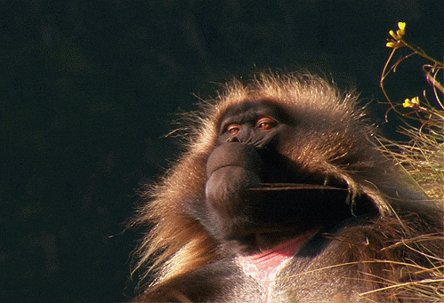

# Cours 14 | Séance de travail - projet final (2/2)

[STOP]

<!-- **Savoirs :** finalisation, validation, mise en ligne, préparation de la présentation -->

{.w-100}

Dernière ligne droite&nbsp;! Cette séance sert à **finaliser, valider et publier** le site promotionnel de votre jeu vidéo avant les présentations orales du cours 15.

## Checklist de finalisation

- [ ] Terminer l'intégration des dernières sections et médias.
- [ ] Vérifier que le site est **responsive** (mobile, tablette, bureau).
- [ ] Passer le HTML et le CSS au [validateur du W3C](https://validator.w3.org/) et corriger les erreurs (cours 8).
- [ ] Tester dans **plusieurs navigateurs** (Chrome, Firefox, Safari).
- [ ] Retirer les traces de débogage (`console.log`, `markers: true` de GSAP…).

## Mettre en ligne

- [ ] Générer la version de production&nbsp;: `npm run build` (cours 3).
- [ ] Déployer le dossier `dist/` - sur **GitHub Pages** ou sur **cPanel** (cours 5).
- [ ] Ouvrir l'URL publique et **tout revérifier** en ligne (liens, images, médias).

!!! warning "Le piège classique"

    Une **page blanche** sur GitHub Pages&nbsp;? Vérifiez le `base` dans `vite.config.js` (cours 5). Des images manquantes en ligne&nbsp;? Attention aux chemins et à la **casse** des noms de fichiers (le serveur, lui, distingue les majuscules).

## Préparer la présentation orale

Le cours 15 est consacré aux présentations. Profitez de la fin de l'atelier pour&nbsp;:

- [ ] Préparer une courte démonstration de votre site (2 à 3 minutes).
- [ ] Pouvoir **expliquer vos choix** techniques&nbsp;: pourquoi DaisyUI, quelles animations GSAP, quelle librairie et pourquoi.
- [ ] Avoir sous la main le **lien du site** et le **lien du dépôt GitHub**.

!!! success "Bravo 🎉"

    Vous avez parcouru tout le pipeline moderne&nbsp;: outillage (CLI, Git, Vite), intégration (Tailwind, DaisyUI), interactivité (Alpine), animation (GSAP), librairies spécialisées et mise en ligne. C'est exactement ce qu'on attend d'un intégrateur Web en 2026.
