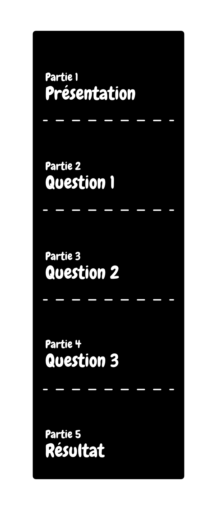

---
tags:
  - Exercice
---

[:material-arrow-u-left-top: Cours 12](../cours12.md){.breadcrumb}

# Projet de session 2 (PS2) : Si tu savais ce que je sais

Le projet de session #2 consiste à créer une page web dans lequel l'utilisateur aura à interagir avec un quiz, animé par **GSAP** et légèrement structuré par **Bootstrap 5**.

La page doit être structurée en 5 étapes : Présentation, Question 1, Question 2, Question 3 et Résultats.

Exemple :

**Présentation**

> Connaissez-vous l'histoire du Québec?

**Question 1**

> Qui est le premier premier ministre du Québec ? 
> A) Maurice Duplessis 
> B) François Legault 
> C) René Lévesque

**Question 2**

> En quelle année le premier CÉGEP fut créé ? 
> A) 1971 
> B) 1986 
> C) 1979 
> D) 1967

**Question 3**

> Quelle est la devise officielle du Québec 
> A) Je me souviens 
> B) Vive le Québec libre !

**Résultat**

> Bravo ! 
> Vous avez obtenu un score de 2/3 
> Voici les réponses ...

## Critères d’évaluation

Votre travail sera évalué en fonction des critères suivants :

**Structure avec Bootstrap 5** (1 points)

- [ ] Utilisation correcte du système de grille / conteneur Bootstrap.

**Animations avec GSAP** (6 points)

- [ ] Utilisation du plugin `ScrollTrigger` pour des animations déclenchées par le scroll. (2 points)
- [ ] Utilisation du plugin `SplitText` pour des animations textuelles. (1 point)
- [ ] Utilisation du plugin `Draggable` pour un aspect plus interactif. (1 point)
- [ ] Utilisation du plugin `MotionPath` pour des animations guidées par SVG. (1 point)
- [ ] Utilisation du plugin `MorphSVG` pour des animations de transformation. (1 point)

**Qualité de la programmation** (2 points)

- [ ] Code bien structuré, lisible et correctement indenté. (1 point)
- [ ] Quiz fonctionnel sans bogue majeur. (1 point)

**Créativité et esthétisme** (1 points)

- [ ] Design esthétique et attrayant, créativité dans la présentation du quiz.

Ce projet est évalué sur 10 points et compte pour **40% de votre note finale**.

!!! warning "Français"

    Des points de français pourraient être retirés jusqu’à concurrence de 10 %.

## Livrable

Votre PS2 devra contenir les fichiers suivants :

- [ ] un fichier `index.html`
- [ ] un fichier `styles.css` dans un dossier `src`
- [ ] un fichier `scripts.js` dans un dossier `src`
- [ ] un dossier `assets` (contenant tous vos médias)

Compressez votre dossier en format .`.zip` et déposez-le dans le devoir PS2 sur le groupe Teams.

Date de remise : **5 décembre 2024 à 23h59**
