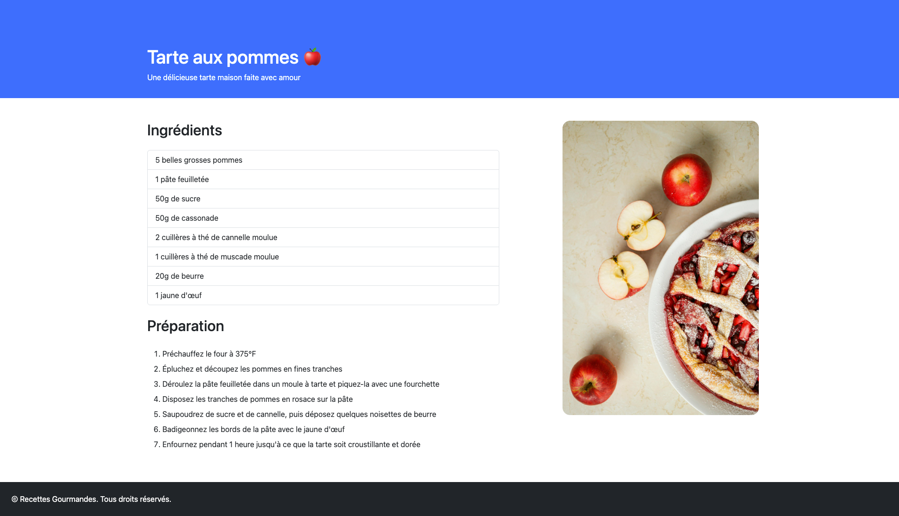
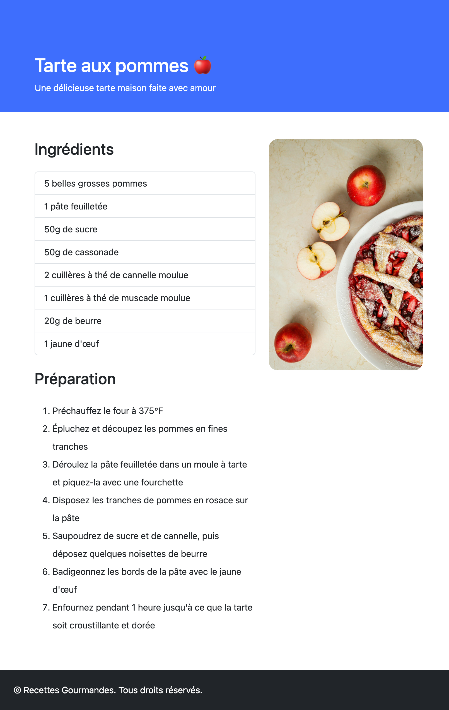
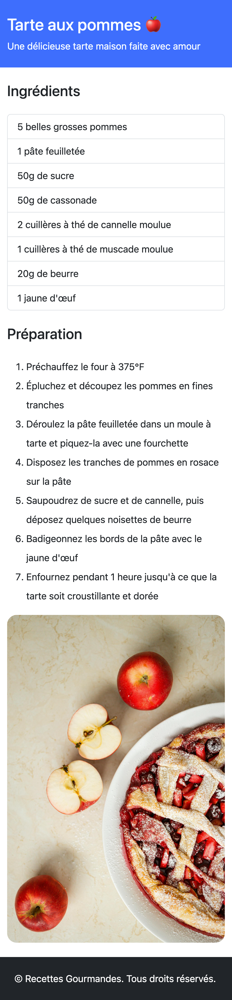

---
tags:
  - Devoir
  - Évaluation formative
---

# Tarte aux pommes

L'objectif de ce devoir est de reproduire le plus exactement possible le désultat attendu en écrivant uniquement du HTML et en utilisant le framework Bootstrap.

L’objectif de ce devoir est de **reproduire fidèlement le résultat attendu** en utilisant uniquement du **HTML** et les classes de **Bootstrap 5**. Aucun CSS ou JavaScript personnalisé n’est requis, ni permis d'ailleurs ;)  

Ce travail est une **évaluation formative** : il vise à tester la capacité à analyser une maquette et à traduire ses observations en code structuré via l'usage d'un framework.

## Résultat attendu

Le site doit s’adapter aux différents formats d’écran (**responsive**).

Voici le résultat attendu sur 3 breakpoints :

- Bureau

    ---

    {data-zoom-image}

- Tablette

    ---

    {data-zoom-image}

- Téléphone

    ---

    {data-zoom-image}

## Contenu du site Web

> Tarte aux pommes 🍎

> Une délicieuse tarte maison faite avec amour

> Ingrédients

> - 5 belles grosses pommes
> - 1 pâte feuilletée
> - 50g de sucre
> - 50g de cassonade
> - 2 cuillères à thé de cannelle moulue
> - 1 cuillères à thé de muscade moulue
> - 20g de beurre
> - 1 jaune d'œuf

> Préparation

> - Préchauffez le four à 375°F
> - Épluchez et découpez les pommes en fines tranches
> - Déroulez la pâte feuilletée dans un moule à tarte et piquez-la avec une fourchette
> - Disposez les tranches de pommes en rosace sur la pâte
> - Saupoudrez de sucre et de cannelle, puis déposez quelques noisettes de beurre
> - Badigeonnez les bords de la pâte avec le jaune d'œuf
> - Enfournez pendant 1 heure jusqu'à ce que la tarte soit croustillante et dorée

> © Recettes Gourmandes. Tous droits réservés.

[Image de la tarte :material-download:](./tarte-pommes.jpg)

## Instructions

- [ ] Crée un dossier **`devoir_01`**.  
- [ ] Dans ce dossier, crée un fichier **`index.html`**.  
- [ ] Ajoute une structure HTML de base.  
- [ ] Importe Bootstrap 5.3 via un CDN
- [ ] Programme la structure HTML pour obtenir le rendu demandé :
  - [ ] un header coloré avec titre et sous-titre
  - [ ] des conteneurs Bootstrap avec une grille responsive
  - [ ] une liste d’ingrédients présentée avec les bonnes classes
  - [ ] une liste ordonnée pour la préparation
  - [ ] une image responsive arrondie
  - [ ] un footer sombre
- [ ] Teste ton site en bureau, tablette et mobile pour vérifier que le rendu correspond.

## Remise

À remettre en format .zip

Nomenclature du .zip : [nom de famille]-[prénom]_[identifiant du travail] 
Exemple : **gilbert-charlene_devoir01.zip**

Date de remise : 15 septembre avant le début du cours
