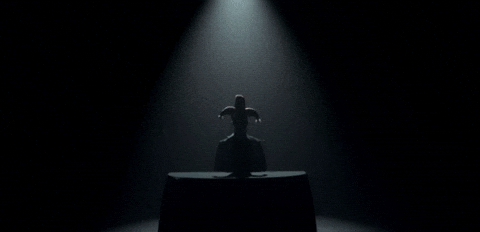
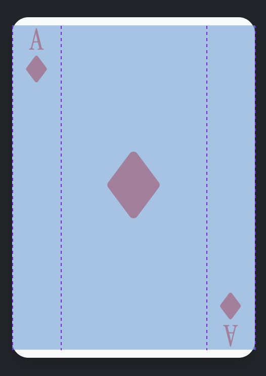

# Examen

{ .w-100 }

[^col]: Notion vue dans l'exercice Triskaïdékaphobie. Si vous n'y arrivez pas, créez 6 colonnes et ignorez la dernière.
[^cartephilo]: Notion vue dans l'exercice des cartes philosophiques.

Durée : **2 h 45**

Cet examen compte pour **25%** de la note finale.

L'objectif est de reproduire à l'identique le résultat attendu ci-dessous.

## Résultat attendu

### Structure d'une carte

{ data-zoom-image }

Chaque carte a une structure de grille **CSS** (pas Bootstrap) en trois parties. Les proportions en fraction sont de **1 - 3 - 1**.

!!! info "Au sujet des cartes"

    Le concept de carte ci-dessus ne fait pas référence au concept de carte Bootstrap.
    
    Il n'y a donc **pas** de classe Bootstrap `.card` à utiliser dans l'examen.

## Consignes

### Mise en place [5 points]

- [ ] Télécharger le [dossier de départ](./carre_depart.zip){download}
- [ ] Avec `npm`, installer les paquets « Bootstrap 5.3.8 » et « Bootstrap Icons 1.11.0 »
- [ ] Lier au fichier `index.html` les deux paquets situés dans le dossier `node_modules`
- [ ] Lier au fichier `index.html` les fichiers `styles.css` et `scripts.js` situés dans le dossier `src`
- [ ] Créer un fichier `.gitignore` pour ignorer le dossier `node_modules`
- [ ] Appliquer le thème sombre de Bootstrap au fichier `index.html`
- [ ] À l'aide de la bonne classe Bootstrap, appliquer au `body` un interlignage de 1
- [ ] À l'aide de la bonne classe Bootstrap, aligner au centre les textes de la page

#### CSS (styles.css) [2 points]

- [ ] Redéfinir la couleur rgb Bootstrap **Danger** par `rgb(255, 0, 0)`
- [ ] Ajouter une nouvelle classe `flip` qui permet de créer un effet miroir vertical à l'aide de la propriété `transform`

#### HTML (index.html) [9 points]

- [ ] Ajouter une `div` avec la classe Bootstrap qui permet d'ajouter un conteneur
- [ ] Ajouter dans la `div` le HTML nécessaire pour créer 5 colonnes ([^col])
  - [ ] Appliquer un espacement (gutter) de 1 entre les colonnes ([^cartephilo])

- [ ] Dans chaque colonne, ajouter une `div` pour l'affichage du dos d'une carte à jouer
  - [ ] Ajouter la classe `back`
  - [ ] Ajouter la classe `d-none`
  - [ ] Ajouter la classe Bootstrap pour appliquer une couleur de fond claire
  - [ ] Ajouter la classe Bootstrap pour appliquer des coins arrondis de 4
  - [ ] Ajouter la classe Bootstrap pour appliquer un padding de 2 sur tous les côtés
  - [ ] Dans la `div`, ajouter l'image `back.png`
  - [ ] Sur l'image, ajouter la classe Bootstrap nécessaire pour qu'elle ne puisse pas être plus large que son conteneur

- [ ] Dans chaque colonne, ajouter une autre `div` pour l'affichage de la carte à jouer
  - [ ] Ajouter la classe `carte`
  - [ ] Ajouter la classe Bootstrap pour appliquer une couleur de fond claire
  - [ ] Ajouter la classe Bootstrap pour appliquer une couleur de texte relative à la carte (pique et trèfle en noir, coeur et carreau en rouge _danger_ )
  - [ ] Ajouter la classe Bootstrap pour appliquer des coins arrondis de 4
  - [ ] Ajouter la classe Bootstrap pour appliquer un padding vertical de 2

### Carte à jouer [11 points]

- [ ] Pour chaque carte, ajouter 3 `div` pour chaque partie de la carte
- [ ] Pour chaque partie, ajouter le contenu textuel et les icônes Bootstrap de chacune des cartes (Suit diamond fill, Suit heart fill, Suit spade fill, Suit club fill)
- [ ] Au besoin, ajuster le contenu HTML des parties de la carte pour respecter le résultat attendu
- [ ] Agrandir les icônes du centre avec la classe Bootstrap qui permet d'afficher de très gros titres (la carte _2 de pique_ doit afficher de plus petites icônes au centre)
- [ ] Appliquer la classe flip créée plus tôt aux éléments qui doivent avoir un effet miroir vertical

- [ ] Dans `styles.css`, activer le système de grille à la classe `.carte`
  - [ ] Configurer les proportions comme indiquées dans le résultat attendu
  
- [ ] Avec des classes Bootstrap ou en css directement, aligner les parties de carte comme dans le résultat attendu

#### 2 de pique [4 points]

- [ ] Pour le 2 de pique, les icônes centrales doivent être configurées uniquement avec des classes Bootstrap flexbox

### JavaScript (scripts.js) [2 points]

- [ ] Lorsqu'on clique sur une colonne, retirer la classe `d-none` de la `div` « back » et ajouter la classe `d-none` à la `div` « carte »
- [ ] Faire le contraire lorsqu'on clique à nouveau sur la même colonne

### Mise en ligne [1 point]

- [ ] Sur votre serveur, téléverser vos fichiers (node_modules inclus) dans un dossier « carre »

!!! info "Méthode"

    Vous pouvez utiliser la méthode cPanel ou la méthode « ftp-simple »

### GitHub [1 point]

- [ ] Créer un repo public nommé « carre »
- [ ] Sauvegarder le code sur GitHub

### Qualité [2 points]

- [ ] Indenter correctement le code
- [ ] Respect des consignes

## Remise

Remettre dans Teams :

- le dossier complet (avec node_module) en format `zip` avec la nomenclature suivante : `nomfamille-prenom_examen01.zip`
- le lien vers votre site Web
- le lien vers votre repo GitHub
