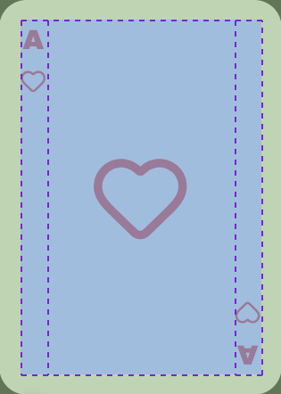

# Préparation à l'examen

{ .w-100 }

Doit être réalisé en **2 h 45**

## Résultat attendu

{.h-auto .w-100}

[Ouvrir dans le navigateur](https://tim-w3.github.io/carre-solution/){ .md-button .md-button--primary }

## Consignes

### Mise en place 

- [ ] [Accepter le devoir Classroom 50](https://classroom50.org/tim-w3/web-3/assignments/carre/accept)
- [ ] Cloner le dépôt avec GitHub Desktop
- [ ] Ouvrir le dossier cloné dans VSCode

- [ ] Installer les packages de départ du `package.json`
- [ ] Installer la fonte "Archivo Black" et l'activer sur le site
- [ ] Installer lucide pour les icônes

### Structure

- [ ] Ajouter une navbar DaisyUi de type « Navbar with title and icon »
- [ ] Remplacer le bouton par un Theme controller
- [ ] Sous la navbar, ajouter une colonne centrée 
- [ ] Dans celle-ci, ajouter une grille à 5 colonnes.

### Une carte

- [ ] Dans l'une des 5 colonnes ajouter une carte à jouer au ratio 5:7
- [ ] Appliquer un fond blanc
- [ ] Appliquer un texte rouge
- [ ] Arrondir les coins
- [ ] Configurer la carte en grille Tailwind
  - [ ] Colonne de gauche en `auto`
  - [ ] Colonne centrale en `1fr`
  - [ ] Colonne de droite en `auto`

  {data-zoom-image .w-20}

- [ ] Ajouter les contenus pour l'As de coeur
- [ ] Le texte doit être centré
- [ ] L'icône du centre doit être très grande et être alignée au centre
- [ ] La colonne de droite doit subir une rotation de 180deg et être alignée en bas

### Les cartes

- [ ] Copier-coller la carte pour les 5 colonnes en ajustant la couleur et l'icône: 
  - As de coeur (heart, rouge)
  - As de carreau (diamond, rouge)
  - As de pique (spade, noir)
  - As de trèfle (club, noir)
  - 2 de coeur (heart, rouge)
- [ ] 2 de coeur : le 2e coeur doit subir une rotation de 180deg

### Finition

- [ ] Appliquer des espacements afin de ressembler au résultat attendu.
- [ ] Sous le breakpoint `md`, les cartes s'affichent en 2 colonnes et non en 5
- [ ] Indenter correctement le code

### GitHub Pages

- [ ] Créer un nouveau repo GitHub nommé "carre-NOM-PRENOM" (Remplacer NOM et PRENOM par votre prénom)
- [ ] Y ajouter le contenu du build vite
- [ ] Configurer GitHub Pages pour mettre le build en ligne

- [ ] Dans un fichier README.md à la racine du devoir classroom, ajouter l'URL de votre site.

## Remise

- [ ] Un simple push du devoir classroom suffit pour effectuer la remise
