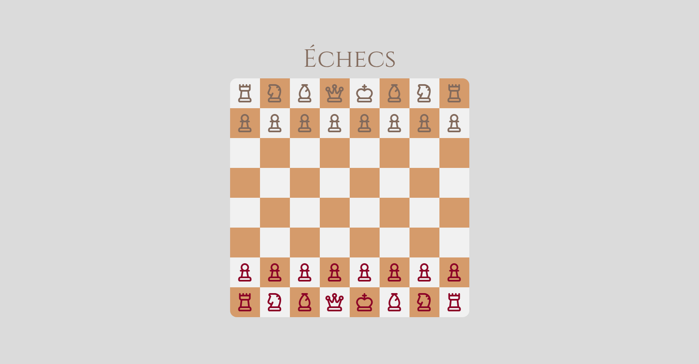

# Examen 01 — Reprise à la maison

{ .w-100 }

L'examen est sur 20 points et représente **25 %** de la note finale.

Examen de reprise à réaliser **à la maison**. À remettre au plus tard le **(date à préciser)**.

## Résultat attendu

[Ouvrir dans le navigateur](https://tim-w3.github.io/echecs-solution/){ .md-button .md-button--primary }

## Consignes 

### Mise en place :coin:

- [ ] [Accepter le devoir Classroom 50](https://classroom50.org/tim-w3/web-3/assignments/echecs/accept)
- [ ] Cloner le répertoire avec GitHub Desktop
- [ ] Ouvrir le dossier cloné dans VSCode
- [ ] Installer les packages de départ du `package.json`
- [ ] Lancer le serveur de développement Vite et ouvrir l'adresse affichée

### Packages :coin::coin:

Le site utilise trois _packages_ supplémentaires : **Fontsource** (Cinzel), **Lucide** et **Animate.css**.

- [ ] Installer les trois paquets
- [ ] Vérifier dans `package.json` que les trois _packages_ y sont
- [ ] Dans `style.css` :
  - [ ] Importer la fonte « Cinzel » et l'appliquer à tout le site (police `sans` par défaut)
  - [ ] Importer Lucide
  - [ ] Importer animate.css
- [ ] Effectuer un commit et un push

### Thèmes :coin::coin:

- [ ] Configurer DaisyUI avec le thème `autumn` (par défaut)
- [ ] Appliquer le thème `autumn` sur la balise `<html>`
- [ ] Le `<body>` occupe au minimum toute la hauteur de l'écran et utilise la couleur de fond `base-200`
- [ ] Effectuer un commit et un push

### Structure :coin::coin::coin::coin:

- [ ] Dans le `<body>`, ajouter un conteneur (`
`) qui occupe toute la hauteur de l'écran
- [ ] Ce conteneur est une colonne flex dont le contenu est centré horizontalement et verticalement, avec un espacement de `4` entre les éléments
- [ ] Y ajouter un titre 1 « Échecs »
  - [ ] Très grand texte (`6xl`)
  - [ ] Couleur `neutral` du thème
- [ ] Sous le titre, ajouter une `
` qui sera une grille à 8 colonnes (l'échiquier)
  - [ ] Aucun espacement entre les cellules
  - [ ] Largeur `xl`
  - [ ] Taille de texte `5xl` (pour les icônes)
  - [ ] Coins arrondis `box` du thème (le contenu qui dépasse est masqué)
- [ ] Effectuer un commit et un push

### Échiquier :coin::coin::coin::coin::coin:

- [ ] Dans la grille à 8 colonnes, ajouter 64 `div` carrées (ratio 1:1)
- [ ] Les cases alternent en damier :
  - [ ] Cases pâles : couleur de fond `base-100`
  - [ ] Cases foncées : couleur de fond `accent`
  - [ ] La case en haut à gauche est **pâle**
- [ ] Le contenu de chaque case est centré horizontalement et verticalement
- [ ] Placer les pièces avec les icônes Lucide suivantes : [`chess-rook`](https://lucide.dev/icons/chess-rook) (tour), [`chess-knight`](https://lucide.dev/icons/chess-knight) (cavalier), [`chess-bishop`](https://lucide.dev/icons/chess-bishop) (fou), [`chess-queen`](https://lucide.dev/icons/chess-queen) (dame), [`chess-king`](https://lucide.dev/icons/chess-king) (roi) et [`chess-pawn`](https://lucide.dev/icons/chess-pawn) (pion)
- [ ] Respecter la disposition et les couleurs du thème suivantes :

| Rangée | Contenu (de gauche à droite) | Couleur |
| :--- | :--- | :---: |
| **1** | tour, cavalier, fou, dame, roi, fou, cavalier, tour | `neutral` |
| **2** | 8 pions | `neutral` |
| **3 à 6** | cases vides | — |
| **7** | 8 pions | `primary` |
| **8** | tour, cavalier, fou, dame, roi, fou, cavalier, tour | `primary` |

- [ ] Effectuer un commit et un push

### Animations :coin::coin:

Les animations proviennent d'Animate.css

- [ ] Le titre apparaît en glissant du haut (`fadeInDown`)
- [ ] L'échiquier apparaît en glissant du bas (`fadeInUp`)
- [ ] Chaque **cavalier** apparaît en tournant (`rotateIn`)
- [ ] Effectuer un commit et un push

### Responsive :coin:

- [ ] Sous le breakpoint `md`, l'échiquier est caché (seul le titre reste affiché)
- [ ] À partir de `md`, l'échiquier s'affiche normalement
- [ ] Effectuer un commit et un push

### Finition :coin:

- [ ] Indenter correctement le code
- [ ] Effectuer un commit et un push

### GitHub Pages :coin::coin:

- [ ] Dans votre compte GitHub, créer un nouveau répertoire nommé « echecs-NOM-PRENOM » (remplacer NOM et PRENOM par votre nom et prénom)
- [ ] Y ajouter le contenu d'un build Vite (ex. : `index.html` et le dossier `/assets`)
- [ ] Configurer GitHub Pages pour mettre le build en ligne
- [ ] Dans le fichier `README.md` de l'examen, à la racine du devoir Classroom, ajouter l'URL du site
- [ ] Effectuer un commit et un push

## Remise

- [ ] Un simple push du devoir Classroom avant la date limite suffit pour effectuer la remise

Bravo c'est fini !
