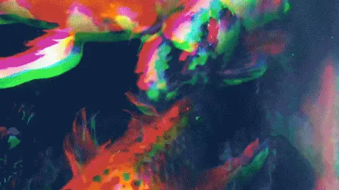

---
tags:
  - Exercice
---

# 1001 poissons

{.w-100}

L'objectif de cet exercice est de créer **1001 objets « Poisson »** à l'aide du concept de **classe JavaScript**.

Le but est de les afficher dans la console du navigateur.

Chaque poisson doit avoir :

* un nom unique
* une des couleurs suivantes : brun, vert, jaune, bicolore, tricolore
* un âge entre 3 et 100 ans

## Fun fact 🐠

_by_Nick_Hobgood.jpg){.w-50}

Tous les [poissons-clowns](https://fr.wikipedia.org/wiki/Poisson-clown) naissent sans sexe puis deviennent mâle.

Dans chaque colonie, on observe la hiérarchie suivante :

- **Femelle dominante** - la plus grosse
- **Mâle reproducteur** - le 2e plus gros
- **Mâles non reproducteurs** - les plus petits

Si la femelle meurt, le mâle dominant change de sexe et devient la nouvelle femelle !

On appelle ça de l'hermaphrodisme séquentiel.

## Consignes

Pour cet exercice, il faut utiliser une **boucle** pour créer les 1001 poissons et les ajouter dans un tableau.

- [ ] Crée une classe `Poisson` avec les propriétés `nom`, `couleur` et `age`. (Pas besoin de méthode pour cet exercice)
- [ ] Crée un **tableau vide** pour contenir les poissons
- [ ] Crée un **tableau contenant les couleurs possibles** : `["brun", "vert", "jaune", "bicolore", "tricolore"]`
- [ ] Crée une boucle qui s’exécute **1001 fois**
  - [ ] Dans la boucle, crée une variable `nom` et assigne-lui un nom unique (Ex.: `Poisson1`, `Poisson2`, …)
  - [ ] Dans la boucle, choisis une couleur aléatoire depuis le tableau des couleurs (avec `Math.random()` et `Math.floor()`)
  - [ ] Dans la boucle, génère un âge aléatoire entre 3 et 100
  - [ ] Instancie un nouvel objet `Poisson` avec ces valeurs et ajoute-le au tableau
- [ ] Affiche le tableau complet de poissons dans la console avec `console.log(poissons)`
- [ ] Vérifie ton code en affichant par exemple le **premier** et le **dernier poisson** du tableau

!!!example "Aide"

    ```js
    class Poisson {
      constructor(nom, couleur, age) {
        //
        //
        //
      }
    }

    // Variable : Tableau des poissons
    // Variable : Tableau des couleurs possibles
  
    // Boucle pour créer 1001 poissons
    for (let i = 1; i <= 1001; i++) {
      // Variable : Nom unique
      // Variable : Couleur aléatoire
      // Variable : Âge aléatoire entre 3 et 100 inclus
      // Variable : Instance de Poisson avec le nom, la couleur et l'âge

      // Ajouter l'instance au tableau des poissons
    }

    // Affiche tout le tableau dans la console
    // Afficher le premier poisson dans la console
    // Afficher le dernier poisson dans la console
    ```

[STOP]

SOLUTION

```js
// Classe Poisson
class Poisson {
  constructor(nom, couleur, age) {
    this.nom = nom;
    this.couleur = couleur;
    this.age = age;
  }
}

// Tableau des poissons
const poissons = [];

// Tableau des couleurs possibles
const couleurs = ["brun", "vert", "jaune", "bicolore", "tricolore"];

// Boucle pour créer 1001 poissons
for (let i = 1; i <= 1001; i++) {
  // Nom unique
  const nom = `Poisson${i}`;

  // Couleur aléatoire
  const couleur = couleurs[Math.floor(Math.random() * couleurs.length)];

  // Âge aléatoire entre 3 et 100 inclus
  const age = Math.floor(Math.random() * (100 - 3 + 1)) + 3;

  // Création d'un nouvel objet Poisson
  const poisson = new Poisson(nom, couleur, age);

  // Ajout au tableau
  poissons.push(poisson);
}

// Affiche tout le tableau
console.log(poissons);

// Vérification : premier et dernier poisson
console.log("Premier poisson :", poissons[0]);
console.log("Dernier poisson :", poissons[poissons.length - 1]);
```