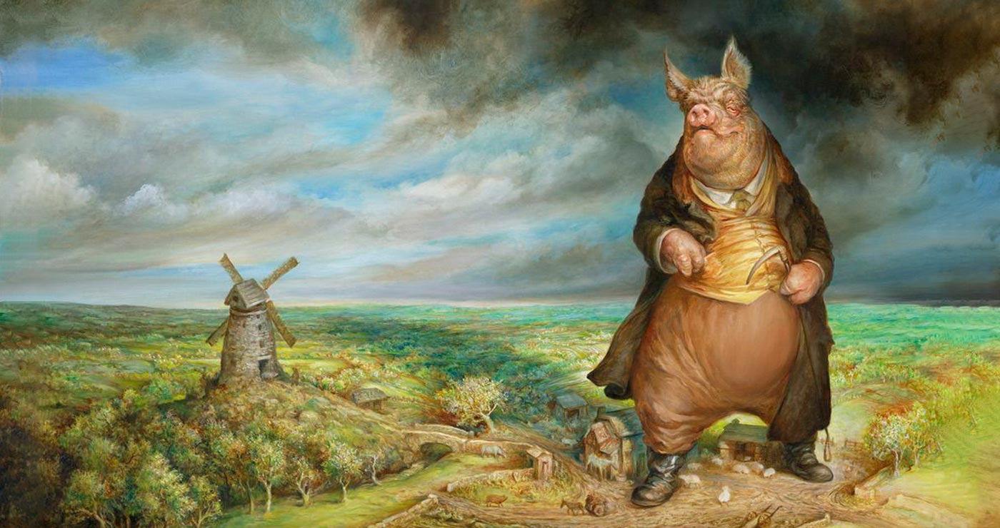

# La ferme des animaux

{.w-100}

> La Ferme des animaux de George Orwell est une fable politique où des animaux se révoltent contre leurs maîtres humains pour instaurer une société égalitaire.
> Peu à peu, les cochons prennent le pouvoir et reproduisent les mêmes injustices qu’ils dénonçaient, illustrant la corruption du pouvoir absolu.

L'objectif de cet exercice est de faire courser les animaux. Pour ce faire, vous devrez faire usage des notions suivantes : 

* `utils` : Pour appliquer un aléatoire sur la durée de l'animation
* `irregular` : Pour un lissage irrégulier (ease)
* `offsetWidth` : Pour déterminer la distance à parcourir sur l'axe des x
* `addEventListener` : Pour déclencher l'animation

## Résultat attendu

Cliquer pour démarrer l'animation

<iframe class="aspect-4-3" height="300" style="width: 100%;" scrolling="no" title="AnimeJS - La ferme des animaux" src="https://codepen.io/tim-momo/embed/emJywMo?default-tab=result&theme-id=50173" frameborder="no" loading="lazy" allowtransparency="true" allowfullscreen="true">
  See the Pen <a href="https://codepen.io/tim-momo/pen/emJywMo">
  AnimeJS - La ferme des animaux</a> by TIM Montmorency (<a href="https://codepen.io/tim-momo">@tim-momo</a>)
  on <a href="https://codepen.io">CodePen</a>.
</iframe>

## Consignes

- [ ] Effectuez l'installation de base pour un projet AnimeJS
- [ ] Télécharger les [images](./images.zip){ download }
- [ ] Dans `index.html`, ajouter une div avec la classe `race`
- [ ] Dans la div, ajouter les images des animaux

- [ ] Finir l'exercice 😜

## Indices

!!! tip "Ligne d'arrivé"

    La ligne d'arrivée est faite en CSS. Voici le code du background : 

    ```css title="CSS"
    background: repeating-conic-gradient(#fff 0 25%, #c00 0 50%) 0 0 / 25px 25px;
    ```

!!! tip "Durée"

    La durée de l'animation pour chaque image est **aléatoire**

!!! tip "Lissage"

    Le lissage de l'animation est **irrégulier** !!

