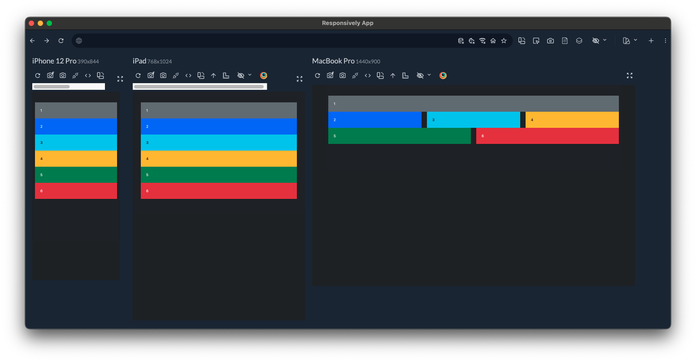
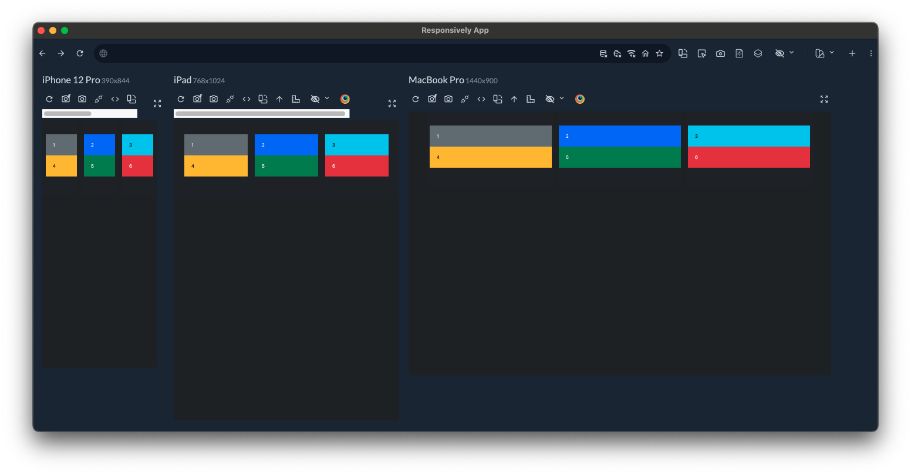
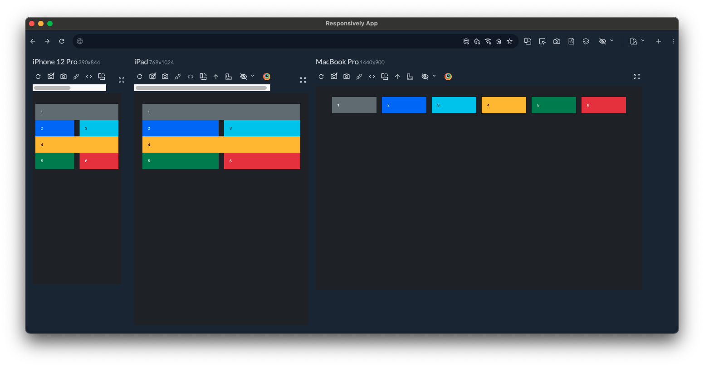
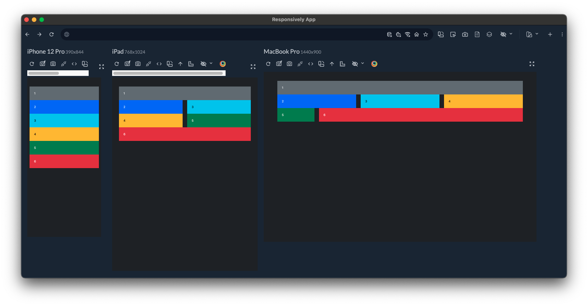
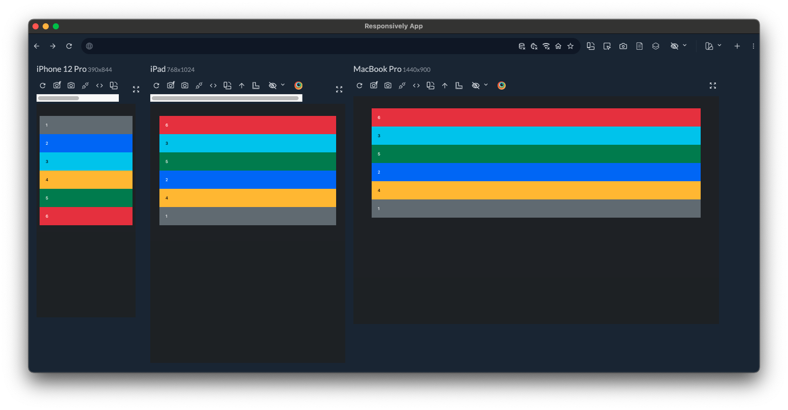

---
tags:
  - Exercice
---

[:material-arrow-u-left-top: Cours 3](../cours03.md){.breadcrumb}

# Casse-grille

Cet exercice comprend 8 mini défis. Tous les défis doivent être réalisés en HTML seulement.

Seulement 2 breakpoints doivent être utilisés : `md` et `xl`

Il n'y a donc pas de JavaScript ou de CSS à écrire.

Voici les 8 résultats à reproduire. Observez bien les détails.

## Défi 1

{data-zoom-image}

## Défi 2

{data-zoom-image}

## Défi 3

{data-zoom-image}

## Défi 4

{data-zoom-image}

## Défi 5

{data-zoom-image}

## Défi 6

{data-zoom-image}

## Défi 7

{data-zoom-image}

## Défi 8

{data-zoom-image}

## Instructions

- [ ] Créer un dossier "casse_grille"
- [ ] Créer un fichier pour chaque défi. Ex : `defi1.html`, `defi2.html`, `defi3.html`, etc.
- [ ] Dans `defi1.html`, créer une structure HTML de base
- [ ] Importez le css de Bootstrap 5 : `<link href="https://cdn.jsdelivr.net/npm/bootstrap@5.3.3/dist/css/bootstrap.min.css" rel="stylesheet" integrity="sha384-QWTKZyjpPEjISv5WaRU9OFeRpok6YctnYmDr5pNlyT2bRjXh0JMhjY6hW+ALEwIH" crossorigin="anonymous">
`
- [ ] Mettre le site en mode sombre
- [ ] Programmer la structure HTML du défi #1 (cette structure sera la même pour tous les défis)
- [ ] Copier/coller le contenu du fichier `defi1.html` dans les autres `.html`
- [ ] Compléter le défi 1
- [ ] Compléter le défi 2
- [ ] Compléter le défi 3
- [ ] Compléter le défi 4
- [ ] Compléter le défi 5
- [ ] Compléter le défi 6
- [ ] Compléter le défi 7
- [ ] Compléter le défi 8
