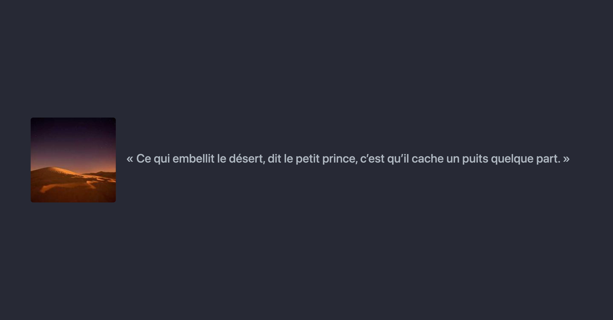
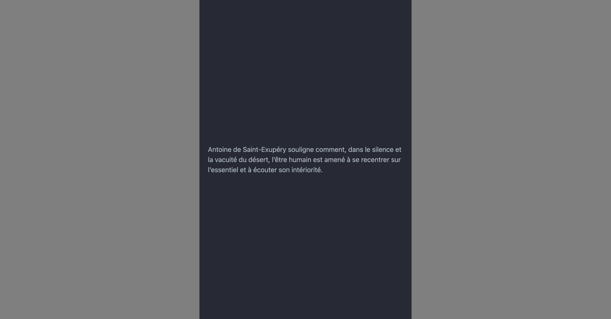

---
tags:
  - Exercice
---

[:material-arrow-u-left-top: Cours 4](../cours04.md){.breadcrumb}

# Le petit prince

Le but de cet exercice est de mettre en pratique l'usage des classes Boostrap display dans un contexte responsive.

## Résultat attendu

Version Desktop
{data-zoom-image}

Version Mobile
{data-zoom-image}

## Instructions

- [ ] Effectuez un fork du [Codepen de départ](https://codepen.io/tim-momo/pen/LYKvOay??editors=1000)
- [ ] Analysez attentivement le code HTML et sa structure
- [ ] Ajoutez des classes CSS dans le HTML uniquement aux endroits où il est inscrit `class=""`
- [ ] Pour la version Desktop (breakpoint `md` et plus grand), cachez le texte qui commence par « Antoine de Saint-Exupéry »
- [ ] Pour la version Desktop, assurez vous que la grosseur du texte soit celle d'un titre 3
- [ ] Pour la version Desktop, assurez vous que le texte soit aligné verticalement avec l'image
- [ ] Pour la version Desktop, la colonne de l'image doit être configuré à `col-auto`. L'autre colonne doit simplement avoir la classe `col`
- [ ] Pour la version Mobile, cachez les colonnes et afficher le texte qui commence par «Antoine de Saint-Exupéry»
