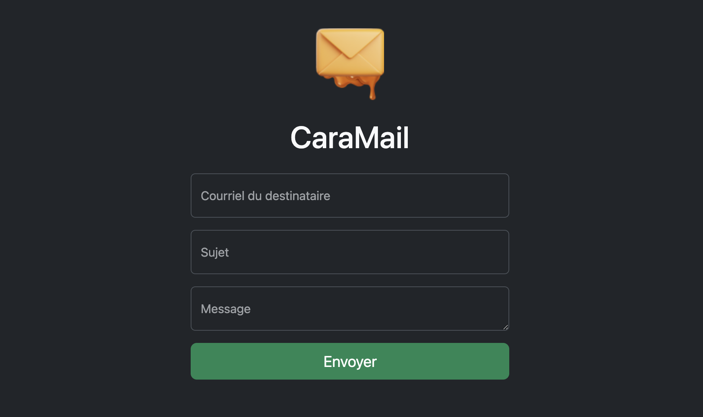

---
tags:
  - Exercice
  - Bootstrap
  - EmailJS
  - JavaScript
  - FTP
---

# Caramail

{ .w-100 data-zoom-image }

> Savez-vous faire du caramel à sec ?
> Il suffit de faire chauffer du sucre dans une casserole !
> Il passe du transparent au blond, au doré, puis à l'ambré. On s'arrête là. Si on le laisse trop longtemps, il devient amer.
> Attention ! Il ne faut pas remuer avec une cuillère, sinon ça cristallise et ça forme des grumeaux.

L'objectif de cet exercice est de mettre en pratique les notions suivantes dans un même projet :

- Bootstrap
- EmailJS
- JavaScript
- FTP (cPanel)

## Résultat attendu

## Consignes

### Mise en place

- [ ] Créer un dossier nommé « CaraMail »
- [ ] [Télécharger le logo](./caramail.png){ download } et placer l'image dans un sous-dossier `assets/images`
- [ ] À la racine du dossier « CaraMail », créer un fichier `index.html` et y ajouter une structure HTML de base
- [ ] Toujours à la racine, installer avec npm ces deux paquets :
  - `bootstrap`
  - `@emailjs/browser`
- [ ] Lier les fichiers CSS et JavaScript de Bootstrap dans la page `index.html`
- [ ] Lier le script JavaScript d'EmailJS dans la page `index.html`
- [ ] Créer un fichier `scripts.js` dans le sous-dossier `src/js`
- [ ] Lier `scripts.js` dans la page `index.html`. Vérifier la liaison en ajoutant `console.log(123);`, puis en regardant la console du navigateur

### Bootstrap

- [ ] Dans `index.html`, créer la structure HTML nécessaire pour reproduire le layout du résultat attendu
  - [ ] Ajouter le logo
  - [ ] Ajouter un titre de niveau 1 avec le texte « CaraMail »
  - [ ] Ajouter un champ de type `email` pour le « Courriel du destinataire »
  - [ ] Ajouter un champ de type `text` pour le « Sujet »
  - [ ] Ajouter un `textarea` pour le « Message »
  - [ ] Ajouter des [labels flottants](https://getbootstrap.com/docs/5.3/forms/floating-labels/) sur les champs (consulter la documentation Bootstrap)
  - [ ] Ajouter un bouton de type `submit` avec le texte « Envoyer »
  - [ ] Sous le bouton, ajouter une `div` avec l'attribut `id="status"` (on va modifier son contenu en js)

### cPanel

- [ ] Se connecter à votre cPanel
- [ ] Créer un compte de messagerie
- [ ] Consulter la boîte de réception pour vérifier que tout fonctionne

### EmailJS

- [ ] [Créer un compte EmailJS](https://dashboard.emailjs.com/sign-up)
- [ ] Noter votre clé publique (_Public Key_)
- [ ] Créer un nouveau service avec un serveur SMTP et les informations de votre messagerie cPanel.
- [ ] Noter l'identifiant du service (_Service ID_)
- [ ] Créer un nouveau template
- [ ] Renommer le nom du template par « Courriel »
- [ ] Adapter la mise en page du template à votre goût personnel
- [ ] Ajouter une variable pour le sujet et une autre pour le contenu du courriel
- [ ] Enregistrer
- [ ] Noter l'identifiant du template (_Template ID_)

### JavaScript

- [ ] Dans `scripts.js` :
  - [ ] Récupérer le formulaire (`form`) dans une variable
  - [ ] Récupérer l'élément `id="status"` dans une variable (barre de statut)
  - [ ] Stocker la clé publique EmailJS dans une variable
  - [ ] Stocker l'identifiant du service EmailJS dans une variable
  - [ ] Stocker l'identifiant du template EmailJS dans une variable
  - [ ] Initialiser EmailJS avec la clé publique
  - [ ] Ajouter un écouteur d'événement (`submit`) au formulaire :
    - [ ] Appeler `event.preventDefault()` pour empêcher l'envoi par défaut
    - [ ] Désactiver le bouton d'envoi (`disabled`)
    - [ ] Afficher « Envoi en cours... » dans la barre de statut
    - [ ] Envoyer un e‑mail via EmailJS avec les données du formulaire correctement associées aux variables EmailJS
    - [ ] Gérer les promesses (`then`, `catch`, `finally`) :
      - [ ] `then` : écrire « Message envoyé ✅ » dans la barre de statut
      - [ ] `catch` : écrire « Erreur d'envoi ❌ » dans la barre de statut
      - [ ] `finally` : réactiver le bouton d'envoi
  - [ ] Tester

### FTP

- [ ] Avec l'extension VSCode `ftp-simple` (vérifier le nom exact), connectez-vous à votre serveur
- [ ] Transférer le dossier « CaraMail » sur votre serveur afin qu'il soit visible sur Internet
- [ ] Tester l'URL publique
- [ ] Tester le formulaire
- [ ] Célébrer votre beau travail 🥳
