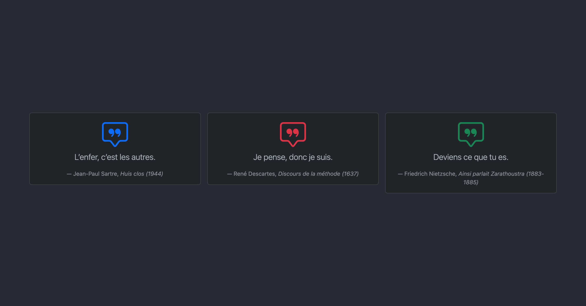
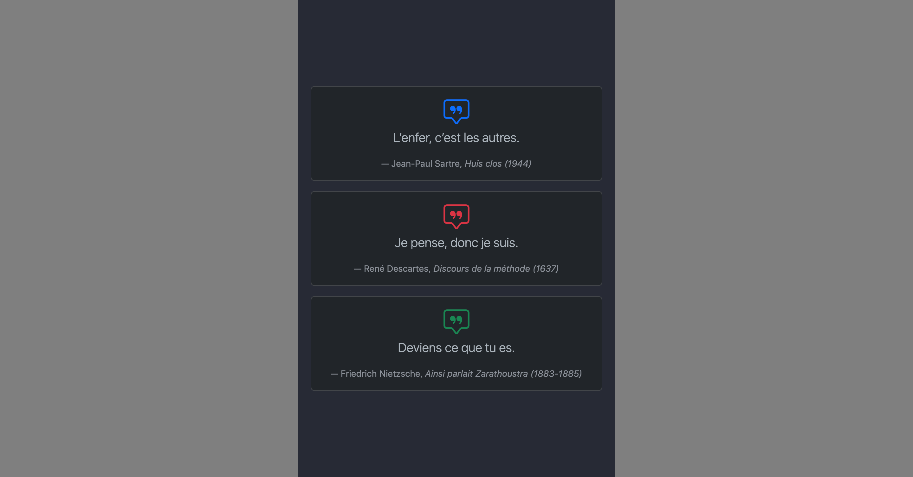

---
tags:
  - Exercice
---

# Cartes philosophiques

{.w-100}

Reproduire le résultat attendu en utilisant uniquement des classes Bootstrap 5 :

* Alignement du texte · Typographie (tailles) · Couleurs · Espacements
* Conteneur · Grille · Cartes · Bootstrap Icons · Breakpoints

!!! warning "Important"

    Mise à part l'ajout des librairies dans le `<head>`, il ne faut pas ajouter de nouveau HTML.
    Modifiez uniquement les attributs `class=""` déjà présents dans le code.

## Résultat attendu

Version Desktop
{data-zoom-image}

Version Mobile
{data-zoom-image}

## Instructions

- [ ] Télécharger le [document de départ](./philo_starter.zip){download}
- [ ] Avec `npm`, installez bootstrap et bootstrap-icons
- [ ] Liez les deux librairies à votre HTML dans le `<head>`

- [ ] Analysez attentivement le code HTML et sa structure
- [ ] Ajoutez une classe `container` au `div` qui englobe tout le code
- [ ] À l’intérieur du conteneur, ajoutez une class `row` et appliquez-lui la classe `g-3`

  !!! success "Nouveauté !"

      `g-3` définit l’espacement (_gutter_) entre les colonnes

- [ ] Centrez tous les textes avec une classe Bootstrap prévue à cet effet
- [ ] Il doit y avoir 3 colonnes en tout. Utilisez `col-md-4` pour qu’elles se mettent côte à côte dès le breakpoint `md` et un par dessus l'autre sous le breakpoint `md`
- [ ] Chaque colonne contient une Carte Bootstrap. Ajoutez le nécessaire pour que ce soit le cas
- [ ] Dans chaque carte, il y a un `
` pour son "body" (voir documentation pour connaître la classe à utiliser)
- [ ] La balise `<i>` contient l'[icône bootstrap](https://icons.getbootstrap.com/icons/chat-square-quote/). L'icône doit avoir la classe `display-3` pour s'afficher aussi grande. N'oubliez pas de changer sa couleur 🔵🔴🟢
- [ ] La citation se trouve dans le `
` du `<blockquote>`. Elle doit être en `lead`.
- [ ] Le `<footer>` dans le `<blockquote>` doit afficher son texte en petit format et en couleur "muted" (voir la documentation Bootstrap pour savoir comment faire).
