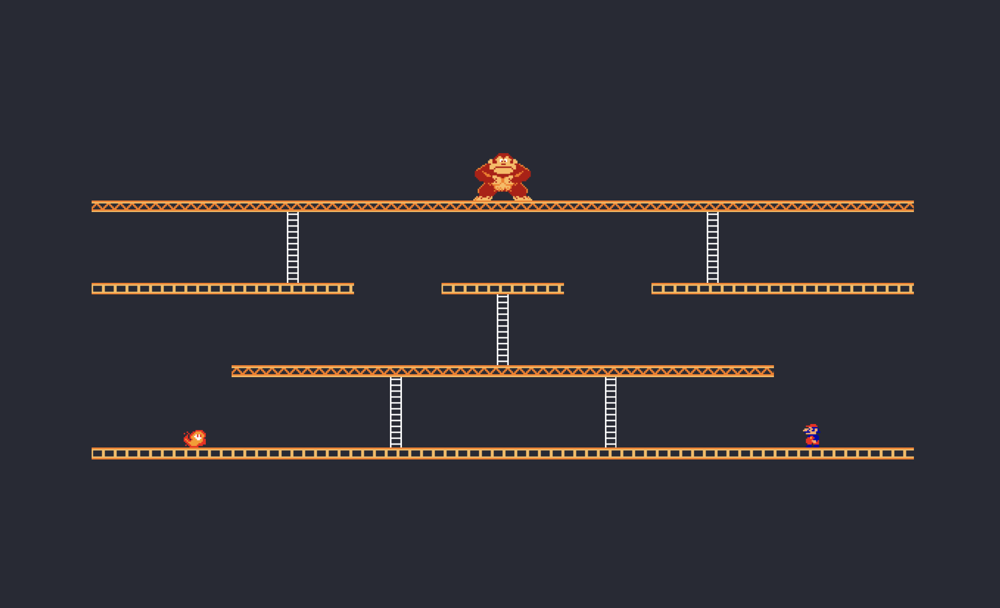

---
tags:
  - Exercice
---

# Donkey Kong

Le but de cet exercice est de reproduire le résultat attendu avec des classes Bootstrap.

!!! warning "Important"

    Ne pas ajouter de nouveau HTML. Modifier uniquement les attributs `class=""` déjà présents dans le code.

## Résultat attendu

{data-zoom-image}

## Instructions

- [ ] Effectuez un fork du [CodePen de base](https://codepen.io/tim-momo/pen/oNrOwPW?editors=1100)
- [ ] Analysez attentivement le code HTML et sa structure
- [ ] Prendre connaissance et comprendre les classes `.floor1`, `.floor2` et `.ladder` qui figurent dans le CSS

Voici la liste de toutes les classes dont vous aurez besoin :

- [ ] `container`
- [ ] `row`
- [ ] `col`
- [ ] `col-8`
- [ ] `col-4`
- [ ] `col-2`
- [ ] `offset-1`
- [ ] `offset-2`
- [ ] `text-center`
- [ ] `d-flex`
- [ ] `justify-content-center`
- [ ] `justify-content-around`
- [ ] `align-items-end`
- [ ] `floor1`
- [ ] `floor2`
- [ ] `ladder`
