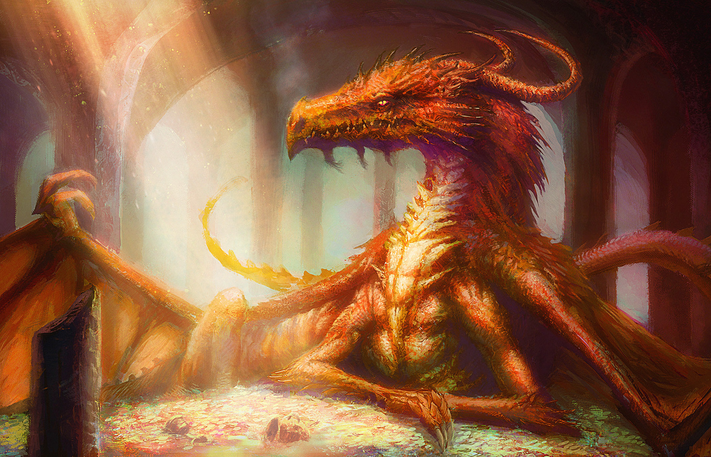
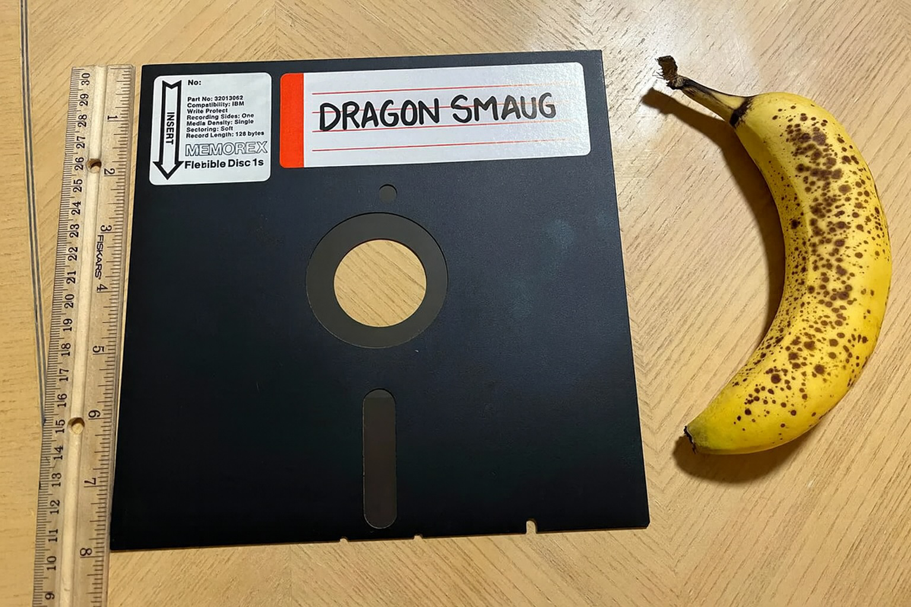

---
tags:
  - Exercice
  - npm
---

# Dragon Smaug

{.w-100}

> Le dragon Smaug est le célèbre dragon dans Bilbo le Hobbit (de J.R.R. Tolkien), avide, redoutable et immensément intelligent, qui garde le trésor des Nains dans la Montagne Solitaire.

> JF : Dragon Smaug c'est aussi le premier jeu d'ordinateur que j'ai joué. Ça se jouait sur une disquette flexible 8 pouces et c'était vraiment juste un jeu de type [snake](https://fr.wikipedia.org/wiki/Snake_(genre_de_jeu_vid%C3%A9o)) sans aucun lien avec un dragon. Fallait se l'imaginer 😅.

> {data-zoom-image .w-50}
<!-- https://www.reddit.com/r/vintagecomputing/comments/1b6ekgy/found_this_giant_floppy_in_my_late_fathers_files/ -->

L'objectif de cet exercice est d'installer le jeu avec npm sur son ordinateur et d'y faire un score plus élevé que 15.

## Consignes

- [ ] Créer un dossier et nommez le dragon-smaug
- [ ] En ligne de commande, déplacez-vous dans le dossier à l'aide de la commande `cd`
- [ ] Initialisez npm dans le dossier avec `npm init -y`
- [ ] Installez le paquet Dragon Smaug : `@jfcmontmorency/dragon-smaug`
- [ ] Créer un fichier index.html avec une structure html de base
- [ ] Dans body, ajouter le html suivant :
    ```html
    <h1>Dragon Smaug</h1>
    <p>Flèches ou WASD pour bouger</p>
    <div id="game"></div>
    ```
- [ ] Liez le css du paquet `@jfcmontmorency/dragon-smaug` (dans le dossier `dist`)
- [ ] Liez le script du paquet `@jfcmontmorency/dragon-smaug` (dans le dossier `dist`)
- [ ] Finalement, ajouter le code JavaScript suivant à votre projet :
    ```js
    const game = DragonSmaug.mount('#game', {
        cols: 16,
        rows: 8,
        speedMs: 140,
        onGameOver(score) { console.log("Score final:", score); }
    });
    game.start();
    ```
- [ ] Jouez et essayez d’obtenir un score supérieur à 15
