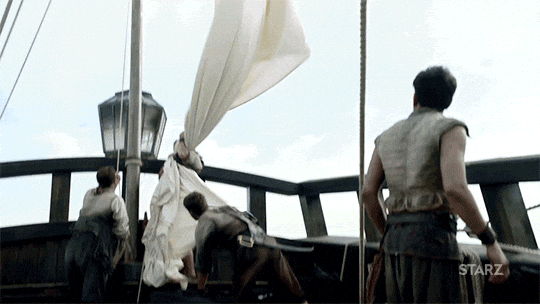
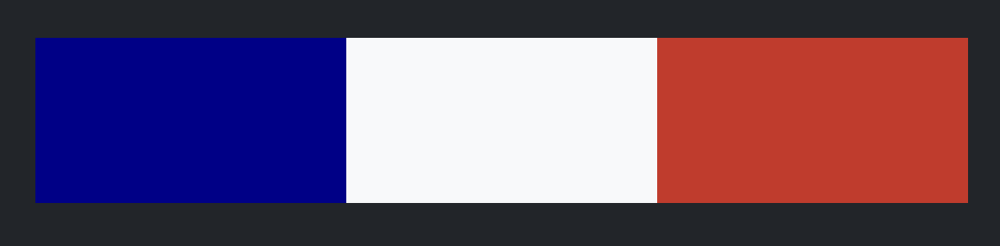
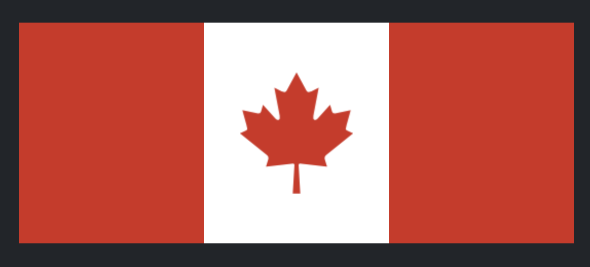
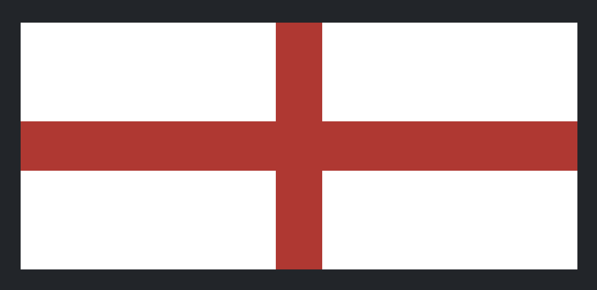
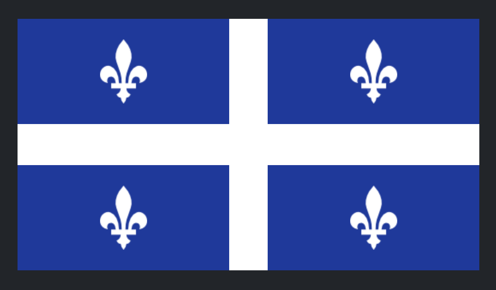

---
tags:
  - Exercice
  - Bootstrap
---

# Drapeau

{.w-100}

L'objectif de cet exercice est de reproduire des drapeaux avec le système de grille Bootstrap.

## Résultats attendus

### France

Bleu : #00008C (0, 0, 140)

Rouge : #CF2C20 (207, 44, 32)

### Canada

Rouge : #d52b1e (213, 43, 30)

### Angleterre

Rouge : #BE2A2A (190, 42, 42)

### Québec

Bleu : #153AA0 (21, 58, 160)

## Consignes

Chacun des drapeaux demandera à surcharger les couleurs Bootstrap.
Dans la partie HTML du codepen, vous ne serez autorisé de ne modifier que les attributs html (class="").

- [ ] Effectuez un fork du [Codepen de départ - France](https://codepen.io/tim-momo/pen/XJXJPJo/849b935fcc840c7b460dae7139c51d32)
- [ ] Effectuez un fork du [Codepen de départ - Canada](https://codepen.io/tim-momo/pen/KwVwxpo/6808972557d3d8c9915927f2a30f0c6d)
- [ ] Effectuez un fork du [Codepen de départ - Angleterre](https://codepen.io/tim-momo/pen/PwZwdqW/d71ba8e9fa59094201a3c5c3d88dd7c2)
- [ ] Effectuez un fork du [Codepen de départ - Québec](https://codepen.io/tim-momo/pen/MYKYqwB/858f829529eac6452e382caf6775d8bc)