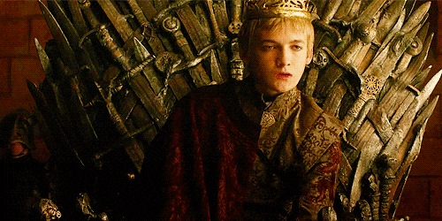

---
tags:
  - Exercice
---

# L’enfant roi

{.w-100}

L'objectif de cet exercice est d'utiliser à bon escient la notion de **display flex** et la notion d'**justification flex** en Bootstrap.

!!! warning "Important"

    Ne pas ajouter de nouveau HTML. Modifier uniquement les attributs `class=""` déjà présents dans le code.

## Résultat attendu

<figure markdown>
{data-zoom-image}
<figcaption>💅 Il se peut que les icônes soient un peu différentes que dans le résultat attendu. Vous pouvez ignorer cette différence.</figcaption>
</figure>

## Instructions

* [ ] Effectuez un fork du [CodePen de base](https://codepen.io/tim-momo/pen/vYqMWGg)
* [ ] Ajoutez les classes `d-flex` et les justifications appropriées afin de reconstruire la figure de l’enfant roi
