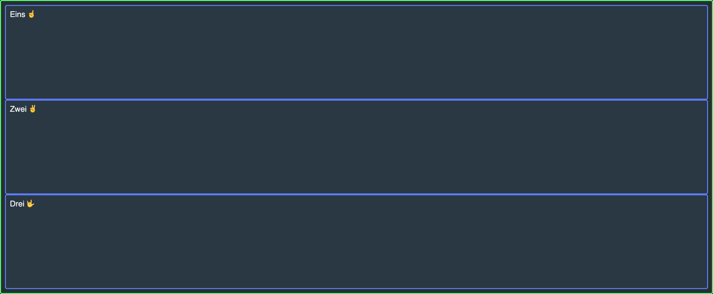

---
tags:
  - Exercice
  - Grid
---

# La base

L'objectif de cet exercice est d'introduire la notion de grille en css.

## Résultat attendu 

{data-zoom-image}

## Consigne

- [ ] Effectuer un _fork_ du [Codepen de départ](https://codepen.io/editor/tim-momo/pen/01a03ebb-e8a6-71df-933f-735e33b49585).

  !!! note "Le _fork_ est essentiel pour avoir les points attribués aux exercices"

- [ ] Activer la mise en forme de grille en css
- [ ] Ajouter une hauteur équivalente à `100%` de la [hauteur du viewport](https://www.w3schools.com/cssref/css_units.php)