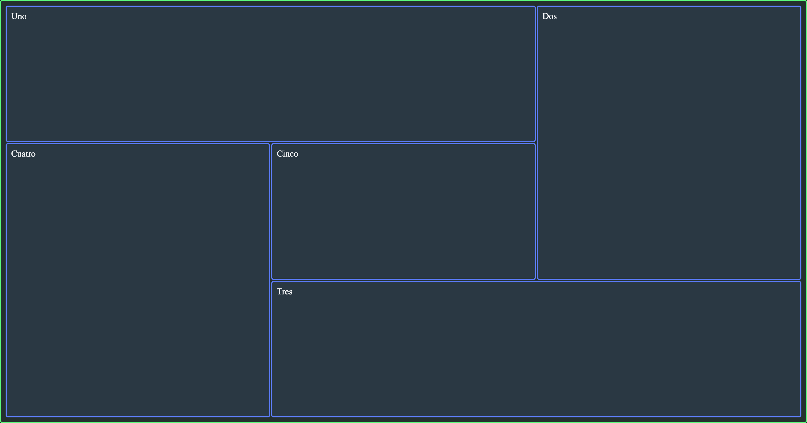

---
tags:
  - Exercice
  - Grid
---

# Grid | Spirale

L'objectif de cet exercice est de mettre en pratique les notions de `grid-column` et de `grid-row`.

## Résultat attendu 

{data-zoom-image}

## Consigne

- [ ] Effectuer un _fork_ du [Codepen de départ](https://codepen.io/editor/tim-momo/pen/01a040ba-9788-7259-8786-1ebce2434fbc).

  !!! note "Le _fork_ est essentiel pour avoir les points attribués aux exercices"

- [ ] Activer la mise en forme de grille en css
- [ ] Ajouter une hauteur équivalente à `100%` de la [hauteur du viewport](https://www.w3schools.com/cssref/css_units.php)
- [ ] Configurer 3 colonnes à une largeur de ⅓ chacune
- [ ] Configurer 3 lignes à une hauteur de ⅓ chacune
- [ ] Ajouter un espacement qui séparera chaque cellule de `2px` entre elles
- [ ] Avec les propriétés `grid-column` et `grid-row`, positionner les enfants pour arriver au résultat attendu.