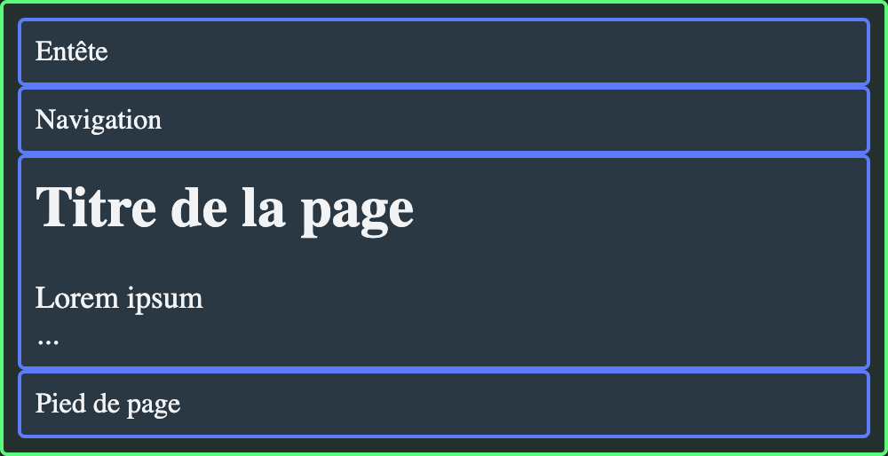
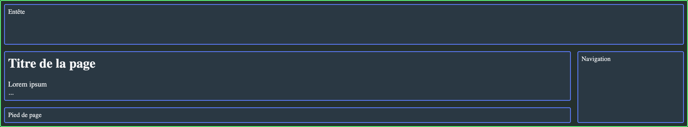

---
tags:
  - Exercice
  - Grid
---

# Grid | Squelette

L'objectif de cet exercice est de mettre en pratique la notion de `grid-template-areas` pour créer une véritable structure de page Web responsive en grid CSS.

## Résultat attendu 

<figure markdown>
{data-zoom-image}
<figcaption><= 1023px</figcaption>
</figure>

<figure markdown>
{data-zoom-image}
<figcaption>> 1024px</figcaption>
</figure>

## Consigne

- [ ] Effectuer un _fork_ du [Codepen de départ](https://codepen.io/editor/tim-momo/pen/01a04137-43b2-705e-98d5-05385445604b).

  !!! note "Le _fork_ est essentiel pour avoir les points attribués aux exercices"

- [ ] Activer la mise en forme de grille en css
- [ ] Configurer les colonnes : 
  - Colonne de droite à `260px` de large
  - La colonne principale prend le reste de l'espace
- [ ] Configurer les lignes : 
  - Première ligne à `100px` de haut
  - Le reste s'adapte au contenu
- [ ] Ajouter un espacement qui séparera chaque cellule de `1rem` entre elles
- [ ] Configurer la structure avec `grid-template-areas`
- [ ] Assigner chacune des régions aux éléments de la page

<!-- ### Bonus 💅 -->

- [ ] Ajouter un media query pour retirer la mise en page grid lorsque l'écran est plus petit que `1024px`
