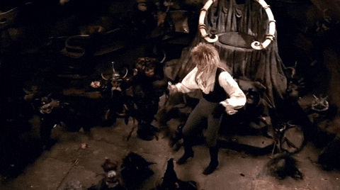

---
tags:
  - Exercice
  - AnimeJS
---

# Labyrinthe

{ .w-100 }

> [IMDB](https://www.imdb.com/fr-ca/title/tt0091369/)

L'objectif de cet exercice est de mettre en pratique les notions AnimeJS suivantes : 

* keyframes
* callback
* valeurs relatives
* utilitaire set
* lissage global

## Résultat attendu

<iframe class="aspect-4-3" height="300" style="width: 100%;" scrolling="no" title="AnimeJS - Exercice - Labyrinthe SOLUTION" src="https://codepen.io/tim-momo/embed/yyeENoL/43fbc58d3c0a4b34f8da430cfd1c1f2e?default-tab=result&theme-id=50173" frameborder="no" loading="lazy" allowtransparency="true">
  See the Pen <a href="https://codepen.io/tim-momo/pen/yyeENoL/43fbc58d3c0a4b34f8da430cfd1c1f2e">
  AnimeJS - Exercice - Labyrinthe SOLUTION</a> by TIM Montmorency (<a href="https://codepen.io/tim-momo">@tim-momo</a>)
  on <a href="https://codepen.io">CodePen</a>.
</iframe>

## Consignes

Dans cet exercice, les valeurs de positionnement doivent obligatoirement être configurées avec les unitées `cqw` et `cqh`.

- [ ] Effectuer un fork du [Codepen de départ](https://codepen.io/tim-momo/pen/OPMExeG/bc795f134b50c794c6b9106d9a4061ec)
- [ ] Avec l'utilitaire `set()`, assigner une valeur de départ à l'élément `.dot`
  * Déplacement latérale de 10cqw
  * Opacité de 0

Animer l'élément `.dot` avec les configurations suivantes :

- [ ] Durée de 3 secondes
- [ ] Boucle infinie
- [ ] Lissage `outSine` sur toute la durée de l'animation
- [ ] Animation de l'opacité et des positionnements dans le labyrinthe avec la notion de keyframes
- [ ] À chaque fois qu'une boucle se termine, effectuez une animation sur l'élément `.wrap`

Animer l'élément `.wrap`

- [ ] Rotation relative d'un huitième de tours
- [ ] Durée de 2.5 secondes
- [ ] Lissage `cubicBezier` ressemblable à celui dans le résultat attendu

Animer la variable css `--primary`

- [ ] La valeur doit passer de "#f00" à "#0f0" à "#00f"
- [ ] Boucle infinie
- [ ] Durée de 3 secondes
- [ ] Lissage linéaire
