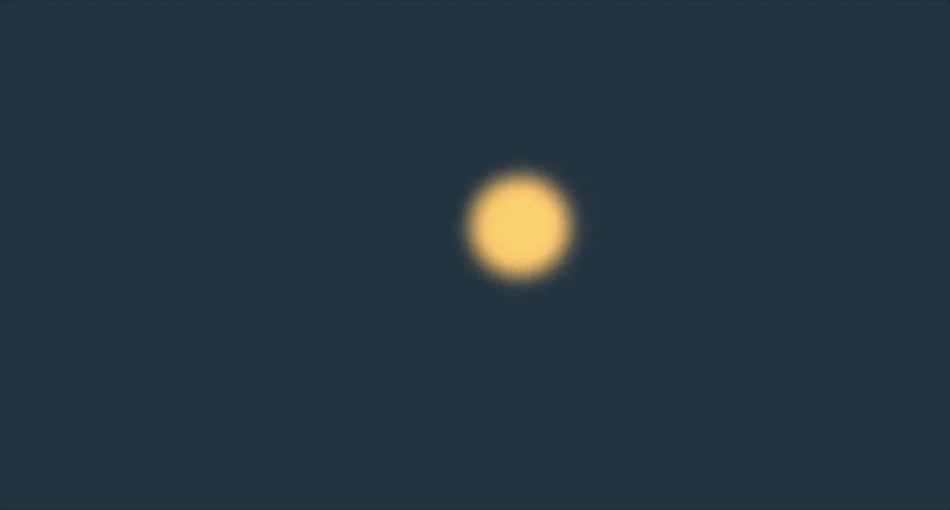

---
tags:
  - Exercice
---

# Lava

L'objectif de cet exercice est de mettre en pratique plusieurs notions acquises jusqu'à présent. C'est-à-dire : 

* La notion de grid en CSS
* Les boucles en JavaScript
* L'ajout d'éléments dans le DOM en JavaScript
* Les animations en AnimeJS
* Les utilitaires d'AnimeJS

## Résultat attendu

## Instructions

- [ ] Effectuer un fork du [Codepen de départ](https://codepen.io/tim-momo/pen/GgowWVR)

### CSS

- [ ] Placer le volcan au milieu du `body` avec CSS Grid.

!!! example "Ça s'aligne, mais pourquoi ?"

    Le positionnement horizontal, c'est logique, mais si ça s'aligne verticalement, c'est grâce à `height: 100vh;`.
    
    En effet, pour qu'une grille (grid) puisse aligner verticalement, elle doit être plus haute que son contenu.

- [ ] Ajouter une position absolue à l'élément `lave` et une position relative à l'élément `volcan`.

!!! example "Ça s'aligne, mais pourquoi ?"

    Pour l'exercice, on ne veut pas que les points de lave se positionnent l'un en dessous de l'autre, on veut qu'ils se superposent ! D'où la position absolue.

- [ ] Sur l'élément `lave`, ajouter les styles `filter: blur(1px);` et `mix-blend-mode: plus-lighter;`. Le premier sert à appliquer du flou, l'autre à appliquer un effet d'addition de lumière.

Résultat : 

{data-zoom-image .w-25}

### JavaScript

- [ ] Stocker l'élément `volcan` dans une variable

- [ ] Créer une animation avec AnimeJS sur l'élément `lave`
- [ ] Animer le `x` avec une valeur aléatoire de `-50` à `50` en `vw` (Utiliser une fonction fléchée et le random d'AnimeJS)

!!! example "Aléatoire et unité de mesure"

    La valeur aléatoire d'AnimeJS donne juste un chiffre. Pour que ce chiffre représente une mesure (ex: 50vw), il faut [concaténer](https://developer.mozilla.org/fr/docs/Learn_web_development/Core/Scripting/Strings#concat%C3%A9nation_avec) ce chiffre avec la mesure `vw`.

- [ ] Animer le `y` avec une valeur aléatoire de `-50` à `50` en `vh` (Utiliser une fonction fléchée et le random d'AnimeJS)
- [ ] Animer le `scale` de `0`, à une valeur aléatoire entre 10 et 40, à `0`. (Utilisez un tableau)
- [ ] Animer un délai aléatoire entre `0` et une seconde
- [ ] Animer en boucle
- [ ] À chaque fois que l'animation boucle (_callback_), appliquer cette fonction : `(self) => self.restart().refresh()`.

!!! example "(self) => self.restart().refresh()"

    Cette fonction fléchée va repositionner la lave à son point initial (`restart()`) et va assigner de nouvelles valeurs aléatoires (`refresh()`) aux éléments animés.

Résultat : 

{data-zoom-image .w-25}

- [ ] Définir une variable JavaScript qui référence l'élément `volcan` (avec `querySelector`)
- [ ] Déplacer l'animation dans une boucle `for` JavaScript qui s'exécute 40 fois.
- [ ] Dans la boucle, avant l'animation, ajouter le JavaScript nécessaire pour créer un nouvel élément `div` avec la classe `lave` et ajouter cet élément à l'élément `volcan`.

!!! example "Ajouter un nouvel élément dans le DOM"

    Pour créer un nouvel élément, on doit utiliser [`createElement()`](https://developer.mozilla.org/fr/docs/Web/API/Document/createElement)

    Pour ajouter une classe CSS, on utilise [`classList.add()`](https://developer.mozilla.org/en-US/docs/Web/API/Element/classList)

    Pour ajouter un élément dans un autre, on utilise [`appendChild()`](https://developer.mozilla.org/en-US/docs/Web/API/Node/appendChild)

- [ ] Dans l'animation, au lieu d'effectuer une animation sur l'élément `lave`, appliquer l'animation sur le nouvel élément `div` que vous venez de créer en JavaScript.

### HTML 

- [ ] Retirer l'élément `lave`

### CSS (bonus)

- [ ] Tester le retrait des styles `mix-blend-mode: plus-lighter;` et `filter: blur(1px);` pour comprendre leur impact sur le projet.