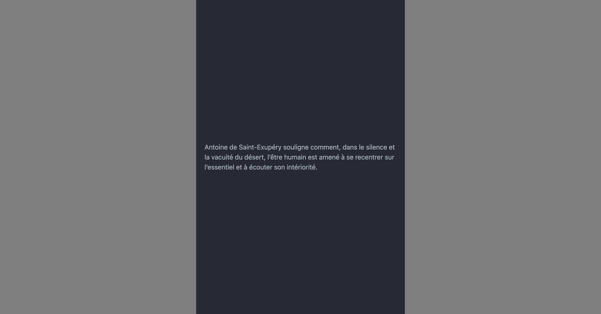

---
tags:
  - Exercice
---

# Le petit prince

{ .w-100 }

Le but de cet exercice est de mettre en pratique l'usage des classes Bootstrap display (l'utilitaire d'affichage qui commence par `.d-*`) dans un contexte responsive.

!!! warning "Important"

    Ne pas ajouter de nouveau HTML. Modifier uniquement les attributs `class=""` déjà présents dans le code.

## Résultat attendu

<div class="grid" markdown>
Version Desktop (≥ md)
{data-zoom-image}

Version Mobile (< md)
{data-zoom-image}
</div>

## Instructions

- [ ] Effectuez un fork du [CodePen de départ](https://codepen.io/tim-momo/pen/LYKvOay?editors=1000)
- [ ] Analysez attentivement le code HTML et sa structure

- [ ] Desktop (breakpoint `md` et plus) :
  - [ ] Masquez le texte débutant par « Antoine de Saint-Exupéry ».
  - [ ] Appliquez la classe `col-auto` à la colonne de l’image et `col` à la colonne du texte.

    !!! success "Nouveauté !"

        `col-auto` dicte à la colonne d'avoir une largeur égale à la largeur de son contenu.

  - [ ] Assurez-vous que le style du texte corresponde **au style** d'une balise `<h3>`.
  - [ ] Alignez verticalement le texte par rapport à l'image avec les classes Flexbox de Bootstrap.

- [ ] Mobile (plus petit que le breakpoint `md`) :
  - [ ] Masquez la rangée (`row`) comportant les deux colonnes.
  - [ ] Affichez le texte débutant par « Antoine de Saint-Exupéry ».

[STOP]

```html title="Solution"
<div class="container">
  <div class="row d-none d-md-flex">
    <div class="col-auto">
      
    </div>
    <div class="col d-flex align-items-center h3">
      « Ce qui embellit le désert, dit le petit prince, c’est qu’il cache un puits quelque part. »
    </div>
  </div>
  <div class="d-block d-md-none">
    Antoine de Saint-Exupéry souligne comment, dans le silence et la vacuité du désert, l’être humain est amené à se recentrer sur l’essentiel et à écouter son intériorité.
  </div>
</div>
```
