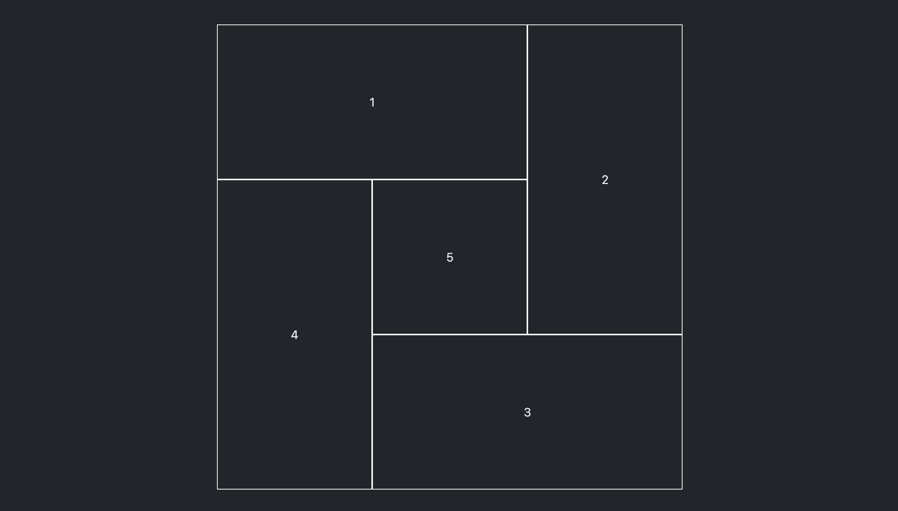

---
tags:
  - Exercice
  - Grid
---

# Spirale

{.w-100}

## Résultats attendus

{data-zoom-image}

## Consignes

Écrire le css nécessaire pour reproduire le résultat attendu. Aucun HTML n'est nécessaire.

- [ ] Effectuez un fork du [Codepen de départ](https://codepen.io/tim-momo/pen/emJmLGX)
- [ ] Les attributs suivants doivent être utilisés :
  * `grid-template-columns`
  * `grid-template-rows`
  * `grid-template-areas`
  * `grid-area`

- [ ] Effectuez un fork du [Codepen de départ](https://codepen.io/tim-momo/pen/WbrbgyK)
- [ ] Les attributs suivants doivent être utilisés :
  * `grid-template-columns`
  * `grid-template-rows`
  * `grid-column`
  * `grid-row`