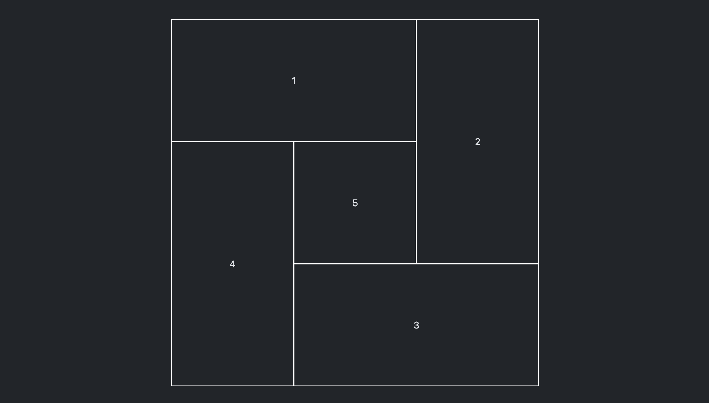
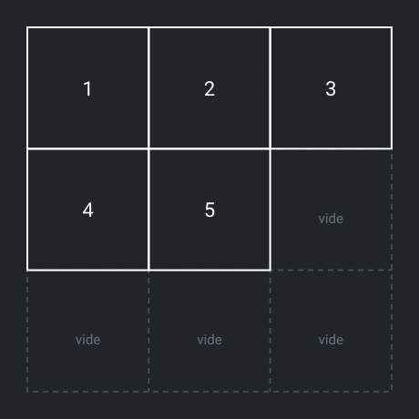

---
tags:
  - Exercice
  - Grid
---

# Spirale

{.w-100}

!!! warning "Faites d'abord [Grid pas à pas](../grid-pas-a-pas/index.md){.back}"

    Cet exercice est une **synthèse**&nbsp;: il ne présente aucune notion nouvelle. Si les huit étapes de *Grid pas à pas* ne sont pas cochées, vous allez vous battre avec la spirale au lieu de l'assembler.

## Résultats attendus

{data-zoom-image}

Cinq boîtes, aucune superposition, aucun trou. Chaque boîte occupe **une ou deux cases** d'une grille de 3 × 3.

!!! danger "Le fork est obligatoire"

    Avant de toucher au code, **connectez-vous à votre compte CodePen**, puis cliquez sur **Fork**.

    Sans fork, votre travail vit dans un onglet anonyme&nbsp;: il disparaît à la fermeture du navigateur et vous n'aurez **aucun lien à remettre** à la fin du bloc.

    Le réflexe, à chaque exercice CodePen&nbsp;:

    - [ ] Se connecter à CodePen
    - [ ] **Fork** du pen de départ
    - [ ] Renommer le pen avec le nom de l'exercice
    - [ ] **Save**
    - [ ] Copier l'adresse `.../live/...` du pen et la coller **tout de suite** dans le `README.md` de votre dépôt `web3-exercices`

    Les exercices CodePen se remettent **par leur lien**, jamais par du code copié. Voyez l'énoncé *Exercices 01* pour le détail de la remise.

## Le principe

L'exercice se fait en **deux temps**. Les deux parties donnent **exactement le même résultat visuel**, par deux techniques différentes. C'est tout l'intérêt&nbsp;: constater qu'une même mise en page peut s'écrire de deux façons, et se faire une opinion sur celle qu'on préfère relire.

Dans les deux cas&nbsp;: écrivez uniquement le CSS nécessaire. **Aucun HTML n'est à écrire ni à modifier.**

Le HTML de départ est le même des deux côtés&nbsp;:

```html title="Déjà écrit pour vous"
<div class="grille">
  <div class="box un">1</div>
  <div class="box deux">2</div>
  <div class="box trois">3</div>
  <div class="box quatre">4</div>
  <div class="box cinq">5</div>
</div>
```

## Partie 1 — Les zones nommées

- [ ] Effectuez un fork du [CodePen de départ — *Grid Spirale*](https://codepen.io/tim-momo/pen/emJmLGX)

### Étape 1 — Lire la maquette avant d'écrire

Ne codez rien tout de suite. Prenez une feuille, dessinez un carré divisé en **3 colonnes et 3 rangées**, et remplissez ce tableau en regardant le résultat attendu&nbsp;:

| Boîte | Combien de colonnes&nbsp;? | Combien de rangées&nbsp;? |
| :-: | :-: | :-: |
| **1** | 2 | 1 |
| **2** | … | … |
| **3** | … | … |
| **4** | … | … |
| **5** | … | … |

!!! tip "Vérification arithmétique"

    Une grille 3 × 3 contient **9 cases**. Additionnez les cases de vos cinq boîtes (colonnes × rangées). Si le total ne fait pas exactement 9, votre lecture de la maquette est fausse — corrigez-la maintenant, pas dans le CSS.

### Étape 2 — Poser le quadrillage

Écrivez **seulement** les colonnes et les rangées. Rien d'autre.

```css
.grille {
  /* display: grid est déjà là */
  grid-template-columns: … ;
  grid-template-rows: … ;
}
```

**Résultat attendu à cette étape**

{.w-50 data-zoom-image}

Vos cinq boîtes occupent **une case chacune**, dans l'ordre du HTML, et quatre cases restent vides. Il n'y a pas encore de spirale, et c'est normal.

!!! failure "Si vous ne voyez pas ça"

    Si les boîtes remplissent tout le carré ou s'étirent bizarrement, c'est le quadrillage qui est faux. Ouvrez les DevTools (++f12++), activez la surimpression de grille et **comptez les cases**. Ne passez pas à l'étape 3 tant que vous ne voyez pas neuf cases dont quatre vides.

### Étape 3 — Dessiner la spirale en texte

`grid-template-areas` est littéralement votre dessin de l'étape 1, écrit en mots. Une ligne de texte par rangée, un mot par case, et un nom répété fusionne les cases.

La première rangée vous est donnée en exemple&nbsp;:

```css
.grille {
  grid-template-columns: … ;
  grid-template-rows: … ;
  grid-template-areas:
    "un un deux"
    "…  …  …"
    "…  …  …";
}
```

!!! warning "Rien ne bougera encore"

    Écrire `grid-template-areas` ne déplace rien tout seul&nbsp;: tant qu'aucune boîte n'a de `grid-area`, les zones nommées existent mais restent inoccupées. C'est l'étape 4 qui branche les deux.

### Étape 4 — Brancher les boîtes, une à la fois

Assignez **une seule** boîte, puis regardez le résultat. Puis la suivante. Puis la suivante.

```css
.un { grid-area: un; }
/* vérifiez, puis ajoutez .deux, puis .trois… */
```

- [ ] `.un` occupe bien les deux premières cases du haut
- [ ] `.deux` descend sur deux rangées à droite
- [ ] `.trois`, `.quatre` et `.cinq` complètent la spirale
- [ ] **Save**

!!! failure "Toute la mise en page s'est effondrée d'un coup&nbsp;?"

    Comptez les mots de chaque ligne de `grid-template-areas`. S'il y en a trois sur une ligne et deux sur une autre, **la déclaration complète est ignorée** — pas seulement la ligne fautive.

## Partie 2 — Le placement par lignes

- [ ] Effectuez un fork du [CodePen de départ — *Pareille, mais pas pareille*](https://codepen.io/tim-momo/pen/WbrbgyK)

Même résultat, sans aucun nom de zone. On revient à ce que vous avez pratiqué à l'étape 6 de *Grid pas à pas*&nbsp;: on compte les **traits**.

### Étape 5 — Remplir le tableau avant de coder

Une grille de 3 colonnes possède **4 lignes verticales**, et une grille de 3 rangées possède **4 lignes horizontales**. Complétez ce tableau sur papier&nbsp;:

| Boîte | `grid-column` | `grid-row` |
| :-: | :-: | :-: |
| **1** | `1 / 3` | `1 / 2` |
| **2** | `… / …` | `… / …` |
| **3** | `… / …` | `… / …` |
| **4** | `… / …` | `… / …` |
| **5** | `… / …` | `… / …` |

!!! tip "Comment lire la ligne donnée"

    `grid-column: 1 / 3` se lit «&nbsp;**de** la ligne 1 **jusqu'à** la ligne 3&nbsp;», ce qui occupe les colonnes **1 et 2**. Deux colonnes, trois traits&nbsp;: c'est exactement le décalage qui piège tout le monde.

### Étape 6 — Écrire le CSS, une boîte à la fois

```css
.un {
  grid-column: 1 / 3;
  grid-row: 1 / 2;
}
/* puis .deux, .trois, .quatre, .cinq */
```

- [ ] Le résultat est **identique** à celui de la partie 1
- [ ] **Save**

!!! question "Pour finir"

    Deux questions à vous poser une fois les deux versions terminées&nbsp;:

    1. Laquelle des deux relirez-vous le plus facilement dans un mois&nbsp;?
    2. Si on ajoutait une **quatrième colonne** à la grille, laquelle des deux versions serait la plus rapide à corriger&nbsp;?

## Remise

Les **deux** forks doivent apparaître dans le `README.md` de votre dépôt `web3-exercices`, sur la ligne *Spirale* (partie 1 et partie 2). Avec un seul des deux liens, l'exercice est considéré comme **partiel** (1 point sur 2).
